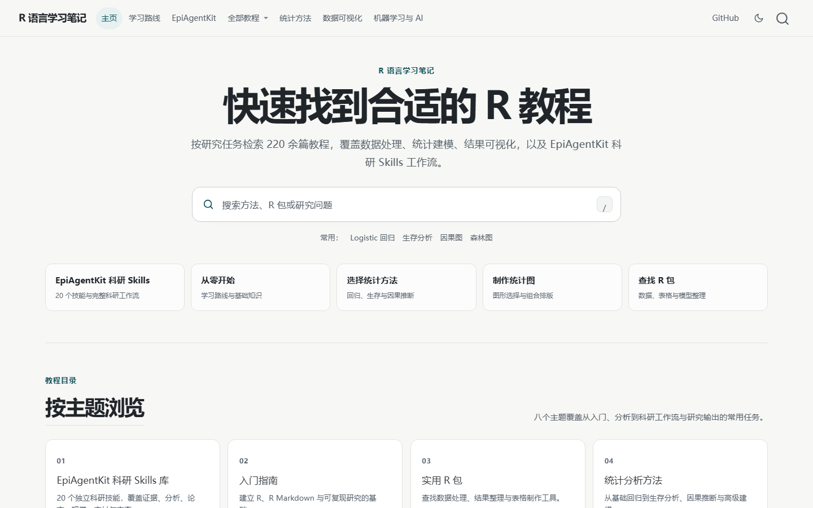
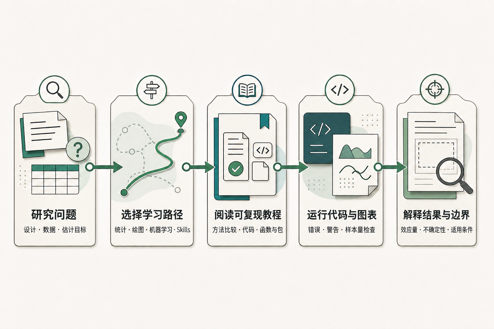

# R 语言学习笔记

[](https://r.wk8686.top/)
[](https://www.r-project.org/)
[](https://quarto.org/)
[](#内容地图)

面向 R 语言学习者、流行病学研究者和生物统计实践者的中文教程站。内容从 R 与 Quarto 基础延伸到研究设计、回归建模、纵向与生存数据、因果推断、预测模型、机器学习、科研绘图和 EpiAgentKit 科研 Skills。教程不仅给出代码，也强调问题定义、方法选择、结果解释和适用边界。

当前仓库包含 250 个按编号管理的教程源文件。在线站点提供全文搜索、栏目导航、文章目录、深色模式和移动端布局。

<p align="center">
  <a href="https://r.wk8686.top/">
    
  </a>
</p>

## 快速入口

| 目标 | 入口 |
| --- | --- |
| 在线阅读全部内容 | [r.wk8686.top](https://r.wk8686.top/) |
| 从基础开始学习 | [学习路线](https://r.wk8686.top/sections/guide.html) |
| 查找统计分析方法 | [统计分析方法](https://r.wk8686.top/sections/statistics.html) |
| 查找科研绘图教程 | [数据可视化](https://r.wk8686.top/sections/visualization.html) |
| 查找机器学习方法 | [机器学习与人工智能](https://r.wk8686.top/sections/machine-learning.html) |
| 浏览科研 Skills | [EpiAgentKit 科研 Skills 库](https://r.wk8686.top/sections/epiagentkit.html) |
| 报告错误或提出选题 | [GitHub Issues](https://github.com/KangWang42/R_note_for_Epidemiology/issues) |

## 项目定位

本项目解决三个相互关联的问题：如何选择与研究问题匹配的方法，如何在 R 中复现分析与图形，以及如何在不夸大证据的前提下解释输出。文章通常围绕一个明确任务组织，给出数据准备、函数或模型调用、结果读取、常见错误和进一步阅读。

项目以教程和可复现示例为主，不是统一封装的 R 软件包，也不是可直接替代研究方案或统计分析计划的模板库。模拟数据仅用于教学；具体研究仍需根据目标人群、暴露或干预、结局、估计目标、偏倚结构和数据质量确定分析方案。

## 内容地图

| 栏目 | 主要内容 | 在线入口 |
| --- | --- | --- |
| 入门指南 | R Markdown、Quarto、开发环境与可重复研究工作流 | [学习路线](https://r.wk8686.top/sections/guide.html) |
| 实用 R 包 | 数据整理、统计汇总、模型整理、表格与可视化扩展 | [实用 R 包](https://r.wk8686.top/sections/packages.html) |
| 统计分析方法 | 研究设计、回归、生存、纵向数据、因果推断、贝叶斯方法与预测模型 | [统计分析方法](https://r.wk8686.top/sections/statistics.html) |
| 数据可视化 | 图形基础、分布与比较图、科研绘图、组合排版和交互图 | [数据可视化](https://r.wk8686.top/sections/visualization.html) |
| 机器学习与人工智能 | 预处理、重采样、分类回归、聚类、集成学习与模型解释 | [机器学习与人工智能](https://r.wk8686.top/sections/machine-learning.html) |
| 实用操作 | 数据导入、清洗、字符串与日期、数据库、网络数据和文档自动化 | [实用操作](https://r.wk8686.top/sections/operation.html) |
| 特殊应用 | 卫生经济学、环境流行病学、质性研究、信号处理与模拟 | [特殊应用](https://r.wk8686.top/sections/special.html) |
| EpiAgentKit | 生物统计原则、证据检索、项目初始化、分析、写作、图件与审查 Skills | [EpiAgentKit 科研 Skills 库](https://r.wk8686.top/sections/epiagentkit.html) |

栏目页由站点配置生成，是完整内容导航的唯一维护入口。部分教程会因同时服务多个任务而出现在不同学习路径中。

## 从研究问题到结果解释

<p align="center">
  
</p>

这条路径对应本站教程的基本阅读方式：

1. 明确研究问题、数据结构和需要估计或预测的对象。
2. 从栏目页或搜索结果选择方法路线，先比较相邻方法，再进入具体函数。
3. 阅读可复现教程，核对示例数据、模型假设、输入格式和依赖包。
4. 在本地实际运行代码与图表，检查错误、警告、缺失值和样本量变化。
5. 根据效应尺度、不确定性、验证方式和研究设计解释结果，同时保留教程说明的限制。

<details>
<summary>示意图的等价文字说明</summary>

图中包含五个自左向右连接的阶段：研究问题阶段明确设计、数据与估计目标；选择学习路径阶段在统计、绘图、机器学习和 Skills 之间定位任务；阅读可复现教程阶段比较方法并核对代码、函数与包；运行代码与图表阶段检查错误、警告和样本量；解释结果与边界阶段关注效应量、不确定性与适用条件。箭头表示推荐的阅读和实践顺序，不表示所有研究都使用相同统计方法。

</details>

## 按任务选择教程

| 研究或学习任务 | 建议起点 | 可继续阅读 |
| --- | --- | --- |
| 多重检验与错误发现率 | [FDR 与多重检验](https://r.wk8686.top/1135-fdr.html) | 结合研究问题预设检验族与调整策略 |
| 样本量与把握度设计 | [样本量与功效分析](https://r.wk8686.top/1048-power-analysis.html) | 比较均值、率、生存结局、重复测量和预测模型场景 |
| 重复测量与纵向数据 | [GEE](https://r.wk8686.top/1085-gee.html) | [多水平模型](https://r.wk8686.top/1024-multilevel.html)、[时变协变量 Cox](https://r.wk8686.top/1089-time-varying-cox.html) |
| 临床预测模型 | [预测模型工作流](https://r.wk8686.top/1100-prediction-model.html) | [分布、ROC、校准与决策曲线](https://r.wk8686.top/2072-prediction-evaluation-plots.html) |
| 个体与纵向临床图形 | [临床研究个体数据图](https://r.wk8686.top/2071-clinical-individual-plots.html) | 云雨图、配对变化、个体轨迹、瀑布图和游泳图 |
| 效应量与不确定性 | [效应估计图](https://r.wk8686.top/2073-effect-estimate-plots.html) | 系数图、亚组森林图与非线性预测曲线 |
| 组学结果展示 | [组学科研绘图](https://r.wk8686.top/2074-omics-research-plots.html) | MA、PCA、表达热图与过度富集气泡图 |
| 科研工作流与 Skills | [EpiAgentKit Skills 完整目录](https://r.wk8686.top/5019-epiagentkit-skills.html) | 按研究设计、分析、写作、图件和交付任务选择 Skill |

## 教程质量标准

新建或结构性重写的教程按仓库内 `.claude/skills/` 的项目规范验收。历史文章仍在按同一标准逐步修订。

- **问题先于函数**：先说明研究问题、数据结构和目标量，再介绍包与函数。
- **代码实际执行**：除非普通计算机难以完成或存在明确外部依赖，示例代码应实际运行，不以 `eval = FALSE` 隐藏错误。
- **结果可解释**：图表和模型输出需说明分母、参考组、尺度、不确定性和不能推出的结论。
- **方法有边界**：存在易混淆方法时，增加比较、工作流或示意图，明确选择条件和停止条件。
- **视觉可访问**：内容图使用非颜色编码、替代文本和最终尺寸检查；统计图来自真实代码，科研原始图像不做生成式重绘。
- **来源可核验**：包接口和技术事实优先指向 R 官方手册、包官方文档或方法学原始来源。

## 本地阅读与开发

### 环境

- R，用于执行 `.rmd` 中的代码。
- Quarto，用于预览和渲染网站。
- 各教程声明的 R 包。
- Git，仅在需要参与版本控制时使用。

本仓库当前没有统一的 `renv.lock`。不同教程使用的扩展包不同，应根据目标文章中的 `library()` 调用安装依赖，不建议为阅读单篇文章一次性安装全站全部包。最近一次本地验证环境为 R 4.5.2 和 Quarto 1.8.27；更早版本能否运行取决于文章使用的包接口。

### 获取仓库

```bash
git clone https://github.com/KangWang42/R_note_for_Epidemiology.git
cd R_note_for_Epidemiology
```

### 定向预览单篇教程

日常修改采用定向预览，不执行全站渲染：

```bash
cd doc
quarto preview 2072-prediction-evaluation-plots.rmd
```

### 定向生成网站文件

```bash
cd doc

# 渲染发生变化的文章
quarto render 2072-prediction-evaluation-plots.rmd --to html

# 导航变化时重新生成栏目页
Rscript generate_sections.R

# 渲染相关栏目与首页
quarto render sections/visualization.qmd --to html
quarto render index.qmd --to html
```

Quarto 的输出目录是仓库根目录下的 `public/`。该目录是实际部署产物，不应手工修改生成的 HTML。

## 项目结构

```text
.
├── .claude/skills/           # 本仓库的教程写作与栏目质量规范
├── .github/workflows/
│   └── deploy.yml            # 将 public/ 同步到服务器
├── doc/
│   ├── _quarto.yml           # 导航、栏目和网站配置
│   ├── index.qmd             # 首页源文件
│   ├── NNNN-topic.rmd/qmd    # 按编号管理的教程源文件
│   ├── sections/             # 由 generate_sections.R 生成的栏目页
│   ├── images/               # 封面、示意图与静态图片
│   ├── figure/               # R 代码生成的文章图件
│   ├── generate_sections.R   # 根据 _quarto.yml 更新栏目页
│   ├── styles.css            # 网站组件与响应式样式
│   └── theme.scss            # Quarto 主题变量
├── public/                   # 可直接部署的静态网站
├── CLAUDE.md                 # 项目级维护约束
└── README.md
```

教程编号约定用于保持目录稳定：`00xx` 为入门，`10xx` 为统计与方法，`20xx` 为可视化，`30xx` 为实用操作，`40xx` 为应用开发，`50xx` 为 AI 工具与科研 Skills，`60xx` 为特殊应用。

## 新建或修改教程

1. 阅读 `CLAUDE.md`、`.claude/skills/tutorial-authoring/` 和目标栏目的 Skill。
2. 在 `doc/` 中新增或修改编号源文件，补齐 `title`、`date`、`categories` 和 `description`。
3. 更新 `doc/_quarto.yml` 的导航位置。不要直接维护 `doc/sections/` 中的生成内容。
4. 实际运行全部常规代码块，检查错误、警告、缺失值和意外样本量变化。
5. 执行 `Rscript generate_sections.R`，然后定向渲染文章、相关栏目和首页。
6. 检查生成 HTML 的图片路径、替代文本、公式、代码折行、桌面目录和移动端布局。
7. 提交教程源文件以及相应的 `public/` 生成产物。

可使用仓库自带的结构审计脚本检查教程：

```bash
python .claude/skills/tutorial-authoring/scripts/audit_tutorial.py \
  doc/2072-prediction-evaluation-plots.rmd
```

## 部署方式

`.github/workflows/deploy.yml` 在 `main` 分支的 `public/**` 发生变化时触发，将 `public/` 通过 `rsync` 同步到服务器。工作流只负责部署，不会在 GitHub Actions 中安装 R、执行教程或构建 Quarto 网站。因此，进入 `main` 的提交必须已经包含经过验证的静态生成文件。

## 贡献

欢迎通过 Issue 报告以下问题：

- 代码无法运行、包接口变化或结果与正文不一致。
- 公式、图注、替代文本、导航或移动端显示异常。
- 方法选择、统计解释或证据边界不准确。
- 希望补充的研究设计、分析方法、R 包或科研绘图主题。

Pull Request 应保持一个清楚的修改主题，并说明受影响文章、验证命令和兼容性影响。不要顺带重排无关文件，也不要用未经核验的示例替换现有方法口径。
