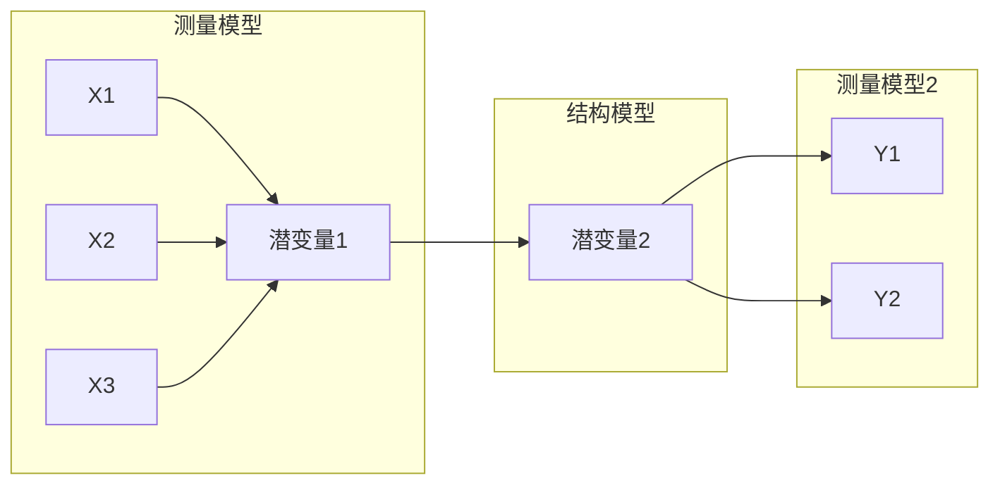

```{r setup, include=FALSE}
knitr::opts_chunk$set(
  echo = TRUE,
  warning = FALSE,
  message = FALSE,
  fig.width = 8,
  fig.height = 6,
  dpi = 150
)
```

## 简介

**结构方程模型 (Structural Equation Modeling, SEM)** 是一种强大的多元统计分析技术，它结合了因子分析（测量模型）和路径分析（结构模型），允许研究者同时检验观测变量与潜变量之间、以及潜变量之间的复杂关系。

在 R 语言中，`lavaan` (Latent Variable Analysis) 是最流行的 SEM 包，它语法简洁且功能全面。`semPlot` 包则常用于绘制路径图。

### SEM 的核心组成

1. **测量模型 (Measurement Model)**：描述潜变量如何由观测指标测量
2. **结构模型 (Structural Model)**：描述潜变量之间的因果/相关关系



## 安装

```{r eval=FALSE}
install.packages("lavaan")
install.packages("semPlot")
```

```{r}
library(lavaan)
library(semPlot)
```

## 实例数据

我们将使用 `lavaan` 自带的 `PoliticalDemocracy` 数据集，该数据集包含了 1960 年和 1965 年各国的工业化程度与政治民主程度的数据。

```{r}
data(PoliticalDemocracy)
head(PoliticalDemocracy)
```

**变量说明**：
- `x1-x3`: 1960年工业化指标
- `y1-y4`: 1960年民主程度指标
- `y5-y8`: 1965年民主程度指标

## 模型设定

`lavaan` 使用一种直观的字符串语法来描述模型：

| 符号 | 含义 | 示例 |
|------|------|------|
| `=~` | 定义潜变量（由...测量） | `F =~ x1 + x2 + x3` |
| `~` | 回归关系（被...预测） | `Y ~ X1 + X2` |
| `~~` | 协方差/方差 | `x1 ~~ x2` |
| `:=` | 定义新参数 | `indirect := a*b` |

```{r}
model <- "
  # 测量模型 (定义潜变量)
    ind60 =~ x1 + x2 + x3
    dem60 =~ y1 + y2 + y3 + y4
    dem65 =~ y5 + y6 + y7 + y8

  # 结构模型 (回归关系)
    dem60 ~ ind60
    dem65 ~ ind60 + dem60

  # 残差相关 (可选)
    y1 ~~ y5
    y2 ~~ y4 + y6
    y3 ~~ y7
    y4 ~~ y8
    y6 ~~ y8
"
```

## 模型拟合

使用 `sem()` 函数拟合模型。

```{r}
fit <- sem(model, data = PoliticalDemocracy)
```

## 查看结果

使用 `summary()` 函数查看详细结果，`standardized = TRUE` 可以输出标准化系数，`fit.measures = TRUE` 输出拟合指数。

```{r}
summary(fit, standardized = TRUE, fit.measures = TRUE, rsquare = TRUE)
```

## 拟合指数详解

这是 SEM 分析中最关键的部分。以下是常用拟合指数及其阈值：

### 绝对拟合指数

| 指标 | 理想值 | 可接受值 | 说明 |
|------|--------|----------|------|
| **χ²** | p > 0.05 | - | 样本量敏感，大样本常被拒绝 |
| **RMSEA** | < 0.05 | < 0.08 | 近似误差均方根，考虑模型简洁性 |
| **SRMR** | < 0.05 | < 0.08 | 标准化残差均方根 |

### 相对拟合指数

| 指标 | 理想值 | 可接受值 | 说明 |
|------|--------|----------|------|
| **CFI** | > 0.95 | > 0.90 | 比较拟合指数 |
| **TLI** | > 0.95 | > 0.90 | Tucker-Lewis 指数 |
| **NFI** | > 0.95 | > 0.90 | 规范拟合指数（样本量敏感） |

> [!TIP]
> **快速判断法则**：CFI/TLI > 0.90，RMSEA < 0.08，SRMR < 0.08 通常被认为是可接受的模型拟合。

### 提取拟合指数

```{r}
# 提取常用拟合指数
fit_indices <- fitMeasures(fit, c("chisq", "df", "pvalue", "cfi", "tli", "rmsea", "srmr"))
round(fit_indices, 3)
```

## 路径系数解读

### 标准化系数解读示例

```{r}
# 提取标准化路径系数
std_coef <- standardizedSolution(fit)
# 只看结构路径（回归关系）
std_coef[std_coef$op == "~", c("lhs", "op", "rhs", "est.std", "pvalue")]
```

**解读示例**：
- `dem60 ~ ind60 = 0.45` 表示：工业化程度每增加1个标准差，民主程度增加0.45个标准差
- 标准化系数允许比较不同路径的相对重要性

## 路径图可视化

使用 `semPaths()` 函数绘制模型路径图。

```{r}
semPaths(fit,
  what = "std", # 显示标准化系数
  layout = "tree", # 树状布局
  edge.label.cex = 0.8, # 标签字体大小
  curvePivot = TRUE, # 曲线弯曲
  fade = FALSE, # 不根据系数大小淡化颜色
  style = "lisrel", # 绘图风格
  rotation = 2 # 旋转
)
```

## 修正指数 (Modification Indices)

如果模型拟合不佳，可以查看修正指数，了解添加哪些路径可以改善模型。

```{r}
mi <- modindices(fit, sort = TRUE)
head(mi[mi$mi > 10, ]) # 查看 MI > 10 的路径
```

> [!WARNING]
> 修正指数仅供参考！添加路径必须有理论支持，否则可能导致过度拟合（overfitting）。

## 常见问题与解决方案

| 问题 | 症状 | 解决方案 |
|------|------|----------|
| **模型不收敛** | 报错 "did not converge" | 检查数据缺失、变量尺度差异过大 |
| **负方差** | Heywood case | 增加样本量、简化模型、检查编码错误 |
| **CFI/TLI过低** | < 0.90 | 检查测量模型、考虑添加残差相关 |
| **RMSEA过高** | > 0.10 | 检查模型设定、移除不显著路径 |
| **因子载荷过低** | < 0.4 | 考虑移除该指标或合并相似指标 |

### 诊断性检查

```{r}
# 检查残差
resid(fit, type = "standardized")$cov[1:5, 1:5] # 查看标准化残差矩阵
```

> [!IMPORTANT]
> 标准化残差绝对值 > 2.58 (α=0.01) 表示存在显著的局部拟合问题。

## 高级技巧

### 多组比较

```{r eval=FALSE}
# 按组拟合并比较
fit_group <- sem(model, data = mydata, group = "gender")
summary(fit_group)
```

### 中介效应检验

```{r eval=FALSE}
# 定义带中介的模型
med_model <- "
  # 直接效应
  Y ~ c*X
  # 通过 M 的间接效应
  M ~ a*X
  Y ~ b*M
  # 定义间接效应
  indirect := a*b
  total := c + a*b
"
```

## 参考文献

-   Rosseel, Y. (2012). lavaan: An R Package for Structural Equation Modeling. *Journal of Statistical Software*, 48(2), 1-36.
-   Hu, L., & Bentler, P. M. (1999). Cutoff criteria for fit indexes in covariance structure analysis. *Structural Equation Modeling*, 6(1), 1-55.
-   Kline, R. B. (2015). *Principles and Practice of Structural Equation Modeling* (4th ed.). Guilford Press.

