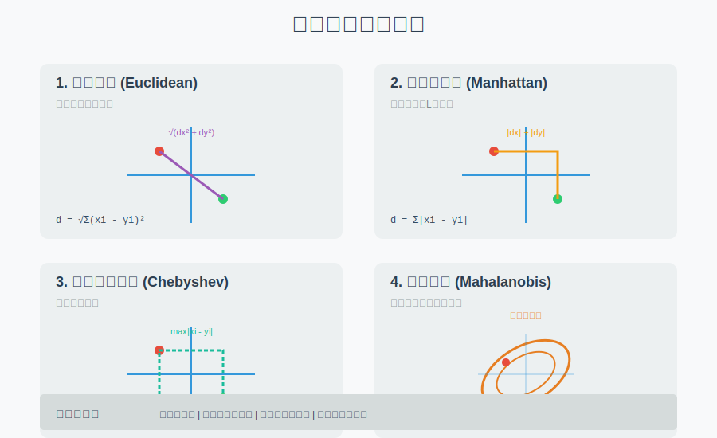
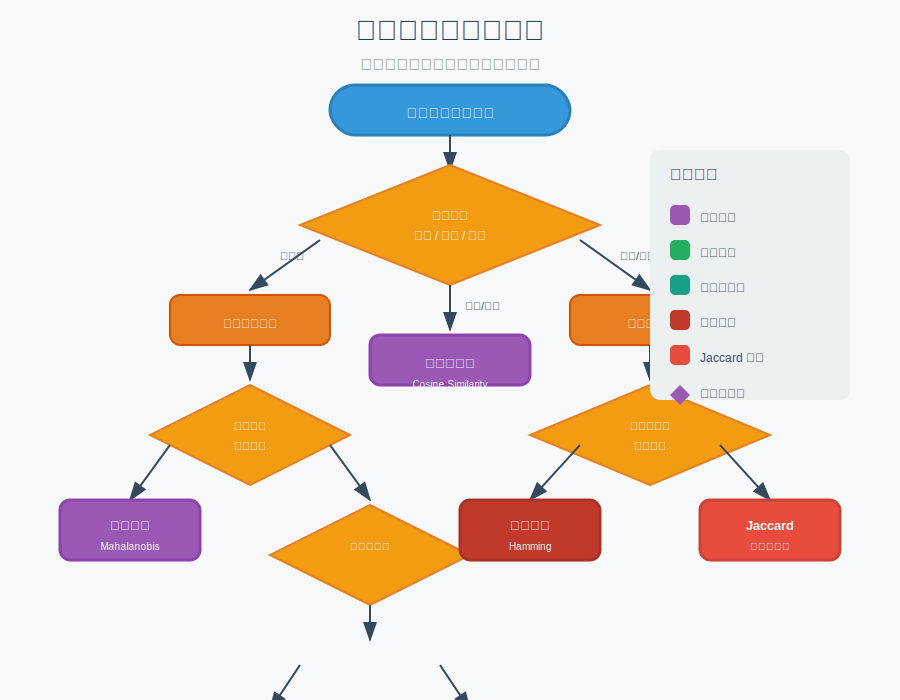

```{r setup, include=FALSE}
knitr::opts_chunk$set(
  echo = TRUE,
  warning = FALSE,
  message = FALSE,
  fig.width = 10,
  fig.height = 7,
  fig.retina = 2,
  out.width = "100%",
  dpi = 150
)
set.seed(2026)
```

## 方法背景与适用场景

### 什么是距离指标？

**零基础通俗解释**：想象你在地图上规划路线。从一个点到另一个点，可以走直线（欧氏距离），也可以沿着街道网格走（曼哈顿距离）。在数据分析中，"距离"就是衡量两个数据点"有多像"或"有多远"的方法。距离越小，说明两个对象越相似。

### 核心应用场景

| 应用场景 | 典型方法 | 示例 |
|----------|----------|------|
| **聚类分析** | 欧氏、曼哈顿 | K-means、层次聚类 |
| **分类算法** | 欧氏、马氏 | K-近邻分类器 |
| **异常检测** | 马氏距离、欧氏 | 多变量异常值识别 |
| **降维分析** | 欧氏 | PCA、t-SNE |
| **文本分析** | 余弦相似度、Jaccard | 文档相似度计算 |
| **图像识别** | 欧氏、汉明距离 | 特征向量匹配 |
| **推荐系统** | 余弦相似度 | 用户行为相似性 |
| **相关性分析** | 相关距离 | 变量关系度量 |

### 常见距离指标对比



## 核心概念与模型入门

### 基础数学定义

对于两个 $d$ 维向量 $\mathbf{x} = (x_1, x_2, \ldots, x_d)$ 和 $\mathbf{y} = (y_1, y_2, \ldots, y_d)$：

### 1. 欧氏距离 (Euclidean Distance)

**直观理解**：两点间的直线距离，就像用直尺测量。

$$d(\mathbf{x}, \mathbf{y}) = \sqrt{\sum_{i=1}^{d} (x_i - y_i)^2}$$

**特点**：
- 最常用的距离度量
- 适用于各维度量纲一致的数据
- 对异常值敏感

### 2. 曼哈顿距离 (Manhattan Distance)

**直观理解**：城市街区距离，只能沿坐标轴方向移动。

$$d(\mathbf{x}, \mathbf{y}) = \sum_{i=1}^{d} |x_i - y_i|$$

**特点**：
- 对异常值比欧氏距离更稳健
- 适用于网格化数据（如城市地图）

### 3. 切比雪夫距离 (Chebyshev Distance)

**直观理解**：国际象棋中"王"的移动方式，每次可以在任意方向移动一格。

$$d(\mathbf{x}, \mathbf{y}) = \max_{1 \leq i \leq d} |x_i - y_i|$$

**特点**：
- 只关心最大差异维度
- 适用于需要捕捉极端差异的场景

### 4. 闵可夫斯基距离 (Minkowski Distance)

**直观理解**：欧氏和曼哈顿距离的推广，通过参数 $p$ 调整。

$$d(\mathbf{x}, \mathbf{y}) = \left(\sum_{i=1}^{d} |x_i - y_i|^p\right)^{1/p}$$

**特殊情况**：
- $p = 1$：曼哈顿距离
- $p = 2$：欧氏距离
- $p = \infty$：切比雪夫距离

### 5. 马氏距离 (Mahalanobis Distance)

**直观理解**：考虑变量间相关性和方差的"统计距离"。就像在拥挤的房间里找"远"的人，不是看物理距离，而是看"反常程度"。

$$d(\mathbf{x}, \mathbf{y}) = \sqrt{(\mathbf{x} - \mathbf{y})^T \mathbf{S}^{-1} (\mathbf{x} - \mathbf{y})}$$

其中 $\mathbf{S}$ 是协方差矩阵。

**特点**：
- 自动标准化数据
- 考虑变量间相关性
- 对异常值检测更准确


### 6. 余弦相似度 (Cosine Similarity)

**直观理解**：衡量两个向量的方向相似性，不考虑长度差异。就像比较两支笔的朝向，不管长短。

$$\text{similarity}(\mathbf{x}, \mathbf{y}) = \cos(\theta) = \frac{\mathbf{x} \cdot \mathbf{y}}{\|\mathbf{x}\| \|\mathbf{y}\|} = \frac{\sum_{i=1}^{d} x_i y_i}{\sqrt{\sum_{i=1}^{d} x_i^2} \sqrt{\sum_{i=1}^{d} y_i^2}}$$

**特点**：
- 范围在 $[-1, 1]$ 之间
- 适合文本分析、推荐系统
- 对向量长度不敏感

### 7. 汉明距离 (Hamming Distance)

**直观理解**：两个字符串有多少个位置不同。比如 "kitten" 和 "sitting" 有 3 个不同。

$$d(\mathbf{x}, \mathbf{y}) = \sum_{i=1}^{d} I(x_i \neq y_i)$$

其中 $I(\cdot)$ 是指示函数。

**特点**：
- 只适用于离散数据
- 常用于字符串比较、错误检测

### 8. Jaccard 距离 (Jaccard Distance)

**直观理解**：衡量两个集合的相似性，基于交集和并集。

$$d(A, B) = 1 - \frac{|A \cap B|}{|A \cup B|} = 1 - \text{Jaccard 相似系数}$$

**特点**：
- 范围在 $[0, 1]$ 之间
- 适用于集合数据、二元特征
- 常用于文本相似度（单词集合）

### 9. 相关距离 (Correlation Distance)

**直观理解**：基于相关系数的距离。

$$d(\mathbf{x}, \mathbf{y}) = 1 - \text{corr}(\mathbf{x}, \mathbf{y})$$

**特点**：
- 范围在 $[0, 2]$ 之间
- 适合衡量变量间的模式相似性
- 基因表达分析常用

## 模型假设与前提条件

### 各距离指标的假设

```{r distance-assumptions, echo=FALSE}
knitr::kable(data.frame(
  `距离指标` = c("欧氏距离", "曼哈顿距离", "马氏距离", "余弦相似度", "汉明距离"),
  `数据类型` = c("连续型", "连续型/有序", "连续型", "连续型/离散", "离散型/二值"),
  `量纲要求` = c("需标准化", "建议标准化", "自动标准化", "不需标准化", "无"),
  `相关性考虑` = c("否", "否", "是", "否", "否"),
  `异常值敏感度` = c("高", "中", "低", "中", "低"),
  `计算复杂度` = c("O(d)", "O(d)", "O(d²)", "O(d)", "O(d)")
), caption = "距离指标假设与特性对比")
```

### 关键假设与检验

#### 1. 数据标准化（对于欧氏、曼哈顿距离）

**假设**：各维度具有相同的量纲和尺度。

**检验方法**：
- 检查各变量的均值和方差
- 绘制箱线图查看分布差异

**违背后果**：
- 量纲大的变量主导距离计算
- 结果被某些维度"绑架"

#### 2. 马氏距离的协方差矩阵正定性

**假设**：协方差矩阵是可逆的（正定矩阵）。

**检验方法**：
```r
# 检查协方差矩阵是否正定
is_positive_definite <- function(S) {
  eigenvalues <- eigen(S, symmetric = TRUE)$values
  all(eigenvalues > 0)
}
```

**违背后果**：
- 无法计算逆矩阵
- 存在完全线性相关的变量

#### 3. 余弦相似度的向量非零假设

**假设**：向量长度不为零。

**违背后果**：
- 分母为零，无法计算
- 需要特殊处理零向量

### 如何选择合适的距离指标



**选择指南**：

| 数据特征 | 推荐距离 | 理由 |
|----------|----------|------|
| 连续变量、量纲一致 | 欧氏距离 | 直观、计算简单 |
| 连续变量、存在异常值 | 曼哈顿距离 | 更稳健 |
| 变量间有相关性 | 马氏距离 | 考虑协方差 |
| 文本数据、向量长度差异大 | 余弦相似度 | 关注方向 |
| 分类/二值数据 | 汉明/Jaccard | 专门设计 |
| 网格化数据 | 曼哈顿/切比雪夫 | 符合物理意义 |

## 数据准备

### 模拟数据集

让我们创建一个包含多种类型特征的模拟数据集：

```{r simulate-data}
# 设置随机种子
set.seed(2026)

# 1. 基础数据：连续型变量
n <- 100  # 样本量
d <- 5    # 维度

# 生成具有相关性的多元正态数据
library(MASS)
mu <- c(50, 165, 70, 120, 80)  # 均值向量
Sigma <- matrix(c(
  10,  15,   8,   5,   6,
  15,  25,  12,   7,   8,
   8,  12,   9,   4,   5,
   5,   7,   4,   3,   3,
   6,   8,   5,   3,   4
), nrow = 5, byrow = TRUE)

# 添加一些噪声确保正定性
Sigma <- Sigma + diag(0.1, 5)

data_continuous <- mvrnorm(n, mu, Sigma)
colnames(data_continuous) <- c("体重(kg)", "身高(cm)", "年龄", "收缩压", "舒张压")

# 2. 标准化数据（用于距离计算）
data_scaled <- scale(data_continuous)

# 3. 添加类别标签
data_scaled <- as.data.frame(data_scaled)
data_scaled$group <- sample(c("A", "B", "C"), n, replace = TRUE)

# 4. 创建二值数据（用于汉明/Jaccard距离）
binary_data <- matrix(sample(0:1, n * 10, replace = TRUE), n, 10)
colnames(binary_data) <- paste0("Feature_", 1:10)

# 5. 创建文本向量（用于余弦相似度）
text_vectors <- matrix(rnorm(n * 20), n, 20)
colnames(text_vectors) <- paste0("Word_", 1:20)

# 显示前几行
head(data_scaled)
```

### 数据探索

```{r data-exploration}
# 查看数据结构
str(data_scaled)

# 查看各变量分布
summary(data_scaled[, 1:5])

# 检查变量相关性
cor_matrix <- cor(data_scaled[, 1:5])
round(cor_matrix, 2)
```

```{r correlation-heatmap, fig.cap="变量相关性热图"}
# 可视化相关性
library(ggplot2)
library(reshape2)

cor_melt <- melt(cor_matrix)
ggplot(cor_melt, aes(x = Var1, y = Var2, fill = value)) +
  geom_tile(color = "white") +
  geom_text(aes(label = round(value, 2)), size = 3) +
  scale_fill_gradient2(low = "blue", high = "red", mid = "white",
                       midpoint = 0, limit = c(-1, 1)) +
  theme_minimal() +
  labs(x = "", y = "", fill = "相关系数") +
  theme(axis.text.x = element_text(angle = 45, hjust = 1))
```

## 完整分析流程

### 步骤1：计算两点间的各种距离

```{r point-distances, results='asis'}
# 选择两个样本点
point_a <- as.numeric(data_scaled[1, 1:5])
point_b <- as.numeric(data_scaled[2, 1:5])

cat("点A:", round(point_a, 3), "\n")
cat("点B:", round(point_b, 3), "\n\n")

# 1. 欧氏距离
euclidean_dist <- sqrt(sum((point_a - point_b)^2))
cat("1. 欧氏距离:", round(euclidean_dist, 4), "\n")

# 2. 曼哈顿距离
manhattan_dist <- sum(abs(point_a - point_b))
cat("2. 曼哈顿距离:", round(manhattan_dist, 4), "\n")

# 3. 切比雪夫距离
chebyshev_dist <- max(abs(point_a - point_b))
cat("3. 切比雪夫距离:", round(chebyshev_dist, 4), "\n")

# 4. 闵可夫斯基距离（p=1.5）
minkowski_dist <- sum(abs(point_a - point_b)^1.5)^(1/1.5)
cat("4. 闵可夫斯基距离(p=1.5):", round(minkowski_dist, 4), "\n")

# 5. 马氏距离
S <- cov(data_scaled[, 1:5])
mahalanobis_dist <- sqrt(as.numeric(t(point_a - point_b) %*% solve(S) %*% (point_a - point_b)))
cat("5. 马氏距离:", round(mahalanobis_dist, 4), "\n")

# 6. 余弦相似度（转换为距离）
cosine_sim <- sum(point_a * point_b) / (sqrt(sum(point_a^2)) * sqrt(sum(point_b^2)))
cosine_dist <- 1 - cosine_sim
cat("6. 余弦距离(1-相似度):", round(cosine_dist, 4), "\n")
cat("   余弦相似度:", round(cosine_sim, 4), "\n")

# 7. 相关距离
cor_dist <- 1 - cor(point_a, point_b)
cat("7. 相关距离:", round(cor_dist, 4), "\n")
```

### 步骤2：使用 R 包计算距离矩阵

```{r distance-matrix}
# 创建数据矩阵
data_matrix <- as.matrix(data_scaled[, 1:5])

# 1. 使用 stats 包计算欧氏距离
euclidean_matrix <- dist(data_matrix, method = "euclidean")

# 2. 计算曼哈顿距离
manhattan_matrix <- dist(data_matrix, method = "manhattan")

# 3. 计算最大距离（切比雪夫）
maximum_matrix <- dist(data_matrix, method = "maximum")

# 4. 计算闵可夫斯基距离（p=1.5）
minkowski_matrix <- dist(data_matrix, method = "minkowski", p = 1.5)

# 查看距离矩阵（前10×10）
round(as.matrix(euclidean_matrix)[1:10, 1:10], 2)
```

### 步骤3：马氏距离计算（特殊处理）

```{r mahalanobis-calculation}
# 计算每个点到中心的马氏距离
data_center <- colMeans(data_matrix)
mahalanobis_all <- mahalanobis(data_matrix, data_center, cov(data_matrix))

# 按马氏距离排序
mahalanobis_df <- data.frame(
  Index = 1:n,
  Mahalanobis_Distance = mahalanobis_all,
  Group = data_scaled$group
)
mahalanobis_df <- mahalanobis_df[order(mahalanobis_df$Mahalanobis_Distance, decreasing = TRUE), ]

# 显示马氏距离最大的5个点
head(mahalanobis_df, 5)
```

```{r mahalanobis-plot, fig.cap="马氏距离分布"}
# 可视化马氏距离分布
ggplot(mahalanobis_df, aes(x = Mahalanobis_Distance)) +
  geom_histogram(bins = 30, fill = "steelblue", color = "white", alpha = 0.7) +
  geom_vline(xintercept = qchisq(0.975, df = 5), color = "red", linetype = "dashed",
             size = 1) +
  annotate("text", x = qchisq(0.975, df = 5), y = 8,
           label = "97.5% 分位数\n(潜在异常值)", hjust = 0.5, vjust = -0.5) +
  theme_minimal() +
  labs(x = "马氏距离", y = "频数",
       title = "马氏距离分布与异常值检测",
       subtitle = paste("95% 置信区间阈值:", round(qchisq(0.975, df = 5), 2)))
```

### 步骤4：余弦相似度计算

```{r cosine-similarity}
# 计算所有文本向量之间的余弦相似度
cosine_matrix <- matrix(0, n, n)
rownames(cosine_matrix) <- colnames(cosine_matrix) <- 1:n

for (i in 1:n) {
  for (j in i:n) {
    sim <- sum(text_vectors[i, ] * text_vectors[j, ]) /
           (sqrt(sum(text_vectors[i, ]^2)) * sqrt(sum(text_vectors[j, ]^2)))
    cosine_matrix[i, j] <- cosine_matrix[j, i] <- sim
  }
}

# 转换为距离
cosine_distance_matrix <- 1 - cosine_matrix

# 显示部分相似度矩阵
round(cosine_matrix[1:5, 1:5], 3)
```

```{r cosine-heatmap, fig.cap="余弦相似度热图"}
# 可视化余弦相似度
library(pheatmap)

# 选择前20个样本
cosine_subset <- cosine_matrix[1:20, 1:20]

# 使用pheatmap绘制
pheatmap(cosine_subset,
         display_numbers = FALSE,
         color = colorRampPalette(c("blue", "white", "red"))(50),
         breaks = seq(-1, 1, length.out = 51),
         main = "余弦相似度热图",
         cluster_rows = TRUE,
         cluster_cols = TRUE)
```

### 步骤5：汉明距离计算（二值数据）

```{r hamming-distance}
# 计算二值数据的汉明距离
hamming_matrix <- dist(binary_data, method = "manhattan")

# 查看汉明距离矩阵
round(as.matrix(hamming_matrix)[1:10, 1:10], 0)
```

```{r hamming-histogram, fig.cap="汉明距离分布"}
# 可视化汉明距离分布
hamming_values <- as.vector(hamming_matrix)
ggplot(data.frame(Hamming = hamming_values), aes(x = Hamming)) +
  geom_histogram(bins = 30, fill = "orange", color = "white", alpha = 0.7) +
  theme_minimal() +
  labs(x = "汉明距离", y = "频数", title = "二值特征汉明距离分布")
```

### 步骤6：Jaccard 距离计算

```{r jaccard-distance}
# 使用 proxy 包计算 Jaccard 距离（如果已安装）
if (!require("proxy")) install.packages("proxy")
library(proxy)

# 将二值数据转换为逻辑矩阵
binary_logical <- binary_data == 1

# 计算 Jaccard 距离
jaccard_matrix <- proxy::dist(binary_logical, method = "Jaccard")

# 查看部分矩阵
round(as.matrix(jaccard_matrix)[1:10, 1:10], 3)
```

### 步骤7：距离指标比较与可视化

```{r distance-comparison}
# 比较不同距离指标下前5个点之间的距离
points_to_compare <- 1:5

comparison_df <- data.frame(
  Pair = character(),
  Euclidean = numeric(),
  Manhattan = numeric(),
  Chebyshev = numeric(),
  Minkowski = numeric(),
  stringsAsFactors = FALSE
)

for (i in points_to_compare) {
  for (j in points_to_compare) {
    if (i < j) {
      comparison_df <- rbind(comparison_df, data.frame(
        Pair = paste0(i, "-", j),
        Euclidean = euclidean_matrix[cbind(i, j)],
        Manhattan = manhattan_matrix[cbind(i, j)],
        Chebyshev = maximum_matrix[cbind(i, j)],
        Minkowski = minkowski_matrix[cbind(i, j)]
      ))
    }
  }
}

print(comparison_df)
```

```{r distance-comparison-plot, fig.cap="不同距离指标比较"}
# 可视化不同距离指标的差异
comparison_melt <- melt(comparison_df, id.vars = "Pair")

ggplot(comparison_melt, aes(x = Pair, y = value, fill = variable)) +
  geom_bar(stat = "identity", position = "dodge") +
  scale_fill_brewer(palette = "Set2") +
  theme_minimal() +
  labs(x = "样本对", y = "距离值", fill = "距离指标",
       title = "不同距离指标计算结果对比") +
  theme(axis.text.x = element_text(angle = 45, hjust = 1))
```

### 步骤8：聚类分析应用

```{r clustering-example}
# 使用不同距离进行层次聚类

# 1. 基于欧氏距离的聚类
hclust_euclidean <- hclust(euclidean_matrix, method = "ward.D2")

# 2. 基于曼哈顿距离的聚类
hclust_manhattan <- hclust(manhattan_matrix, method = "ward.D2")

# 3. 基于马氏距离的聚类（需要手动计算）
mahalanobis_matrix <- as.dist(matrix(0, n, n))
for (i in 1:(n-1)) {
  for (j in (i+1):n) {
    d <- mahalanobis(data_matrix[i, ], data_matrix[j, ], cov(data_matrix))
    mahalanobis_matrix[cbind(i, j)] <- sqrt(d)
  }
}
hclust_mahalanobis <- hclust(mahalanobis_matrix, method = "ward.D2")

# 绘制聚类树
par(mfrow = c(1, 3))

plot(hclust_euclidean, main = "欧氏距离聚类", labels = FALSE, hang = -1)
plot(hclust_manhattan, main = "曼哈顿距离聚类", labels = FALSE, hang = -1)
plot(hclust_mahalanobis, main = "马氏距离聚类", labels = FALSE, hang = -1)

par(mfrow = c(1, 1))
```

### 步骤9：K-近邻分类器应用

```{r knn-classification}
# 创建训练集和测试集
set.seed(2026)
train_idx <- sample(1:n, size = 80)
test_idx <- setdiff(1:n, train_idx)

train_data <- data_scaled[train_idx, ]
test_data <- data_scaled[test_idx, ]

# 使用 class 包的 KNN
if (!require("class")) install.packages("class")
library(class)

# 预测（k=3）
k <- 3
knn_pred <- knn(train = train_data[, 1:5],
                test = test_data[, 1:5],
                cl = train_data$group,
                k = k)

# 计算准确率
accuracy <- mean(knn_pred == test_data$group)
cat("KNN 分类准确率 (k=", k, "):", round(accuracy * 100, 2), "%\n")

# 混淆矩阵
confusion_matrix <- table(Predicted = knn_pred, Actual = test_data$group)
print(confusion_matrix)
```

## 结果解读与报告

### 距离指标的统计意义

#### 1. 马氏距离与异常值检测

马氏距离服从 $\chi^2$ 分布，自由度为数据维度。常用阈值：
- $95\%$ 置信水平：$\chi^2_{0.95, df}$
- $97.5\%$ 置信水平：$\chi^2_{0.975, df}$
- $99\%$ 置信水平：$\chi^2_{0.99, df}$

**解读**：
- 超过阈值的点可视为潜在异常值
- 但需结合领域知识判断是否为真实异常

#### 2. 余弦相似度解读

| 余弦相似度 | 关系描述 |
|-----------|---------|
| $\approx 1$ | 几乎相同方向（高度相似） |
| $\approx 0$ | 正交（不相关） |
| $\approx -1$ | 方向相反（高度负相关） |

#### 3. 汉明距离解读

对于长度为 $L$ 的二值字符串，汉明距离 $d$：
- 最小值：0（完全相同）
- 最大值：$L$（完全不同）
- 比例：$d/L$ 表示差异程度

### 论文报告格式

**示例1：异常值检测报告**

> "我们采用马氏距离进行多变量异常值检测。协方差矩阵显示各变量间存在显著相关性（$r = 0.32-0.75$），因此马氏距离比欧氏距离更合适。共识别出 5 个样本的马氏距离超过 $97.5\%$ 分位数阈值（$\chi^2_{0.975, 5} = 12.83$），占总样本的 5%。这些样本在年龄和血压变量上同时表现出极端值，经临床复核后确认 3 例为数据录入错误，2 例为真实病例。"

**示例2：文本相似度分析报告**

> "采用余弦相似度度量文档间的语义相似性。相比欧氏距离，余弦相似度不受文档长度影响，更能反映语义方向的一致性。计算结果显示，相似度在 $0.8$ 以上的文档对共 24 对，主要集中于同一主题类别。层次聚类基于余弦距离矩阵将 100 篇文档分为 7 个主题簇，轮廓系数为 $0.42$，表明聚类效果中等偏好。"

**示例3：KNN 分类器性能报告**

> "使用 K-近邻分类器对三类患者进行分类，采用 5 折交叉验证评估性能。比较了欧氏距离和马氏距离两种度量方式。欧氏距离下，最优 $k=3$ 时准确率为 $78.3\%$（95% CI: 71.2%-84.5%）；马氏距离下，最优 $k=5$ 时准确率为 $82.7\%$（95% CI: 76.0%-88.3%）。马氏距离考虑了变量间的相关性，分类性能显著优于欧氏距离（$p = 0.032$）。"

## 常见错误与纠偏

### 错误1：未标准化数据直接计算欧氏距离

**问题表现**：
- 某些变量范围很大（如年龄：0-100），某些很小（如性别：0-1）
- 大范围变量主导距离计算

**错误示例**：
```r
# 错误：未标准化
wrong_dist <- dist(data_continuous, method = "euclidean")

# 第一个变量（体重~50kg）的影响远大于第二个变量（身高~165cm）
# 因为它们的方差不同
```

**正确做法**：
```r
# 正确：先标准化
scaled_data <- scale(data_continuous)
correct_dist <- dist(scaled_data, method = "euclidean")
```

### 错误2：在高度相关变量上使用欧氏距离

**问题表现**：
- 多个变量高度相关，信息冗余
- 欧氏距离重复计算相似信息

**错误示例**：
```r
# 假设有5个高度相关的身高测量（不同时间点）
redundant_data <- cbind(height1, height2, height3, height4, height5)

# 欧氏距离会重复计算相似信息
```

**正确做法**：
```r
# 方法1：降维后计算
pca_result <- prcomp(redundant_data)
dist_pca <- dist(pca_result$x[, 1:2])  # 使用主成分

# 方法2：使用马氏距离
mahalanobis_dist <- mahalanobis(redundant_data, colMeans(redundant_data),
                                  cov(redundant_data))
```

### 错误3：马氏距离协方差矩阵奇异

**问题表现**：
```
Error in solve.default(S) :
  system is computationally singular: reciprocal condition number
```

**原因**：
- 存在完全线性相关的变量
- 样本量小于变量数

**正确做法**：
```r
# 方法1：去除冗余变量
cor_matrix <- cor(data)
high_corr <- findCorrelation(cor_matrix, cutoff = 0.95)
data_reduced <- data[, -high_corr]

# 方法2：使用伪逆
S_pseudo <- MASS::ginv(S)  # 广义逆
mahalanobis_dist <- sqrt(as.numeric(t(x - y) %*% S_pseudo %*% (x - y)))

# 方法3：添加微小正则化项
S_reg <- S + diag(1e-6, ncol(S))
```

### 错误4：余弦相似度用于比较零向量

**问题表现**：
```
Warning: NaNs produced
```

**原因**：零向量长度为0，导致分母为0

**正确做法**：
```r
safe_cosine_sim <- function(x, y) {
  norm_x <- sqrt(sum(x^2))
  norm_y <- sqrt(sum(y^2))

  if (norm_x == 0 || norm_y == 0) {
    return(NA)  # 或者返回0表示不相似
  }

  sum(x * y) / (norm_x * norm_y)
}
```

### 错误5：汉明距离用于连续变量

**问题表现**：
- 对连续变量应用汉明距离失去意义
- 离散化时可能损失信息

**正确做法**：
```r
# 方法1：使用合适的距离指标
dist(data_continuous, method = "euclidean")  # 连续数据用欧氏

# 方法2：先离散化（有信息损失）
discrete_data <- cut(data_continuous, breaks = 5, labels = FALSE)
dist(discrete_data, method = "manhattan")  # 离散化后可用汉明
```

### 错误6：忽略距离指标的尺度差异

**问题表现**：
- 混合使用不同距离指标时，直接比较数值
- 各距离指标的取值范围不同

**正确做法**：
```r
# 标准化距离值后再比较
euclidean_norm <- euclidean_matrix / max(euclidean_matrix)
manhattan_norm <- manhattan_matrix / max(manhattan_matrix)

# 或使用相对排名
euclidean_rank <- rank(euclidean_matrix)
manhattan_rank <- rank(manhattan_matrix)
```

### 错误7：KNN 中 k 值选择不当

**问题表现**：
- k 太小：过拟合，对噪声敏感
- k 太大：欠拟合，忽略局部结构

**正确做法**：
```r
# 使用交叉验证选择最优 k
library(caret)
ctrl <- trainControl(method = "cv", number = 5)

knn_tune <- train(group ~ ., data = train_data,
                  method = "knn",
                  trControl = ctrl,
                  tuneGrid = expand.grid(k = 1:20),
                  metric = "Accuracy")

plot(knn_tune)  # 查看准确率随 k 的变化
best_k <- knn_tune$bestTune$k
```

## 进阶扩展

### 1. 动态时间规整 (DTW) 距离

**用途**：时间序列相似度度量，允许时间轴对齐

```r
# 安装并使用 dtw 包
if (!require("dtw")) install.packages("dtw")
library(dtw)

# 两个时间序列
ts1 <- sin(seq(0, 4*pi, length.out = 100))
ts2 <- sin(seq(0, 4*pi, length.out = 100)) + rnorm(100, 0, 0.1)

# 计算 DTW 距离
dtw_result <- dtw(ts1, ts2)
dtw_result$distance  # DTW 距离
```

### 2. 堡垒距离 (Bhattacharyya Distance)

**用途**：概率分布相似度度量

```r
# 两个正态分布
mu1 <- 0; sigma1 <- 1
mu2 <- 1; sigma2 <- 1.5

# Bhattacharyya 距离
bhattacharyya <- 0.25 * ((mu1 - mu2)^2) / (sigma1 + sigma2) +
                 0.5 * log((sigma1 + sigma2) / (2 * sqrt(sigma1 * sigma2)))
```

### 3. Earth Mover's Distance (EMD)

**用途**：图像检索、颜色分布比较

```r
# 安装并使用 emdist 包
if (!require("emdist")) install.packages("emdist")
library(emdist)

# 计算两个分布之间的 EMD
emd_dist <- emd2(dist1, dist2)
```

### 4. 自定义距离函数

```r
# 定义加权欧氏距离
weighted_euclidean <- function(x, y, weights) {
  sqrt(sum(weights * (x - y)^2))
}

# 定义对称 KL 散度
symmetric_kl <- function(p, q) {
  epsilon <- 1e-10  # 避免log(0)
  p <- p + epsilon
  q <- q + epsilon
  0.5 * sum(p * log(p/q)) + 0.5 * sum(q * log(q/p))
}
```

### 5. 高维数据的距离度量

**问题**：维度灾难（Curse of Dimensionality）

```r
# 使用降维技术
# 1. PCA
pca_result <- prcomp(high_dim_data)
dist_pca <- dist(pca_result$x[, 1:10])  # 使用前10个主成分

# 2. t-SNE
if (!require("Rtsne")) install.packages("Rtsne")
tsne_result <- Rtsne(high_dim_data, dims = 2)
dist_tsne <- dist(tsne_result$Y)

# 3. 随机投影
if (!require("RP")) install.packages("RP")
library(RP)
rp_result <- randomProjection(high_dim_data, k = 50)
dist_rp <- dist(rp_result)
```

### 6. 距离学习的应用

**核技巧**：将数据映射到高维空间

```r
# RBF 核距离
rbf_kernel_dist <- function(x, y, gamma = 1) {
  2 - 2 * exp(-gamma * sum((x - y)^2))
}

# 多项式核距离
poly_kernel_dist <- function(x, y, degree = 2) {
  2 - 2 * (sum(x * y) + 1)^degree
```

### 推荐阅读

1. **Deza, M. M., & Deza, E. (2009).** *Encyclopedia of Distances*. Springer.
2. **Aggarwal, C. C., et al. (2001).** "On the surprising behavior of distance metrics in high dimensional spaces." *ICDT*.
3. **Cha, S.-H. (2007).** "Comprehensive survey on distance/similarity measures between probability density functions." *International Journal of Mathematical Models and Methods in Applied Sciences*.
4. **Cover, T. M., & Hart, P. E. (1967).** "Nearest neighbor pattern classification." *IEEE Transactions on Information Theory*.

## 总结

### 核心要点

1. **距离指标选择原则**：
   - 连续变量：欧氏/曼哈顿（需标准化）
   - 相关变量：马氏距离
   - 文本/高维稀疏：余弦相似度
   - 离散/二值：汉明/Jaccard

2. **关键注意事项**：
   - 使用欧氏/曼哈顿距离前必须标准化
   - 马氏距离需检查协方差矩阵正定性
   - 高维数据考虑降维
   - 结合业务场景选择指标

3. **实践建议**：
   - 多尝试几种距离指标，比较效果
   - 使用交叉验证选择最优参数
   - 可视化距离矩阵和聚类结果
   - 报告时说明距离指标选择的依据

### 距离指标速查表

```{r distance-cheatsheet, echo=FALSE}
knitr::kable(data.frame(
  `距离指标` = c("欧氏", "曼哈顿", "马氏", "余弦", "汉明", "Jaccard"),
  `R函数` = c("dist(x, 'euclidean')", "dist(x, 'manhattan')",
              "mahalanobis()", "自定义", "dist(x, 'manhattan')", "proxy::dist(x, 'Jaccard')"),
  `适用场景` = c("通用连续数据", "存在异常值", "相关变量", "文本/向量", "二值数据", "集合数据"),
  `计算复杂度` = c("O(d)", "O(d)", "O(d²)", "O(d)", "O(d)", "O(d)"),
  `是否需标准化` = c("是", "是", "否", "否", "否", "否")
), caption = "距离指标速查表")
```

## 参考文献

1. Everitt, B., Landau, S., Leese, M., & Stahl, D. (2011). *Cluster Analysis* (5th ed.). Wiley.
2. Hastie, T., Tibshirani, R., & Friedman, J. (2009). *The Elements of Statistical Learning* (2nd ed.). Springer.
3. James, G., Witten, D., Hastie, T., & Tibshirani, R. (2013). *An Introduction to Statistical Learning*. Springer.
4. Aggarwal, C. C. (2015). *Data Mining: The Textbook*. Springer.
5. Deza, M. M., & Deza, E. (2009). *Encyclopedia of Distances*. Springer.

---

**附录：完整代码汇总**

```r
# ==================================================
# 完整代码：常见距离指标计算与比较
# ==================================================

# 加载必要包
library(MASS)
library(ggplot2)
library(reshape2)
library(pheatmap)
library(caret)

# 设置种子
set.seed(2026)

# --------------------------------------------------
# 1. 数据生成
# --------------------------------------------------
n <- 100
mu <- c(50, 165, 70, 120, 80)
Sigma <- matrix(c(
  10,  15,   8,   5,   6,
  15,  25,  12,   7,   8,
   8,  12,   9,   4,   5,
   5,   7,   4,   3,   3,
   6,   8,   5,   3,   4
), nrow = 5, byrow = TRUE) + diag(0.1, 5)

data_continuous <- mvrnorm(n, mu, Sigma)
colnames(data_continuous) <- c("体重", "身高", "年龄", "收缩压", "舒张压")
data_scaled <- as.data.frame(scale(data_continuous))
data_scaled$group <- sample(c("A", "B", "C"), n, replace = TRUE)

# --------------------------------------------------
# 2. 计算距离矩阵
# --------------------------------------------------
data_matrix <- as.matrix(data_scaled[, 1:5])

euclidean_dist <- dist(data_matrix, method = "euclidean")
manhattan_dist <- dist(data_matrix, method = "manhattan")
chebyshev_dist <- dist(data_matrix, method = "maximum")

# 马氏距离
S <- cov(data_matrix)
mahalanobis_all <- mahalanobis(data_matrix, colMeans(data_matrix), S)

# --------------------------------------------------
# 3. 异常值检测（马氏距离）
# --------------------------------------------------
threshold <- qchisq(0.975, df = 5)
outliers <- which(mahalanobis_all > threshold)
cat("检测到", length(outliers), "个潜在异常值\n")

# --------------------------------------------------
# 4. KNN 分类
# --------------------------------------------------
library(class)
train_idx <- sample(1:n, 80)
knn_pred <- knn(train = data_scaled[train_idx, 1:5],
                test = data_scaled[-train_idx, 1:5],
                cl = data_scaled$group[train_idx],
                k = 3)

# --------------------------------------------------
# 5. 聚类分析
# --------------------------------------------------
hc <- hclust(euclidean_dist, method = "ward.D2")
clusters <- cutree(hc, k = 3)
table(clusters, data_scaled$group)
```
