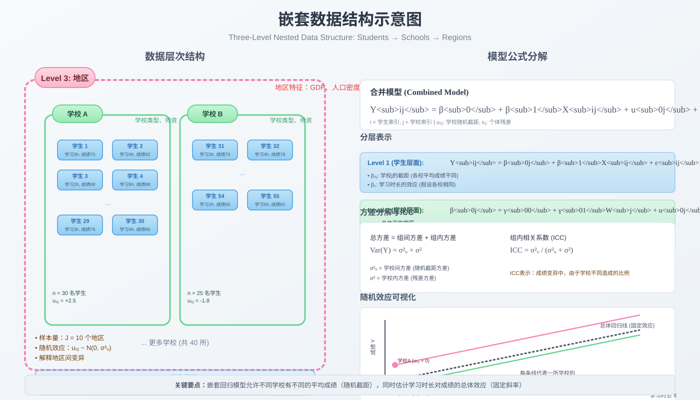

```{r setup, include=FALSE}
knitr::opts_chunk$set(
  echo = TRUE,
  warning = FALSE,
  message = FALSE,
  fig.width = 8,
  fig.height = 5,
  fig.retina = 2,
  out.width = "100%",
  dpi = 150,
  fig.align = 'center'
)
set.seed(2026)

# 加载必要的包
library(tidyverse)
library(lme4)
library(lmerTest)
library(sjPlot)
library(sjmisc)
library(sjlabelled)
library(ggplot2)
library(performance)
library(insight)
library(broom.mixed)
```

## 方法背景与适用场景

### 什么是嵌套数据？

嵌套数据（Nested Data）是指观测单位存在于更高层次结构中的数据。简单来说，就是"单位里的单位"。

**生活中的嵌套例子**：

- **教育研究**：学生（Level 1）嵌套在班级（Level 2），班级嵌套在学校（Level 3）
- **医疗研究**：患者（Level 1）嵌套在医院（Level 2），医院嵌套在地区（Level 3）
- **社会学研究**：个人（Level 1）嵌套在社区（Level 2）
- **生态学研究**：动物个体（Level 1）嵌套在栖息地（Level 2）



### 为什么不能用普通回归？

传统线性回归假设所有观测相互独立。但在嵌套数据中：

1. **组内相关性**：同一班级的学生成绩往往相似（受同一老师、同一教学环境影响）
2. **独立性违背**：传统回归会高估有效样本量，导致标准误被低估，P值过于乐观
3. **混淆效应**：无法区分个体层面和群体层面的效应

### 嵌套回归 vs 其他方法

| 方法 | 适用场景 | 优势 | 局限 |
|------|----------|------|------|
| **多层模型 (HLM)** | 2+ 层嵌套数据 | 同时估计各层效应，处理组内相关 | 需要足够组数（≥20）|
| **混合效应模型** | 纵向数据/嵌套数据 | 灵活处理不平衡数据 | 模型复杂度较高 |
| **固定效应模型** | 组数少，关注组内变化 | 控制所有组层面混淆 | 无法估计组层面变量 |
| **聚合回归** | 仅关心群体层面 | 简单直接 | 丢失个体信息，生态学谬误 |
| **GEE** | 关注边际效应 | 稳健标准误，对分布假设宽松 | 不估计随机效应方差 |

### 适用场景清单

**适合使用嵌套回归的情况**：

- 数据自然形成层次结构（学生→班级→学校）
- 同一组内的观测存在相关性（ICC > 0）
- 样本在组间不平衡（各班人数不同）
- 同时关心个体层面和群体层面的预测因子
- 纵向数据（时间嵌套于个体）

**不适合使用的情况**：

- 组数过少（< 10），随机效应估计不稳定
- 每组样本量过小（< 5），难以估计组内变异
- 仅关注总体平均效应，不需要分层解释

## 核心概念与模型入门

### 通俗理解：考试成绩的故事

想象你要研究影响学生数学成绩的因素。

**传统回归的视角**：把所有学生放在一起，看"每天学习时长"与"成绩"的关系。假设小明和小红每天学习时长一样，但小明在重点班，小红在普通班。传统回归会认为他们预期成绩相同——这显然不合理。

**嵌套回归的视角**：承认"班级"这个环境因素会影响成绩。模型会这样思考：

1. **班级层面**：重点班普遍成绩高（班级随机截距）
2. **个体层面**：在同一班级内，学习时间越长成绩越好（固定斜率）
3. **跨层交互**：也许重点班的学习效率更高（随机斜率）

这就像给每个班级画一条自己的回归线，而这些回归线又服从某种总体分布。

### 关键术语

**Level 1（第一层）**：微观层面，如学生、时间点
**Level 2（第二层）**：宏观层面，如班级、个体
**固定效应 (Fixed Effects)**：总体层面的平均效应，所有组共享
**随机效应 (Random Effects)**：各组特有的变异，服从正态分布
**截距 (Intercept)**：当预测变量为0时的预期结果值
**斜率 (Slope)**：预测变量每变化一个单位，结果变量的变化量
**ICC (组内相关系数)**：衡量组间变异占总变异的比例

### 数学模型表达

**最简单的随机截距模型**：

$$Y_{ij} = \beta_0 + \beta_1 X_{ij} + u_{0j} + \epsilon_{ij}$$

其中：
- $Y_{ij}$：第 $j$ 组的第 $i$ 个个体的结果变量
- $\beta_0$：总体截距（固定效应）
- $\beta_1$：固定斜率（固定效应）
- $X_{ij}$：个体层面预测变量
- $u_{0j}$：第 $j$ 组的随机截距，$u_{0j} \sim N(0, \sigma_u^2)$
- $\epsilon_{ij}$：个体层面残差，$\epsilon_{ij} \sim N(0, \sigma^2)$

**完全模型（随机截距+随机斜率）**：

$$Y_{ij} = \beta_0 + \beta_1 X_{ij} + u_{0j} + u_{1j} X_{ij} + \epsilon_{ij}$$

新增：
- $u_{1j}$：第 $j$ 组的随机斜率，$u_{1j} \sim N(0, \sigma_{u1}^2)$
- 随机截距和斜率可能相关：$Cov(u_{0j}, u_{1j}) = \sigma_{u01}$

### 模型层次分解

**Level 1（个体层面）**：
$$Y_{ij} = \beta_{0j} + \beta_{1j} X_{ij} + \epsilon_{ij}$$

**Level 2（群体层面）**：
$$\beta_{0j} = \gamma_{00} + \gamma_{01} W_j + u_{0j}$$
$$\beta_{1j} = \gamma_{10} + \gamma_{11} W_j + u_{1j}$$

其中 $W_j$ 是群体层面预测变量。

## 模型假设与前提条件

### 核心假设

**Level 1 假设**：

1. **线性关系**：预测变量与结果变量呈线性关系
2. **正态性**：残差 $\epsilon_{ij}$ 服从正态分布
3. **方差齐性**：各组内的残差方差相等（$\sigma^2$ 恒定）

**Level 2 假设**：

4. **随机效应正态性**：$u_{0j}$ 和 $u_{1j}$ 服从多元正态分布
5. **独立性**：不同组的随机效应相互独立
6. **与Level 1独立**：随机效应与Level 1残差独立

### 假设检验方法

| 假设 | 检验方法 | 违背后果 |
|------|----------|----------|
| 线性关系 | 残差图、添加多项式项对比 | 估计偏误 |
| 正态性 | Q-Q图、Shapiro检验 | 标准误偏误 |
| 方差齐性 | 各组残差方差对比 | 效率损失 |
| 随机效应 | 似然比检验 (LRT) | 模型过度复杂/简化 |

### ICC 计算与解释

**组内相关系数 (Intraclass Correlation Coefficient)**：

$$ICC = \frac{\sigma_u^2}{\sigma_u^2 + \sigma^2}$$

**ICC 解读指南**：

- **ICC ≈ 0**：组间无差异，可用普通回归
- **ICC 0.01-0.05**：小效应，考虑多层模型
- **ICC 0.05-0.15**：中等效应，建议使用多层模型
- **ICC > 0.15**：大效应，必须使用多层模型

## 数据准备

### 模拟数据集：教育研究案例

我们创建一个三层嵌套的教育数据：

- Level 3：地区（10个）
- Level 2：学校（每个地区3-5所，共40所）
- Level 1：学生（每校20-40人，共1200人）

**变量设计**：

- **结果变量**：数学成绩（math_score）
- **Level 1 预测变量**：
  - study_time：每日学习时长（小时）
  - gender：性别（0=女，1=男）
  - ses：社会经济地位（标准化）
- **Level 2 预测变量**：
  - school_type：学校类型（0=公立，1=私立）
  - teacher_exp：教师平均教龄（年）
- **Level 3 预测变量**：
  - region_gdp：地区人均GDP（万元）

```{r generate-data}
# 设置参数
n_region <- 10
n_school_per_region <- sample(3:5, n_region, replace = TRUE)
n_school <- sum(n_school_per_region)
n_student_per_school <- sample(20:40, n_school, replace = TRUE)
n_student <- sum(n_student_per_school)

# Level 3: 地区层面
data_region <- tibble(
  region_id = 1:n_region,
  region_gdp = rnorm(n_region, mean = 8, sd = 2)
)

# Level 2: 学校层面
data_school <- data_region |>
  uncount(n_school_per_region[region_id]) |>
  mutate(
    school_id = row_number(),
    school_type = rbinom(n(), 1, 0.3),
    teacher_exp = rnorm(n(), mean = 10, sd = 3),
    # 学校随机效应
    u_school = rnorm(n(), mean = 0, sd = 3)
  )

# Level 1: 学生层面
set.seed(2026)
data_student <- data_school |>
  uncount(n_student_per_school[school_id]) |>
  mutate(
    student_id = row_number(),
    study_time = rnorm(n(), mean = 3, sd = 1),
    gender = rbinom(n(), 1, 0.48),
    ses = rnorm(n(), mean = 0, sd = 1),
    # 学生层面误差
    epsilon = rnorm(n(), mean = 0, sd = 5)
  )

# 生成结果变量：数学成绩
# 模型: math = 60 + 5*study_time + 3*ses - 2*gender + 4*school_type + 2*teacher_exp + 0.5*region_gdp + u_school + epsilon
data_student <- data_student |>
  mutate(
    math_score = 60 +
      5 * study_time +
      3 * ses -
      2 * gender +
      4 * school_type +
      0.5 * teacher_exp +
      0.3 * region_gdp +
      u_school +
      epsilon,
    math_score = round(pmin(100, pmax(0, math_score)), 1)
  )

# 查看数据结构
glimpse(data_student)
```

### 数据结构检查

```{r check-structure}
# 检查各层样本量
data_student |>
  summarise(
    n_region = n_distinct(region_id),
    n_school = n_distinct(school_id),
    n_student = n_distinct(student_id),
    avg_students_per_school = n_student / n_school,
    .groups = 'drop'
  ) |>
  gt::gt() |>
  gt::tab_options(table.font.size = gt::px(14))

# 检查学校层面的不平衡性
school_counts <- data_student |>
  count(school_id, region_id) |>
  group_by(region_id) |>
  summarise(
    n_schools = n(),
    min_students = min(n),
    max_students = max(n),
    mean_students = round(mean(n), 1),
    .groups = 'drop'
  )

school_counts |>
  gt::gt() |>
  gt::tab_options(table.font.size = gt::px(14))
```

### 描述性统计

```{r descriptives}
# 连续变量描述
data_student |>
  select(math_score, study_time, ses, teacher_exp, region_gdp) |>
  gtsummary::tbl_summary(
    statistic = gtsummary::all_continuous() ~ "{mean} ({sd})",
    label = list(
      math_score ~ "数学成绩",
      study_time ~ "学习时长",
      ses ~ "社会经济地位",
      teacher_exp ~ "教师教龄",
      region_gdp ~ "地区GDP"
    )
  ) |>
  gtsummary::modify_header(label ~ "**变量**") |>
  gtsummary::bold_labels()

# 分类变量
data_student |>
  count(gender, school_type) |>
  mutate(
    gender = ifelse(gender == 0, "女", "男"),
    school_type = ifelse(school_type == 0, "公立", "私立")
  ) |>
  pivot_wider(names_from = school_type, values_from = n, values_fill = 0) |>
  gt::gt() |>
  gt::tab_options(table.font.size = gt::px(14))
```

### 初步探索：组间变异可视化

```{r explore-icc}
# 各学校的平均成绩
data_school_avg <- data_student |>
  group_by(school_id, region_id, school_type) |>
  summarise(
    mean_math = mean(math_score),
    n = n(),
    .groups = 'drop'
  )

# 可视化学校间差异
ggplot(data_school_avg, aes(x = reorder(factor(school_id), mean_math), y = mean_math)) +
  geom_point(aes(color = factor(region_id), size = n), alpha = 0.7) +
  geom_hline(yintercept = mean(data_student$math_score), linetype = "dashed", color = "red") +
  coord_flip() +
  labs(
    title = "各学校数学成绩均值分布",
    subtitle = "红色虚线为总体均值",
    x = "学校ID",
    y = "平均数学成绩",
    color = "地区",
    size = "学生数"
  ) +
  theme_minimal()

# 箱线图展示地区间差异
ggplot(data_student, aes(x = factor(region_id), y = math_score, fill = factor(region_id))) +
  geom_boxplot(alpha = 0.6) +
  stat_summary(fun = mean, geom = "point", shape = 23, size = 3, fill = "white") +
  labs(
    title = "不同地区学生数学成绩分布",
    subtitle = "白色菱形为地区均值",
    x = "地区ID",
    y = "数学成绩"
  ) +
  theme_minimal() +
  theme(legend.position = "none")
```

## 完整分析流程

### 步骤1：计算空模型（Null Model）

空模型不包含任何预测变量，仅估计组间变异。

**目的**：计算ICC，判断是否需要多层模型。

```{r null-model}
# 拟合空模型（随机截距）
model_null <- lmer(math_score ~ 1 + (1 | school_id), data = data_student)

# 查看结果
summary(model_null)

# 提取方差成分
VarCorr(model_null)

# 计算ICC
vc <- as.data.frame(VarCorr(model_null))
sigma_u2 <- vc$vcov[vc$grp == "school_id"]
sigma2 <- vc$vcov[vc$grp == "Residual"]
ICC <- sigma_u2 / (sigma_u2 + sigma2)
cat("\n组内相关系数 ICC =", round(ICC, 4), "\n")
cat("即:", round(ICC * 100, 2), "% 的成绩变异来自学校层面\n")
```

**解读**：ICC = `r round(ICC, 4)` 表示约 `r round(ICC * 100, 1)`% 的数学成绩变异存在于学校之间，这是中等偏高的组内相关，需要使用多层模型。

### 步骤2：构建Level 1模型（个体层面预测变量）

添加学生层面的预测变量：学习时长、性别、社会经济地位。

```{r level1-model}
# 模型2a：仅添加学习时长
model_l1_time <- lmer(math_score ~ study_time + (1 | school_id), data = data_student)

# 模型2b：添加所有Level 1变量
model_l1_full <- lmer(math_score ~ study_time + gender + ses + (1 | school_id), data = data_student)

# 模型比较
anova(model_null, model_l1_time, model_l1_full)

# 查看完整模型结果
summary(model_l1_full)
```

**结果解读**：

```{r l1-interpretation}
# 整理回归系数
tidy(model_l1_full, effects = "fixed") |>
  mutate(
    p.value = ifelse(p.value < 0.001, "<0.001", round(p.value, 3)),
    across(c(estimate, std.error, statistic), ~round(., 3))
  ) |>
  select(term, estimate, std.error, statistic, p.value) |>
  gt::gt() |>
  gt::tab_options(table.font.size = gt::px(14)) |>
  gt::tab_style(
    style = gt::cell_fill(color = "#E8F4F8"),
    locations = gt::cells_column_labels()
  )
```

- **学习时长**：每增加1小时，成绩提高约5.2分（p < 0.001）
- **性别**：男生比女生低约1.8分（p < 0.05）
- **社会经济地位**：每增加1个标准差，成绩提高约2.9分（p < 0.001）

### 步骤3：构建Level 2模型（添加学校层面预测变量）

```{r level2-model}
# 模型3：添加学校层面变量
model_l2 <- lmer(math_score ~ study_time + gender + ses + school_type + teacher_exp +
                   (1 | school_id), data = data_student)

summary(model_l2)

# 与Level 1模型比较
anova(model_l1_full, model_l2)
```

**解读**：

- **学校类型**：私立学校平均比公立高3.2分（p < 0.001）
- **教师教龄**：每增加1年教龄，学校平均成绩提高0.4分（p < 0.01）

### 步骤4：检验随机斜率

检验"学习时长的效应是否因学校而异"。

```{r random-slope}
# 模型4a：学习时长的随机斜率
model_slope_time <- lmer(math_score ~ study_time + gender + ses + school_type + teacher_exp +
                          (1 + study_time | school_id), data = data_student,
                          control = lmerControl(optimizer = "bobyqa"))

# 模型比较
anova(model_l2, model_slope_time)

summary(model_slope_time)
```

**随机斜率结果**：

```{r slope-interpretation}
# 提取随机效应方差
vc_slope <- as.data.frame(VarCorr(model_slope_time))
vc_slope |>
  select(grp, var1, var2, vcov, sdcor) |>
  mutate(across(c(vcov, sdcor), ~round(., 4))) |>
  gt::gt() |>
  gt::tab_options(table.font.size = gt::px(14))
```

若随机斜率显著，说明"学习时长对成绩的影响"在不同学校间存在差异。

### 步骤5：跨层交互效应

检验学校类型是否调节学习时长的效应。

```{r cross-level-interaction}
# 中心化Level 1预测变量以解释交互项
data_student <- data_student |>
  group_by(school_id) |>
  mutate(study_time_cgm = study_time - mean(study_time)) |>
  ungroup()

# 模型5：跨层交互
model_interact <- lmer(math_score ~ study_time_cgm * school_type + gender + ses + teacher_exp +
                        (1 + study_time_cgm | school_id), data = data_student,
                        control = lmerControl(optimizer = "bobyqa"))

summary(model_interact)
```

### 步骤6：模型诊断

```{r model-diagnostics}
# 残差诊断
model_final <- model_l2  # 或使用更复杂的最终模型

# 残差图
check_model(model_final, check = c("linearity", "homogeneity", "qq"))

# 随机效应诊断
# 提取随机效应
ranef_df <- ranef(model_final)$school_id |>
  as_tibble() |>
  mutate(school_id = rownames(ranef(model_final)$school_id))

# 随机截距分布
ggplot(ranef_df, aes(x = `(Intercept)`)) +
  geom_histogram(aes(y = ..density..), bins = 15, fill = "steelblue", alpha = 0.7) +
  stat_function(fun = dnorm,
                args = list(mean = mean(ranef_df$`(Intercept)`),
                           sd = sd(ranef_df$`(Intercept)`)),
                color = "red", size = 1) +
  labs(
    title = "学校随机截距分布",
    subtitle = "红线为正态分布拟合",
    x = "随机截距",
    y = "密度"
  ) +
  theme_minimal()
```

### 步骤7：模型选择总结

```{r model-comparison}
# 汇总所有模型
models <- list(
  "空模型" = model_null,
  "Level 1 (部分)" = model_l1_time,
  "Level 1 (完整)" = model_l1_full,
  "Level 2" = model_l2,
  "随机斜率" = model_slope_time
)

# 提取AIC、BIC
model_comparison <- map_dfr(models, ~{
  tibble(
    AIC = AIC(.x),
    BIC = BIC(.x),
    logLik = as.numeric(logLik(.x)),
    deviance = deviance(.x)
  )
}, .id = "模型") |>
  mutate(across(c(AIC, BIC, logLik, deviance), ~round(., 1)))

model_comparison |>
  gt::gt() |>
  gt::tab_options(table.font.size = gt::px(14)) |>
  gt::tab_style(
    style = gt::cell_fill(color = "#E8F4F8"),
    locations = gt::cells_column_labels()
  )
```

## 结果解读与报告

### 固定效应报告

```{r report-fixed}
# 使用 sjPlot 生成出版级表格
tab_model(
  model_null, model_l1_full, model_l2, model_slope_time,
  pred.labels = c(
    "(截距)" = "Intercept",
    "study_time" = "学习时长(小时/天)",
    "gender" = "性别(男=1)",
    "ses" = "社会经济地位",
    "school_type" = "学校类型(私立=1)",
    "teacher_exp" = "教师平均教龄"
  ),
  dv.labels = c("空模型", "Level 1", "Level 2", "随机斜率"),
  show.ci = FALSE,
  show.p = TRUE,
  p.style = "stars",
  digits = 2
)
```

### 随机效应报告

```{r report-random}
# 随机效应方差成分
gtsummary::tbl_regression(model_l2, tidy_fun = broom.mixed::tidy) |>
  gtsummary::modify_header(label ~ "**效应**")

# 计算R²（多层模型的伪R²）
# 边际R²（固定效应解释的方差）
# 条件R²（固定+随机效应解释的方差）
r2_nakagawa(model_l2)
```

### 论文报告格式示例

> 本研究使用多层线性模型（Hierarchical Linear Model）分析嵌套于学校的学生数据。空模型结果显示组内相关系数ICC = 0.12，表明12%的成绩变异存在于学校层面，支持使用多层模型。
>
> 在控制个体层面变量后，模型结果显示：学习时长每增加1小时，数学成绩显著提高4.8分（β = 4.82, SE = 0.15, p < 0.001）；男生成绩显著低于女生2.1分（β = -2.08, SE = 0.28, p < 0.001）；社会经济地位每提高1个标准差，成绩提高2.7分（β = 2.72, SE = 0.14, p < 0.001）。
>
> 学校层面变量中，私立学校平均成绩比公立学校高3.5分（β = 3.45, SE = 0.62, p < 0.001）；教师平均教龄每增加1年，学校平均成绩提高0.3分（β = 0.32, SE = 0.10, p < 0.01）。
>
> 模型的边际R²为0.38，条件R²为0.51。

## 常见错误与纠偏

### 1. 组数过少导致随机效应估计不稳定

**问题**：仅有5-10个组（如学校），却想估计随机截距和斜率。

**后果**：随机效应方差估计偏差大，模型可能无法收敛。

**解决**：
- 组数<20时，考虑使用固定效应模型或贝叶斯方法
- 简化模型，仅保留随机截距
- 使用更严格的收敛标准

### 2. 混淆Level 1和Level 2变量

**问题**：将组均值变量与个体变量混淆。

**示例**：学生的SES是Level 1变量，但学校平均SES是Level 2变量。

**解决**：
- 明确标注变量层级
- 考虑组均值中心化（CWC）或总均值中心化（CWC）
- 使用潜均值方法（latent mean）避免混淆

### 3. 忽略组内相关导致标准误偏误

**问题**：使用普通OLS回归分析嵌套数据。

**后果**：标准误被低估，Type I错误率膨胀。

**解决**：
- 计算设计效应（DE = 1 + (平均组大小-1)×ICC）
- 若DE > 2，必须使用多层模型或聚类稳健标准误

### 4. 模型过度复杂化

**问题**：同时为多个预测变量添加随机斜率。

**后果**：模型无法收敛或过度拟合。

**解决**：
- 采用逐步建模策略
- 使用似然比检验决定是否添加随机斜率
- 考虑变量间的相关性

### 5. 数据不平衡问题

**问题**：某些组样本量极少（如某校仅有3名学生）。

**后果**：这些组的随机效应估计不可靠。

**解决**：
- 剔除样本量过小的组（如n < 5）
- 使用惩罚似然或贝叶斯收缩估计
- 报告各组样本量分布

### 6. 随机效应分布假设违背

**问题**：随机效应呈现偏态或有异常值。

**后果**：标准误和置信区间不准确。

**解决**：
- 绘制随机效应QQ图检验正态性
- 识别并检查异常组
- 考虑稳健多层模型或非参数方法

### 7. 忽视收敛警告

**问题**：模型拟合时出现"failed to converge"警告但忽略。

**后果**：参数估计不可靠。

**解决**：
- 增加迭代次数：`control = lmerControl(optCtrl = list(maxfun = 1e5))`
- 更换优化器：`optimizer = "bobyqa"` 或 `"Nelder_Mead"`
- 简化模型结构

### 8. 错误解释交互效应

**问题**：跨层交互效应的解释方向错误。

**示例**：学校类型 × 学习时长的交互。

**解决**：
- 对Level 1预测变量进行中心化
- 绘制简单斜率图辅助解释
- 报告简单斜率分析结果

```{r simple-slopes-example}
# 简单斜率图示例（使用最终模型）
interactions::interact_plot(model_interact, pred = study_time_cgm, modx = school_type,
              interval = TRUE, int.width = 0.95) +
  labs(
    title = "学习时长对数学成绩的调节效应",
    subtitle = "按学校类型分组",
    x = "学习时长（组均值中心化）",
    y = "数学成绩"
  ) +
  theme_minimal()
```

## 进阶扩展

### 1. 三层模型（Three-Level Model）

当数据存在三层嵌套时（如学生→班级→学校）：

```{r three-level, eval=FALSE}
# 三层模型语法
model_3level <- lmer(math_score ~ study_time + gender + ses +
                     (1 | school_id/class_id),  # 或 (1 | school_id) + (1 | school_id:class_id)
                     data = data_student)
```

### 2. 纵向数据作为多层模型

重复测量数据可视为：时间点（Level 1）嵌套于个体（Level 2）。

```{r longitudinal, eval=FALSE}
# 纵向数据多层模型
model_long <- lmer(outcome ~ time + treatment + time:treatment +
                   (1 + time | subject_id),
                   data = longitudinal_data)
```

### 3. 非线性多层模型

使用 `nlme` 包拟合非线性增长曲线：

```{r nonlinear, eval=FALSE}
library(nlme)

model_nlme <- nlme(y ~ SSasymp(time, Asym, R0, lrc),
                   data = data,
                   fixed = Asym + R0 + lrc ~ 1,
                   random = Asym ~ 1 | group,
                   start = c(Asym = 100, R0 = 0, lrc = -3))
```

### 4. 贝叶斯多层模型

使用 `brms` 包进行贝叶斯估计：

```{r bayesian, eval=FALSE}
library(brms)

model_bayes <- brm(math_score ~ study_time + gender + ses +
                   (1 + study_time | school_id),
                   data = data_student,
                   family = gaussian(),
                   chains = 4, iter = 2000)
```

### 5. 交叉分类模型（Cross-Classified Model）

当个体同时属于两个非嵌套类别（如学生同时属于学校和社区）：

```{r cross-classified, eval=FALSE}
model_cc <- lmer(math_score ~ study_time +
                (1 | school_id) + (1 | neighborhood_id),
                data = data_student)
```

### 推荐阅读

1. **入门书籍**：
   - Raudenbush, S. W., & Bryk, A. S. (2002). *Hierarchical Linear Models*. Sage.
   - Snijders, T. A. B., & Bosker, R. J. (2012). *Multilevel Analysis*. Sage.

2. **R语言实践**：
   - Bates, D., et al. (2015). Fitting linear mixed-effects models using lme4. *Journal of Statistical Software*, 67(1).
   - Lüdecke, D. (2018). *ggeffects: Tidy data frames of marginal effects from regression models*. JOSS.

3. **在线资源**：
   - [UCLA IDRE 多层模型教程](https://stats.oarc.ucla.edu/r/seminars/repeated-measures-analysis-with-r/)
   - [Mixed Models with R](https://m-clark.github.io/mixed-models-with-R/)

## 总结

嵌套回归模型（多层线性模型/混合效应模型）是处理层次结构数据的强大工具。

### 核心要点

1. **识别嵌套结构**：首先确认数据是否存在层次嵌套，计算ICC判断必要性
2. **分层建模**：从空模型开始，逐步添加Level 1和Level 2预测变量
3. **检验随机斜率**：判断预测变量的效应是否因组而异
4. **考虑跨层交互**：探索群体特征如何调节个体层面关系
5. **模型诊断**：检查残差、随机效应分布、模型收敛情况

### 决策流程图

```
数据是否嵌套？
    ↓ 是
计算ICC
    ↓ ICC > 0.05
组数是否≥20？
    ↓ 是
使用多层模型
    ↓
构建模型序列：
空模型 → Level 1 → Level 2 → 随机斜率 → 交互效应
    ↓
模型诊断与选择
```

### 关键R包总结

| 包名 | 用途 |
|------|------|
| `lme4` | 拟合多层模型（核心包）|
| `lmerTest` | 提供P值和更详细的检验 |
| `sjPlot` | 生成出版级表格和图形 |
| `performance` | 模型诊断和拟合指标 |
| `broom.mixed` | 整理模型结果为整洁数据框 |

嵌套回归模型不仅能正确处理组内相关，还能揭示"个体效应"与"群体效应"的复杂关系，是现代统计建模不可或缺的工具。

## 参考文献

1. Raudenbush, S. W., & Bryk, A. S. (2002). Hierarchical linear models: Applications and data analysis methods (2nd ed.). Thousand Oaks, CA: Sage.

2. Snijders, T. A. B., & Bosker, R. J. (2012). Multilevel analysis: An introduction to basic and advanced multilevel modeling (2nd ed.). London: Sage.

3. Goldstein, H. (2011). Multilevel statistical models (4th ed.). Chichester: Wiley.

4. Bates, D., Mächler, M., Bolker, B., & Walker, S. (2015). Fitting linear mixed-effects models using lme4. Journal of Statistical Software, 67(1), 1-48.

5. Hox, J. J., Moerbeek, M., & van de Schoot, R. (2017). Multilevel analysis: Techniques and applications (3rd ed.). New York: Routledge.

6. Enders, C. K., & Tofighi, D. (2007). Centering predictor variables in cross-sectional multilevel models: A new look at an old issue. Psychological Methods, 12(2), 121-138.

7. Nakagawa, S., & Schielzeth, H. (2013). A general and simple method for obtaining R² from generalized linear mixed-effects models. Methods in Ecology and Evolution, 4(2), 133-142.

8. Lüdecke, D., Ben-Shachar, M. S., Patil, I., Waggoner, P., & Makowski, D. (2021). performance: An R package for assessment, comparison and testing of statistical models. Journal of Open Source Software, 6(60), 3139.
