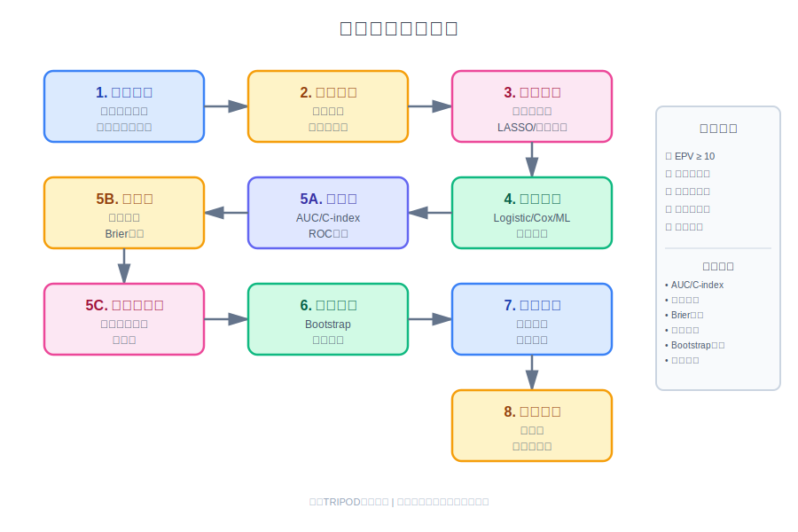

```{r setup, include=FALSE}
knitr::opts_chunk$set(
  echo = TRUE, 
  message = FALSE, 
  warning = FALSE,
  fig.align = 'center'  # 所有图片居中
)
set.seed(2026)
```

## 方法背景与适用场景

### 什么是临床预测模型?

想象你是一位医生,面对一位50岁的高血压患者,你需要判断他未来10年发生心血管疾病的风险。你会考虑哪些因素?年龄、血压、胆固醇、是否吸烟、糖尿病史等等。**临床预测模型就是把这种医生的经验判断,转化为可以量化计算的数学公式。**

就像天气预报根据气温、湿度、气压等因素预测降雨概率一样,临床预测模型根据患者的临床特征(年龄、性别、实验室检查、症状等)预测某种结局发生的概率(如疾病发生、死亡、并发症等)。

### 与其他统计方法的区别

| 方法 | 主要目的 | 关注点 | 输出 |
|------|----------|--------|------|
| **临床预测模型** | **预测个体风险** | 预测准确性、模型校准 | 风险概率、风险评分 |
| Logistic回归 | 探索因素关联 | 假设检验、OR值 | 统计显著性 |
| 生存分析 | 估计生存时间 | 时间-事件关系 | 生存曲线、HR值 |
| 倾向评分 | 因果推断 | 混杂控制 | 因果效应估计 |

**核心区别**:其他方法主要回答"哪些因素与结局相关",预测模型回答"这个个体的风险有多大"。

### 适用场景

**适合使用预测模型的场景**:

1. **疾病风险预测**:糖尿病发病风险、心血管事件风险
2. **预后评估**:ICU患者死亡风险、癌症患者生存预测
3. **诊断辅助**:根据症状和检查预测疾病概率
4. **治疗决策支持**:根据患者特征推荐个体化治疗方案
5. **资源分配**:识别高危人群进行重点干预

**不适合的场景**:

- 样本量太小(<10×预测变量数×结局事件数)
- 数据质量差(大量缺失、测量误差)
- 仅关心因果推断而非预测
- 结局发生率极低(<5%)或极高(>95%)

### 核心概念速览

```{r core-concepts, echo=FALSE}
library(gt)

tibble::tribble(
  ~概念, ~含义, ~评价指标,
  "区分度 (Discrimination)", "模型区分有病/无病的能力", "C-index (AUC)",
  "校准度 (Calibration)", "预测概率与实际概率的一致性", "校准曲线、Brier分数",
  "临床实用性", "模型在临床决策中的价值", "决策曲线分析",
  "内部验证", "在同一数据集验证模型", "Bootstrap、交叉验证",
  "外部验证", "在独立数据集验证模型", "外部队列验证"
) |> 
  gt() |> 
  tab_style(
    style = cell_fill(color = "#E8F4F8"),
    locations = cells_column_labels()
  ) |> 
  tab_style(
    style = cell_text(weight = "bold"),
    locations = cells_body(columns = 1)
  ) |> 
  tab_options(
    table.font.size = px(14),
    data_row.padding = px(8)
  )
```

## 核心原理与理论基础

### 预测模型的数学本质

对于二分类结局(如疾病是否发生),预测模型本质上是估计**条件概率**:

$$
P(Y=1|X_1, X_2, \ldots, X_p) = f(X_1, X_2, \ldots, X_p)
$$

其中:
- $Y$ 是结局变量(0=未发生,1=发生)
- $X_1, X_2, \ldots, X_p$ 是 $p$ 个预测变量
- $f(\cdot)$ 是模型函数

**常用模型函数**:

```{r model-types, echo=FALSE}
tibble::tribble(
  ~模型类型, ~函数形式, ~适用场景, ~R实现,
  "Logistic回归", "logit(p) = β₀ + β₁X₁ + ... + βₚXₚ", "线性关系、可解释性强", "glm(..., family='binomial')",
  "Cox比例风险", "h(t) = h₀(t)exp(β₁X₁ + ... + βₚXₚ)", "时间-事件结局", "survival::coxph()",
  "随机森林", "基于决策树集成", "非线性关系、交互作用", "randomForest::randomForest()",
  "LASSO回归", "带L1惩罚的回归", "变量选择、高维数据", "glmnet::cv.glmnet()"
) |> 
  gt() |> 
  tab_style(
    style = cell_fill(color = "#FFF4E6"),
    locations = cells_column_labels()
  ) |> 
  tab_options(
    table.font.size = px(14),
    data_row.padding = px(8)
  )
```

### 模型开发的关键步骤



一个完整的预测模型开发流程包括:

1. **研究设计**:明确预测目标、结局定义、目标人群
2. **数据准备**:数据清洗、缺失值处理、变量编码
3. **变量筛选**:单因素分析、专业知识、统计方法
4. **模型拟合**:选择合适的建模方法
5. **模型评价**:区分度、校准度、临床实用性
6. **内部验证**:Bootstrap、交叉验证
7. **外部验证**:独立队列验证
8. **模型展示**:列线图、风险评分、在线计算器

### 模型性能评价指标详解

#### 1. 区分度 (Discrimination)

**C-index (Concordance Index)**,也称为AUC (Area Under ROC Curve):

- **含义**:随机抽取一对患者(一个发生结局,一个未发生),模型给发生结局者更高风险的概率
- **取值范围**:0.5-1.0
  - 0.5:与随机猜测无异
  - 0.7-0.8:可接受
  - 0.8-0.9:优秀
  - >0.9:极好(或过拟合)
- **R实现**:`pROC::auc()` 或 `Hmisc::rcorr.cens()`

#### 2. 校准度 (Calibration)

**校准曲线**:横轴为预测概率,纵轴为实际发生率。理想情况下应在45度对角线上。

**Hosmer-Lemeshow检验**:

$$
\chi^2 = \sum_{g=1}^{G} \frac{(O_g - E_g)^2}{N_g \bar{\pi}_g (1-\bar{\pi}_g)}
$$

其中:
- $O_g$ 是第 $g$ 组观测事件数
- $E_g$ 是第 $g$ 组期望事件数
- $N_g$ 是第 $g$ 组样本量
- $\bar{\pi}_g$ 是第 $g$ 组平均预测概率

**注意**:P值不显著(>0.05)表示校准良好,但该检验效能低,不推荐单独使用。

**Brier分数**:

$$
\text{Brier} = \frac{1}{N} \sum_{i=1}^{N} (p_i - y_i)^2
$$

其中:
- $p_i$ 是预测概率
- $y_i$ 是实际结局(0或1)
- 取值范围:0-1,越小越好

#### 3. 临床实用性

**决策曲线分析 (Decision Curve Analysis, DCA)**:

评估在不同风险阈值下,使用模型做决策相比"全部治疗"或"全不治疗"的净获益 (Net Benefit):

$$
\text{NB} = \frac{\text{TP}}{N} - \frac{\text{FP}}{N} \times \frac{p_t}{1-p_t}
$$

其中:
- TP:真阳性数
- FP:假阳性数
- $p_t$:决策阈值

## 数据准备与探索

### 模拟真实临床数据

我们模拟一个**心血管疾病5年发病风险预测**的研究数据:

```{r simulate-data}
library(dplyr)
library(ggplot2)

# 模拟1000名随访5年的患者数据
n <- 1000

# 生成协变量
set.seed(2026)
cvd_data <- tibble(
  # 人口学特征
  age = rnorm(n, mean = 55, sd = 10),
  sex = sample(c("男", "女"), n, replace = TRUE, prob = c(0.52, 0.48)),
  
  # 生理指标
  sbp = rnorm(n, mean = 135, sd = 18),  # 收缩压 (mmHg)
  dbp = rnorm(n, mean = 85, sd = 10),   # 舒张压 (mmHg)
  tc = rnorm(n, mean = 5.2, sd = 1.1),  # 总胆固醇 (mmol/L)
  hdl = rnorm(n, mean = 1.3, sd = 0.4), # 高密度脂蛋白 (mmol/L)
  ldl = tc - hdl - rnorm(n, 0.5, 0.2),  # 低密度脂蛋白
  bmi = rnorm(n, mean = 24.5, sd = 3.5),
  
  # 行为因素
  smoking = sample(c("从不", "曾经", "当前"), n, replace = TRUE, 
                   prob = c(0.5, 0.25, 0.25)),
  
  # 疾病史
  diabetes = sample(c(0, 1), n, replace = TRUE, prob = c(0.85, 0.15)),
  hypertension = ifelse(sbp >= 140 | dbp >= 90, 1, 0),
  
  # 用药史
  statin = sample(c(0, 1), n, replace = TRUE, prob = c(0.7, 0.3))
) |> 
  mutate(
    # 年龄分类
    age_group = cut(age, breaks = c(0, 50, 60, 70, 100),
                    labels = c("<50", "50-59", "60-69", "≥70")),
    
    # 计算线性预测值(真实风险)
    linear_predictor = -8 + 
      0.06 * age +                          # 年龄效应
      0.5 * (sex == "男") +                 # 性别效应
      0.02 * sbp +                          # 收缩压效应
      0.3 * (tc - 5) +                      # 胆固醇效应
      -0.5 * (hdl - 1.3) +                  # HDL保护效应
      0.05 * (bmi - 24) +                   # BMI效应
      0.4 * (smoking == "当前") +           # 吸烟效应
      0.6 * diabetes +                      # 糖尿病效应
      0.3 * hypertension,                   # 高血压效应
    
    # 根据logistic函数生成结局
    prob = 1 / (1 + exp(-linear_predictor)),
    cvd_event = rbinom(n, 1, prob)
  )

# 数据概览
glimpse(cvd_data)
```

### 描述性统计

```{r descriptive-stats}
library(gtsummary)

# 按结局分组的基线特征表
cvd_data |> 
  select(age, sex, sbp, dbp, tc, hdl, bmi, smoking, 
         diabetes, hypertension, cvd_event) |> 
  mutate(cvd_event = factor(cvd_event, levels = c(0, 1),
                            labels = c("未发病", "发病"))) |> 
  tbl_summary(
    by = cvd_event,
    statistic = list(
      all_continuous() ~ "{mean} ({sd})",
      all_categorical() ~ "{n} ({p}%)"
    ),
    label = list(
      age ~ "年龄 (岁)",
      sex ~ "性别",
      sbp ~ "收缩压 (mmHg)",
      dbp ~ "舒张压 (mmHg)",
      tc ~ "总胆固醇 (mmol/L)",
      hdl ~ "HDL-C (mmol/L)",
      bmi ~ "BMI (kg/m²)",
      smoking ~ "吸烟状态",
      diabetes ~ "糖尿病",
      hypertension ~ "高血压"
    )
  ) |> 
  add_p() |> 
  add_overall() |> 
  modify_header(label ~ "**变量**") |> 
  bold_labels()
```

### 探索性数据可视化

```{r eda-plots, fig.width=10, fig.height=6}
library(patchwork)

# 1. 年龄分布 by 结局
p1 <- ggplot(cvd_data, aes(x = age, fill = factor(cvd_event))) +
  geom_density(alpha = 0.6) +
  scale_fill_manual(values = c("#4ECDC4", "#FF6B6B"),
                    labels = c("未发病", "发病")) +
  labs(x = "年龄 (岁)", y = "密度", fill = "结局") +
  theme_minimal(base_family = "sans")

# 2. 收缩压分布 by 结局
p2 <- ggplot(cvd_data, aes(x = factor(cvd_event), y = sbp, 
                           fill = factor(cvd_event))) +
  geom_violin(alpha = 0.6) +
  geom_boxplot(width = 0.2, fill = "white", outlier.alpha = 0.5) +
  scale_fill_manual(values = c("#4ECDC4", "#FF6B6B")) +
  scale_x_discrete(labels = c("未发病", "发病")) +
  labs(x = "", y = "收缩压 (mmHg)") +
  theme_minimal(base_family = "sans") +
  theme(legend.position = "none")

# 3. 胆固醇 vs 年龄散点图
p3 <- ggplot(cvd_data, aes(x = age, y = tc, color = factor(cvd_event))) +
  geom_point(alpha = 0.5, size = 1.5) +
  geom_smooth(method = "loess", se = FALSE) +
  scale_color_manual(values = c("#4ECDC4", "#FF6B6B"),
                     labels = c("未发病", "发病")) +
  labs(x = "年龄 (岁)", y = "总胆固醇 (mmol/L)", color = "结局") +
  theme_minimal(base_family = "sans")

# 4. 结局发生率 by 分类变量
p4 <- cvd_data |> 
  group_by(smoking) |> 
  summarise(rate = mean(cvd_event) * 100, .groups = "drop") |> 
  ggplot(aes(x = smoking, y = rate, fill = smoking)) +
  geom_col(alpha = 0.8) +
  geom_text(aes(label = sprintf("%.1f%%", rate)), vjust = -0.5) +
  scale_fill_brewer(palette = "Set2") +
  labs(x = "吸烟状态", y = "CVD发生率 (%)") +
  theme_minimal(base_family = "sans") +
  theme(legend.position = "none")

# 组合图
(p1 + p2) / (p3 + p4) +
  plot_annotation(
    title = "心血管疾病预测变量探索性分析",
    theme = theme(plot.title = element_text(size = 14, face = "bold"))
  )
```

### 缺失值处理

```{r missing-data}
# 检查缺失值
library(naniar)

# 人为引入部分缺失值(模拟真实场景)
cvd_data_missing <- cvd_data |> 
  mutate(
    hdl = ifelse(runif(n()) < 0.05, NA, hdl),
    bmi = ifelse(runif(n()) < 0.08, NA, bmi),
    smoking = ifelse(runif(n()) < 0.03, NA, smoking)
  )

# 缺失值可视化
gg_miss_var(cvd_data_missing, show_pct = TRUE) +
  labs(title = "各变量缺失比例", y = "缺失数量") +
  theme_minimal()

# 多重插补
library(mice)

# 选择建模变量
vars_for_imputation <- c("age", "sex", "sbp", "tc", "hdl", "bmi", 
                         "smoking", "diabetes", "cvd_event")

imputed_data <- mice(
  cvd_data_missing[vars_for_imputation],
  m = 5,              # 5个插补数据集
  method = "pmm",     # 预测均值匹配法
  seed = 2026,
  printFlag = FALSE
)

# 查看插补质量
densityplot(imputed_data, ~ hdl + bmi)
```


## 模型构建与变量筛选

### 变量筛选策略

**常用的变量筛选方法**:

```{r variable-selection-methods, echo=FALSE}
tibble::tribble(
  ~方法, ~优点, ~缺点, ~推荐场景,
  "单因素筛选", "简单快速", "忽略交互和混杂", "初步筛选",
  "逐步回归", "自动化", "易过拟合、不稳定", "变量较多时",
  "LASSO", "同时选择+正则化", "需调参", "高维数据",
  "专业知识", "临床可解释", "可能遗漏变量", "任何场景(必须结合)",
  "全子集", "找到最优组合", "计算量大", "变量<15个"
) |> 
  gt() |> 
  tab_style(
    style = cell_fill(color = "#E8F4F8"),
    locations = cells_column_labels()
  ) |> 
  tab_options(
    table.font.size = px(14),
    data_row.padding = px(8)
  )
```

**推荐策略**:专业知识 + 统计筛选

```{r variable-selection}
# 1. 单因素分析
library(broom)
library(purrr)

predictors <- c("age", "sex", "sbp", "tc", "hdl", "bmi", 
                "smoking", "diabetes", "hypertension")

univariate_results <- map_dfr(predictors, function(var) {
  formula_str <- paste0("cvd_event ~ ", var)
  model <- glm(as.formula(formula_str), 
               data = cvd_data, 
               family = binomial)
  
  tidy(model, exponentiate = TRUE, conf.int = TRUE) |> 
    filter(term != "(Intercept)") |> 
    mutate(variable = var)
}) |> 
  select(variable, term, estimate, conf.low, conf.high, p.value) |> 
  arrange(p.value)

# 格式化输出
univariate_results |> 
  mutate(
    OR_CI = sprintf("%.2f (%.2f-%.2f)", estimate, conf.low, conf.high),
    p.value = ifelse(p.value < 0.001, "<0.001", sprintf("%.3f", p.value))
  ) |> 
  select(variable, term, OR_CI, p.value) |> 
  gt() |> 
  tab_header(title = "单因素分析结果") |> 
  cols_label(
    variable = "变量",
    term = "水平",
    OR_CI = "OR (95% CI)",
    p.value = "P值"
  ) |> 
  tab_style(
    style = cell_fill(color = "#FFE5E5"),
    locations = cells_body(
      columns = p.value,
      rows = p.value < 0.05
    )
  ) |> 
  tab_options(
    table.font.size = px(14),
    data_row.padding = px(8)
  )
```

### 多因素Logistic回归模型

```{r full-model}
# 完整模型(包含所有候选变量)
full_model <- glm(
  cvd_event ~ age + sex + sbp + tc + hdl + bmi + 
    smoking + diabetes + hypertension,
  data = cvd_data,
  family = binomial(link = "logit")
)

# 模型摘要
summary(full_model)

# 格式化系数表
tidy(full_model, exponentiate = TRUE, conf.int = TRUE) |> 
  filter(term != "(Intercept)") |> 
  mutate(
    OR_CI = sprintf("%.2f (%.2f-%.2f)", estimate, conf.low, conf.high),
    p.value = ifelse(p.value < 0.001, "<0.001", sprintf("%.3f", p.value))
  ) |> 
  select(term, OR_CI, p.value) |> 
  gt() |> 
  tab_header(title = "多因素Logistic回归结果") |> 
  cols_label(
    term = "变量",
    OR_CI = "调整OR (95% CI)",
    p.value = "P值"
  ) |> 
  tab_style(
    style = cell_text(weight = "bold"),
    locations = cells_body(
      columns = everything(),
      rows = p.value < 0.05
    )
  ) |> 
  tab_options(
    table.font.size = px(14),
    data_row.padding = px(8)
  )
```

### LASSO变量选择

```{r lasso-selection}
library(glmnet)

# 准备矩阵格式数据
X <- model.matrix(
  ~ age + sex + sbp + tc + hdl + bmi + smoking + diabetes + hypertension,
  data = cvd_data
)[, -1]  # 去掉截距列

y <- cvd_data$cvd_event

# 交叉验证选择最优lambda
set.seed(2026)
cv_lasso <- cv.glmnet(X, y, family = "binomial", alpha = 1, nfolds = 10)

# 可视化lambda选择
plot(cv_lasso)
title("LASSO交叉验证: lambda选择", line = 2.5)

# 提取最优lambda时的系数
lasso_coef <- coef(cv_lasso, s = "lambda.min")
print(lasso_coef)

# 选出非零系数的变量
selected_vars <- rownames(lasso_coef)[lasso_coef[,1] != 0][-1]  # 去掉截距
cat("\nLASSO选出的变量:", paste(selected_vars, collapse = ", "), "\n")
```

### 简化模型(基于LASSO结果)

```{r reduced-model}
# 根据LASSO和临床意义,建立简化模型
reduced_model <- glm(
  cvd_event ~ age + sex + sbp + tc + smoking + diabetes,
  data = cvd_data,
  family = binomial
)

# 比较完整模型与简化模型
anova(reduced_model, full_model, test = "Chisq")

# AIC比较
cat("\n完整模型AIC:", AIC(full_model), "\n")
cat("简化模型AIC:", AIC(reduced_model), "\n")

# 简化模型系数
tidy(reduced_model, exponentiate = TRUE, conf.int = TRUE) |> 
  filter(term != "(Intercept)") |> 
  gt() |> 
  tab_header(title = "简化模型系数") |> 
  fmt_number(columns = c(estimate, conf.low, conf.high), decimals = 2) |> 
  fmt_number(columns = p.value, decimals = 3) |> 
  tab_options(
    table.font.size = px(14),
    data_row.padding = px(8)
  )
```

## 模型性能评价

### 区分度评价: ROC曲线与AUC

```{r roc-auc, fig.width=8, fig.height=6}
library(pROC)

# 获取预测概率
cvd_data <- cvd_data |> 
  mutate(
    pred_prob_full = predict(full_model, type = "response"),
    pred_prob_reduced = predict(reduced_model, type = "response")
  )

# 计算ROC
roc_full <- roc(cvd_data$cvd_event, cvd_data$pred_prob_full)
roc_reduced <- roc(cvd_data$cvd_event, cvd_data$pred_prob_reduced)

# 可视化ROC曲线
ggroc(list(
  "完整模型" = roc_full,
  "简化模型" = roc_reduced
), legacy.axes = TRUE) +
  geom_abline(intercept = 0, slope = 1, linetype = "dashed", color = "gray") +
  annotate("text", x = 0.7, y = 0.3, 
           label = sprintf("完整模型 AUC = %.3f", auc(roc_full)),
           size = 4) +
  annotate("text", x = 0.7, y = 0.2,
           label = sprintf("简化模型 AUC = %.3f", auc(roc_reduced)),
           size = 4) +
  labs(
    x = "1 - 特异度 (假阳性率)",
    y = "灵敏度 (真阳性率)",
    title = "ROC曲线比较",
    color = "模型"
  ) +
  theme_minimal(base_size = 12)

# AUC统计检验
roc.test(roc_full, roc_reduced)
```

### 最优截断值选择

```{r optimal-cutoff}
# 使用Youden指数选择最优截断值
coords_full <- coords(roc_full, "best", ret = c("threshold", "sensitivity", 
                                                  "specificity", "ppv", "npv"))

# 格式化输出
tibble(
  指标 = c("最优截断值", "灵敏度", "特异度", "阳性预测值", "阴性预测值"),
  值 = c(
    sprintf("%.3f", coords_full$threshold),
    sprintf("%.1f%%", coords_full$sensitivity * 100),
    sprintf("%.1f%%", coords_full$specificity * 100),
    sprintf("%.1f%%", coords_full$ppv * 100),
    sprintf("%.1f%%", coords_full$npv * 100)
  )
) |> 
  gt() |> 
  tab_header(title = "基于Youden指数的最优截断值") |> 
  tab_options(
    table.font.size = px(14),
    data_row.padding = px(8)
  )
```

### 校准度评价

```{r calibration, fig.width=10, fig.height=5}
library(rms)

# 准备数据(使用rms包格式)
dd <- datadist(cvd_data)
options(datadist = "dd")

# 使用rms的lrm函数重新拟合
lrm_model <- lrm(
  cvd_event ~ age + sex + sbp + tc + smoking + diabetes,
  data = cvd_data,
  x = TRUE, y = TRUE
)

# 1. 校准曲线(Bootstrap法)
par(mfrow = c(1, 2))
cal <- calibrate(lrm_model, B = 200)
plot(cal, 
     xlab = "预测概率",
     ylab = "实际发生率",
     main = "校准曲线 (Bootstrap法)")

# 2. Hosmer-Lemeshow检验(分10组)
library(ResourceSelection)
hl_test <- hoslem.test(cvd_data$cvd_event, cvd_data$pred_prob_reduced, g = 10)
print(hl_test)

# 手动绘制H-L校准图
hl_data <- tibble(
  pred = cvd_data$pred_prob_reduced,
  obs = cvd_data$cvd_event
) |> 
  mutate(decile = ntile(pred, 10)) |> 
  group_by(decile) |> 
  summarise(
    pred_mean = mean(pred),
    obs_mean = mean(obs),
    n = n(),
    .groups = "drop"
  )

plot(hl_data$pred_mean, hl_data$obs_mean,
     xlim = c(0, 1), ylim = c(0, 1),
     xlab = "预测概率", ylab = "观测概率",
     main = "Hosmer-Lemeshow校准图",
     pch = 19, col = "steelblue", cex = 1.5)
abline(0, 1, col = "red", lty = 2)
grid()

par(mfrow = c(1, 1))
```

### Brier分数

```{r brier-score}
# 计算Brier分数
brier_score <- mean((cvd_data$pred_prob_reduced - cvd_data$cvd_event)^2)

cat("Brier分数:", sprintf("%.4f", brier_score), "\n")
cat("解释: 0 = 完美预测, 0.25 = 无信息预测\n")

# 计算标准化Brier分数
brier_null <- mean(cvd_data$cvd_event) * (1 - mean(cvd_data$cvd_event))
brier_scaled <- 1 - brier_score / brier_null

cat("标准化Brier分数:", sprintf("%.4f", brier_scaled), "\n")
cat("解释: 相对于null模型的改进程度\n")
```

## 模型验证

### 内部验证: Bootstrap法

```{r bootstrap-validation}
library(rms)

# Bootstrap验证(200次重采样)
set.seed(2026)
validate_result <- validate(lrm_model, B = 200)

# 提取关键指标
print(validate_result)

# 格式化输出
tibble(
  指标 = c("Dxy (Discrimination)", "R² (Explained variance)", 
           "Intercept (Calibration)", "Slope (Calibration)"),
  原始值 = sprintf("%.4f", validate_result[c("Dxy", "R2", "Intercept", "Slope"), "index.orig"]),
  训练集 = sprintf("%.4f", validate_result[c("Dxy", "R2", "Intercept", "Slope"), "training"]),
  测试集 = sprintf("%.4f", validate_result[c("Dxy", "R2", "Intercept", "Slope"), "test"]),
  乐观度 = sprintf("%.4f", validate_result[c("Dxy", "R2", "Intercept", "Slope"), "optimism"]),
  校正值 = sprintf("%.4f", validate_result[c("Dxy", "R2", "Intercept", "Slope"), "index.corrected"])
) |> 
  gt() |> 
  tab_header(title = "Bootstrap内部验证结果 (B=200)") |> 
  tab_style(
    style = cell_fill(color = "#E8F4F8"),
    locations = cells_body(columns = c(原始值, 校正值))
  ) |> 
  tab_options(
    table.font.size = px(14),
    data_row.padding = px(8)
  )

# C-index校正
c_index_corrected <- (validate_result["Dxy", "index.corrected"] + 1) / 2
cat("\n校正后的C-index:", sprintf("%.3f", c_index_corrected), "\n")
```

### 交叉验证

```{r cross-validation}
library(caret)

# 10折交叉验证
set.seed(2026)
train_control <- trainControl(
  method = "cv",
  number = 10,
  classProbs = TRUE,
  summaryFunction = twoClassSummary,
  savePredictions = "final"
)

# 准备数据(caret要求因子型结局)
cvd_data_cv <- cvd_data |> 
  mutate(
    outcome = factor(cvd_event, levels = c(0, 1), labels = c("No", "Yes"))
  )

# 训练模型
cv_model <- train(
  outcome ~ age + sex + sbp + tc + smoking + diabetes,
  data = cvd_data_cv,
  method = "glm",
  family = "binomial",
  trControl = train_control,
  metric = "ROC"
)

# 输出结果
print(cv_model)
cat("\n交叉验证平均AUC:", sprintf("%.3f", cv_model$results$ROC), "\n")
```

### 模拟外部验证

```{r external-validation}
# 模拟一个外部验证队列(500人,来自不同人群)
n_ext <- 500
set.seed(2027)

external_data <- tibble(
  age = rnorm(n_ext, mean = 58, sd = 11),  # 年龄稍大
  sex = sample(c("男", "女"), n_ext, replace = TRUE, prob = c(0.55, 0.45)),
  sbp = rnorm(n_ext, mean = 138, sd = 20),  # 血压稍高
  tc = rnorm(n_ext, mean = 5.4, sd = 1.2),
  smoking = sample(c("从不", "曾经", "当前"), n_ext, replace = TRUE,
                   prob = c(0.45, 0.30, 0.25)),
  diabetes = sample(c(0, 1), n_ext, replace = TRUE, prob = c(0.82, 0.18))
) |> 
  mutate(
    linear_predictor = -8.5 + 0.065 * age + 0.55 * (sex == "男") +
      0.022 * sbp + 0.32 * (tc - 5) + 0.45 * (smoking == "当前") +
      0.65 * diabetes,
    prob = 1 / (1 + exp(-linear_predictor)),
    cvd_event = rbinom(n_ext, 1, prob)
  )

# 使用原模型预测
external_data$pred_prob <- predict(reduced_model, newdata = external_data,
                                   type = "response")

# 外部验证的AUC
roc_external <- roc(external_data$cvd_event, external_data$pred_prob)
cat("外部验证AUC:", sprintf("%.3f", auc(roc_external)), "\n")

# 外部验证的校准曲线
ext_cal_data <- external_data |> 
  mutate(decile = ntile(pred_prob, 10)) |> 
  group_by(decile) |> 
  summarise(
    pred_mean = mean(pred_prob),
    obs_mean = mean(cvd_event),
    n = n(),
    .groups = "drop"
  )

ggplot(ext_cal_data, aes(x = pred_mean, y = obs_mean)) +
  geom_point(size = 3, color = "steelblue") +
  geom_smooth(method = "loess", se = TRUE, color = "darkblue") +
  geom_abline(intercept = 0, slope = 1, linetype = "dashed", color = "red") +
  labs(
    x = "预测概率",
    y = "观测概率",
    title = "外部验证队列校准曲线"
  ) +
  coord_fixed(xlim = c(0, 1), ylim = c(0, 1)) +
  theme_minimal()
```

## 临床实用性评价

### 决策曲线分析 (DCA)

```{r dca-analysis, fig.width=8, fig.height=6}
library(dcurves)

# 决策曲线分析
dca_result <- dca(
  cvd_event ~ pred_prob_reduced,
  data = cvd_data,
  thresholds = seq(0, 0.5, by = 0.01)
)

# 绘制决策曲线
plot(dca_result,
     smooth = TRUE,
     span = 0.2) +
  labs(
    x = "风险阈值",
    y = "净获益",
    title = "决策曲线分析"
  ) +
  theme_minimal()
```

### 列线图 (Nomogram)

```{r nomogram, fig.width=10, fig.height=6}
library(rms)

# 绘制列线图
nom <- nomogram(lrm_model,
                fun = plogis,
                funlabel = "CVD风险",
                fun.at = c(0.01, 0.05, 0.1, 0.2, 0.3, 0.5, 0.7, 0.9))

plot(nom, xfrac = 0.3)
```

### 风险分层

```{r risk-stratification}
# 根据预测概率分层
cvd_data <- cvd_data |> 
  mutate(
    risk_group = cut(pred_prob_reduced,
                     breaks = c(0, 0.05, 0.10, 0.20, 1),
                     labels = c("低危(<5%)", "中危(5-10%)", 
                               "高危(10-20%)", "极高危(≥20%)"),
                     include.lowest = TRUE)
  )

# 各风险组实际发生率
risk_summary <- cvd_data |> 
  group_by(risk_group) |> 
  summarise(
    n = n(),
    events = sum(cvd_event),
    rate = mean(cvd_event) * 100,
    .groups = "drop"
  )

risk_summary |> 
  gt() |> 
  tab_header(title = "风险分层与实际发生率") |> 
  cols_label(
    risk_group = "风险组",
    n = "人数",
    events = "事件数",
    rate = "实际发生率(%)"
  ) |> 
  fmt_number(columns = rate, decimals = 1) |> 
  tab_options(
    table.font.size = px(14),
    data_row.padding = px(8)
  )

# 可视化风险分层
ggplot(cvd_data, aes(x = risk_group, fill = factor(cvd_event))) +
  geom_bar(position = "fill") +
  scale_fill_manual(values = c("#4ECDC4", "#FF6B6B"),
                    labels = c("未发病", "发病")) +
  scale_y_continuous(labels = scales::percent) +
  labs(
    x = "风险分层",
    y = "比例",
    fill = "结局",
    title = "各风险组结局分布"
  ) +
  theme_minimal()
```

## 模型展示与应用

### 构建预测函数

```{r prediction-function}
# 创建便于使用的预测函数
predict_cvd_risk <- function(age, sex, sbp, tc, smoking, diabetes) {
  # 参数验证
  if (age < 18 | age > 100) stop("年龄应在18-100岁之间")
  if (!sex %in% c("男", "女")) stop("性别应为'男'或'女'")
  if (sbp < 80 | sbp > 200) stop("收缩压应在80-200mmHg之间")
  if (tc < 2 | tc > 10) stop("总胆固醇应在2-10mmol/L之间")
  if (!smoking %in% c("从不", "曾经", "当前")) {
    stop("吸烟状态应为'从不'、'曾经'或'当前'")
  }
  if (!diabetes %in% c(0, 1)) stop("糖尿病应为0(无)或1(有)")
  
  # 构建数据框
  new_data <- data.frame(
    age = age,
    sex = sex,
    sbp = sbp,
    tc = tc,
    smoking = smoking,
    diabetes = diabetes
  )
  
  # 预测
  risk <- predict(reduced_model, newdata = new_data, type = "response")
  
  # 风险分层
  risk_level <- cut(risk,
                    breaks = c(0, 0.05, 0.10, 0.20, 1),
                    labels = c("低危", "中危", "高危", "极高危"))
  
  # 返回结果
  list(
    risk_probability = round(risk * 100, 2),
    risk_level = as.character(risk_level),
    interpretation = sprintf(
      "该患者5年心血管疾病发病风险为%.2f%%,属于%s人群。",
      risk * 100, risk_level
    )
  )
}

# 示例使用
predict_cvd_risk(
  age = 60,
  sex = "男",
  sbp = 145,
  tc = 5.8,
  smoking = "当前",
  diabetes = 1
)
```

### 批量预测与导出

```{r batch-prediction}
# 批量预测示例
new_patients <- tibble(
  patient_id = 1:5,
  age = c(55, 62, 48, 70, 58),
  sex = c("男", "女", "男", "男", "女"),
  sbp = c(138, 152, 128, 165, 142),
  tc = c(5.2, 6.1, 4.8, 5.9, 5.5),
  smoking = c("从不", "曾经", "当前", "从不", "曾经"),
  diabetes = c(0, 1, 0, 1, 0)
)

# 预测
new_patients <- new_patients |> 
  mutate(
    cvd_risk = predict(reduced_model, newdata = new_patients, type = "response"),
    risk_percent = round(cvd_risk * 100, 2),
    risk_group = cut(cvd_risk,
                     breaks = c(0, 0.05, 0.10, 0.20, 1),
                     labels = c("低危", "中危", "高危", "极高危"))
  )

new_patients |> 
  select(patient_id, age, sex, sbp, tc, smoking, diabetes, 
         risk_percent, risk_group) |> 
  gt() |> 
  tab_header(title = "新患者风险预测结果") |> 
  cols_label(
    patient_id = "患者编号",
    age = "年龄",
    sex = "性别",
    sbp = "收缩压",
    tc = "总胆固醇",
    smoking = "吸烟",
    diabetes = "糖尿病",
    risk_percent = "风险(%)",
    risk_group = "风险分层"
  ) |> 
  tab_options(
    table.font.size = px(14),
    data_row.padding = px(8)
  )

# 导出为CSV(可选)
# write.csv(new_patients, "cvd_risk_predictions.csv", row.names = FALSE)
```

## 进阶主题

### 机器学习模型对比

```{r ml-comparison}
library(randomForest)

# 随机森林
set.seed(2026)
rf_model <- randomForest(
  factor(cvd_event) ~ age + sex + sbp + tc + smoking + diabetes,
  data = cvd_data,
  ntree = 500,
  importance = TRUE
)

# RF预测
cvd_data$pred_rf <- predict(rf_model, type = "prob")[, 2]

# 性能对比
roc_rf <- roc(cvd_data$cvd_event, cvd_data$pred_rf)

tibble(
  模型 = c("Logistic回归", "随机森林"),
  AUC = c(auc(roc_reduced), auc(roc_rf))
) |> 
  mutate(AUC = sprintf("%.3f", AUC)) |> 
  gt() |> 
  tab_header(title = "不同模型性能对比") |> 
  tab_options(
    table.font.size = px(14),
    data_row.padding = px(8)
  )

# ROC曲线对比
ggroc(list(
  "Logistic回归" = roc_reduced,
  "随机森林" = roc_rf
), legacy.axes = TRUE) +
  geom_abline(intercept = 0, slope = 1, linetype = "dashed") +
  labs(
    x = "1 - 特异度",
    y = "灵敏度",
    title = "模型性能对比",
    color = "模型"
  ) +
  theme_minimal()
```

### 变量重要性分析

```{r variable-importance, fig.width=8, fig.height=5}
library(tidyr)

# 1. Logistic回归的变量重要性(标准化系数)
importance_lr <- tidy(reduced_model) |> 
  filter(term != "(Intercept)") |> 
  mutate(
    std_coef = abs(estimate),
    variable = term
  ) |> 
  select(variable, std_coef) |> 
  arrange(desc(std_coef))

# 2. 随机森林的变量重要性
importance_rf <- importance(rf_model) |> 
  as.data.frame() |> 
  tibble::rownames_to_column("variable") |> 
  select(variable, MeanDecreaseGini)

# 合并并可视化
importance_combined <- importance_lr |> 
  left_join(importance_rf, by = "variable") |> 
  pivot_longer(cols = -variable, names_to = "method", values_to = "importance")

ggplot(importance_combined, aes(x = reorder(variable, importance), 
                                y = importance, fill = method)) +
  geom_col(position = "dodge") +
  coord_flip() +
  scale_fill_brewer(palette = "Set2",
                    labels = c("Gini重要性(RF)", "标准化系数(LR)")) +
  labs(
    x = "",
    y = "重要性",
    fill = "方法",
    title = "变量重要性对比"
  ) +
  theme_minimal()
```

### 非线性关系探索

```{r nonlinear-exploration, fig.width=10, fig.height=4}
library(mgcv)

# GAM模型探索非线性
gam_model <- gam(
  cvd_event ~ s(age) + sex + s(sbp) + s(tc) + smoking + diabetes,
  data = cvd_data,
  family = binomial
)

# 可视化平滑项
par(mfrow = c(1, 3))
plot(gam_model, select = 1, main = "年龄的非线性效应", 
     shade = TRUE, col = "steelblue")
plot(gam_model, select = 2, main = "收缩压的非线性效应",
     shade = TRUE, col = "steelblue")
plot(gam_model, select = 3, main = "胆固醇的非线性效应",
     shade = TRUE, col = "steelblue")
par(mfrow = c(1, 1))

# 比较AUC
cvd_data$pred_gam <- predict(gam_model, type = "response")
roc_gam <- roc(cvd_data$cvd_event, cvd_data$pred_gam)
cat("GAM模型AUC:", sprintf("%.3f", auc(roc_gam)), "\n")
cat("Logistic模型AUC:", sprintf("%.3f", auc(roc_reduced)), "\n")
```

## 常见问题与注意事项

### 1. 样本量与事件数

**最小样本量经验法则**:

- **EPV (Events Per Variable)**: 每个预测变量至少需要10-20个事件
- 例如: 10个预测变量, 结局发生率10%, 需要样本量 ≥ 1000-2000

```{r sample-size-check}
# 检查当前数据
n_events <- sum(cvd_data$cvd_event)
n_predictors <- 6  # reduced_model的预测变量数
epv <- n_events / n_predictors

cat("事件数:", n_events, "\n")
cat("预测变量数:", n_predictors, "\n")
cat("EPV:", round(epv, 1), "\n")
cat("评价:", ifelse(epv >= 10, "✓ 样本量充足", "✗ 样本量不足"), "\n")
```

### 2. 处理类别不平衡

当结局发生率过低(<5%)或过高(>95%)时:

```{r class-imbalance}
# 结局发生率
event_rate <- mean(cvd_data$cvd_event)
cat("结局发生率:", sprintf("%.1f%%", event_rate * 100), "\n")

if (event_rate < 0.05 | event_rate > 0.95) {
  cat("⚠️  警告: 类别不平衡严重,考虑:\n")
  cat("  - 使用SMOTE等重采样方法\n")
  cat("  - 调整分类阈值\n")
  cat("  - 使用稀有事件logistic回归\n")
} else {
  cat("✓ 类别平衡度可接受\n")
}
```

### 3. 过拟合检测

```{r overfitting-check}
# 检查乐观度
optimism_dxy <- validate_result["Dxy", "optimism"]
optimism_percent <- (optimism_dxy / validate_result["Dxy", "index.orig"]) * 100

cat("Dxy乐观度:", sprintf("%.4f", optimism_dxy), "\n")
cat("相对乐观度:", sprintf("%.1f%%", optimism_percent), "\n")
cat("评价:", ifelse(optimism_percent < 10, 
                 "✓ 过拟合风险低", 
                 "⚠️  可能存在过拟合"), "\n")
```

### 4. 缺失数据的影响

```{r missing-impact}
# 比较完整病例分析 vs 多重插补
# (这里演示概念,实际需要完整实现多重插补)

cat("完整病例分析适用条件:\n")
cat("  1. 缺失比例 < 5%\n")
cat("  2. 缺失机制为MCAR(完全随机缺失)\n\n")

cat("多重插补推荐条件:\n")
cat("  1. 缺失比例 5-40%\n")
cat("  2. 缺失机制为MAR(随机缺失)\n")
cat("  3. 使用mice包进行m=5-20次插补\n")
```

### 5. 模型更新与维护

```{r model-maintenance}
cat("预测模型需要定期评估:\n\n")
cat("1. 监测指标:\n")
cat("   - 每6-12个月检查模型校准度\n")
cat("   - 追踪新数据的AUC变化\n")
cat("   - 监测预测分布漂移\n\n")

cat("2. 模型更新触发条件:\n")
cat("   - AUC下降 > 0.05\n")
cat("   - 校准曲线系统性偏离\n")
cat("   - 人群特征显著变化\n")
cat("   - 治疗方案重大改变\n")
```

## 报告撰写要点

### TRIPOD声明检查清单

```{r tripod-checklist, echo=FALSE}
tibble::tribble(
  ~条目, ~内容, ~建议,
  "标题与摘要", "明确说明是预测模型研究", "包含'prediction model'关键词",
  "研究设计", "前瞻性/回顾性,队列/病例对照", "说明数据来源与时间",
  "结局定义", "明确结局事件定义与判定标准", "提供操作性定义",
  "预测变量", "列出所有候选变量及测量方法", "区分连续/分类变量",
  "样本量", "报告总样本量与事件数", "计算EPV",
  "缺失数据", "报告缺失比例与处理方法", "使用多重插补",
  "模型开发", "详述建模策略与变量筛选", "避免数据驱动筛选",
  "模型评价", "报告区分度、校准度、临床实用性", "AUC + 校准曲线 + DCA",
  "模型验证", "内部验证(Bootstrap/交叉验证)", "外部验证(独立队列)",
  "模型展示", "提供列线图或计算器", "便于临床应用",
  "解释与局限", "讨论适用人群与局限性", "明确不适用场景"
) |> 
  gt() |> 
  tab_header(title = "TRIPOD报告规范检查清单") |> 
  tab_style(
    style = cell_fill(color = "#E8F4F8"),
    locations = cells_column_labels()
  ) |> 
  tab_options(
    table.font.size = px(14),
    data_row.padding = px(8)
  )
```

## 参考文献

1. **Steyerberg EW.** *Clinical Prediction Models: A Practical Approach to Development, Validation, and Updating.* 2nd ed. Springer; 2019.

2. **Collins GS, Reitsma JB, Altman DG, Moons KG.** Transparent reporting of a multivariable prediction model for individual prognosis or diagnosis (TRIPOD): the TRIPOD Statement. *BMJ.* 2015;350:g7594.

3. **Van Calster B, McLernon DJ, van Smeden M, Wynants L, Steyerberg EW.** Calibration: the Achilles heel of predictive analytics. *BMC Med.* 2019;17(1):230.

4. **Vickers AJ, Elkin EB.** Decision curve analysis: a novel method for evaluating prediction models. *Med Decis Making.* 2006;26(6):565-574.

5. **Riley RD, Snell KI, Ensor J, Burke DL, Harrell FE Jr, Moons KG, Collins GS.** Minimum sample size for developing a multivariable prediction model: PART II - binary and time-to-event outcomes. *Stat Med.* 2019;38(7):1276-1296.

6. **Harrell FE Jr.** *Regression Modeling Strategies: With Applications to Linear Models, Logistic and Ordinal Regression, and Survival Analysis.* 2nd ed. Springer; 2015.

7. **Austin PC, Steyerberg EW.** Events per variable (EPV) and the relative performance of different strategies for estimating the out-of-sample validity of logistic regression models. *Stat Methods Med Res.* 2017;26(2):796-808.

8. **Wynants L, Van Calster B, Collins GS, et al.** Prediction models for diagnosis and prognosis of covid-19: systematic review and critical appraisal. *BMJ.* 2020;369:m1328.
