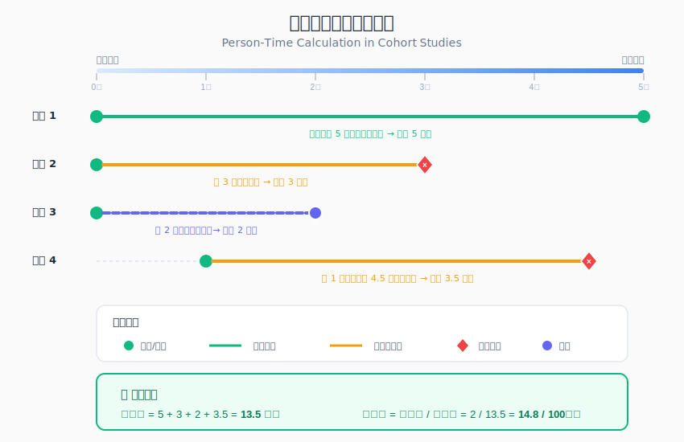

```{r setup, include=FALSE}
knitr::opts_chunk$set(
  echo = TRUE,
  warning = FALSE,
  message = FALSE,
  fig.width = 8,
  fig.height = 5,
  fig.retina = 2,
  out.width = "100%",
  dpi = 150
)
```

## 方法背景与适用场景

**队列研究（Cohort Study）** 是流行病学中最重要的分析性研究设计之一。它选择一组暴露于某因素的人群和一组未暴露的人群，**随时间追踪**观察两组的发病情况，从而评估暴露与疾病的因果关系。

### 适用场景

| 研究目的 | 典型应用 |
|---------|---------|
| 因果关系验证 | 吸烟与肺癌的关系 |
| 发病率估计 | 某职业人群的职业病发病率 |
| 预后因素研究 | 影响癌症生存的因素 |
| 治疗效果评估 | 真实世界中药物的长期效果 |
| 自然史研究 | 疾病从发生到结局的进程 |

### 队列研究类型

| 类型 | 定义 | 优点 | 缺点 |
|------|------|------|------|
| **前瞻性队列** | 从现在开始追踪到未来 | 暴露信息准确，偏倚小 | 耗时长，费用高 |
| **回顾性队列** | 利用历史资料追踪 | 省时省力 | 信息质量依赖历史记录 |
| **双向性队列** | 结合前瞻与回顾 | 平衡效率与质量 | 设计复杂 |

### 与其他研究设计的对比

| 特征 | 队列研究 | 横截面研究 | 病例对照研究 | RCT |
|------|---------|-----------|-------------|-----|
| 时间方向 | 前瞻/回顾 | 同一时点 | 回顾性 | 前瞻性 |
| 主要指标 | RR/HR/发病率 | 患病率/PR | OR | RR |
| 因果推断 | 强 | 弱 | 中等 | 最强 |
| 随机分配 | 否 | 否 | 否 | 是 |
| 适用于罕见暴露 | 是 | 否 | 否 | 可能 |
| 适用于罕见疾病 | 否 | 否 | 是 | 否 |

---

## 核心概念与模型入门

### 通俗理解：用日常例子解释队列研究

> 💡 **想象你是一位园丁，想知道"施肥是否能让植物长得更高"**
> 
> 你把100盆花分成两组：50盆施肥，50盆不施肥。然后**每周测量**它们的高度，**持续追踪3个月**。最后比较两组的生长情况。
> 
> 队列研究就像**拍一部电影**而不是**拍一张照片**：
> - 🎬 **时间跨度**：从开始追踪到结局发生（或研究结束）
> - ⏱️ **时间先后**：先有暴露（施肥），后观察结局（生长）
> - 📊 **比较**：暴露组vs非暴露组的结局差异
>
> **回到流行病学**：队列研究追踪"健康人群"随时间发展，观察暴露因素是否增加了发病风险。因为暴露在前、发病在后，所以能更好地推断因果关系。

### 核心术语

| 概念 | 英文 | 定义 | 公式 |
|------|------|------|------|
| 发病率 | Incidence Rate | 单位人时内的新发病例数 | $IR = \frac{\text{新发病例数}}{\text{人时}}$ |
| 累积发病率 | Cumulative Incidence | 随访期内发病的概率 | $CI = \frac{\text{新发病例数}}{\text{风险人群数}}$ |
| 相对危险度 | Relative Risk (RR) | 暴露组与非暴露组发病率之比 | $RR = \frac{IR_{暴露}}{IR_{非暴露}}$ |
| 风险比 | Hazard Ratio (HR) | 任意时点暴露组相对风险 | Cox模型估计 |
| 归因危险度 | Attributable Risk | 暴露导致的超额发病率 | $AR = IR_{暴露} - IR_{非暴露}$ |
| 人时 | Person-time | 所有研究对象的随访时间之和 | $\sum_{i=1}^{n} T_i$ |

### 人时（Person-time）计算



人时是队列研究的核心计算单位，反映了"风险暴露"的总量。

**计算方法**：
- 每个人的随访时间 = 结局发生时间（或删失时间） - 进入研究时间
- 总人时 = 所有个体随访时间之和

**示例**：
- 患者A：随访2年后发病 → 贡献2人年
- 患者B：随访5年未发病，研究结束 → 贡献5人年
- 患者C：随访3年后失访 → 贡献3人年（删失）

---

## 模型假设与前提条件

### 假设1：时序明确

**含义**: 暴露发生在结局之前。

**检验方法**: 
- 仔细设计基线调查时点
- 排除基线时已发病者

**违背后果**: 无法区分因果方向。

**应对策略**: 严格定义研究起点，使用"洗脱期"排除早期病例。

### 假设2：删失独立

**含义**: 删失（失访、退出）与结局发生独立。

**检验方法**: 
- 比较完成随访者与失访者的基线特征
- 敏感性分析

**违背后果**: 发病率估计偏倚。

**应对策略**: 尽量减少失访，使用多种方法处理删失。

### 假设3：比例风险（Cox模型）

**含义**: 暴露组与非暴露组的风险比随时间恒定。

**检验方法**: 
- Schoenfeld残差检验
- 绘制log(-log(S(t)))图

**违背后果**: HR估计不准确。

**应对策略**: 使用分层Cox模型或时变协变量。

### 假设4：无测量误差

**含义**: 暴露和结局测量准确。

**检验方法**: 使用经过验证的测量工具。

**违背后果**: 信息偏倚，可能导致RR偏向1。

**应对策略**: 标准化数据收集，盲法评估结局。

---

## 数据准备

### 安装与加载R包

```{r}
# 核心包
library(tidyverse)     # 数据处理
library(survival)      # 生存分析
library(survminer)     # 生存曲线可视化
library(gtsummary)     # 专业表格
library(ggsurvfit)     # 现代生存曲线

# 辅助包
library(epiR)          # 流行病学分析
library(broom)         # 模型整理
library(gt)            # 表格美化
library(lubridate)     # 日期处理
```

### 模拟队列研究数据

我们模拟一项职业暴露与心血管疾病的前瞻性队列研究：

```{r}
# 设置随机种子
set.seed(2026)
n <- 500

# 生成基线数据
cohort_data <- tibble(
  id = 1:n,
  
  # 暴露变量：职业暴露
  exposure = factor(sample(c("暴露组", "非暴露组"), n, 
                           replace = TRUE, prob = c(0.4, 0.6))),
  
  # 基线协变量
  age_baseline = round(rnorm(n, 45, 10)),
  sex = factor(sample(c("男", "女"), n, replace = TRUE, prob = c(0.55, 0.45))),
  bmi = round(rnorm(n, 25, 4), 1),
  smoking = factor(sample(c("从不", "曾经", "现在"), n, 
                          replace = TRUE, prob = c(0.45, 0.25, 0.30))),
  hypertension = rbinom(n, 1, prob = 0.30),
  diabetes = rbinom(n, 1, prob = 0.12),
  
  # 入队时间（2015-2018年间随机入队）
  entry_date = as.Date("2015-01-01") + sample(0:1095, n, replace = TRUE),
  
  # 研究结束日期
  study_end = as.Date("2025-12-31")
)

# 生成生存时间和事件
cohort_data <- cohort_data |> 
  mutate(
    # 基线风险
    log_hr = 0.03 * (age_baseline - 45) +
             0.4 * (sex == "男") +
             0.05 * (bmi - 25) +
             0.5 * (smoking == "现在") +
             0.3 * (smoking == "曾经") +
             0.6 * hypertension +
             0.5 * diabetes +
             0.7 * (exposure == "暴露组"),  # 暴露效应
    
    # 生存时间（Weibull分布，单位：年）
    true_survival = rweibull(n, shape = 1.5, scale = 15 * exp(-log_hr / 1.5)),
    true_survival = pmax(true_survival, 0.1),  # 最小0.1年
    
    # 最大随访时间
    max_followup = as.numeric(study_end - entry_date) / 365.25,
    
    # 删失：行政删失 + 随机失访
    censor_time = pmin(max_followup, 
                       rexp(n, rate = 0.02)),  # 每年2%失访率
    
    # 观察时间和事件状态
    followup_years = pmin(true_survival, censor_time),
    event = as.integer(true_survival <= censor_time),
    
    # 结局日期
    exit_date = entry_date + days(round(followup_years * 365.25)),
    exit_date = pmin(exit_date, study_end)
  ) |> 
  select(id, exposure, age_baseline, sex, bmi, smoking, hypertension, diabetes,
         entry_date, exit_date, followup_years, event)

# 查看数据
glimpse(cohort_data)

# 基本统计
cat("样本量:", nrow(cohort_data), "\n")
cat("事件数:", sum(cohort_data$event), "\n")
cat("事件率:", round(mean(cohort_data$event) * 100, 1), "%\n")
cat("总随访人年:", round(sum(cohort_data$followup_years), 1), "\n")
```

### 数据质量检查

```{r}
# 基线特征表（按暴露分组）
cohort_data |> 
  tbl_summary(
    by = exposure,
    include = c(age_baseline, sex, bmi, smoking, hypertension, diabetes,
                followup_years, event),
    label = list(
      age_baseline ~ "基线年龄",
      sex ~ "性别",
      bmi ~ "BMI",
      smoking ~ "吸烟状态",
      hypertension ~ "高血压",
      diabetes ~ "糖尿病",
      followup_years ~ "随访时间(年)",
      event ~ "发生事件"
    ),
    statistic = list(
      all_continuous() ~ "{mean} ± {sd}",
      all_categorical() ~ "{n} ({p}%)"
    )
  ) |> 
  add_p() |> 
  add_overall() |> 
  modify_header(label = "**变量**") |> 
  modify_spanning_header(c("stat_1", "stat_2") ~ "**暴露状态**") |> 
  bold_labels()
```

---

## 完整分析流程

### 步骤1：人时计算

```{r}
# 按暴露组计算人时
person_time <- cohort_data |> 
  group_by(exposure) |> 
  summarise(
    n = n(),
    events = sum(event),
    person_years = sum(followup_years),
    incidence_rate = events / person_years * 1000,  # 每千人年
    median_followup = median(followup_years),
    .groups = "drop"
  )

person_time |> 
  gt() |> 
  tab_header(
    title = "队列随访摘要",
    subtitle = "按暴露状态分层"
  ) |> 
  cols_label(
    exposure = "暴露状态",
    n = "人数",
    events = "事件数",
    person_years = "人年",
    incidence_rate = "发病率(/千人年)",
    median_followup = "中位随访(年)"
  ) |> 
  fmt_number(columns = c(person_years, median_followup), decimals = 1) |> 
  fmt_number(columns = incidence_rate, decimals = 2)
```

### 步骤2：发病率与相对危险度

```{r}
# 创建2x2表计算RR
# 需要累积发病率（不考虑时间）
tab_cohort <- cohort_data |> 
  group_by(exposure) |> 
  summarise(
    n = n(),
    events = sum(event),
    .groups = "drop"
  ) |> 
  arrange(desc(exposure))  # 暴露组在前

# 使用epiR计算RR
rr_data <- matrix(
  c(tab_cohort$events[1], tab_cohort$n[1] - tab_cohort$events[1],
    tab_cohort$events[2], tab_cohort$n[2] - tab_cohort$events[2]),
  nrow = 2, byrow = TRUE
)
rownames(rr_data) <- c("暴露组", "非暴露组")
colnames(rr_data) <- c("发病", "未发病")

rr_result <- epi.2by2(rr_data, method = "cohort.count", 
                       conf.level = 0.95, outcome = "as.columns")
print(rr_result)
```

### 步骤3：发病率比（基于人时）

```{r}
# 使用Poisson回归计算发病率比（IRR）
# 需要先计算每个人的人时
irr_model <- glm(event ~ exposure + offset(log(followup_years)),
                  data = cohort_data, family = poisson)

# 提取IRR
irr_result <- tidy(irr_model, exponentiate = TRUE, conf.int = TRUE) |> 
  filter(term != "(Intercept)")

irr_result |> 
  gt() |> 
  tab_header(title = "发病率比 (IRR)") |> 
  cols_label(
    term = "变量",
    estimate = "IRR",
    conf.low = "95%CI下限",
    conf.high = "95%CI上限",
    p.value = "P值"
  ) |> 
  fmt_number(columns = c(estimate, conf.low, conf.high), decimals = 2) |> 
  fmt_number(columns = p.value, decimals = 4)
```

### 步骤4：Kaplan-Meier生存曲线

```{r}
#| fig-height: 7
# 创建生存对象
surv_obj <- Surv(time = cohort_data$followup_years, 
                  event = cohort_data$event)

# Kaplan-Meier拟合
km_fit <- survfit(surv_obj ~ exposure, data = cohort_data)

# 使用survminer绑制
ggsurvplot(
  km_fit,
  data = cohort_data,
  pval = TRUE,
  pval.method = TRUE,
  conf.int = TRUE,
  risk.table = TRUE,
  risk.table.col = "strata",
  surv.median.line = "hv",
  palette = c("#ef4444", "#2563eb"),
  legend.labs = c("暴露组", "非暴露组"),
  legend.title = "暴露状态",
  xlab = "随访时间 (年)",
  ylab = "无事件生存概率",
  title = "职业暴露与心血管事件的Kaplan-Meier曲线"
)
```

```{r}
# 现代风格生存曲线
survfit2(Surv(followup_years, event) ~ exposure, data = cohort_data) |> 
  ggsurvfit() +
  add_confidence_interval() +
  add_risktable() +
  add_quantile(y_value = 0.5, color = "gray50", linetype = "dashed") +
  scale_color_manual(values = c("#ef4444", "#2563eb")) +
  scale_fill_manual(values = c("#ef4444", "#2563eb")) +
  labs(
    title = "累积发病曲线",
    subtitle = "1 - Kaplan-Meier生存曲线",
    x = "随访时间 (年)",
    y = "累积发病概率"
  ) +
  theme_minimal(base_size = 12)
```

### 步骤5：Log-rank检验

```{r}
# Log-rank检验
logrank_test <- survdiff(Surv(followup_years, event) ~ exposure, 
                          data = cohort_data)
print(logrank_test)

# 提取p值
logrank_p <- 1 - pchisq(logrank_test$chisq, df = 1)
cat("Log-rank检验 p值:", format.pval(logrank_p, digits = 3), "\n")
```

### 步骤6：Cox比例风险回归

#### 6.1 单因素Cox回归

```{r}
# 单因素分析
cox_univar <- coxph(Surv(followup_years, event) ~ exposure, data = cohort_data)
summary(cox_univar)
```

#### 6.2 多因素Cox回归

```{r}
# 多因素Cox回归
cox_multi <- coxph(
  Surv(followup_years, event) ~ exposure + age_baseline + sex + bmi + 
    smoking + hypertension + diabetes,
  data = cohort_data
)

# 使用gtsummary输出
tbl_regression(cox_multi, exponentiate = TRUE) |> 
  add_global_p() |> 
  modify_header(label = "**变量**") |> 
  bold_p(t = 0.05) |> 
  bold_labels()
```

### 步骤7：比例风险假设检验

```{r}
# Schoenfeld残差检验
ph_test <- cox.zph(cox_multi)
print(ph_test)

# 可视化残差
par(mfrow = c(2, 2))
plot(ph_test[1])  # exposure
plot(ph_test[2])  # age
plot(ph_test[3])  # sex
plot(ph_test[4])  # bmi
par(mfrow = c(1, 1))
```

```{r}
# 更好的可视化
ggcoxzph(ph_test, var = "exposure", font.main = 12)
```

### 步骤8：森林图可视化

```{r}
#| fig-height: 7
# 提取HR及95%CI
hr_data <- tidy(cox_multi, exponentiate = TRUE, conf.int = TRUE) |> 
  mutate(
    term = case_when(
      term == "exposure非暴露组" ~ "非暴露组 vs 暴露组",
      term == "age_baseline" ~ "年龄(每增加1岁)",
      term == "sex女" ~ "女性 vs 男性",
      term == "bmi" ~ "BMI(每增加1)",
      term == "smoking曾经" ~ "曾经吸烟 vs 从不",
      term == "smoking现在" ~ "现在吸烟 vs 从不",
      term == "hypertension" ~ "高血压",
      term == "diabetes" ~ "糖尿病",
      TRUE ~ term
    ),
    significant = ifelse(p.value < 0.05, "显著", "不显著")
  )

ggplot(hr_data, aes(x = estimate, y = reorder(term, estimate))) +
  geom_vline(xintercept = 1, linetype = "dashed", color = "gray50") +
  geom_point(aes(color = significant), size = 3) +
  geom_errorbarh(aes(xmin = conf.low, xmax = conf.high, color = significant),
                 height = 0.2) +
  scale_color_manual(values = c("显著" = "#ef4444", "不显著" = "#94a3b8")) +
  scale_x_log10() +
  labs(
    title = "心血管事件危险因素森林图",
    subtitle = "多因素Cox回归结果",
    x = "风险比 HR (95% CI)",
    y = "",
    color = "统计显著性"
  ) +
  theme_minimal(base_size = 12) +
  theme(
    legend.position = "bottom",
    plot.title = element_text(face = "bold")
  )
```

### 步骤9：归因危险度计算

```{r}
# 计算归因分数
# AR = (RR - 1) / RR (暴露组)
# PAR = p(RR - 1) / [p(RR - 1) + 1] (人群)

# 获取暴露的HR
hr_exposure <- exp(coef(cox_multi)["exposure非暴露组"])
# 注意：这里是非暴露组vs暴露组，所以需要取倒数
hr_exposed <- 1 / hr_exposure

# 暴露比例
p_exposed <- mean(cohort_data$exposure == "暴露组")

# 计算归因分数
af_exposed <- (hr_exposed - 1) / hr_exposed  # 暴露者中归因于暴露的比例
paf <- p_exposed * (hr_exposed - 1) / (p_exposed * (hr_exposed - 1) + 1)  # 人群归因分数

cat("暴露组归因分数 (AF%):", round(af_exposed * 100, 1), "%\n")
cat("人群归因分数 (PAF%):", round(paf * 100, 1), "%\n")
```

### 步骤10：模型预测与验证

```{r}
# 预测生存概率
# 创建新数据进行预测
new_data <- tibble(
  exposure = factor(c("暴露组", "非暴露组"), levels = c("暴露组", "非暴露组")),
  age_baseline = c(50, 50),
  sex = factor(c("男", "男"), levels = c("男", "女")),
  bmi = c(25, 25),
  smoking = factor(c("从不", "从不"), levels = c("从不", "曾经", "现在")),
  hypertension = c(0, 0),
  diabetes = c(0, 0)
)

# 预测5年和10年生存概率
surv_pred <- survfit(cox_multi, newdata = new_data)

# 提取特定时间点的生存概率
summary(surv_pred, times = c(5, 10))
```

```{r}
# C-index评估模型区分度
c_index <- concordance(cox_multi)
cat("C-index:", round(c_index$concordance, 3), "\n")
cat("95% CI:", round(c_index$concordance - 1.96 * sqrt(c_index$var), 3), "-",
    round(c_index$concordance + 1.96 * sqrt(c_index$var), 3), "\n")
```

---

## 结果解读与报告

### STROBE报告规范要点

| 条目 | 队列研究特殊要求 |
|------|----------------|
| 研究设计 | 明确说明前瞻性/回顾性，描述队列入选标准 |
| 随访 | 报告随访时间（中位数、四分位距），描述随访方法 |
| 失访 | 报告失访率，比较失访者与完成者特征 |
| 人时 | 报告总人时，说明人时计算方法 |
| 发病率 | 报告发病率及95%CI（每千人年） |
| 相对危险度 | 报告粗RR和调整后RR/HR |

### 结果报告模板

> 本研究纳入 `r nrow(cohort_data)` 名研究对象，中位随访时间为 `r round(median(cohort_data$followup_years), 1)` 年（IQR: `r round(quantile(cohort_data$followup_years, 0.25), 1)` - `r round(quantile(cohort_data$followup_years, 0.75), 1)` 年），累积 `r round(sum(cohort_data$followup_years), 0)` 人年。随访期间共发生 `r sum(cohort_data$event)` 例心血管事件。
>
> 暴露组发病率为 `r round(person_time$incidence_rate[person_time$exposure == "暴露组"], 2)` /千人年，非暴露组为 `r round(person_time$incidence_rate[person_time$exposure == "非暴露组"], 2)` /千人年。
>
> 多因素Cox回归分析显示，在控制年龄、性别、BMI、吸烟状态、高血压和糖尿病后，职业暴露显著增加心血管事件风险（HR = X.XX, 95% CI: X.XX-X.XX, P = X.XXX）。

---

## 常见错误与纠偏

### 错误1：忽视失访偏倚

**错误表现**: 不报告失访率，不分析失访者特征

**正确做法**: 
- 报告失访率（建议 < 20%）
- 比较失访者与完成者的基线特征
- 进行敏感性分析（如将失访者视为发病/未发病）

### 错误2：不检验比例风险假设

**错误表现**: 直接使用Cox回归而不验证PH假设

**正确做法**: 
- 使用Schoenfeld残差检验
- 若违反，使用分层Cox或时变协变量

```{r eval=FALSE}
# 若PH假设违反，可以使用分层Cox
cox_strat <- coxph(
  Surv(followup_years, event) ~ exposure + strata(age_group),
  data = cohort_data
)
```

### 错误3：混淆累积发病率与发病率

**错误表现**: 将累积发病率称为"发病率"

**正确做法**: 
- 累积发病率（Cumulative Incidence）= 事件数 / 初始人数
- 发病率（Incidence Rate）= 事件数 / 人时
- 当随访时间不同时，使用发病率更准确

### 错误4：忽视竞争风险

**错误表现**: 存在竞争事件时仍使用标准生存分析

**正确做法**: 使用竞争风险分析（Fine-Gray模型）

```{r eval=FALSE}
# 竞争风险分析
library(cmprsk)
# 假设event = 1是目标事件，event = 2是竞争事件
fg_model <- crr(cohort_data$followup_years, 
                cohort_data$event,
                cohort_data$exposure)
```

### 错误5：时间原点不一致

**错误表现**: 不同个体的"时间零点"不一致

**正确做法**: 
- 明确定义研究起点（如诊断日期、暴露开始日期）
- 左截断处理延迟入队

---

## 进阶扩展

### 时变暴露分析

当暴露状态随时间变化时：

```{r eval=FALSE}
# 转换为计数过程格式
library(survSplit)

# 假设暴露在第3年发生变化
cohort_tv <- survSplit(
  Surv(followup_years, event) ~ .,
  data = cohort_data,
  cut = c(3),
  episode = "interval"
)

# 时变Cox模型
cox_tv <- coxph(
  Surv(tstart, followup_years, event) ~ exposure + age_baseline + sex,
  data = cohort_tv
)
```

### 加速失效时间模型

作为Cox模型的替代：

```{r}
# Weibull AFT模型
aft_weibull <- survreg(
  Surv(followup_years, event) ~ exposure + age_baseline + sex,
  data = cohort_data,
  dist = "weibull"
)

# 提取结果
tidy(aft_weibull, conf.int = TRUE) |> 
  filter(term != "(Intercept)" & term != "Log(scale)")
```

### 动态预测

```{r}
# 使用ggsurvfit进行分组预测
survfit2(Surv(followup_years, event) ~ exposure, data = cohort_data) |> 
  tidy_survfit() |> 
  ggplot(aes(x = time, y = estimate, color = strata)) +
  geom_step(size = 1) +
  geom_ribbon(aes(ymin = conf.low, ymax = conf.high, fill = strata), 
              alpha = 0.2, color = NA) +
  scale_color_manual(values = c("#ef4444", "#2563eb"),
                     labels = c("暴露组", "非暴露组")) +
  scale_fill_manual(values = c("#ef4444", "#2563eb"),
                    labels = c("暴露组", "非暴露组")) +
  labs(
    title = "生存概率动态变化",
    x = "随访时间 (年)",
    y = "生存概率",
    color = "暴露状态",
    fill = "暴露状态"
  ) +
  theme_minimal(base_size = 12)
```

---

## 总结

### 队列研究要点回顾

1. **设计特点**：按暴露状态分组，前瞻性追踪观察结局
2. **核心优势**：时序明确，可直接计算发病率和RR
3. **主要指标**：发病率、RR、HR、归因危险度
4. **分析方法**：Kaplan-Meier、Log-rank检验、Cox回归
5. **关键假设**：比例风险假设、删失独立
6. **报告规范**：遵循STROBE声明，报告人时和失访率

### 研究设计检查清单

- [ ] 明确定义暴露和结局
- [ ] 确保时间顺序（暴露→结局）
- [ ] 排除基线时已发病者
- [ ] 制定随访计划和失访控制策略
- [ ] 预估样本量和统计效能
- [ ] 计划竞争风险的处理
- [ ] 验证比例风险假设

---

## 参考文献

1. Rothman KJ, Greenland S, Lash TL. Modern Epidemiology. 3rd ed. Lippincott Williams & Wilkins; 2008.

2. Therneau TM, Grambsch PM. Modeling Survival Data: Extending the Cox Model. Springer; 2000.

3. Vandenbroucke JP, et al. Strengthening the Reporting of Observational Studies in Epidemiology (STROBE): Explanation and Elaboration. PLoS Med. 2007;4(10):e297.

4. Hernán MA, Robins JM. Causal Inference: What If. Chapman & Hall/CRC; 2020.

5. 詹思延. 流行病学（第8版）. 人民卫生出版社; 2017.

6. Kleinbaum DG, Klein M. Survival Analysis: A Self-Learning Text. 3rd ed. Springer; 2012.
