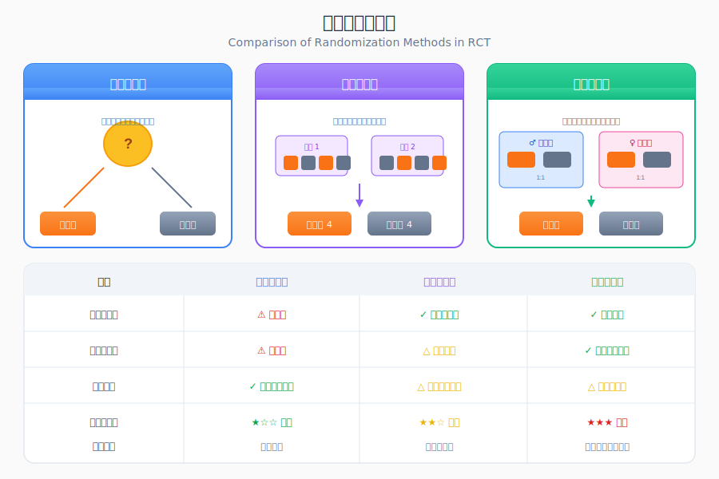

```{r setup, include=FALSE}
knitr::opts_chunk$set(
  echo = TRUE,
  warning = FALSE,
  message = FALSE,
  fig.width = 8,
  fig.height = 5,
  fig.retina = 2,
  out.width = "100%",
  dpi = 150
)
```

## 方法背景与适用场景

**随机对照试验（Randomized Controlled Trial, RCT）** 是评估干预措施效果的"金标准"研究设计。通过**随机分配**将研究对象分入干预组和对照组，最大程度消除混杂因素的影响，从而获得干预的真实因果效应。

### 适用场景

| 研究目的 | 典型应用 |
|---------|---------|
| 新药疗效评估 | III期临床试验 |
| 手术方式比较 | 微创vs传统手术 |
| 预防措施评估 | 疫苗有效性试验 |
| 诊断工具验证 | 新筛查方法评估 |
| 行为干预效果 | 健康教育项目评估 |

### RCT的核心要素

| 要素 | 说明 | 作用 |
|------|------|------|
| **随机化** | 用随机方法分配受试者 | 消除选择偏倚，平衡混杂因素 |
| **对照** | 设立对照组进行比较 | 提供基准，分离安慰剂效应 |
| **盲法** | 隐藏分组信息 | 减少信息偏倚 |
| **分配隐藏** | 隐藏分组序列 | 防止选择性入组 |

### 与观察性研究的对比

| 特征 | RCT | 队列研究 | 病例对照 |
|------|-----|---------|---------|
| 随机分配 | ✓ | ✗ | ✗ |
| 因果推断强度 | 最强 | 强 | 中等 |
| 混杂控制 | 随机化 | 调整 | 匹配/调整 |
| 伦理限制 | 较大 | 较小 | 较小 |
| 外部有效性 | 可能受限 | 较好 | 较好 |
| 成本 | 高 | 中 | 低 |

---

## 核心概念与模型入门

### 通俗理解：用日常例子解释RCT

> 💡 **想象你是一位老师，想知道"课后辅导是否能提高考试成绩"**
> 
> **普通方法**：让愿意参加辅导的学生参加，然后比较成绩。
> - ❌ 问题：愿意参加的可能本来就是更努力的学生，无法判断是"辅导有效"还是"学生本身优秀"
>
> **RCT方法**：把100名学生**随机抽签**分成两组——50人参加辅导，50人不参加，学期末比较成绩。
> - ✓ 优点：随机分组确保两组学生的智力、动机、家庭背景**平均相似**
> - ✓ 结果：如果辅导组成绩更好，就可以归因于辅导本身
>
> **关键点**：
> - 🎲 **随机**：像抽签一样，每个人被分到任一组的概率相等
> - ⚖️ **平衡**：随机化使得两组在所有特征（包括未知的）上趋于相似
> - 🔬 **对照**：有比较才能知道干预的真正效果

### 核心术语

| 概念 | 英文 | 定义 |
|------|------|------|
| 随机化 | Randomization | 用随机方法将受试者分配到各组 |
| 分配隐藏 | Allocation Concealment | 在分配前隐藏分组序列 |
| 盲法 | Blinding/Masking | 对分组信息保密 |
| 安慰剂 | Placebo | 外观相同但无活性成分的对照 |
| ITT分析 | Intention-to-Treat | 按原始分组分析，不论实际接受情况 |
| PP分析 | Per-Protocol | 仅分析完成方案者 |
| 非劣效性 | Non-inferiority | 证明新疗法不比标准差 |
| 优效性 | Superiority | 证明新疗法优于标准 |

### 随机化类型



| 类型 | 方法 | 优点 | 缺点 |
|------|------|------|------|
| **简单随机** | 抛硬币/随机数表 | 简单，无偏 | 可能导致组间不平衡 |
| **区组随机** | 每个区组内平衡 | 保证样本量平衡 | 可能被猜测 |
| **分层随机** | 按重要因素分层后随机 | 保证关键变量平衡 | 设计复杂 |
| **最小化** | 动态平衡多个因素 | 多因素平衡 | 非纯随机 |
| **集群随机** | 以群体为单位随机 | 适用于群体干预 | 需更大样本 |

### 盲法层次

| 层次 | 谁被盲 | 目的 |
|------|-------|------|
| **开放标签** | 无人被盲 | 不可能实施盲法时 |
| **单盲** | 仅受试者 | 减少安慰剂效应 |
| **双盲** | 受试者+研究者 | 减少测量偏倚 |
| **三盲** | 受试者+研究者+统计师 | 最大程度减少偏倚 |

---

## 模型假设与前提条件

### 假设1：随机化成功

**含义**: 随机化使各组基线特征均衡。

**检验方法**: 
- 比较基线特征表
- 使用标准化差异（SMD < 0.1为平衡良好）

**违背后果**: 混杂偏倚。

**应对策略**: 调整分析（协方差分析ANCOVA）。

### 假设2：无污染

**含义**: 各组受试者只接受分配的干预。

**检验方法**: 
- 监测依从性
- 记录交叉情况

**违背后果**: 效应被稀释。

**应对策略**: ITT分析为主，PP分析为辅。

### 假设3：无失访偏倚

**含义**: 失访与结局和分组独立。

**检验方法**: 
- 比较失访者特征
- 敏感性分析

**违背后果**: 估计偏倚。

**应对策略**: 多重插补、最坏情况分析。

### 假设4：盲法有效

**含义**: 受试者和研究者不知道分组。

**检验方法**: 
- 研究结束时询问猜测分组
- 计算破盲指数

**违背后果**: 安慰剂效应或测量偏倚。

**应对策略**: 使用客观结局指标。

---

## 数据准备

### 安装与加载R包

```{r}
# 核心包
library(tidyverse)     # 数据处理
library(gtsummary)     # 专业表格
library(ggplot2)       # 可视化
library(pwr)           # 样本量计算
library(randomizr)     # 随机化工具

# 辅助包
library(broom)         # 模型整理
library(gt)            # 表格美化
library(scales)        # 格式化
library(DiagrammeR)    # 流程图
```

### 模拟RCT数据

我们模拟一项评估降压药的双盲RCT：

```{r}
# 设置随机种子
set.seed(2026)
n <- 400

# 生成基线数据
rct_data <- tibble(
  id = sprintf("P%04d", 1:n),
  
  # 基线协变量
  age = round(rnorm(n, 55, 10)),
  sex = factor(sample(c("男", "女"), n, replace = TRUE, prob = c(0.52, 0.48))),
  bmi = round(rnorm(n, 26, 4), 1),
  smoking = factor(sample(c("从不", "曾经", "现在"), n, 
                          replace = TRUE, prob = c(0.45, 0.30, 0.25))),
  diabetes = rbinom(n, 1, prob = 0.15),
  
  # 基线血压
  sbp_baseline = round(rnorm(n, 155, 15)),  # 高血压患者
  dbp_baseline = round(rnorm(n, 95, 10)),
  
  # 分层因素
  site = factor(sample(paste0("中心", 1:4), n, replace = TRUE)),
  severity = factor(sample(c("轻度", "中度", "重度"), n, 
                           replace = TRUE, prob = c(0.3, 0.5, 0.2)))
)

# 使用分层区组随机化分配
rct_data$group <- block_ra(
  blocks = interaction(rct_data$site, rct_data$severity),
  conditions = c("试验组", "对照组")
)
rct_data$group <- factor(rct_data$group)

# 生成结局数据
rct_data <- rct_data |> 
  mutate(
    # 真实治疗效应：试验药降低血压10mmHg
    treatment_effect = ifelse(group == "试验组", -10, 0),
    
    # 12周后血压（考虑回归均值效应和个体变异）
    sbp_week12 = round(
      sbp_baseline - 5 +  # 回归均值效应
      treatment_effect +   # 治疗效应
      -0.1 * (age - 55) +  # 年龄效应
      rnorm(n, 0, 8)       # 个体变异
    ),
    
    dbp_week12 = round(
      dbp_baseline - 3 + 
      ifelse(group == "试验组", -5, 0) +
      rnorm(n, 0, 5)
    ),
    
    # 血压变化
    sbp_change = sbp_week12 - sbp_baseline,
    dbp_change = dbp_week12 - dbp_baseline,
    
    # 血压达标（< 140/90 mmHg）
    bp_controlled = as.integer(sbp_week12 < 140 & dbp_week12 < 90),
    
    # 依从性（部分患者未完成方案）
    completed = rbinom(n, 1, prob = 0.92),
    
    # 不良事件
    adverse_event = rbinom(n, 1, prob = ifelse(group == "试验组", 0.15, 0.08))
  )

# 查看数据
glimpse(rct_data)

# 分组统计
table(rct_data$group)
```

### 基线特征平衡性检查

```{r}
# 基线特征表
baseline_table <- rct_data |> 
  tbl_summary(
    by = group,
    include = c(age, sex, bmi, smoking, diabetes, sbp_baseline, 
                dbp_baseline, site, severity),
    label = list(
      age ~ "年龄 (岁)",
      sex ~ "性别",
      bmi ~ "BMI (kg/m²)",
      smoking ~ "吸烟状态",
      diabetes ~ "糖尿病",
      sbp_baseline ~ "基线收缩压 (mmHg)",
      dbp_baseline ~ "基线舒张压 (mmHg)",
      site ~ "研究中心",
      severity ~ "高血压严重程度"
    ),
    statistic = list(
      all_continuous() ~ "{mean} ± {sd}",
      all_categorical() ~ "{n} ({p}%)"
    )
  ) |> 
  add_p() |> 
  add_overall() |> 
  modify_header(label = "**变量**") |> 
  modify_spanning_header(c("stat_1", "stat_2") ~ "**分组**") |> 
  bold_labels()

baseline_table
```

```{r}
# 计算标准化差异（SMD）
library(tableone)

vars <- c("age", "sex", "bmi", "smoking", "diabetes", 
          "sbp_baseline", "dbp_baseline")
cat_vars <- c("sex", "smoking", "diabetes")

tab_smd <- CreateTableOne(vars = vars, strata = "group", 
                           data = rct_data, factorVars = cat_vars)
smd_values <- ExtractSmd(tab_smd)

# 可视化SMD
smd_df <- tibble(
  variable = names(smd_values),
  smd = as.numeric(smd_values)
) |> 
  mutate(balanced = abs(smd) < 0.1)

ggplot(smd_df, aes(x = smd, y = reorder(variable, smd))) +
  geom_vline(xintercept = c(-0.1, 0.1), linetype = "dashed", color = "gray50") +
  geom_vline(xintercept = 0, color = "black") +
  geom_point(aes(color = balanced), size = 3) +
  scale_color_manual(values = c("TRUE" = "#22c55e", "FALSE" = "#ef4444"),
                     labels = c("不平衡", "平衡")) +
  labs(
    title = "基线特征平衡性检验",
    subtitle = "|SMD| < 0.1 表示平衡良好",
    x = "标准化差异 (SMD)",
    y = "",
    color = "平衡状态"
  ) +
  theme_minimal(base_size = 12)
```

---

## 完整分析流程

### 步骤1：样本量计算

```{r}
# 样本量计算：两组均值比较
# H0: μ1 - μ2 = 0
# H1: μ1 - μ2 = 10 mmHg (预期降压效果)
# α = 0.05 (双侧), Power = 0.80
# SD = 15 mmHg

power_result <- pwr.t.test(
  d = 10 / 15,  # 效应量 = 差异 / SD
  sig.level = 0.05,
  power = 0.80,
  type = "two.sample",
  alternative = "two.sided"
)

print(power_result)

# 考虑20%失访
n_per_group <- ceiling(power_result$n / 0.80)
cat("\n考虑20%失访后，每组需要:", n_per_group, "人\n")
cat("总样本量:", n_per_group * 2, "人\n")
```

```{r}
# 样本量-效能曲线
n_range <- seq(50, 300, by = 10)
power_curve <- sapply(n_range, function(n) {
  pwr.t.test(n = n, d = 10/15, sig.level = 0.05, 
             type = "two.sample")$power
})

power_df <- tibble(n = n_range, power = power_curve)

ggplot(power_df, aes(x = n, y = power)) +
  geom_line(color = "#2563eb", size = 1.2) +
  geom_hline(yintercept = 0.80, linetype = "dashed", color = "#ef4444") +
  geom_vline(xintercept = ceiling(power_result$n), linetype = "dashed", color = "#22c55e") +
  annotate("text", x = ceiling(power_result$n) + 20, y = 0.75, 
           label = paste("n =", ceiling(power_result$n)), color = "#22c55e") +
  scale_y_continuous(labels = percent_format(), limits = c(0, 1)) +
  labs(
    title = "样本量-统计效能曲线",
    subtitle = "效应量d = 0.67, α = 0.05",
    x = "每组样本量",
    y = "统计效能"
  ) +
  theme_minimal(base_size = 12)
```

### 步骤2：随机化实施

```{r}
# 演示不同随机化方法

# 1. 简单随机化
simple_rand <- complete_ra(N = 20, conditions = c("A", "B"))
table(simple_rand)

# 2. 区组随机化（区组大小为4）
block_rand <- block_ra(
  blocks = rep(1:5, each = 4),
  conditions = c("A", "B")
)
# 每个区组内A和B各2人

# 3. 分层区组随机化
# 按性别分层
strat_rand <- block_ra(
  blocks = c(rep("M", 10), rep("F", 10)),
  conditions = c("A", "B")
)
table(strat_rand, c(rep("M", 10), rep("F", 10)))
```

```{r}
# 可视化随机化结果
rand_visual <- tibble(
  subject = 1:20,
  method = rep(c("简单随机", "区组随机"), each = 10),
  group = c(simple_rand[1:10], block_rand[1:10])
)

ggplot(rand_visual, aes(x = subject, y = method, fill = group)) +
  geom_tile(color = "white", size = 0.5) +
  scale_fill_manual(values = c("A" = "#2563eb", "B" = "#ef4444")) +
  labs(
    title = "随机化分配示意图",
    x = "受试者编号",
    y = "随机化方法",
    fill = "分组"
  ) +
  theme_minimal(base_size = 12)
```

### 步骤3：CONSORT流程图

```{r}
# 创建CONSORT流程图数据
consort_data <- list(
  assessed = n + 50,  # 筛选人数
  excluded = 50,      # 排除人数
  randomized = n,
  allocated_treatment = sum(rct_data$group == "试验组"),
  allocated_control = sum(rct_data$group == "对照组"),
  completed_treatment = sum(rct_data$group == "试验组" & rct_data$completed == 1),
  completed_control = sum(rct_data$group == "对照组" & rct_data$completed == 1),
  analyzed_treatment = sum(rct_data$group == "试验组"),  # ITT分析
  analyzed_control = sum(rct_data$group == "对照组")
)

# 使用DiagrammeR创建流程图
grViz("
digraph CONSORT {
  graph [rankdir = TB]
  node [shape = box, style = filled, fillcolor = lightblue]
  
  assessed [label = '筛选评估\\n(n = 450)']
  excluded [label = '排除 (n = 50)\\n• 不符合纳入标准: 30\\n• 拒绝参加: 15\\n• 其他原因: 5', fillcolor = lightyellow]
  randomized [label = '随机化\\n(n = 400)', fillcolor = lightgreen]
  
  treatment [label = '分配至试验组\\n(n = 200)']
  control [label = '分配至对照组\\n(n = 200)']
  
  treatment_fu [label = '完成随访\\n(n = 184)\\n失访: 16']
  control_fu [label = '完成随访\\n(n = 186)\\n失访: 14']
  
  treatment_analyzed [label = 'ITT分析\\n(n = 200)']
  control_analyzed [label = 'ITT分析\\n(n = 200)']
  
  assessed -> excluded [style = dashed]
  assessed -> randomized
  randomized -> treatment
  randomized -> control
  treatment -> treatment_fu
  control -> control_fu
  treatment_fu -> treatment_analyzed
  control_fu -> control_analyzed
}
")
```

### 步骤4：主要结局分析（ITT原则）

```{r}
# ITT分析：所有随机化受试者
# 主要结局：12周血压变化

# 描述性统计
outcome_summary <- rct_data |> 
  group_by(group) |> 
  summarise(
    n = n(),
    sbp_baseline_mean = mean(sbp_baseline),
    sbp_week12_mean = mean(sbp_week12),
    sbp_change_mean = mean(sbp_change),
    sbp_change_sd = sd(sbp_change),
    bp_controlled_pct = mean(bp_controlled) * 100,
    .groups = "drop"
  )

outcome_summary |> 
  gt() |> 
  tab_header(title = "主要结局摘要") |> 
  fmt_number(columns = where(is.numeric), decimals = 1)
```

```{r}
# 主要分析：两组血压变化比较
# 使用t检验
t_test_result <- t.test(sbp_change ~ group, data = rct_data)
print(t_test_result)

# 计算效应量（Cohen's d）
library(effectsize)
cohens_d <- cohens_d(sbp_change ~ group, data = rct_data)
print(cohens_d)
```

```{r}
# ANCOVA：调整基线血压
ancova_model <- lm(sbp_week12 ~ group + sbp_baseline + age + sex, data = rct_data)

tbl_regression(ancova_model) |> 
  modify_header(label = "**变量**") |> 
  bold_p(t = 0.05)
```

### 步骤5：PP分析（敏感性分析）

```{r}
# PP分析：仅分析完成方案者
rct_pp <- rct_data |> filter(completed == 1)

cat("PP分析样本量:", nrow(rct_pp), "\n")

# PP分析结果
t_test_pp <- t.test(sbp_change ~ group, data = rct_pp)

# 比较ITT和PP结果
comparison <- tibble(
  分析类型 = c("ITT", "PP"),
  样本量 = c(nrow(rct_data), nrow(rct_pp)),
  试验组均值 = c(
    mean(rct_data$sbp_change[rct_data$group == "试验组"]),
    mean(rct_pp$sbp_change[rct_pp$group == "试验组"])
  ),
  对照组均值 = c(
    mean(rct_data$sbp_change[rct_data$group == "对照组"]),
    mean(rct_pp$sbp_change[rct_pp$group == "对照组"])
  ),
  组间差异 = c(
    -diff(t_test_result$estimate),
    -diff(t_test_pp$estimate)
  ),
  P值 = c(t_test_result$p.value, t_test_pp$p.value)
)

comparison |> 
  gt() |> 
  tab_header(title = "ITT vs PP 分析比较") |> 
  fmt_number(columns = c(试验组均值, 对照组均值, 组间差异), decimals = 1) |> 
  fmt_number(columns = P值, decimals = 4)
```

### 步骤6：结果可视化

```{r}
#| fig-height: 6
# 血压变化分布图
ggplot(rct_data, aes(x = sbp_change, fill = group)) +
  geom_density(alpha = 0.6) +
  geom_vline(xintercept = 0, linetype = "dashed") +
  scale_fill_manual(values = c("试验组" = "#2563eb", "对照组" = "#ef4444")) +
  labs(
    title = "收缩压变化分布",
    subtitle = paste("组间差异:", round(-diff(t_test_result$estimate), 1), 
                     "mmHg, p =", format.pval(t_test_result$p.value, digits = 3)),
    x = "收缩压变化 (mmHg)",
    y = "密度",
    fill = "分组"
  ) +
  theme_minimal(base_size = 12)
```

```{r}
# 前后变化图
rct_long <- rct_data |> 
  select(id, group, sbp_baseline, sbp_week12) |> 
  pivot_longer(cols = starts_with("sbp"),
               names_to = "time",
               values_to = "sbp") |> 
  mutate(time = ifelse(time == "sbp_baseline", "基线", "12周"))

ggplot(rct_long, aes(x = time, y = sbp, group = id, color = group)) +
  geom_line(alpha = 0.1) +
  stat_summary(aes(group = group), fun = mean, geom = "line", size = 1.5) +
  stat_summary(aes(group = group), fun = mean, geom = "point", size = 3) +
  scale_color_manual(values = c("试验组" = "#2563eb", "对照组" = "#ef4444")) +
  labs(
    title = "收缩压变化趋势",
    subtitle = "细线为个体轨迹，粗线为组均值",
    x = "时间点",
    y = "收缩压 (mmHg)",
    color = "分组"
  ) +
  theme_minimal(base_size = 12)
```

```{r}
#| fig-height: 5
# 血压达标率对比
bp_control_summary <- rct_data |> 
  group_by(group) |> 
  summarise(
    n = n(),
    controlled = sum(bp_controlled),
    rate = mean(bp_controlled) * 100,
    .groups = "drop"
  ) |> 
  mutate(
    ci_low = map2_dbl(controlled, n, ~binom.test(.x, .y)$conf.int[1] * 100),
    ci_high = map2_dbl(controlled, n, ~binom.test(.x, .y)$conf.int[2] * 100)
  )

ggplot(bp_control_summary, aes(x = group, y = rate, fill = group)) +
  geom_col(width = 0.6) +
  geom_errorbar(aes(ymin = ci_low, ymax = ci_high), width = 0.2) +
  geom_text(aes(label = paste0(round(rate, 1), "%")), vjust = -0.5, size = 5) +
  scale_fill_manual(values = c("试验组" = "#2563eb", "对照组" = "#ef4444")) +
  scale_y_continuous(limits = c(0, 100)) +
  labs(
    title = "血压达标率对比",
    subtitle = "目标: <140/90 mmHg",
    x = "",
    y = "达标率 (%)",
    fill = "分组"
  ) +
  theme_minimal(base_size = 12) +
  theme(legend.position = "none")
```

### 步骤7：安全性分析

```{r}
# 不良事件分析
ae_summary <- rct_data |> 
  group_by(group) |> 
  summarise(
    n = n(),
    ae_count = sum(adverse_event),
    ae_rate = mean(adverse_event) * 100,
    .groups = "drop"
  )

# Fisher精确检验
ae_table <- table(rct_data$group, rct_data$adverse_event)
fisher_test <- fisher.test(ae_table)

ae_summary |> 
  gt() |> 
  tab_header(
    title = "不良事件摘要",
    subtitle = paste("Fisher精确检验 p =", round(fisher_test$p.value, 3))
  ) |> 
  cols_label(
    group = "分组",
    n = "人数",
    ae_count = "不良事件数",
    ae_rate = "发生率(%)"
  ) |> 
  fmt_number(columns = ae_rate, decimals = 1)
```

### 步骤8：亚组分析

```{r}
#| fig-height: 7
# 按严重程度分层的亚组分析
subgroup_results <- rct_data |> 
  group_by(severity) |> 
  summarise(
    n = n(),
    effect = mean(sbp_change[group == "试验组"]) - mean(sbp_change[group == "对照组"]),
    se = sqrt(var(sbp_change[group == "试验组"])/sum(group == "试验组") +
              var(sbp_change[group == "对照组"])/sum(group == "对照组")),
    .groups = "drop"
  ) |> 
  mutate(
    ci_low = effect - 1.96 * se,
    ci_high = effect + 1.96 * se
  )

# 添加总体结果
overall <- tibble(
  severity = "总体",
  n = nrow(rct_data),
  effect = -diff(t_test_result$estimate),
  se = sqrt(sum((t_test_result$stderr)^2)),
  ci_low = -diff(t_test_result$estimate) - 1.96 * t_test_result$stderr,
  ci_high = -diff(t_test_result$estimate) + 1.96 * t_test_result$stderr
)

subgroup_plot_data <- bind_rows(subgroup_results, overall) |> 
  mutate(severity = factor(severity, levels = c("轻度", "中度", "重度", "总体")))

ggplot(subgroup_plot_data, aes(x = effect, y = severity)) +
  geom_vline(xintercept = 0, linetype = "dashed", color = "gray50") +
  geom_point(size = 3, color = "#2563eb") +
  geom_errorbarh(aes(xmin = ci_low, xmax = ci_high), height = 0.2, color = "#2563eb") +
  geom_text(aes(label = paste0("n=", n)), hjust = -0.5, vjust = -1, size = 3) +
  labs(
    title = "亚组分析：按高血压严重程度",
    subtitle = "试验组 vs 对照组 收缩压变化差异",
    x = "组间差异 (mmHg)",
    y = "亚组"
  ) +
  theme_minimal(base_size = 12)
```

---

## 结果解读与报告

### CONSORT报告规范

CONSORT（Consolidated Standards of Reporting Trials）是RCT报告的国际标准：

| 条目 | 要点 |
|------|------|
| 标题 | 明确标识为随机对照试验 |
| 试验设计 | 描述分配比例、优效/非劣效设计 |
| 随机化 | 报告随机序列生成、分配隐藏方法 |
| 盲法 | 说明谁被盲，评估破盲情况 |
| 样本量 | 报告样本量计算依据 |
| 流程图 | 提供CONSORT流程图 |
| 基线 | 展示基线特征表 |
| 主要结局 | 报告ITT分析结果，包括效应量和95%CI |
| 敏感性分析 | 报告PP分析等敏感性分析结果 |
| 危害 | 报告不良事件 |

### 结果报告模板

> 本研究共纳入 `r nrow(rct_data)` 名高血压患者，按1:1比例随机分配至试验组（n = `r sum(rct_data$group == "试验组")`）和对照组（n = `r sum(rct_data$group == "对照组")`）。两组基线特征均衡（所有SMD < 0.1）。
>
> **主要结局**：12周后，试验组收缩压较基线平均下降 `r round(abs(mean(rct_data$sbp_change[rct_data$group == "试验组"])), 1)` mmHg，对照组下降 `r round(abs(mean(rct_data$sbp_change[rct_data$group == "对照组"])), 1)` mmHg，组间差异为 `r round(-diff(t_test_result$estimate), 1)` mmHg（95% CI: `r round(t_test_result$conf.int[1], 1)` - `r round(t_test_result$conf.int[2], 1)`, P `r ifelse(t_test_result$p.value < 0.001, "< 0.001", paste("=", round(t_test_result$p.value, 3)))`）。
>
> **安全性**：试验组不良事件发生率为 `r round(mean(rct_data$adverse_event[rct_data$group == "试验组"]) * 100, 1)`%，对照组为 `r round(mean(rct_data$adverse_event[rct_data$group == "对照组"]) * 100, 1)`%（P = `r round(fisher_test$p.value, 3)`）。

---

## 常见错误与纠偏

### 错误1：基线差异后调整P值

**错误表现**: 基线检验P > 0.05就认为"组间平衡"，P < 0.05就"需要调整"

**正确做法**: 
- 基线P值受样本量影响，不应作为调整依据
- 使用SMD评估平衡性（|SMD| < 0.1）
- 预先计划的协变量应始终调整

### 错误2：不报告ITT分析

**错误表现**: 仅报告PP分析结果

**正确做法**: 
- ITT分析为主要分析（保持随机化优势）
- PP分析作为敏感性分析
- 两种分析结果一致时结论更可靠

### 错误3：多重比较不校正

**错误表现**: 同时检验多个次要结局不进行多重比较校正

**正确做法**: 
- 预先指定主要结局（通常1个）
- 次要结局使用Bonferroni或FDR校正
- 明确区分预设分析和探索性分析

### 错误4：选择性报告

**错误表现**: 只报告统计显著的结果

**正确做法**: 
- 预注册研究方案（如ClinicalTrials.gov）
- 报告所有预设结局
- 明确区分预设和事后分析

### 错误5：过度解读亚组分析

**错误表现**: 亚组分析p < 0.05就认为存在交互作用

**正确做法**: 
- 亚组分析应预先计划
- 检验交互作用（P for interaction）
- 考虑多重比较问题
- 结论需后续研究验证

---

## 进阶扩展

### 适应性设计

```{r eval=FALSE}
# 适应性设计允许中期分析调整
library(rpact)

# 计划期中分析
design <- getDesignGroupSequential(
  kMax = 2,                    # 2次分析（期中+最终）
  typeOfDesign = "asOF",       # O'Brien-Fleming界值
  informationRates = c(0.5, 1) # 50%和100%信息时
)

summary(design)
```

### 非劣效性试验设计

```{r}
# 非劣效性样本量计算
# 假设新药不比标准差5mmHg以上
margin <- 5  # 非劣效界值
delta <- 0   # 假设真实差异为0
sd <- 15

n_noninf <- ((1.96 + 0.84)^2 * 2 * sd^2) / (margin - delta)^2
cat("非劣效性试验每组样本量:", ceiling(n_noninf), "\n")
```

### 集群随机试验

```{r}
# 集群随机样本量计算
# 需要考虑设计效应
icc <- 0.05  # 类内相关系数
m <- 20      # 每个集群的个体数

# 设计效应
deff <- 1 + (m - 1) * icc
cat("设计效应:", round(deff, 2), "\n")

# 调整后样本量
n_cluster <- ceiling(power_result$n * deff)
cat("调整后每组样本量:", n_cluster, "\n")
cat("需要的集群数:", ceiling(n_cluster / m), "个/组\n")
```

---

## 总结

### RCT要点回顾

1. **核心优势**：随机化消除混杂，是因果推断的金标准
2. **关键要素**：随机化、对照、盲法、分配隐藏
3. **分析原则**：ITT为主，PP为辅
4. **报告规范**：遵循CONSORT声明
5. **样本量**：需预先计算并考虑失访
6. **亚组分析**：谨慎解读，需预先计划

### 设计检查清单

- [ ] 明确研究问题和假设
- [ ] 选择适当的随机化方法
- [ ] 计算所需样本量
- [ ] 设计盲法实施方案
- [ ] 明确分配隐藏方法
- [ ] 定义ITT和PP分析人群
- [ ] 预先指定亚组分析
- [ ] 制定数据安全监查计划
- [ ] 注册临床试验方案

---

## 参考文献

1. Schulz KF, et al. CONSORT 2010 Statement: Updated guidelines for reporting parallel group randomised trials. BMJ. 2010;340:c332.

2. ICH E9(R1) Addendum: Estimands and Sensitivity Analysis in Clinical Trials. 2019.

3. Friedman LM, et al. Fundamentals of Clinical Trials. 5th ed. Springer; 2015.

4. Moher D, et al. CONSORT 2010 Explanation and Elaboration: Updated guidelines for reporting parallel group randomised trials. BMJ. 2010;340:c869.

5. 吴阶平, 裘法祖. 黄家驷外科学. 人民卫生出版社; 2008.（临床试验设计章节）

6. Pocock SJ. Clinical Trials: A Practical Approach. Wiley; 2013.
