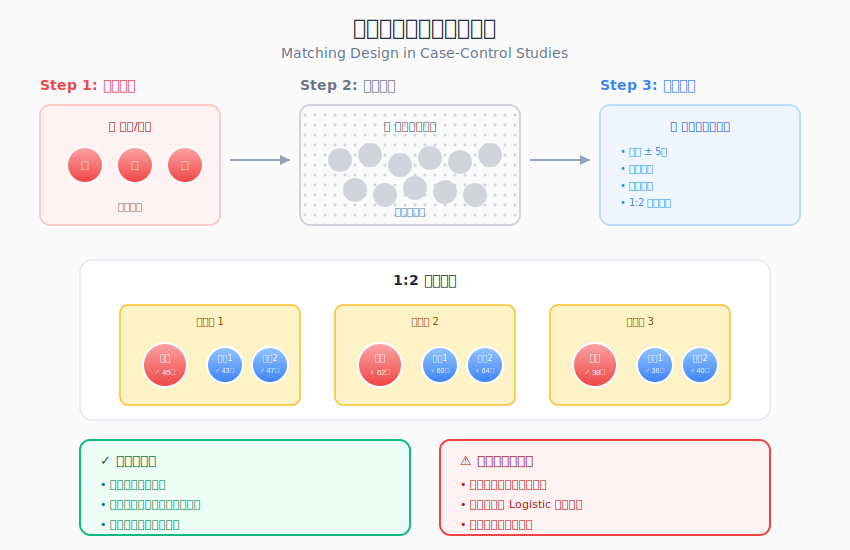

```{r setup, include=FALSE}
knitr::opts_chunk$set(
  echo = TRUE,
  warning = FALSE,
  message = FALSE,
  fig.width = 8,
  fig.height = 5,
  fig.retina = 2,
  out.width = "100%",
  dpi = 150
)
```

## 方法背景与适用场景

**病例对照研究（Case-Control Study）** 是一种回顾性研究设计，通过比较**病例组**（已患病者）和**对照组**（未患病者）的暴露史，探索暴露因素与疾病的关联。它是研究**罕见疾病**病因的首选方法。

### 适用场景

| 研究目的 | 典型应用 |
|---------|---------|
| 罕见疾病病因探索 | 克雅氏病与牛肉消费 |
| 暴发调查 | 食物中毒的病因食品识别 |
| 多因素病因研究 | 肺癌的多种危险因素 |
| 初步病因假设验证 | 新发疾病的风险因素筛查 |
| 资源有限的快速研究 | 发展中国家的病因学研究 |

### 病例对照研究类型

| 类型 | 定义 | 优点 | 缺点 |
|------|------|------|------|
| **非匹配设计** | 独立选择病例和对照 | 简单，分析简便 | 可能存在混杂 |
| **频率匹配** | 按比例匹配（如年龄分布相同） | 控制混杂，保留样本量 | 分析稍复杂 |
| **个体匹配** | 每个病例配一个或多个对照 | 精确控制混杂 | 需条件Logistic回归 |
| **巢式病例对照** | 在队列中进行 | 暴露测量准确 | 需要现有队列 |

### 与其他研究设计的对比

| 特征 | 病例对照 | 队列研究 | 横截面研究 | RCT |
|------|---------|---------|-----------|-----|
| 时间方向 | 回顾性 | 前瞻/回顾 | 同一时点 | 前瞻 |
| 主要指标 | OR | RR/HR | PR | RR |
| 适用于罕见疾病 | ✓✓✓ | ✗ | ✗ | ✗ |
| 适用于罕见暴露 | ✗ | ✓ | ✗ | ✗ |
| 因果推断 | 中等 | 强 | 弱 | 最强 |
| 成本/时间 | 低/短 | 高/长 | 低/短 | 高/长 |

---

## 核心概念与模型入门

### 通俗理解：用日常例子解释病例对照研究

> 💡 **想象你是一位侦探，调查"为什么有些人食物中毒而有些人没有"**
> 
> **队列研究思路**：跟踪100人吃了什么，等着看谁生病。
> - ❌ 问题：食物中毒是急性的，等追踪完成可能已经太晚
>
> **病例对照思路**：
> 1. 找到10个中毒的人（**病例组**）
> 2. 找到10个参加同一聚餐但没中毒的人（**对照组**）
> 3. 问他们都吃了什么
> 4. 发现：8个病例吃了生蚝，只有2个对照吃了生蚝
> 5. 结论：生蚝可能是罪魁祸首！
>
> **关键点**：
> - 🔙 **回顾**：从结果（生病）追溯原因（吃了什么）
> - 🎯 **效率**：不需要等待发病，直接找到病人
> - 📊 **比较**：病例的暴露率 vs 对照的暴露率
> - ⚠️ **记忆**：需要准确回忆过去的暴露（可能有偏倚）

### 核心术语

| 概念 | 英文 | 定义 | 公式/说明 |
|------|------|------|----------|
| 比值比 | Odds Ratio (OR) | 病例组暴露比值与对照组暴露比值之比 | $OR = \frac{a/c}{b/d} = \frac{ad}{bc}$ |
| 暴露比值 | Exposure Odds | 暴露者与非暴露者人数之比 | 暴露者数/非暴露者数 |
| 匹配 | Matching | 使对照在某些特征上与病例相似 | 1:1, 1:2, 1:N |
| 匹配因素 | Matching Factor | 用于匹配的变量（如年龄、性别） | 需条件分析 |
| 回忆偏倚 | Recall Bias | 病例比对照更倾向于回忆暴露 | 影响OR估计 |
| 选择偏倚 | Selection Bias | 病例/对照选择不代表目标人群 | 影响外部有效性 |

### 2×2表与OR计算

|  | 病例 | 对照 |
|--|------|------|
| 暴露+ | a | b |
| 暴露- | c | d |

$$OR = \frac{a \times d}{b \times c}$$

**OR的解释**：
- OR = 1：暴露与疾病无关联
- OR > 1：暴露是危险因素
- OR < 1：暴露是保护因素

**罕见疾病假设**：当疾病罕见（患病率 < 10%）时，OR ≈ RR

### 匹配设计示意图



---

## 模型假设与前提条件

### 假设1：病例代表性

**含义**: 病例应代表目标人群中的所有病例。

**检验方法**: 
- 使用多中心病例
- 比较入选病例与未入选病例特征

**违背后果**: 选择偏倚，OR估计失真。

**应对策略**: 使用发病病例而非现患病例，多来源病例。

### 假设2：对照代表性

**含义**: 对照应代表产生病例的源人群。

**检验方法**: 
- 对照若暴露会成为病例
- 使用多种对照来源验证

**违背后果**: OR估计偏倚。

**应对策略**: 明确定义源人群，随机选择对照。

### 假设3：暴露测量准确

**含义**: 病例和对照的暴露信息同等准确。

**检验方法**: 
- 使用客观记录（如医疗记录）
- 盲法收集暴露信息

**违背后果**: 回忆偏倚（通常高估OR）。

**应对策略**: 使用生物标志物、医疗记录、盲法调查。

### 假设4：时序正确

**含义**: 暴露发生在疾病之前。

**检验方法**: 
- 明确暴露时间窗
- 排除暴露可能是疾病结果的情况

**违背后果**: 反向因果。

**应对策略**: 只考虑疾病发生前的暴露。

---

## 数据准备

### 安装与加载R包

```{r}
# 核心包
library(tidyverse)     # 数据处理
library(survival)      # 条件Logistic回归(clogit)
library(gtsummary)     # 专业表格
library(ggplot2)       # 可视化
library(MatchIt)       # 匹配设计

# 辅助包
library(epiR)          # 流行病学分析
library(epitools)      # OR计算
library(broom)         # 模型整理
library(gt)            # 表格美化
```

### 模拟病例对照研究数据

我们模拟一项探索肺癌危险因素的1:2匹配病例对照研究：

```{r}
# 设置随机种子
set.seed(2026)

# 病例数
n_cases <- 150

# 生成病例数据
cases <- tibble(
  id = sprintf("C%03d", 1:n_cases),
  status = 1,  # 1 = 病例
  
  # 匹配因素
  age = round(rnorm(n_cases, 62, 10)),
  sex = factor(sample(c("男", "女"), n_cases, replace = TRUE, prob = c(0.70, 0.30))),
  
  # 暴露因素（肺癌病例中暴露率更高）
  smoking = factor(sample(c("从不", "曾经", "现在"), n_cases, 
                          replace = TRUE, prob = c(0.15, 0.25, 0.60))),
  pack_years = ifelse(smoking == "从不", 0,
                      ifelse(smoking == "曾经", 
                             round(rnorm(n_cases, 20, 10)),
                             round(rnorm(n_cases, 35, 15)))),
  pack_years = pmax(pack_years, 0),
  
  # 其他暴露
  asbestos = rbinom(n_cases, 1, prob = 0.25),
  radon = rbinom(n_cases, 1, prob = 0.15),
  family_history = rbinom(n_cases, 1, prob = 0.20),
  
  # 职业暴露
  occupation = factor(sample(c("办公室", "工厂", "建筑", "其他"), n_cases,
                             replace = TRUE, prob = c(0.30, 0.35, 0.20, 0.15)))
)

# 为每个病例生成2个匹配对照
controls_list <- map(1:n_cases, function(i) {
  case_age <- cases$age[i]
  case_sex <- cases$sex[i]
  
  tibble(
    id = sprintf("CT%03d_%d", i, 1:2),
    status = 0,  # 0 = 对照
    match_id = i,  # 匹配组ID
    
    # 按年龄±5岁和性别匹配
    age = round(case_age + runif(2, -5, 5)),
    sex = case_sex,
    
    # 对照的暴露率低于病例
    smoking = factor(sample(c("从不", "曾经", "现在"), 2, 
                            replace = TRUE, prob = c(0.40, 0.30, 0.30))),
    pack_years = ifelse(smoking == "从不", 0,
                        ifelse(smoking == "曾经", 
                               round(rnorm(2, 15, 8)),
                               round(rnorm(2, 25, 12)))),
    pack_years = pmax(pack_years, 0),
    
    asbestos = rbinom(2, 1, prob = 0.10),
    radon = rbinom(2, 1, prob = 0.08),
    family_history = rbinom(2, 1, prob = 0.10),
    
    occupation = factor(sample(c("办公室", "工厂", "建筑", "其他"), 2,
                               replace = TRUE, prob = c(0.45, 0.25, 0.15, 0.15)))
  )
})

controls <- bind_rows(controls_list)

# 合并数据（为病例添加match_id）
cases$match_id <- 1:n_cases

cc_data <- bind_rows(
  cases |> select(id, status, match_id, age, sex, smoking, pack_years,
                  asbestos, radon, family_history, occupation),
  controls
) |> 
  arrange(match_id, desc(status))

# 查看数据
glimpse(cc_data)

# 病例和对照数量
table(cc_data$status)
```

### 数据质量检查

```{r}
# 检验匹配变量的平衡性
cc_data |> 
  mutate(status_label = ifelse(status == 1, "病例", "对照")) |> 
  tbl_summary(
    by = status_label,
    include = c(age, sex, smoking, pack_years, asbestos, radon, 
                family_history, occupation),
    label = list(
      age ~ "年龄 (岁)",
      sex ~ "性别",
      smoking ~ "吸烟状态",
      pack_years ~ "吸烟包年",
      asbestos ~ "石棉暴露",
      radon ~ "氡气暴露",
      family_history ~ "肺癌家族史",
      occupation ~ "职业类型"
    ),
    statistic = list(
      all_continuous() ~ "{mean} ± {sd}",
      all_categorical() ~ "{n} ({p}%)"
    )
  ) |> 
  add_p() |> 
  modify_header(label = "**变量**") |> 
  modify_spanning_header(c("stat_1", "stat_2") ~ "**病例/对照**") |> 
  bold_labels()
```

---

## 完整分析流程

### 步骤1：粗OR计算（非匹配分析）

```{r}
# 吸烟与肺癌的2x2表
# 将吸烟二分类：现在/曾经 vs 从不
cc_data <- cc_data |> 
  mutate(ever_smoke = as.integer(smoking != "从不"))

tab_smoke <- table(
  暴露 = cc_data$ever_smoke,
  病例 = cc_data$status
)
tab_smoke

# 使用epiR计算OR
or_result <- epi.2by2(tab_smoke, method = "case.control",
                       conf.level = 0.95, outcome = "as.columns")
print(or_result)
```

```{r}
# 使用epitools计算（更直观的输出）
or_epitools <- oddsratio(tab_smoke, method = "wald")
print(or_epitools)
```

### 步骤2：分层分析（Mantel-Haenszel）

```{r}
# 按性别分层的OR
# 男性
tab_male <- cc_data |> 
  filter(sex == "男") |> 
  with(table(ever_smoke, status))

or_male <- epi.2by2(tab_male, method = "case.control")

# 女性
tab_female <- cc_data |> 
  filter(sex == "女") |> 
  with(table(ever_smoke, status))

or_female <- epi.2by2(tab_female, method = "case.control")

# Mantel-Haenszel合并OR
mh_result <- mantelhaen.test(
  table(cc_data$ever_smoke, cc_data$status, cc_data$sex)
)
print(mh_result)

# 汇总分层结果
strat_summary <- tibble(
  分层 = c("男性", "女性", "合并(M-H)"),
  OR = c(
    or_male$massoc.detail$OR.strata.wald$est,
    or_female$massoc.detail$OR.strata.wald$est,
    mh_result$estimate
  ),
  CI_lower = c(
    or_male$massoc.detail$OR.strata.wald$lower,
    or_female$massoc.detail$OR.strata.wald$lower,
    mh_result$conf.int[1]
  ),
  CI_upper = c(
    or_male$massoc.detail$OR.strata.wald$upper,
    or_female$massoc.detail$OR.strata.wald$upper,
    mh_result$conf.int[2]
  )
)

strat_summary |> 
  gt() |> 
  tab_header(title = "吸烟与肺癌关联的分层分析") |> 
  fmt_number(columns = c(OR, CI_lower, CI_upper), decimals = 2)
```

### 步骤3：条件Logistic回归（匹配分析）

对于匹配设计，必须使用条件Logistic回归：

```{r}
# 条件Logistic回归
# 使用survival包的clogit函数

# 单因素分析：吸烟
clogit_smoke <- clogit(status ~ ever_smoke + strata(match_id), data = cc_data)
summary(clogit_smoke)
```

```{r}
# 多因素条件Logistic回归
clogit_multi <- clogit(
  status ~ ever_smoke + pack_years + asbestos + radon + 
           family_history + occupation + strata(match_id),
  data = cc_data
)

# 使用gtsummary输出
tbl_regression(clogit_multi, exponentiate = TRUE) |> 
  add_global_p() |> 
  modify_header(label = "**变量**") |> 
  bold_p(t = 0.05) |> 
  bold_labels()
```

### 步骤4：剂量-反应关系

```{r}
# 吸烟包年与肺癌的剂量-反应关系
# 将包年分组
cc_data <- cc_data |> 
  mutate(
    pack_years_cat = cut(pack_years, 
                         breaks = c(-1, 0, 10, 20, 40, Inf),
                         labels = c("0", "1-10", "11-20", "21-40", ">40"))
  )

# 按包年分组的OR
dose_response <- cc_data |> 
  group_by(pack_years_cat) |> 
  summarise(
    n_cases = sum(status == 1),
    n_controls = sum(status == 0),
    .groups = "drop"
  )

# 以"0"为参照计算OR
ref_cases <- dose_response$n_cases[1]
ref_controls <- dose_response$n_controls[1]

dose_response <- dose_response |> 
  mutate(
    OR = (n_cases / ref_cases) / (n_controls / ref_controls),
    # 近似95%CI
    log_se = sqrt(1/n_cases + 1/ref_cases + 1/n_controls + 1/ref_controls),
    CI_lower = exp(log(OR) - 1.96 * log_se),
    CI_upper = exp(log(OR) + 1.96 * log_se)
  )

dose_response |> 
  gt() |> 
  tab_header(title = "吸烟包年与肺癌的剂量-反应关系") |> 
  fmt_number(columns = c(OR, CI_lower, CI_upper), decimals = 2)
```

```{r}
# 剂量-反应趋势图
ggplot(dose_response, aes(x = pack_years_cat, y = OR)) +
  geom_point(size = 3, color = "#2563eb") +
  geom_errorbar(aes(ymin = CI_lower, ymax = CI_upper), width = 0.2, color = "#2563eb") +
  geom_hline(yintercept = 1, linetype = "dashed", color = "gray50") +
  scale_y_log10() +
  labs(
    title = "吸烟包年与肺癌风险的剂量-反应关系",
    x = "吸烟包年",
    y = "比值比 OR (log scale)"
  ) +
  theme_minimal(base_size = 12)
```

```{r}
# 趋势检验（线性趋势）
cc_data <- cc_data |> 
  mutate(pack_years_num = as.numeric(pack_years_cat))

trend_model <- clogit(status ~ pack_years_num + strata(match_id), data = cc_data)
summary(trend_model)

cat("\n趋势检验 p值:", format.pval(summary(trend_model)$coefficients[1, 5], digits = 3))
```

### 步骤5：交互作用分析

```{r}
# 吸烟与石棉暴露的交互作用
interact_model <- clogit(
  status ~ ever_smoke * asbestos + strata(match_id),
  data = cc_data
)

summary(interact_model)

# 分层分析
cc_data |> 
  group_by(asbestos) |> 
  summarise(
    n = n(),
    cases = sum(status),
    smoke_cases = sum(status == 1 & ever_smoke == 1),
    smoke_controls = sum(status == 0 & ever_smoke == 1),
    .groups = "drop"
  )
```

### 步骤6：模型诊断

```{r}
# 检验模型拟合优度
# 使用残差分析

# 提取残差
cc_data$resid <- residuals(clogit_multi, type = "martingale")

# 按匹配组绘制残差
ggplot(cc_data, aes(x = factor(status), y = resid)) +
  geom_boxplot(fill = c("#93c5fd", "#fca5a5")) +
  geom_hline(yintercept = 0, linetype = "dashed") +
  labs(
    title = "条件Logistic回归残差诊断",
    x = "病例状态 (0=对照, 1=病例)",
    y = "Martingale残差"
  ) +
  theme_minimal(base_size = 12)
```

### 步骤7：结果可视化

```{r}
#| fig-height: 7
# 森林图
or_data <- tidy(clogit_multi, exponentiate = TRUE, conf.int = TRUE) |> 
  mutate(
    term = case_when(
      term == "ever_smoke" ~ "吸烟(曾经/现在 vs 从不)",
      term == "pack_years" ~ "吸烟包年(每增加1)",
      term == "asbestos" ~ "石棉暴露",
      term == "radon" ~ "氡气暴露",
      term == "family_history" ~ "肺癌家族史",
      term == "occupation工厂" ~ "工厂工人 vs 办公室",
      term == "occupation建筑" ~ "建筑工人 vs 办公室",
      term == "occupation其他" ~ "其他职业 vs 办公室",
      TRUE ~ term
    ),
    significant = ifelse(p.value < 0.05, "显著", "不显著")
  )

ggplot(or_data, aes(x = estimate, y = reorder(term, estimate))) +
  geom_vline(xintercept = 1, linetype = "dashed", color = "gray50") +
  geom_point(aes(color = significant), size = 3) +
  geom_errorbarh(aes(xmin = conf.low, xmax = conf.high, color = significant),
                 height = 0.2) +
  scale_color_manual(values = c("显著" = "#ef4444", "不显著" = "#94a3b8")) +
  scale_x_log10() +
  labs(
    title = "肺癌危险因素森林图",
    subtitle = "条件Logistic回归结果 (1:2匹配设计)",
    x = "比值比 OR (95% CI)",
    y = "",
    color = "统计显著性"
  ) +
  theme_minimal(base_size = 12) +
  theme(
    legend.position = "bottom",
    plot.title = element_text(face = "bold")
  )
```

```{r}
# 暴露比例对比图
exposure_compare <- cc_data |> 
  mutate(status_label = ifelse(status == 1, "病例", "对照")) |> 
  group_by(status_label) |> 
  summarise(
    吸烟 = mean(ever_smoke) * 100,
    石棉暴露 = mean(asbestos) * 100,
    氡气暴露 = mean(radon) * 100,
    家族史 = mean(family_history) * 100,
    .groups = "drop"
  ) |> 
  pivot_longer(cols = -status_label, names_to = "暴露", values_to = "比例")

ggplot(exposure_compare, aes(x = 暴露, y = 比例, fill = status_label)) +
  geom_col(position = "dodge", width = 0.7) +
  scale_fill_manual(values = c("病例" = "#ef4444", "对照" = "#2563eb")) +
  labs(
    title = "病例与对照的暴露率对比",
    x = "",
    y = "暴露比例 (%)",
    fill = ""
  ) +
  theme_minimal(base_size = 12) +
  theme(legend.position = "top")
```

### 步骤8：匹配效率分析

```{r}
# 比较匹配vs非匹配分析
# 非匹配Logistic回归
logit_unmatched <- glm(
  status ~ ever_smoke + pack_years + asbestos + radon + 
           family_history + occupation + age + sex,
  data = cc_data, family = binomial
)

# 提取OR比较
compare_methods <- tibble(
  变量 = c("吸烟", "石棉暴露", "家族史"),
  
  # 条件Logistic（匹配分析）
  OR_matched = c(
    exp(coef(clogit_multi)["ever_smoke"]),
    exp(coef(clogit_multi)["asbestos"]),
    exp(coef(clogit_multi)["family_history"])
  ),
  
  # 非条件Logistic（调整匹配因素）
  OR_unmatched = c(
    exp(coef(logit_unmatched)["ever_smoke"]),
    exp(coef(logit_unmatched)["asbestos"]),
    exp(coef(logit_unmatched)["family_history"])
  )
)

compare_methods |> 
  gt() |> 
  tab_header(title = "匹配分析 vs 非匹配分析OR比较") |> 
  fmt_number(columns = c(OR_matched, OR_unmatched), decimals = 2)
```

---

## 结果解读与报告

### STROBE报告规范要点

| 条目 | 病例对照研究特殊要求 |
|------|---------------------|
| 病例定义 | 明确诊断标准，说明是发病病例还是现患病例 |
| 对照选择 | 说明对照来源，论证其代表源人群 |
| 暴露测量 | 描述暴露信息来源，评估回忆偏倚风险 |
| 匹配 | 报告匹配因素和匹配比例 |
| 样本量 | 报告样本量计算依据 |
| 统计方法 | 匹配设计使用条件Logistic回归 |
| 结果 | 报告粗OR和调整OR |

### 结果报告模板

> 本研究纳入 `r n_cases` 例肺癌病例和 `r nrow(controls)` 例对照，采用1:2个体匹配设计，按年龄（±5岁）和性别匹配。
>
> **主要发现**：
> - 吸烟（曾经/现在）与肺癌风险显著相关（OR = `r round(exp(coef(clogit_multi)["ever_smoke"]), 2)`, 95% CI: `r round(exp(confint(clogit_multi)["ever_smoke", 1]), 2)` - `r round(exp(confint(clogit_multi)["ever_smoke", 2]), 2)`）
> - 石棉暴露显著增加肺癌风险（OR = `r round(exp(coef(clogit_multi)["asbestos"]), 2)`, 95% CI: `r round(exp(confint(clogit_multi)["asbestos", 1]), 2)` - `r round(exp(confint(clogit_multi)["asbestos", 2]), 2)`）
> - 吸烟包年与肺癌风险呈显著剂量-反应关系（P for trend < 0.001）

---

## 常见错误与纠偏

### 错误1：对照选择不当

**错误表现**: 选择住院患者作为对照（可能有选择偏倚）

**正确做法**: 
- 社区对照代表源人群
- 使用多种对照来源验证结果
- 确保对照若暴露会成为病例

### 错误2：匹配后不使用条件分析

**错误表现**: 个体匹配设计使用普通Logistic回归

**正确做法**: 
- 个体匹配必须使用条件Logistic回归（clogit）
- 频率匹配可用普通Logistic回归，但需调整匹配因素

### 错误3：过度匹配

**错误表现**: 按中间变量匹配（如BMI匹配研究运动与心脏病）

**正确做法**: 
- 只匹配真正的混杂因素
- 不匹配暴露与疾病因果链上的中间变量
- 匹配因素不能太多

### 错误4：忽视回忆偏倚

**错误表现**: 不考虑病例可能比对照更好地回忆暴露

**正确做法**: 
- 使用客观记录（医疗档案、职业记录）
- 盲法收集暴露信息
- 敏感性分析评估偏倚影响

### 错误5：混淆OR与RR

**错误表现**: 将OR解释为"风险增加X倍"

**正确做法**: 
- OR是比值比，不是风险比
- 只有当疾病罕见时（<10%），OR ≈ RR
- 正确表述："病例中暴露的比值是对照的X倍"

---

## 进阶扩展

### 巢式病例对照研究

在已有队列中进行病例对照研究：

```{r eval=FALSE}
# 巢式病例对照设计
library(survival)

# 假设有队列数据
# 为每个病例在风险集中随机选择对照
# 需要记录事件时间

nested_cc <- ccwc(
  entry = entry_time,    # 进入队列时间
  exit = exit_time,      # 退出时间
  fail = event,          # 事件指示
  origin = 0,
  controls = 2,          # 每个病例2个对照
  match = list(age_cat), # 匹配因素
  data = cohort_data
)

# 条件Logistic回归
clogit(fail ~ exposure + strata(set), data = nested_cc)
```

### 敏感性分析

评估未测量混杂的影响：

```{r}
# 使用E-value评估未测量混杂
library(EValue)

# 假设观察到的OR = 3.0
observed_or <- 3.0

# 计算E-value
evalue <- evalues.OR(est = observed_or, lo = 2.0, hi = 4.5, rare = TRUE)
print(evalue)

# 解释：E-value表示使观察到的关联消失所需的未测量混杂的最小强度
```

### 多重对照组设计

```{r eval=FALSE}
# 使用多种对照验证结果稳健性
# 1. 社区对照
# 2. 医院其他科室对照
# 3. 朋友/邻居对照

# 分别分析并比较OR
or_community <- clogit(status ~ exposure + strata(match_id), data = data_community)
or_hospital <- clogit(status ~ exposure + strata(match_id), data = data_hospital)
or_friend <- clogit(status ~ exposure + strata(match_id), data = data_friend)

# 若三种对照的OR一致，结果更可信
```

---

## 总结

### 病例对照研究要点回顾

1. **设计特点**：回顾性设计，从病例和对照追溯暴露史
2. **核心优势**：适合罕见疾病，效率高，成本低
3. **主要指标**：比值比（OR）
4. **关键偏倚**：选择偏倚、回忆偏倚、混杂偏倚
5. **匹配分析**：个体匹配必须使用条件Logistic回归
6. **报告规范**：遵循STROBE声明

### 设计检查清单

- [ ] 明确定义病例（诊断标准）
- [ ] 选择适当的对照来源
- [ ] 确定匹配因素和匹配比例
- [ ] 标准化暴露信息收集
- [ ] 考虑回忆偏倚的控制
- [ ] 计算所需样本量
- [ ] 预先计划分层分析和交互作用分析
- [ ] 使用正确的统计方法（条件vs非条件）

### 方法选择决策

```
研究问题类型？
├── 罕见疾病 → 病例对照研究
├── 罕见暴露 → 队列研究
├── 需要因果证据 → RCT或队列研究
└── 快速初步调查 → 病例对照研究
    
匹配设计？
├── 个体匹配 → 条件Logistic回归
└── 频率匹配/无匹配 → 普通Logistic回归（调整匹配因素）
```

---

## 参考文献

1. Rothman KJ, Greenland S, Lash TL. Modern Epidemiology. 3rd ed. Lippincott Williams & Wilkins; 2008.

2. Schlesselman JJ. Case-Control Studies: Design, Conduct, Analysis. Oxford University Press; 1982.

3. Breslow NE, Day NE. Statistical Methods in Cancer Research: Volume I - The Analysis of Case-Control Studies. IARC Scientific Publications; 1980.

4. Vandenbroucke JP, et al. Strengthening the Reporting of Observational Studies in Epidemiology (STROBE): Explanation and Elaboration. PLoS Med. 2007;4(10):e297.

5. 詹思延. 流行病学（第8版）. 人民卫生出版社; 2017.

6. Hosmer DW, Lemeshow S. Applied Logistic Regression. 3rd ed. Wiley; 2013.
