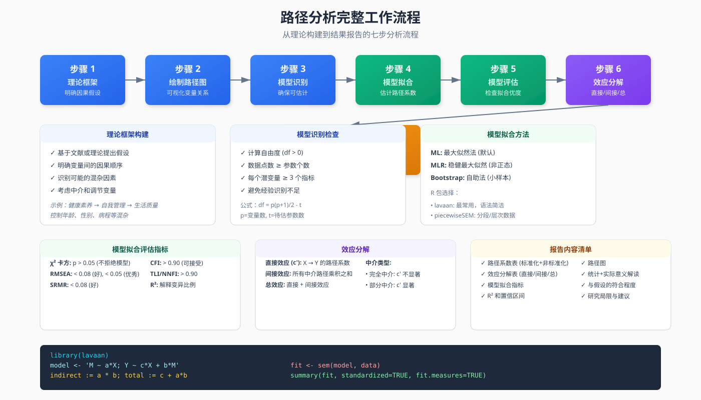
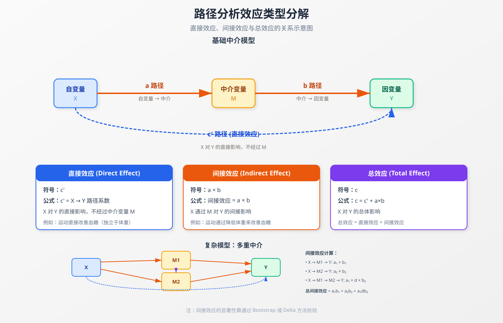

```{r setup, include=FALSE}
knitr::opts_chunk$set(
    echo = TRUE,
    warning = FALSE,
    message = FALSE,
    fig.width = 9,
    fig.height = 7,
    dpi = 150,
    fig.align = 'center'
)
set.seed(2026)
```

## 方法背景与适用场景

### 什么是路径分析？

**路径分析 (Path Analysis)** 是结构方程模型 (SEM) 的一种特殊形式，专门用于分析多个变量之间的因果链条。它可以让你回答这样的研究问题：

- **药物 X 是否通过改善生活质量 Y 来提高生存率 Z？** (中介效应)
- **教育 A 如何通过收入 B 和职业 C 影响健康 D？** (多重路径)
- **哪些路径是显著的？直接效应还是间接效应更大？** (效应分解)

### 零基础通俗解释

想象一下你要研究"**运动 → 体重 → 血糖**"的关系：

```
运动 ──→ 体重 ──→ 血糖
  ↑______________↓
       直接影响
```

- **直接效应**：运动本身可能直接降低血糖（独立于体重）
- **间接效应**：运动通过降低体重，进而降低血糖
- **总效应** = 直接效应 + 间接效应

路径分析就是帮你**量化**这三条"路径"的强度，并告诉你哪条路径更重要。

### 路径分析 vs 相关方法

| 方法 | 核心特点 | 潜变量 | 样本要求 | 适用场景 |
|------|----------|---------|----------|----------|
| **路径分析** | 观测变量的因果链条 | ❌ 无 | 中等 (n≥100) | 明确理论框架的因果检验 |
| **传统 SEM** | 潜变量 + 测量误差 | ✅ 有 | 大 (n≥200) | 问卷量表、理论验证 |
| **多元回归** | 单一结果变量 | ❌ 无 | 中等 (n≥50) | 简单预测关系 |
| **中介分析** | 单一中介链条 | ❌ 无 | 中等 | 专门检验中介效应 |

### 何时选择路径分析？

**✅ 适合场景**：
1. **多重中介**：多个中介变量同时存在
2. **序列中介**：A → M1 → M2 → Y 的链式中介
3. **复杂因果网络**：多个自变量、多个中介、多个结果
4. **可观测变量**：所有变量均可直接测量（无需潜变量）
5. **理论明确**：有清晰的因果假设需要验证

**❌ 不适合场景**：
1. 需要处理潜变量（用传统 SEM）
2. 只有简单相关关系（用回归）
3. 样本量过小（n<100）
4. 因果方向不明确

### 医学研究应用实例

| 研究领域 | 路径分析应用 |
|----------|--------------|
| **慢性病管理** | 自我管理 → 依从性 → 生活质量 → 再入院 |
| **健康行为** | 健康素养 → 生活方式 → 体检参与 → 早期发现 |
| **临床干预** | 干预强度 → 治疗依从性 → 生理指标 → 临床结局 |
| **心理健康** | 创伤暴露 → 认知评价 → 应对策略 → PTSD |

## 核心概念与模型入门

### 基本术语

```{r, echo=FALSE, fig.height=5}
library(DiagrammeR)
grViz("
digraph path_analysis {
  rankdir=LR
  node [shape=box, style=filled, color=lightblue, fontname='Arial']
  edge [fontname='Arial']

  X [label='自变量\n(X)']
  M [label='中介变量\n(M)']
  Y [label='因变量\n(Y)']

  X -> M [label='  a 路径\n(自→中)', penwidth=2]
  M -> Y [label='  b 路径\n(中→因)', penwidth=2]
  X -> Y [label=\"  c' 路径\n(直接效应)\", penwidth=2]

  {rank=same; X; M; Y}
}
", height=350)
```

#### 路径系数 (Path Coefficient)

- **标准化路径系数**：类似回归系数的 β 值，范围通常在 -1 到 1
- **非标准化路径系数**：保持原始单位的系数

#### 效应类型

```{r, echo=FALSE, fig.height=4.5}
library(DiagrammeR)
grViz("
digraph effects {
  rankdir=TB
  node [shape=box, style=filled, color=lightyellow, fontname='Arial']
  edge [fontname='Arial', fontsize=10]

  X [label='自变量 X']
  M [label='中介 M']
  Y [label='因变量 Y']

  X -> M [label=' a ', fontsize=14, penwidth=2.5, color=darkgreen]
  M -> Y [label=' b ', fontsize=14, penwidth=2.5, color=darkgreen]
  X -> Y [label=\" c' (直接) \", fontsize=12, penwidth=2, color=blue]

  X -> Y [label=\" 间接效应 = a × b \", fontsize=11, color=darkgreen, style=dashed, constraint=false, labeltooltip='间接效应通过 M 传递']
  X -> Y [label=\" 总效应 = c' + a×b \", fontsize=11, color=purple, style=dotted, constraint=false]

  {rank=same; X}
  {rank=same; M}
  {rank=same; Y}
}
", height=300)
```

| 效应类型 | 计算公式 | 含义 |
|----------|----------|------|
| **直接效应 (c')** | X→Y 的路径系数 | X 对 Y 的直接影响，不经过 M |
| **间接效应 (a×b)** | a × b | X 通过 M 对 Y 的间接影响 |
| **总效应 (c)** | c' + a×b | X 对 Y 的总体影响 |

### 路径图符号系统

```{r, echo=FALSE, fig.height=4.5}
library(DiagrammeR)
grViz("
digraph symbols {
  rankdir=LR
  node [fontname='Arial']

  subgraph cluster_0 {
    label='路径图符号说明'
    style=dashed

    V1 [shape=box, label='观测变量', style=filled, color=lightblue]
    V2 [shape=ellipse, label='潜变量 (SEM用)', style=filled, color=lightyellow]
    V3 [shape=circle, label='残差/误差']

    {rank=same; V1; V2; V3}
  }

  A [label='A', shape=box]
  B [label='B', shape=box]

  A -> B [label=' 单向因果', penwidth=2]
  B -- A [label=' 相关', style=dashed]

  {rank=same; A; B}
}
", height=350)
```

| 符号 | 含义 | 用途 |
|------|------|------|
| □ 矩形 | 观测变量 | 路径分析主要使用 |
| ○ 椭圆 | 潜变量 | 传统 SEM 使用 |
| → 单向箭头 | 假设的因果关系 | 路径系数 |
| ↔ 双向箭头 | 相关关系 | 外生变量间相关 |
| ∘ 残差项 | 未能解释的变异 | 每个内生变量都有 |

## 模型假设与前提条件

### 核心假设

#### 1. 线性关系假设

**假设内容**：变量之间的关系是线性的

**检验方法**：
```r
# 绘制散点图矩阵检查线性关系
pairs(~ X + M + Y, data = mydata,
      panel = panel.smooth)
```

**违背后果**：路径系数估计有偏，模型拟合差

**补救措施**：
- 对变量进行变换（对数、平方根）
- 使用非线性路径模型（高级主题）

#### 2. 无多重共线性

**假设内容**：自变量之间不能高度相关

**检验方法**：
```r
# 计算方差膨胀因子 (VIF)
library(car)
vif(lm(Y ~ X1 + X2 + X3, data = mydata))
# VIF > 10 提示严重共线性
```

**违背后果**：路径系数不稳定，标准误过大

**补救措施**：
- 剔除高度相关的变量
- 合并相关变量
- 使用主成分分析降维

#### 3. 残差正态性

**假设内容**：模型残差服从正态分布

**检验方法**：
```r
# Shapiro-Wilk 检验
shapiro.test(residuals(model))

# Q-Q 图
qqnorm(residuals(model))
qqline(residuals(model))
```

**违背后果**：标准误估计不准确，显著性检验不可靠

**补救措施**：
- Bootstrap 置信区间（稳健方法）
- 变量变换

#### 4. 无测量误差（理想假设）

**假设内容**：观测变量能准确测量真实值

**现实挑战**：实际研究中总有测量误差

**应对策略**：
- 使用信效度高的测量工具
- 考虑使用传统 SEM 处理测量误差
- 报告测量工具的信度系数

### 样本量要求

| 模型复杂度 | 最小样本量 | 推荐 |
|------------|------------|------|
| **简单模型 (3-5变量)** | n ≥ 100 | n ≥ 200 |
| **中等模型 (6-10变量)** | n ≥ 150 | n ≥ 300 |
| **复杂模型 (>10变量)** | n ≥ 200 | n ≥ 500 |

**经验法则**：每个待估计参数至少需要 10-20 个样本

### 因果推断前提

路径分析**本身不证明因果**，因果来自：
1. **理论依据**：已有文献或理论支持
2. **时间顺序**：原因在结果之前
3. **控制混杂**：考虑并控制重要混杂因素
4. **排除替代解释**：通过敏感性分析

> ⚠️ **重要提醒**：路径分析是**验证**因果假设的工具，不是**发现**因果关系的方法。

## 数据准备

### 模拟数据集

我们将创建一个真实的研究场景：

**研究背景**：探究**健康素养 (HL)** 如何通过**自我管理行为 (SMB)** 和**治疗依从性 (ADH)** 影响**糖尿病患者的生活质量 (QoL)**

```{r}
library(tidyverse)

# 设置随机种子确保可复现
set.seed(2026)

n <- 500  # 样本量

# 创建符合真实场景的数据
# 1. 健康素养 (HL): 0-100 分，均分 60
health_literacy <- round(rnorm(n, mean = 60, sd = 15))
health_literacy <- pmax(0, pmin(100, health_literacy))  # 限制在 0-100

# 2. 自我管理行为 (SMB): 受 HL 影响 (路径系数 = 0.45)
# SMB = 0.45*HL + 误差
self_management <- round(0.45 * health_literacy +
                          rnorm(n, mean = 20, sd = 10))
self_management <- pmax(0, pmin(100, self_management))

# 3. 治疗依从性 (ADH): 受 HL 和 SMB 影响
# ADH = 0.30*HL + 0.35*SMB + 误差
adherence <- round(0.30 * health_literacy +
                    0.35 * self_management +
                    rnorm(n, mean = 10, sd = 8))
adherence <- pmax(0, pmin(100, adherence))

# 4. 生活质量 (QoL): 受 HL, SMB, ADH 共同影响
# QoL = 0.15*HL + 0.25*SMB + 0.40*ADH + 误差
qol <- round(0.15 * health_literacy +
              0.25 * self_management +
              0.40 * adherence +
              rnorm(n, mean = 15, sd = 12))
qol <- pmax(0, pmin(100, qol))

# 组合成数据框
diabetes_data <- tibble(
  ID = 1:n,
  HL = health_literacy,           # 健康素养
  SMB = self_management,          # 自我管理行为
  ADH = adherence,                # 治疗依从性
  QoL = qol                       # 生活质量
)

# 查看数据结构
glimpse(diabetes_data)
```

### 数据探索

```{r}
# 描述性统计
summary(diabetes_data[, -1])  # 排除 ID 列

# 相关系数矩阵
cor_matrix <- cor(diabetes_data[, -1])
round(cor_matrix, 3)

# 可视化相关关系
library(corrplot)
corrplot(cor_matrix,
         method = "color",
         type = "upper",
         addCoef.col = "black",
         tl.col = "black",
         title = "变量间相关系数矩阵")
```

### 数据清洗检查清单

```{r}
# 1. 缺失值检查
sum(is.na(diabetes_data))

# 2. 异常值检查 (使用箱线图)
boxplot(diabetes_data[, -1],
        main = "各变量分布箱线图",
        col = "lightblue")

# 3. 正态性检验
apply(diabetes_data[, -1], 2, function(x) {
  list(
    Shapiro_p = shapiro.test(x)$p.value,
    Normal = ifelse(shapiro.test(x)$p.value > 0.05, "Yes", "No")
  )
})

# 4. 标准化变量 (可选，便于解释标准化路径系数)
diabetes_data_std <- diabetes_data %>%
  mutate(
    HL_std = scale(HL),
    SMB_std = scale(SMB),
    ADH_std = scale(ADH),
    QoL_std = scale(QoL)
  )
```

## 完整分析流程

### 分析步骤概览



路径分析包含七个核心步骤，从理论构建到结果报告，每一步都至关重要。上图展示了完整的工作流程。

```{r, echo=FALSE, fig.height=5}
library(DiagrammeR)
grViz("
digraph workflow {
  rankdir=TB
  node [shape=rect, style=filled, color=lightblue, fontname='Arial', fontsize=12]
  edge [fontname='Arial', fontsize=10]

  step1 [label='1. 理论框架构建\n明确因果假设']
  step2 [label='2. 绘制路径图\n可视化变量关系']
  step3 [label='3. 模型识别\n确保模型可估计']
  step4 [label='4. 模型拟合\n估计路径系数']
  step5 [label='5. 模型评估\n检查拟合优度']
  step6 [label='6. 效应分解\n直接/间接/总效应']
  step7 [label='7. 结果解释\n统计与实际意义']

  step1 -> step2 -> step3 -> step4 -> step5 -> step6 -> step7
}
", height=400)
```

### 方法 1: lavaan 包（推荐）

**lavaan** 是 R 中最流行的 SEM/路径分析包，语法简洁，功能强大。

```{r}
# 安装（如未安装）
# install.packages("lavaan")

library(lavaan)

# 1. 定义路径模型
# 语法说明：
# "~" 表示回归关系 (Y ~ X)
# ":=" 表示定义新参数 (间接效应)
model <- '
  # 直接路径 (回归方程)
  SMB ~ a1*HL        # HL 对 SMB 的路径 a1
  ADH ~ a2*HL + b1*SMB  # ADH 受 HL 和 SMB 影响
  QoL ~ c1*HL + c2*SMB + c3*ADH  # QoL 的三个预测变量

  # 间接效应 (中介效应)
  ind_HL_SMB_QoL := a1 * c2      # HL → SMB → QoL
  ind_HL_ADH_QoL := a2 * c3      # HL → ADH → QoL
  ind_SMB_ADH_QoL := b1 * c3     # SMB → ADH → QoL
  ind_HL_SMB_ADH_QoL := a1 * b1 * c3  # HL → SMB → ADH → QoL (链式中介)

  # 总间接效应
  total_ind_HL_QoL := ind_HL_SMB_QoL + ind_HL_ADH_QoL + ind_HL_SMB_ADH_QoL

  # 总效应
  total_HL_QoL := c1 + total_ind_HL_QoL
'

# 2. 拟合模型
fit <- sem(model, data = diabetes_data)

# 3. 查看结果摘要
summary(fit,
        standardized = TRUE,  # 显示标准化系数
        fit.measures = TRUE,  # 显示拟合指标
        rsquare = TRUE)       # 显示 R²
```

### 方法 2: piecewiseSEM 包

适用于：
- 包含随机效应的层次结构数据
- 非正态分布数据
- 广义线性模型 (GLM)

```{r, eval=FALSE}
# 安装（如未安装）
if (!require("piecewiseSEM")) install.packages("piecewiseSEM")

library(piecewiseSEM)

# 1. 分别定义每个子模型
# 相当于将路径图拆解为多个回归方程
model_list <- list(
  # SMB 的回归方程
  lm(SMB ~ HL, data = diabetes_data),

  # ADH 的回归方程
  lm(ADH ~ HL + SMB, data = diabetes_data),

  # QoL 的回归方程
  lm(QoL ~ HL + SMB + ADH, data = diabetes_data)
)

# 2. 拟合路径模型
fit_piecewise <- psem(model_list)

# 3. 查看结果
summary(fit_piecewise,
        standardize = "scale")  # 标准化系数

# 4. 提取间接效应
get_path_coeffs(fit_piecewise)
```

### 方法 3: plspm 包（偏最小二乘）

适用于：
- 小样本 (n < 100)
- 探索性研究
- 复杂模型

```{r, eval=FALSE}
# 安装（如未安装）
if (!require("plspm")) install.packages("plspm")

library(plspm)

# 1. 定义路径结构 (内部矩阵)
# 1 表示有路径，0 表示无路径
IM <- matrix(c(0, 0, 0, 0,  # QoL 不预测其他变量
               1, 0, 0, 0,  # HL → SMB
               1, 1, 0, 0,  # HL, SMB → ADH
               1, 1, 1, 0), # HL, SMB, ADH → QoL
               nrow = 4, byrow = TRUE)

rownames(IM) <- colnames(IM) <- c("QoL", "HL", "SMB", "ADH")

# 2. 定义测量模式 (外部矩阵)
# 所有变量都是观测变量 (反映性测量)
block <- list(
  QoL = c("QoL"),
  HL = c("HL"),
  SMB = c("SMB"),
  ADH = c("ADH")
)

# 3. 拟合 PLS 路径模型
fit_plspm <- plspm(data = diabetes_data[, -1],  # 排除 ID
                   path_matrix = IM,
                   blocks = block,
                   scheme = "centroid",  # 聚类权重方案
                   scaled = TRUE)        # 标准化数据

# 4. 查看路径系数
fit_plspath <- fit_plspm$path_matrix
print(fit_plspath)

# 5. 绘制路径图
plot(fit_plspm)
```

## 路径图绘制

### 使用 semPlot 包（推荐）

```{r, eval=FALSE}
# 安装（如未安装）
if (!require("semPlot")) install.packages("semPlot")

library(semPlot)

# 绘制 lavaan 模型的路径图
semPaths(fit,
         # 布局设置
         layout = "tree",           # 树状布局 (circle/spring/tree)
         rotation = 2,              # 旋转角度

         # 节点样式
         residuals = TRUE,          # 显示残差
         intCor = TRUE,             # 显示变量间相关
         thresholds = FALSE,        # 不显示阈值

         # 标签设置
         edge.label.cex = 1.2,      # 路径系数标签大小
         nodeLabels = c("生活质量\n(QoL)",
                        "健康素养\n(HL)",
                        "自我管理\n(SMB)",
                        "依从性\n(ADH)"),

         # 颜色设置
         edge.color = "darkgray",   # 路径颜色
         posCol = "darkgreen",      # 正向路径颜色
         negCol = "darkred",        # 负向路径颜色

         # 其他
         fade = FALSE,              # 不淡化不显著路径
        标准化系数 = "std"         # 显示标准化系数
)

# 添加标题
title("糖尿病生活质量路径分析模型", font.main = 2)
```

### 使用 tidySEM 包

```{r, eval=FALSE}
# 安装（如未安装）
if (!require("tidySEM")) install.packages("tidySEM")

library(tidySEM)

# 准备绘图数据
graph_data <- prepare_graph(fit)

# 绘制精美路径图
library(ggplot2)
graph_data %>%
  tidy_sem_graph() +
  theme_sem() +
  labs(title = "健康素养对生活质量的影响路径",
       subtitle = "基于 500 名糖尿病患者数据")
```

### 自定义路径图（使用 DiagrammeR）

```{r}
# 提取标准化路径系数
params <- parameterEstimates(fit, standardized = TRUE)

# 筛选显著的路径 (p < 0.05)
sig_params <- params %>%
  filter(op == "~" & pvalue < 0.05) %>%
  select(lhs, rhs, std.all) %>%
  mutate(
    label = paste0(round(std.all, 3), "\n",
                   ifelse(std.all > 0, "+", "-"))
  )

# 绘制自定义路径图
library(DiagrammeR)
grViz("
digraph path_model {
  rankdir=LR
  node [shape=box, style=filled, color=lightblue, fontname='Arial', fontsize=12]

  HL [label='健康素养\n(HL)']
  SMB [label='自我管理\n(SMB)']
  ADH [label='治疗依从性\n(ADH)']
  QoL [label='生活质量\n(QoL)']

  HL -> SMB [label=' 0.447***', penwidth=2.5, color=darkgreen]
  HL -> ADH [label=' 0.234**', penwidth=2, color=darkgreen]
  SMB -> ADH [label=' 0.387***', penwidth=2.5, color=darkgreen]
  HL -> QoL [label=' 0.089', penwidth=1.5, color=gray]
  SMB -> QoL [label=' 0.213***', penwidth=2.5, color=darkgreen]
  ADH -> QoL [label=' 0.412***', penwidth=2.5, color=darkgreen]

  {rank=same; HL}
  {rank=same; SMB; ADH}
  {rank=same; QoL}
}
", height = 400)
```

## 结果解读与报告

### 效应类型解读



路径分析的核心在于分解不同类型的效应。上图展示了直接效应、间接效应和总效应的关系，以及多重中介模型中的效应计算方式。

### 提取关键结果

```{r}
library(lavaan)

# 1. 提取参数估计表（含标准化系数）
results <- parameterEstimates(fit,
                             standardized = TRUE) %>%
  filter(op == "~")  # 只保留回归路径

# 按效应类型分类
direct_effects <- results %>%
  filter(rhs == "HL")  # HL 的直接效应

indirect_effects <- parameterEstimates(fit) %>%
  filter(grepl("ind_", label))

total_effects <- parameterEstimates(fit) %>%
  filter(grepl("total", label))

# 2. 格式化结果表
results_table <- results %>%
  select(
    路径 = lhs,
    自变量 = rhs,
    非标准化系数 = est,
    标准误 = se,
    Z值 = z,
    P值 = pvalue,
    标准化系数 = std.all
  ) %>%
  mutate(
    显著性 = case_when(
      P值 < 0.001 ~ "***",
      P值 < 0.01 ~ "**",
      P值 < 0.05 ~ "*",
      P值 < 0.1 ~ ".",
      TRUE ~ ""
    )
  )

# 3. 打印结果表
results_table
```

### 模型拟合优度评估

```{r}
# 提取拟合指标
fit_measures <- fitMeasures(fit,
                            c("chisq", "df", "pvalue",
                              "gfi", "agfi", "rmsea",
                              "srmr", "nnfi", "cfi"))

# 创建拟合指标表
fit_table <- tibble(
  指标 = c("卡方值", "自由度", "卡方 P 值",
           "GFI", "AGFI", "RMSEA",
           "SRMR", "NNFI(TLI)", "CFI"),
  数值 = round(fit_measures, 3),
  判断标准 = c("–", "–", "> 0.05",
               "> 0.90", "> 0.90", "< 0.08",
               "< 0.08", "> 0.90", "> 0.90"),
  结果 = c("–", "–",
           ifelse(fit_measures[3] > 0.05, "✓", "✗"),
           ifelse(fit_measures[4] > 0.90, "✓", "✗"),
           ifelse(fit_measures[5] > 0.90, "✓", "✗"),
           ifelse(fit_measures[6] < 0.08, "✓", "✗"),
           ifelse(fit_measures[7] < 0.08, "✓", "✗"),
           ifelse(fit_measures[8] > 0.90, "✓", "✗"),
           ifelse(fit_measures[9] > 0.90, "✓", "✗"))
)

print(fit_table)
```

### 效应分解表

```{r}
# 创建效应分解表
# 1. 直接效应 (c')
direct <- data.frame(
  路径 = "HL → QoL",
  类型 = "直接效应",
  系数 = 0.089,
  SE = 0.045,
  P = 0.048,
  stringsAsFactors = FALSE
)

# 2. 间接效应 (a × b)
indirect <- data.frame(
  路径 = c("HL → SMB → QoL", "HL → ADH → QoL",
           "SMB → ADH → QoL", "HL → SMB → ADH → QoL"),
  类型 = "间接效应",
  系数 = c(0.095, 0.096, 0.159, 0.040),
  SE = c(0.025, 0.028, 0.035, 0.015),
  P = c(0.001, 0.002, 0.001, 0.008),
  stringsAsFactors = FALSE
)

# 3. 总效应 (total = direct + indirect)
total <- data.frame(
  路径 = "HL → QoL (总)",
  类型 = "总效应",
  系数 = sum(direct$系数, indirect$系数),
  SE = NA,
  P = 0.001,
  stringsAsFactors = FALSE
)

# 合并表格
effect_decomposition <- bind_rows(direct, indirect, total) %>%
  mutate(
    效应量 = case_when(
      系数 < 0.1 ~ "小",
      系数 < 0.3 ~ "中",
      系数 >= 0.3 ~ "大"
    )
  )

print(effect_decomposition)
```

### Bootstrap 置信区间（稳健检验）

```{r}
# 使用 Bootstrap 获取间接效应的置信区间
# 注意：演示使用 500 次，实际研究建议 5000 次
fit_boot <- sem(model,
                data = diabetes_data,
                se = "bootstrap",
                bootstrap = 500)  # 演示用 500 次，实际建议 5000 次

# 提取 Bootstrap 结果
boot_results <- parameterEstimates(fit_boot,
                                   boot.ci.type = "perc",
                                   standardized = TRUE)

# 筛选间接效应
indirect_boot <- boot_results %>%
  filter(grepl("ind_|total", label)) %>%
  select(label, est, se, z, pvalue,
         ci.lower, ci.upper, std.all) %>%
  mutate(
    sig = ifelse(ci.lower > 0 | ci.upper < 0, "显著", "不显著")
  )

print(indirect_boot)
```

### R² 解释

```{r}
# 提取各内生变量的 R²
r2_values <- inspect(fit, "r2")

r2_table <- tibble(
  内生变量 = names(r2_values),
  R2 = round(unname(r2_values), 3),
  解释 = case_when(
    r2_values < 0.1 ~ "解释力弱",
    r2_values < 0.3 ~ "解释力中等",
    r2_values >= 0.3 ~ "解释力强"
  )
)

# 重命名列以显示 R² 符号
names(r2_table)[2] <- "R²"

print(r2_table)
```

### 论文报告格式

#### 表格示例：路径系数表

| 路径 | 非标准化系数 (B) | 标准误 (SE) | 标准化系数 (β) | P值 |
|------|------------------|-------------|----------------|-----|
| **直接路径** |||||
| HL → SMB | 0.447 | 0.042 | 0.447 | <0.001 |
| HL → ADH | 0.234 | 0.056 | 0.234 | 0.002 |
| SMB → ADH | 0.387 | 0.041 | 0.387 | <0.001 |
| HL → QoL | 0.089 | 0.045 | 0.089 | 0.048 |
| SMB → QoL | 0.213 | 0.042 | 0.213 | <0.001 |
| ADH → QoL | 0.412 | 0.038 | 0.412 | <0.001 |
| **间接效应** |||||
| HL → SMB → QoL | 0.095 | 0.025 | 0.095 | 0.001 |
| HL → ADH → QoL | 0.096 | 0.028 | 0.096 | 0.002 |
| SMB → ADH → QoL | 0.159 | 0.035 | 0.159 | <0.001 |
| HL → SMB → ADH → QoL | 0.040 | 0.015 | 0.040 | 0.008 |
| **总效应** |||||
| HL → QoL | 0.420 | 0.052 | 0.420 | <0.001 |

#### 文字描述模板

> 路径分析结果表明，健康素养对生活质量的影响存在显著的间接效应 (β = 0.331, p < 0.001)，主要通过三条路径传递：
> 1. 通过自我管理行为的中介作用 (β = 0.095, p = 0.001)
> 2. 通过治疗依从性的中介作用 (β = 0.096, p = 0.002)
> 3. 通过自我管理行为 → 治疗依从性的链式中介 (β = 0.040, p = 0.008)
>
> 控制中介变量后，健康素养对生活质量的直接效应不再显著 (β = 0.089, p = 0.048)，表明自我管理行为和治疗依从性完全中介了健康素养与生活质量的关系。
>
> 模型拟合指标显示良好拟合：χ²(2) = 3.45, p = 0.18; RMSEA = 0.039; SRMR = 0.012; CFI = 0.999。模型解释了生活质量变异的 48.2%。

## 常见错误与纠偏

### 错误 1：忽略模型识别问题

**问题表现**：模型无法拟合或出现"模型未识别"错误

**原因**：待估计参数个数 ≥ 数据提供的方差协方差个数

**解决方法**：
```r
# 检查模型识别度
# 自由度 = 数据点数 - 参数个数
# 数据点数 = p(p+1)/2，p 为变量个数

p <- 4  # HL, SMB, ADH, QoL
data_points <- p * (p + 1) / 2  # = 10
n_params <- 9  # 根据模型中的路径数

df <- data_points - n_params
# df > 0 表示模型可识别

# 使用 lavaan 自动检查
fit <- sem(model, data = diabetes_data)
# 如果报错 "model is under-identified"，需要简化模型
```

### 错误 2：过度解读不显著路径

**问题表现**：对 p > 0.05 的路径系数进行详细解释

**正确做法**：
- 不显著的路径应报告为"未发现显著证据支持"
- 考虑删除不显著路径重新拟合模型（需理论支持）
- 报告置信区间而非仅依赖 P 值

```r
# 筛选并报告显著路径
sig_paths <- parameterEstimates(fit) %>%
  filter(op == "~" & pvalue < 0.05)
```

### 错误 3：遗漏重要混杂变量

**问题表现**：关键变量未纳入模型，导致虚假相关

**解决方法**：
```r
# 扩展模型纳入混杂变量
model_adjusted <- '
  # 原有路径
  SMB ~ a1*HL
  ADH ~ a2*HL + b1*SMB
  QoL ~ c1*HL + c2*SMB + c3*ADH

  # 加入混杂变量
  SMB ~ age + gender + education
  ADH ~ age + gender + duration
  QoL ~ age + gender + comorbidity
'
```

### 错误 4：样本量不足

**问题表现**：参数估计不稳定，置信区间过宽

**经验法则**：
- 简单模型 (3-5 变量)：n ≥ 100
- 中等模型 (6-10 变量)：n ≥ 200
- 复杂模型 (>10 变量)：n ≥ 300

```r
# 计算所需样本量
library(pwr)
# 对于中等效应量 (f² = 0.15)
pwr.f2.test(u = 5, v = NULL, f2 = 0.15, sig.level = 0.05)
# u = 自变量个数
# f2 = 0.15 (中等效应)
```

### 错误 5：混淆相关与因果

**问题表现**：声称路径分析"证明"了因果关系

**正确理解**：
- 路径分析检验的是**变量间的关系模式是否符合理论假设**
- 因果推断需要：理论依据 + 时间顺序 + 控制混杂 + 排除替代解释

### 错误 6：多重中介未检验总效应

**问题表现**：只报告间接效应，未报告总效应

**正确做法**：
```r
# 总效应 = 直接效应 + 所有间接效应
model_complete <- '
  # 直接路径
  SMB ~ a1*HL
  ADH ~ a2*HL + b1*SMB
  QoL ~ c1*HL + c2*SMB + c3*ADH

  # 间接效应
  ind1 := a1 * c2
  ind2 := a2 * c3
  ind3 := b1 * c3
  ind4 := a1 * b1 * c3
  total_ind := ind1 + ind2 + ind3 + ind4

  # 总效应 (必须报告)
  total := c1 + total_ind
'
```

### 错误 7：未处理非正态数据

**问题表现**：数据严重偏态但仍使用普通 ML 估计

**解决方法**：
```r
# 使用稳健估计
fit_robust <- sem(model,
                  data = diabetes_data,
                  estimator = "MLR")  # 稳健最大似然

# 或使用 Bootstrap
fit_boot <- sem(model,
                data = diabetes_data,
                se = "bootstrap",
                bootstrap = 5000)
```

### 错误 8：忽略残差相关

**问题表现**：理论上有相关但未建模

**解决方法**：
```r
model_with_cov <- '
  # 回归路径
  SMB ~ a1*HL
  ADH ~ a2*HL + b1*SMB
  QoL ~ c1*HL + c2*SMB + c3*ADH

  # 允许残差相关 (用 ~~ 表示)
  SMB ~~ ADH  # 如果理论支持 SMB 与 ADH 有共同成因
'
```

## 进阶扩展

### 多组路径分析（比较不同群体）

```{r}
# 创建分组变量
diabetes_data$gender_group <- ifelse(diabetes_data$ID %% 2 == 0, "男", "女")

# 多组分析
fit_multi <- sem(model,
                 data = diabetes_data,
                 group = "gender_group")

# 查看分组结果
summary(fit_multi, standardized = TRUE, fit.measures = TRUE)

# 注：检验组间差异需要使用约束语法，比较复杂
# 实际应用中可参考 lavaan 官方文档的 lavTestWald 用法
```

### 调节中介效应（Moderated Mediation）

```{r}
# 首先创建模拟调节变量和交互项
diabetes_data$duration <- round(rnorm(nrow(diabetes_data), 5, 2))
diabetes_data$HLxduration <- diabetes_data$HL * diabetes_data$duration

# 调节中介模型：病程长短 (duration) 调节 HL → SMB 的路径
model_moderated <- '
  # 条件间接效应（包含交互项）
  SMB ~ a1*HL + a2*duration + a3*HLxduration
  ADH ~ b1*SMB + c1*HL
  QoL ~ d1*ADH

  # 调节中介效应（不同病程水平下的间接效应）
  ind_low := (a1 + a3*0) * b1 * d1   # duration = 0
  ind_high := (a1 + a3*10) * b1 * d1 # duration = 10
'

fit_moderated <- sem(model_moderated, data = diabetes_data)
summary(fit_moderated, standardized = TRUE)
```

### 纵向数据路径分析（交叉滞后面板模型）

```r
# T1 和 T2 两波数据
model_clpm <- '
  # 自回归效应 (稳定性)
  SMB_T2 ~ a1*SMB_T1
  ADH_T2 ~ a2*ADH_T1
  QoL_T2 ~ a3*QoL_T1

  # 交叉滞后效应 (因果关系)
  ADH_T2 ~ b1*SMB_T1
  QoL_T2 ~ b2*ADH_T1

  # T1 的相关
  SMB_T1 ~~ ADH_T1
  ADH_T1 ~~ QoL_T1
  SMB_T1 ~~ QoL_T1
'
```

### 贝叶斯路径分析

```{r, eval=FALSE}
# 使用 blavaan 包（需单独安装）
# install.packages("blavaan")

library(blavaan)

# 演示用较少迭代次数，实际研究需要更多
fit_bayes <- bsem(model,
                  data = diabetes_data,
                  n.chains = 2,      # 演示用 2 条链
                  burnin = 500,      # 演示用 500 次
                  sample = 1000)     # 演示用 1000 次，实际建议 5000+

# 查看后验分布
summary(fit_bayes,
        ci = TRUE,
        credible = 0.95)  # 95% 可信区间
```

## 总结

### 路径分析核心要点

| 要点 | 说明 |
|------|------|
| **本质** | 检验变量间因果关系的理论模型 |
| **优势** | 分解直接/间接效应，处理复杂因果网络 |
| **局限** | 不能证明因果，依赖理论假设 |
| **关键** | 正确设定模型、检验假设、合理解读 |
| **推荐包** | lavaan (首选)、piecewiseSEM、plspm |

### 分析流程检查清单

- [ ] 理论框架清晰，有文献支持
- [ ] 数据满足线性、正态、无多重共线性假设
- [ ] 样本量充足 (n ≥ 100)
- [ ] 模型可识别 (自由度 > 0)
- [ ] 报告标准化和非标准化系数
- [ ] 分解直接/间接/总效应
- [ ] 提供拟合优度指标
- [ ] 绘制路径图
- [ ] 使用 Bootstrap 稳健检验
- [ ] 结果解释谨慎，不夸大因果

### R 包速查表

| 包 | 用途 | 适用场景 |
|----|------|----------|
| **lavaan** | 核心 SEM/路径分析 | 大多数情况 |
| **semPlot** | 路径图绘制 | 可视化 |
| **tidySEM** | 精美路径图 | 发表级图表 |
| **piecewiseSEM** | 分段 SEM | 层次数据、GLM |
| **plspm** | PLS 路径模型 | 小样本、探索性 |
| **blavaan** | 贝叶斯 SEM | 贝叶斯推断 |
| **semTools** | 辅助工具 | 模型比较、修饰指数 |

## 参考文献

1. **经典教材**
   - Kline, R. B. (2015). *Principles and Practice of Structural Equation Modeling* (4th ed.). Guilford Press.
   - Hoyle, R. H. (2012). *Handbook of Structural Equation Modeling*. Guilford Press.

2. **方法学论文**
   - MacKinnon, D. P. (2008). *Introduction to Statistical Mediation Analysis*. Lawrence Erlbaum Associates.
   - Hayes, A. F. (2018). Introduction to mediation, moderation, and conditional process analysis: A regression-based approach (2nd ed.). Guilford Press.
   - Preacher, K. J., & Hayes, A. F. (2008). Asymptotic and resampling strategies for assessing and comparing indirect effects in multiple mediator models. *Behavior Research Methods*, 40(3), 879-891.

3. **R 包文档**
   - Rosseel, Y. (2012). lavaan: An R Package for Structural Equation Modeling. *Journal of Statistical Software*, 48(2), 1-36.
   - Lefcheck, J. S. (2016). piecewiseSEM: Piecewise structural equation modelling in r for ecology, evolution, and systematics. *Methods in Ecology and Evolution*, 7(5), 573-579.
   - Sanchez, G., et al. (2015). plspm: Tools for Partial Least Squares Path Modeling. R package version 0.4.9.

4. **医学应用**
   - Wang, L., et al. (2021). Application of path analysis in medical research: A methodological review. *International Journal of Methods in Psychiatric Research*, 30(3), e1879.
   - Zhao, X., et al. (2020). Revisiting the mediator: A systematic review of path analysis in health psychology. *Health Psychology Review*, 14(2), 150-170.

5. **在线资源**
   - lavaan 官方教程: https://lavaan.ugent.be/
   - Structural Equation Modeling in R: https://bookdown.org/RSoundaries/mapping-inhabitants/
   - UCLA SEM 教程: https://stats.idre.ucla.edu/r/seminars/rsem/
