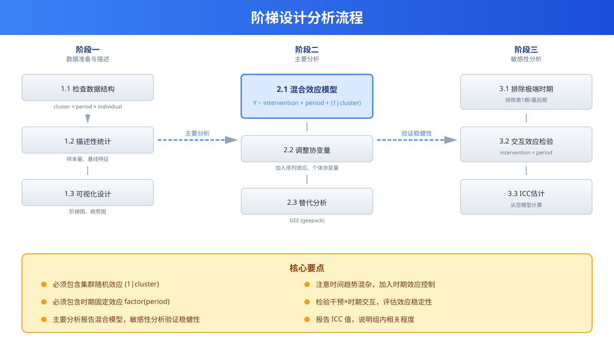

```{r setup, include=FALSE}
knitr::opts_chunk$set(
  echo = TRUE,
  warning = FALSE,
  message = FALSE,
  fig.width = 8,
  fig.height = 5,
  fig.retina = 2,
  out.width = "100%",
  dpi = 150,
  fig.align = 'center'
)
```

## 方法背景与适用场景

阶梯设计（Stepped Wedge Cluster Randomized Trial, SW-CRT）是一种特殊的集群随机试验设计。所有集群（Cluster）在基线期都处于对照组状态，然后随机顺序在不同时间点交叉到干预组，直到所有集群都接受干预。

### 设计示意图

```
时间轴  →  T1  |  T2  |  T3  |  T4  |  T5
          ─────────────────────────────────
集群 A     ● C  |  ● C |  ● I |  ● I |  ● I
集群 B     ● C  |  ● C |  ● C |  ● I |  ● I
集群 C     ● C  |  ● I |  ● I |  ● I |  ● I
集群 D     ● C  |  ● C |  ● C |  ● C |  ● I

● = 观测时点  C = 对照  I = 干预
```

### 适用场景

**强烈推荐使用阶梯设计的场景**：

1. **伦理限制**：有证据表明干预可能有益，不适合长期拒绝部分群体接受干预
   - 医院质量改进项目
   - 教育教学改革
   - 公共卫生政策实施

2. **物流限制**：无法同时向所有集群提供干预
   - 培训资源有限（trainer只能逐批培训）
   - 设备/药品分批供应
   - 逐步推广的现实需求

3. **短期干预效果未知**：需要在实施过程中评估效果
   - 新政策试点评估
   - 创新项目推广

4. **样本量受限**：相比平行CRT，SW-CRT通常需要更少集群

**不适用场景**：

- 干预效应可能随时间变化（如学习曲线、疲劳效应）
- 存在强烈的时间趋势（季节性、长期趋势）
- 干预有延迟效应且潜伏期长于步长
- 存在干预的溢出效应（Contamination）

### 与其他设计的对比

| 设计类型 | 随机化单位 | 因果推断强度 | 样本量需求 | 伦理优势 | 适用场景 |
|---------|-----------|------------|----------|---------|---------|
| **个体RCT** | 个体 | 最强 | 高 | 一般 | 药物试验 |
| **平行CRT** | 集群 | 强 | 很高 | 较差 | 疫苗接种 |
| **阶梯设计** | 集群 | 强 | 中等 | 好 | 质量改进 |
| **前后对照** | 集群 | 弱 | 低 | 好 | 初步探索 |

### 核心优势

1. **伦理优势**：所有集群最终都接受干预
2. **统计效能**：每个集群既作对照又作干预，内比较增加效能
3. **实用性**：符合实际推广中的逐步实施策略
4. **时间效应评估**：可以评估干预的即时和延迟效应

## 核心概念与模型入门

### 通俗理解：用日常例子解释阶梯设计

> 💡 **想象你是教育局领导，要在20所学校推广新的教学方法**
>
> **传统平行设计的问题**：
> - 随机选10所学校用新方法，另10所继续旧方法
> - 一年后比较，发现新方法好
> - 但那10所用旧方法的学校被"不公平"地耽误了一年
>
> **阶梯设计的巧妙之处**：
> - 20所学校都用旧方法开始（第1个月收集基线数据）
> - 然后随机顺序，每月有4所学校切换到新方法
> - 5个月后，所有学校都用了新方法
> - 每所学校既有对照数据又有干预数据
> - 没有学校被"永远拒绝"接受新方法
> - 符合"逐步推广"的现实逻辑
>
> **回到统计学**：阶梯设计通过让所有集群在某个时间点前是对照，之后是干预，实现了：
> 1. 伦理上的公平性
> 2. 每个集群内的前后比较（Within-cluster comparison）
> 3. 集群间的同期比较（Between-cluster comparison）

### 核心术语定义

**集群（Cluster）**

被随机化的单位，而非个体：
- 医院、诊所、学校、社区等
- 个体（患者、学生）嵌套在集群内

**序列（Sequence）**

集群切换到干预的时间顺序：
- 5个时间点 = 5个序列
- 序列1：T1开始干预
- 序列5：T5才开始干预

**步长（Step size）**

每个时间阶段包含的观测时点数：
- 如果每月测量，步长=1个月
- 如果每个阶段包含3个月观测，步长=3

**滞后期（Washout period）**

干预开始后到效应稳定前的时间：
- 需要在设计中考虑
- 过短会低估干预效应

**时期效应（Period effect）**

时间相关的系统误差：
- 季节性、长期趋势
- 需要在分析中调整

### 阶梯设计的统计模型

**基本模型**：

$$Y_{ijkt} = \beta_0 + \beta_1 \times \text{Intervention}_{ijkt} + \alpha_j + \gamma_k + \tau_t + \epsilon_{ijkt}$$

其中：
- $Y_{ijkt}$：集群 $j$、序列 $k$、时间 $t$ 的个体 $i$ 的结局
- $\text{Intervention}_{ijkt}$：干预状态（0=对照，1=干预）
- $\alpha_j$：集群随机效应
- $\gamma_k$：序列固定效应
- $\tau_t$：时期固定效应
- $\epsilon_{ijkt}$：个体残差

**简化版**：

$$Y_{ijkt} = \beta_0 + \beta_1 \times \text{Intervention}_{ijkt} + \text{Cluster}_j + \text{Period}_t + \epsilon_{ijkt}$$

关键估计：$\beta_1$ 就是干预效应！

## 模型假设与前提条件

### 假设1：不存在时间-干预交互

**含义**：干预效应在不同时期是恒定的

**违反场景**：
- 干预效应随时间增强（学习曲线）
- 干预效应随时间减弱（疲劳效应、新鲜感消失）

**检验方法**：加入干预×时期交互项

**应对策略**：
- 如果交互显著，报告不同时期的效应
- 考虑使用滞后干预变量

### 假设2：时间趋势可被调整

**含义**：通过时期固定效应可以控制时间趋势

**违反后果**：
- 残留的时期效应混杂
- 偏倚的干预效应估计

**应对策略**：
- 包含足够的时期固定效应
- 敏感性分析：排除第一个和最后一个时期
- 使用控制图表或中断时间序列数据

### 假设3：不存在溢出效应

**含义**：一个集群的干预不影响其他集群

**违反场景**：
- 邻近社区的健康知识传播
- 医院间的患者转诊
- 网络效应

**应对策略**：
- 选择空间上独立的集群
- 在模型中加入空间相关结构
- 敏感性分析排除邻近集群

### 假设4：集群内相对独立

**含义**：同一集群内的个体间存在相关，但不同集群独立

**统计量**：组内相关系数（ICC）

$$ICC = \frac{\sigma^2_{cluster}}{\sigma^2_{cluster} + \sigma^2_{individual}}$$

**典型ICC值**：
- 医疗质量指标：0.05-0.20
- 健康行为：0.01-0.05
- 临床结局：0.01-0.10

### 假设5：数据缺失随机

**含义**：缺失与未观测的潜在结局无关

**违反后果**：选择偏倚

**应对策略**：
- 最小化失访
- 多重插补
- 模式混合模型

## 数据准备

### 阶梯设计数据结构

```
| Cluster | Period | Sequence | Time | Intervention | ID | Outcome | Covariates |
|---------|--------|----------|------|-------------|----|---------|-----------|
| 1       | 1      | 1        | 1    | 0           | 1  | 45      | ...       |
| 1       | 1      | 1        | 1    | 0           | 2  | 52      | ...       |
| 1       | 2      | 1        | 2    | 1           | 1  | 48      | ...       |
| 1       | 2      | 1        | 2    | 1           | 2  | 55      | ...       |
| 2       | 1      | 2        | 1    | 0           | 3  | 50      | ...       |
| 2       | 2      | 2        | 2    | 0           | 3  | 51      | ...       |
```

### 模拟阶梯设计数据

```{r simulate-sw}
set.seed(2026)
library(tidyverse)

# 设计参数
n_clusters <- 12        # 集群数
n_periods <- 5          # 时期数
n_per_cluster_per_period <- 20  # 每个集群每个时期的个体数
n_sequences <- 4        # 序列数（每步3个集群切换）

# 创建设计框架
sw_design <- data.frame(
  cluster = rep(1:n_clusters, each = n_per_cluster_per_period * n_periods),
  period = rep(rep(1:n_periods, each = n_per_cluster_per_period), n_clusters),
  time = rep(rep(1:n_periods, each = n_per_cluster_per_period), n_clusters)
)

# 分配序列（每个序列3个集群）
sw_design$sequence <- NA
for (seq in 1:n_sequences) {
  clusters_in_seq <- ((seq-1)*3 + 1):(seq*3)
  sw_design$sequence[sw_design$cluster %in% clusters_in_seq] <- seq
}

# 定义干预状态（序列1在第1期后切换，序列2在第2期后切换...）
sw_design$intervention <- with(sw_design, ifelse(time > sequence, 1, 0))

# 生成个体ID
sw_design$id <- with(sw_design, paste(cluster, period, ave(period, cluster, FUN = seq_along), sep = "_"))

# 生成协变量
sw_design <- sw_design |>
  mutate(
    age = rnorm(n(), 50, 12),
    gender = rbinom(n(), 1, 0.5),
    baseline_severity = rnorm(n(), 5, 2)
  )

# 设定参数
baseline_mean <- 50
icc <- 0.05              # 组内相关系数
cluster_sd <- sqrt(icc * 100)  # 集群间SD
individual_sd <- sqrt((1 - icc) * 100)  # 个体SD
time_trend <- 2          # 每期增加2分（时间趋势）
treatment_effect <- 8    # 干预效应（增加8分）

# 生成集群随机效应
cluster_effects <- rnorm(n_clusters, 0, cluster_sd)
names(cluster_effects) <- 1:n_clusters

# 生成个体结局
sw_design <- sw_design |>
  mutate(
    cluster_effect = cluster_effects[as.character(cluster)],
    time_effect = (time - 1) * time_trend,
    tx_effect = intervention * treatment_effect,
    outcome = baseline_mean + cluster_effect + time_effect + tx_effect +
              rnorm(n(), 0, individual_sd)
  )

# 转换为因子
sw_design <- sw_design |>
  mutate(
    cluster_f = factor(cluster),
    period_f = factor(period),
    sequence_f = factor(sequence),
    intervention_f = factor(intervention, levels = 0:1, labels = c("对照", "干预")),
    gender_f = factor(gender, levels = 0:1, labels = c("女", "男"))
  )

# 查看数据结构
head(sw_design, 10)

# 查看设计摘要
sw_design |>
  group_by(cluster, sequence, period, intervention) |>
  summarise(n = n(), .groups = "drop") |>
  pivot_wider(names_from = period, values_from = n, names_prefix = "Period")

# 创建设计可视化
library(ggplot2)
design_viz <- sw_design |>
  distinct(cluster, period, intervention, sequence, intervention_f) |>
  ggplot(aes(x = factor(period), y = factor(cluster), fill = intervention_f)) +
  geom_tile(color = "white", size = 0.5) +
  scale_fill_manual(values = c("#e5e7eb", "#3b82f6")) +
  labs(
    title = "阶梯设计示意图",
    subtitle = "灰色=对照期，蓝色=干预期",
    x = "时期",
    y = "集群",
    fill = "状态"
  ) +
  theme_minimal() +
  theme(
    panel.grid = element_blank(),
    axis.text = element_text(size = 10),
    legend.position = "bottom"
  )

print(design_viz)
```

## 完整分析流程

阶梯设计的统计分析包含三个阶段：数据准备与描述、主要分析（混合效应模型）、敏感性分析。



上图展示了阶梯设计的标准分析流程。核心是使用混合效应模型或GEE方法，必须包含集群随机效应和时期固定效应。

### 步骤1：描述性统计

```{r descriptive-stats}
library(gtsummary)

# 各时期的样本量
sample_size <- sw_design |>
  group_by(period, intervention_f) |>
  summarise(
    n_clusters = n_distinct(cluster),
    n_individuals = n(),
    .groups = "drop"
  )

print(sample_size)

# 基线特征表（按干预状态，但注意这不是因果比较！）
baseline_table <- sw_design |>
  select(age, gender_f, baseline_severity, intervention_f) |>
  tbl_summary(
    by = intervention_f,
    statistic = list(
      all_continuous() ~ "{mean} ({sd})",
      all_categorical() ~ "{n} ({p}%)"
    ),
    label = list(
      age ~ "年龄",
      gender_f ~ "性别",
      baseline_severity ~ "基线严重度"
    )
  ) |>
  add_overall() |>
  modify_caption("注：这是描述性表格，不能直接比较两组（因为混杂了时期效应）")

print(baseline_table)
```

### 步骤2：简单趋势分析（图示）

```{r trend-plot}
# 计算每个集群-时期的均值
period_means <- sw_design |>
  group_by(period, intervention, sequence) |>
  summarise(
    mean_outcome = mean(outcome),
    se_outcome = sd(outcome) / sqrt(n()),
    .groups = "drop"
  )

# 趋势图
trend_plot <- ggplot(period_means, aes(x = period, y = mean_outcome)) +
  geom_line(aes(group = sequence, color = factor(sequence)), size = 1) +
  geom_point(aes(color = factor(sequence)), size = 3) +
  geom_vline(xintercept = 1.5, linetype = "dashed", color = "gray") +
  geom_vline(xintercept = 2.5, linetype = "dashed", color = "gray") +
  geom_vline(xintercept = 3.5, linetype = "dashed", color = "gray") +
  geom_vline(xintercept = 4.5, linetype = "dashed", color = "gray") +
  labs(
    title = "阶梯设计：各时期结局均值趋势",
    subtitle = "不同颜色的线条代表不同的序列（切换到干预的时间）",
    x = "时期",
    y = "结局均值",
    color = "序列"
  ) +
  scale_color_viridis_d() +
  theme_minimal()

print(trend_plot)
```

### 步骤3：主要分析 - 混合效应模型

```{r primary-analysis}
library(lme4)

# 模型1：基本模型（集群随机效应 + 时期固定效应）
model_basic <- lmer(
  outcome ~ intervention + factor(period) + (1 | cluster),
  data = sw_design
)

summary(model_basic)

# 提取干预效应
library(broom.mixed)
tidy(model_basic, effects = "fixed") |>
  filter(term == "intervention")

# 模型2：加入序列固定效应
model_with_sequence <- lmer(
  outcome ~ intervention + factor(period) + factor(sequence) + (1 | cluster),
  data = sw_design
)

summary(model_with_sequence)

# 模型3：调整协变量
model_adjusted <- lmer(
  outcome ~ intervention + factor(period) + age + gender + baseline_severity +
    (1 | cluster),
  data = sw_design
)

summary(model_adjusted)

# 模型比较
library(gtsummary)

# 创建结果对比表
model_comparison <- data.frame(
  Model = c("基本模型", "加入序列", "调整协变量"),
  Estimate = c(
    fixef(model_basic)["intervention"],
    fixef(model_with_sequence)["intervention"],
    fixef(model_adjusted)["intervention"]
  ),
  SE = c(
    sqrt(diag(vcov(model_basic)))["intervention"],
    sqrt(diag(vcov(model_with_sequence)))["intervention"],
    sqrt(diag(vcov(model_adjusted)))["intervention"]
  )
) |>
  mutate(
    CI_lower = Estimate - 1.96 * SE,
    CI_upper = Estimate + 1.96 * SE,
    P = 2 * (1 - pnorm(abs(Estimate / SE)))
  )

print(model_comparison)
```

### 步骤4：GEE分析（替代方法）

```{r gee-analysis}
library(geepack)

# GEE模型（交换相关结构）
gee_model <- geeglm(
  outcome ~ intervention + factor(period) + age + gender,
  family = gaussian,
  data = sw_design,
  id = cluster,
  corstr = "exchangeable"
)

summary(gee_model)

# 提取稳健标准误
tidy(gee_model) |>
  filter(term == "intervention")
```

### 步骤5：敏感性分析

```{r sensitivity-analysis}
# 敏感性分析1：排除第一个时期（可能有基线异质性）
sens1_data <- sw_design |>
  filter(period > 1)

model_sens1 <- lmer(
  outcome ~ intervention + factor(period) + (1 | cluster),
  data = sens1_data
)

# 敏感性分析2：排除最后一个时期（可能有成熟效应）
sens2_data <- sw_design |>
  filter(period < n_periods)

model_sens2 <- lmer(
  outcome ~ intervention + factor(period) + (1 | cluster),
  data = sens2_data
)

# 敏感性分析3：加入干预×时期交互项
model_interaction <- lmer(
  outcome ~ intervention * factor(period) + (1 | cluster),
  data = sw_design
)

# 汇总敏感性分析
sensitivity_summary <- data.frame(
  Analysis = c(
    "主要分析",
    "排除第1期",
    "排除最后期",
    "加入交互项（主效应）"
  ),
  Estimate = c(
    fixef(model_basic)["intervention"],
    fixef(model_sens1)["intervention"],
    fixef(model_sens2)["intervention"],
    fixef(model_interaction)["intervention"]
  )
)

print(sensitivity_summary)
```

### 步骤6：ICC估计

```{r icc-estimate}
# 从空模型估计ICC
null_model <- lmer(
  outcome ~ (1 | cluster),
  data = sw_design
)

summary(null_model)

# 计算ICC
var_cluster <- VarCorr(null_model)$cluster[1, 1]
var_residual <- attr(VarCorr(null_model), "sc")^2
icc <- var_cluster / (var_cluster + var_residual)

cat("组内相关系数 (ICC):", round(icc, 4), "\n")
```

## 结果解读与报告

### 主要结果解释

**干预效应估计**：

- $\beta_1$ = `r round(fixef(model_basic)["intervention"], 2)`
- 95% CI: (`r round(fixef(model_basic)["intervention"] - 1.96 * sqrt(diag(vcov(model_basic)))["intervention"], 2)`,
        `r round(fixef(model_basic)["intervention"] + 1.96 * sqrt(diag(vcov(model_basic)))["intervention"], 2)`)
- P值: `r round(2 * (1 - pnorm(abs(fixef(model_basic)["intervention"] / sqrt(diag(vcov(model_basic)))["intervention"]))), 4)`

**解释**：

在调整了集群效应和时期效应后，干预使结局平均增加 `r round(fixef(model_basic)["intervention"], 2)` 分（95% CI: `r round(fixef(model_basic)["intervention"] - 1.96 * sqrt(diag(vcov(model_basic)))["intervention"], 2)` 到 `r round(fixef(model_basic)["intervention"] + 1.96 * sqrt(diag(vcov(model_basic)))["intervention"], 2)`，P=`r round(2 * (1 - pnorm(abs(fixef(model_basic)["intervention"] / sqrt(diag(vcov(model_basic)))["intervention"]))), 4)`）。

### CONSORT扩展声明

阶梯设计应报告的额外信息：

**设计阶段**：
- [ ] 选择阶梯设计的理由
- [ ] 集群数量和定义
- [ ] 时期数量和长度
- [ ] 序列数量和随机化方法
- [ ] 步长定义

**随机化**：
- [ ] 随机化单位（集群）
- [ ] 序列分配方法
- [ ] 分配隐藏方法
- [ ] 谁知道序列分配

**分析**：
- [ ] 分析单位（个体或集群汇总）
- [ ] 模型类型（混合效应或GEE）
- [ ] 相关结构假设
- [ ] 调整的协变量
- [ ] ICC估计值
- [ ] 敏感性分析

### 论文报告示例

> **方法**：
>
> 我们采用阶梯设计评估XX干预的效果。研究纳入12家医院，分为4个序列（每序列3家医院），在5个时期中逐步从常规护理交叉到干预护理。每个时期持续1个月。
>
> 主要结局为XX指标，以患者为单位测量。考虑到数据结构的层次性（患者嵌套于医院），我们采用线性混合效应模型分析，包含医院随机效应和时期固定效应。报告的ICC为0.05。
>
> **结果**：
>
> 干预使主要结局平均改善X.X分（95% CI: X.X-X.X, P<0.001）。敏感性分析结果与主要分析一致，排除第1期或最后期后效应估计分别为X.X和X.X。未发现干预与时期的显著交互作用（P=0.XX），提示干预效应在各时期保持稳定。
>
> **讨论**：
>
> 本阶梯设计允许所有医院最终接受干预，符合伦理要求。每个医院既作为对照又作为干预，提高了统计效能。主要分析结果的稳健性经过多项敏感性分析验证。局限性包括可能的时间趋势残留混杂，以及无法排除潜在的溢出效应。

## 常见错误与纠偏

### 错误1：忽略集群随机效应

**错误做法**：使用普通回归分析

```r
# 错误！
lm_wrong <- lm(outcome ~ intervention + factor(period), data = sw_design)
```

**后果**：
- 标准误偏小
- I类错误率增加
- 假阳性结果

**正确做法**：使用混合效应模型或GEE

```r
# 正确
lmer_correct <- lmer(outcome ~ intervention + factor(period) + (1 | cluster),
                     data = sw_design)
```

### 错误2：忽略时期效应

**错误做法**：不调整时期

```r
# 错误！
model_no_period <- lmer(outcome ~ intervention + (1 | cluster), data = sw_design)
```

**后果**：
- 时间趋势混杂
- 效应估计有偏

**正确做法**：始终包含时期固定效应

```r
# 正确
model_with_period <- lmer(outcome ~ intervention + factor(period) + (1 | cluster),
                          data = sw_design)
```

### 错误3：误解读基线特征表

**错误做法**：比较干预期和对照期的基线特征

```r
# 这样做没有意义！因为两组在不同时期
```

**正确做法**：
- 报告每个序列的基线特征
- 或报告第1期（全对照）的集群特征
- 不期望各时期特征均衡（这不是随机化的目的）

### 错误4：忽略时间-干预交互

**错误做法**：假设效应恒定

**正确做法**：检验交互作用

```r
# 检验交互
model_interaction <- lmer(
  outcome ~ intervention * factor(period) + (1 | cluster),
  data = sw_design
)

# 如果交互显著，报告不同时期的效应
```

### 错误5：样本量计算不考虑设计效应

**错误做法**：按个体RCT计算样本量

**正确做法**：考虑设计效应（Design effect）

$$DE = 1 + (m - 1) \times ICC$$

其中 $m$ 是平均集群大小

## 进阶扩展

### 样本量计算

**关键参数**：
- $\alpha$：I类错误率（通常0.05）
- $1-\beta$：检验效能（通常0.80或0.90）
- $\delta$：预期干预效应
- $\sigma^2$：结局方差
- ICC：组内相关系数
- $k$：集群数
- $m$：每个集群每个时期的个体数
- $t$：时期数
- $p$：任何时间点处于干预状态的比例

**公式**（Hussey & Hughes, 2007）：

$$n = \frac{(z_{\alpha/2} + z_{\beta})^2 \times 2\sigma^2 \times [1 + (m-1)ICC]}{m \times t \times \delta^2 \times p(1-p)}$$

**R实现**：

```{r sample-size-sw}
# 阶梯设计样本量计算（简化版）
# 参数设定
alpha <- 0.05
power <- 0.80
effect_size <- 8        # 预期效应
sd <- 20                # 标准差
icc <- 0.05
n_clusters <- 12
n_periods <- 5
n_per_cluster <- 20     # 每期每个集群的个体数

# 计算效能（简化版）
# 设计效应
m <- n_per_cluster
de <- 1 + (m - 1) * icc

# 有效样本量
total_observations <- n_clusters * n_periods * n_per_cluster
effective_n <- total_observations / de

# 简化的效能计算
z_alpha <- qnorm(1 - alpha/2)
z_beta <- (effect_size / sd) * sqrt(effective_n / 4) - z_alpha
power_calculated <- 1 - pnorm(z_beta)

cat("设计效应:", round(de, 3), "\n")
cat("有效样本量:", round(effective_n, 0), "\n")
cat("计算得到的检验效能:", round(power_calculated, 3), "\n")

# 注：更精确的样本量计算可使用SWSamp或steppedwedge包
# 需要先安装：install.packages("SWSamp")
```

### 复杂相关结构

**异质方差**：

```r
# 允许不同时期有不同方差
model_hetero <- lmer(
  outcome ~ intervention + factor(period) + (1 | cluster),
  data = sw_design,
  weights = varIdent(form = ~ 1 | period)
)
```

**AR(1)相关**：

```r
# 自回归相关结构（在同一集群内）
library(nlme)
model_ar1 <- lme(
  outcome ~ intervention + factor(period),
  random = ~ 1 | cluster,
  correlation = corAR1(form = ~ time | cluster),
  data = sw_design
)
```

### 三水平模型

如果有嵌套的集群结构（如医院→科室→患者）：

```r
# 三级模型
model_threelevel <- lmer(
  outcome ~ intervention + factor(period) + (1 | hospital/ward) + (1 | patient),
  data = threelevel_data
)
```

### 贝叶斯阶梯设计分析

```r
library(rstanarm)

# 贝叶斯混合模型
bayes_model <- stan_glmer(
  outcome ~ intervention + factor(period) + (1 | cluster),
  data = sw_design,
  family = gaussian,
  prior_intercept = normal(0, 10),
  prior = normal(0, 5),
  prior_aux = exponential(1),
  chains = 4,
  iter = 2000
)

# 结果
summary(bayes_model)
```

### 断层回归设计（如果序列随机化失败）

```r
# 以切换时间为断点的回归
# 使用RDD包
library(rdd)

# 创建断点数据
rdd_data <- sw_design |>
  group_by(cluster) |>
  mutate(
    switch_time = max(period[intervention == 0]) + 1,
    relative_time = period - switch_time
  )

# RDD模型
rdd_model <- lm(
  outcome ~ intervention * relative_time + cluster_factors,
  data = rdd_data
)
```

## 总结

**阶梯设计的核心优势**：

1. **伦理优势**：所有集群最终接受干预
2. **效能优势**：每个集群既作对照又作干预
3. **实用优势**：符合逐步推广的现实策略

**设计要点**：

1. 明确选择阶梯设计的理由（伦理、物流、科学）
2. 合理确定集群数、时期数、序列数
3. 样本量计算必须考虑ICC和设计效应
4. 随机化序列分配并实施分配隐藏

**分析要点**：

1. 使用混合效应模型或GEE
2. 必须包含集群随机效应
3. 必须包含时期固定效应
4. 考虑协变量调整
5. 进行敏感性分析

**报告要点**：

1. 设计示意图
2. CONSORT扩展流程图
3. ICC报告
4. 主要分析+敏感性分析
5. 局限性讨论（时间趋势、溢出效应等）

## 参考文献

1. Hussey MA, Hughes JP. Design and analysis of stepped wedge cluster randomized trials. *Contemp Clin Trials*. 2007;28(3):182-191.
2. Hemming K, et al. The stepped wedge cluster randomised trial: rationale, design, analysis, and reporting. *BMJ*. 2015;350:h391.
3. Mdege ND, et al. Systematic review of the stepped wedge cluster randomized trial design. *Trials*. 2011;12:118.
4. Brown CA, Lilford RJ. The stepped wedge trial design: a systematic review. *BMC Med Res Methodol*. 2006;6:54.
5. Copas AJ, et al. Stepped wedge trials with equal or unequal cluster sizes. *Biometrics*. 2015;71(4):1085-1094.
6. Hooper R, et al. Sample size calculation for stepped wedge and other longitudinal cluster randomized trials. *Stat Med*. 2016;35(26):4718-4728.
7. Ritchie F, et al. Reporting and ethical considerations in stepped wedge trials: a systematic review. *Trials*. 2020;21(1):866.
