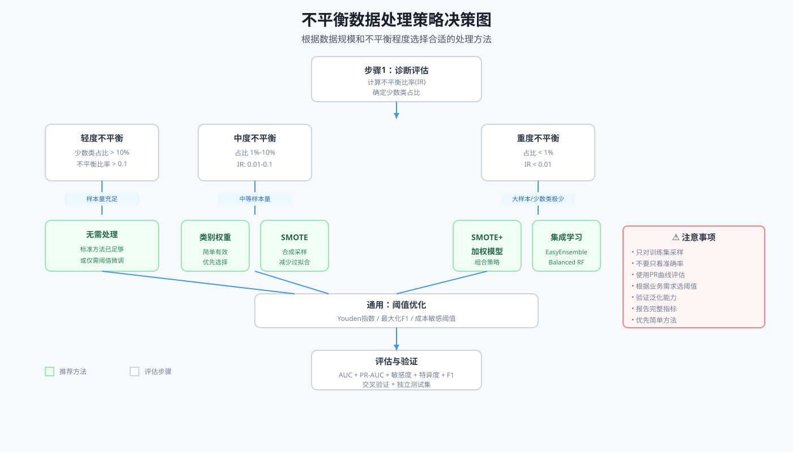

```{r setup, include=FALSE}
knitr::opts_chunk$set(
  echo = TRUE,
  warning = FALSE,
  message = FALSE,
  fig.width = 8,
  fig.height = 5,
  fig.retina = 2,
  out.width = "100%",
  dpi = 150,
  fig.align = 'center'
)
set.seed(2026)
```

## 方法背景与适用场景

### 什么是结局变量不平衡？

**结局变量不平衡**（Class Imbalance）是指分类问题中不同类别的样本数量差异巨大的情况。

想象一个真实的医学场景：医院收集了 10000 名患者的数据，研究术后 30 天内死亡这一不良事件。其中只有 150 人死亡（1.5%），9860 人存活（98.5%）。这种极度不平衡的数据在医学研究中**极为常见**。

#### 生活化类比：大海捞针

**结局变量不平衡就像大海捞针**：

- **多数类**（阴性样本）：大海里的水 —— 数量巨大、随处可见
- **少数类**（阳性样本）：海里的针 —— 稀有、难找、但价值重大

如果用常规方法"随机捞取"，很可能什么也捞不到。我们需要专门的"磁铁"（不平衡处理技术）来提高找到针（正确识别阳性事件）的概率。

### 不平衡程度划分

| 不平衡程度 | 少数类占比 | 医学场景示例 | 处理优先级 |
|-----------|-----------|-------------|-----------|
| **轻度** | 20%-40% | 常见慢性病发病 | 可不处理 |
| **中度** | 1%-20% | 术后并发症 | 建议处理 |
| **重度** | <1% | 罕见病、院内死亡 | **必须处理** |

### 不平衡数据的典型问题

```{r}
library(tidyverse)
library(patchwork)

# 模拟对比：平衡 vs 不平衡数据
set.seed(2026)

# 平衡数据：50% vs 50%
balanced_data <- tibble(
  x1 = rnorm(200, 0, 1),
  x2 = rnorm(200, 0, 1),
  outcome = factor(ifelse(x1 + x2 > 0, "事件", "非事件"))
)

# 不平衡数据：5% vs 95%
imbalanced_data <- tibble(
  x1 = c(rnorm(10, 1.5, 0.8), rnorm(190, 0, 1)),
  x2 = c(rnorm(10, 1.5, 0.8), rnorm(190, 0, 1)),
  outcome = factor(c(rep("事件", 10), rep("非事件", 190)))
)

# 可视化对比
p1 <- ggplot(balanced_data, aes(x = x1, y = x2, color = outcome)) +
  geom_point(alpha = 0.7, size = 2.5) +
  scale_color_manual(values = c("事件" = "#ef4444", "非事件" = "#22c55e")) +
  labs(
    title = "平衡数据 (50% vs 50%)",
    subtitle = "分类边界清晰，模型易学习"
  ) +
  theme_minimal(base_size = 11) +
  theme(legend.position = "bottom",
        plot.title = element_text(face = "bold"))

p2 <- ggplot(imbalanced_data, aes(x = x1, y = x2, color = outcome)) +
  geom_point(alpha = 0.7, size = 2.5) +
  scale_color_manual(values = c("事件" = "#ef4444", "非事件" = "#22c55e")) +
  labs(
    title = "不平衡数据 (5% vs 95%)",
    subtitle = "少数类被多数类掩盖，边界模糊"
  ) +
  theme_minimal(base_size = 11) +
  theme(legend.position = "bottom",
        plot.title = element_text(face = "bold"))

p1 / p2
```

**上图展示**：左图中两类样本数量接近，决策边界清晰；右图中少数类（红点）被大量多数类（绿点）淹没，模型难以学习到有效模式。

### 不平衡导致的四大问题

| 问题 | 说明 | 医学后果 |
|------|------|---------|
| **模型偏向多数类** | 模型倾向于预测多数类以降低整体误差 | 漏诊高危患者 |
| **准确率失效** | 95%准确率可能只是预测所有样本为阴性 | 评估指标误导 |
| **决策边界偏移** | 默认阈值(0.5)偏向多数类 | 预测概率系统性偏差 |
| **过拟合风险** | 模型记忆少数类的少数特征 | 外推能力差 |

### 适用场景与判断标准

**何时需要处理不平衡？**

```{r}
# 判断函数
should_handle_imbalance <- function(data, outcome_var) {
  outcome <- data[[outcome_var]]
  class_counts <- table(outcome)
  minority_prop <- min(class_counts) / sum(class_counts)

  decision <- tibble(
    少数类占比 = scales::percent(minority_prop),
    不平衡程度 = case_when(
      minority_prop >= 0.2 ~ "轻度",
      minority_prop >= 0.01 ~ "中度",
      TRUE ~ "重度"
    ),
    是否需要处理 = ifelse(minority_prop < 0.1, "是", "否"),
    推荐方法 = case_when(
      minority_prop >= 0.2 ~ "无需处理",
      minority_prop >= 0.05 ~ "类别权重 + 阈值调整",
      minority_prop >= 0.01 ~ "SMOTE + 加权模型",
      TRUE ~ "SMOTE + 集成学习"
    )
  )

  return(decision)
}

# 示例：模拟医学数据
medical_example <- tibble(
  patient_id = 1:1000,
  adverse_event = rbinom(1000, 1, 0.03)  # 3% 事件率
)

should_handle_imbalance(medical_example, "adverse_event")
```

### 与其他方法的对比

| 方法 | 主要用途 | 能否处理不平衡 | 备注 |
|------|---------|---------------|------|
| 标准 Logistic 回归 | 二分类结局 | ❌ 需调整 | 对不平衡敏感 |
| Firth 惩罚回归 | 稀有事件/小样本 | ⚠️ 部分解决 | 解决分离问题 |
| 加权 Logistic 回归 | 不平衡数据 | ✅ 推荐 | 简单有效 |
| **SMOTE + 建模** | 不平衡数据 | ✅ 强力推荐 | 综合方案 |
| 随机森林 | 高维预测 | ⚠️ 需设置权重 | 需调整 classwt |

---

## 核心概念与模型入门

### 核心术语

| 术语 | 定义 | 示例 |
|------|------|------|
| **多数类**（Majority Class） | 样本数量多的类别 | 未发生不良事件 |
| **少数类**（Minority Class） | 样本数量少的类别 | 发生不良事件 |
| **不平衡比率**（IR） | 少数类/多数类样本数比 | 0.03 (3%) |
| **过采样**（Oversampling） | 增加少数类样本 | 复制或合成 |
| **欠采样**（Undersampling） | 减少多数类样本 | 随机删除 |
| **混合采样**（Hybrid） | 同时过采样和欠采样 | SMOTE + Tomek |
| **类别权重**（Class Weight） | 训练时加权少数类 | weight = 10:1 |

### 处理策略全景图



**上图说明**：根据数据规模和不平衡程度，选择合适的处理策略。轻度不平衡可考虑阈值调整，中度不平衡优先类别权重，重度不平衡需要数据采样。

### 三大处理策略

#### 策略 1：数据层面（改变数据分布）

**核心思想**：通过采样让训练集更平衡

| 方法 | 操作 | 优点 | 缺点 |
|------|------|------|------|
| **随机过采样** | 复制少数类样本 | 简单直接 | 过拟合风险 |
| **SMOTE** | 合成新少数类样本 | 减少过拟合 | 可能生成噪声 |
| **随机欠采样** | 删除多数类样本 | 减少计算量 | 丢失信息 |

#### 策略 2：算法层面（调整学习过程）

**核心思想**：让模型更重视少数类

| 方法 | 操作 | 优点 | 缺点 |
|------|------|------|------|
| **类别权重** | 训练时加权少数类 | 无需修改数据 | 需算法支持 |
| **阈值调整** | 改变分类阈值 | 简单有效 | 需验证最优值 |

#### 策略 3：集成学习（组合多个模型）

**核心思想**：训练多个模型，综合决策

| 方法 | 操作 | 优点 | 缺点 |
|------|------|------|------|
| **Balanced RF** | 每棵树使用平衡样本 | 内置平衡机制 | 计算成本高 |
| **EasyEnsemble** | 多次欠采样 + 集成 | 保留多数类多样性 | 多个模型 |

---

## 模型假设与前提条件

### 关键假设

使用不平衡处理方法前，需要满足以下假设：

| 假设 | 说明 | 检验方法 |
|------|------|---------|
| **独立性** | 样本之间相互独立 | 研究设计检查 |
| **代表性** | 少数类样本真实反映总体 | 与文献对比发生率 |
| **特征充分** | 预测变量包含区分两类信息 | EDA 分析 |
| **非数据泄漏** | 不平衡是真实的，非测量误差 | 检查数据采集流程 |

### 违背后果

| 违反假设 | 后果 | 解决方案 |
|---------|------|---------|
| 少数类不具代表性 | 模型学偏 | 收集更多少数类样本 |
| 特征不足 | 采样无效 | 特征工程 |
| 数据泄漏 | 虚假高性能 | 严格划分训练/测试集 |

### 前提检查清单

```{r}
check_imbalance_assumptions <- function(data, outcome, predictors) {
  checks <- list()

  # 1. 检查样本独立性（简化版：检查重复ID）
  has_id <- "id" %in% names(data)
  checks[["独立性"]] <- if (has_id && !anyDuplicated(data$id)) {
    "✓ 通过：无重复样本"
  } else {
    "⚠ 警告：无法确认独立性"
  }

  # 2. 检查少数类样本量
  class_counts <- table(data[[outcome]])
  minority_count <- min(class_counts)
  checks[["少数类充足性"]] <- if (minority_count >= 30) {
    "✓ 通过：少数类样本≥30"
  } else {
    "⚠ 警告：少数类样本过少，考虑精确方法"
  }

  # 3. 检查特征分布
  has_predictors <- all(predictors %in% names(data))
  checks[["特征完整性"]] <- if (has_predictors) {
    "✓ 通过：预测变量存在"
  } else {
    "✗ 失败：缺少预测变量"
  }

  return(tibble(
    检查项 = names(checks),
    结果 = unlist(checks)
  ))
}

# 示例使用（后续数据准备后使用）
# check_imbalance_assumptions(medical_data, "adverse_event",
#                             c("age", "sex", "bmi"))
```

---

## 数据准备

### R 包安装与加载

```{r, eval=FALSE}
# 核心处理包
install.packages(c(
  "tidyverse",      # 数据处理
  "ROSE",           # 过采样/欠采样
  "themis",         # tidymodels 采样工具
  "caret",          # 模型训练
  "randomForest"    # 随机森林
))

# 评估包
install.packages(c(
  "yardstick",      # 性能指标
  "PRROC",          # PR 曲线
  "pROC"            # ROC 曲线
))
```

```{r}
# 加载包
library(tidyverse)
library(ROSE)
library(themis)
library(caret)
library(pROC)
library(PRROC)
library(patchwork)
```

### 创建模拟医学数据

我们模拟一个真实的心血管研究场景：研究术后 30 天内主要不良心血管事件（MACE）的预测因素。

```{r}
# 设置随机种子保证可复现性
set.seed(2026)

# 创建模拟数据：2000名患者，3% 事件率
n <- 2000

medical_data <- tibble(
  patient_id = 1:n,
  age = round(rnorm(n, 65, 12)),              # 年龄：均值65，标准差12
  sex = factor(sample(c("男", "女"), n, replace = TRUE, prob = c(0.55, 0.45))),
  bmi = round(rnorm(n, 26, 4), 1),            # BMI
  hypertension = factor(sample(c("是", "否"), n, replace = TRUE, prob = c(0.35, 0.65))),
  diabetes = factor(sample(c("是", "否"), n, replace = TRUE, prob = c(0.20, 0.80))),
  smoking_status = factor(sample(c("从不", "曾经", "现在"), n,
                                   replace = TRUE, prob = c(0.40, 0.35, 0.25))),
  serum_creatinine = round(rnorm(n, 1.1, 0.3), 2),  # 血肌酐
  lvef = round(rnorm(n, 55, 10))               # 左室射血分数
) |>
  # 生成不平衡结局：约3%的MACE事件
  mutate(
    # 风险评分
    risk_score = -5.5 +
      0.04 * (age - 65) +
      0.5 * (sex == "男") +
      0.08 * (bmi - 26) +
      0.7 * (hypertension == "是") +
      0.9 * (diabetes == "是") +
      0.6 * (smoking_status == "现在") +
      0.3 * (serum_creatinine - 1.1) * 10 -
      0.03 * (lvef - 55),
    # 转换为概率
    prob_mace = plogis(risk_score),
    # 生成二分类结局
    mace_event = factor(rbinom(n, 1, prob_mace))
  ) |>
  select(-risk_score, -prob_mace)

# 查看数据结构
glimpse(medical_data)
```

### 探索性分析

#### 结局变量分布

```{r}
# 统计结局分布
outcome_dist <- medical_data |>
  count(mace_event) |>
  mutate(
    event_label = ifelse(mace_event == 1, "发生MACE", "未发生MACE"),
    proportion = n / sum(n),
    percentage = scales::percent(proportion, accuracy = 0.1)
  )

outcome_dist |>
  select(event_label, n, percentage) |>
  knitr::kable(
    col.names = c("结局", "样本数", "占比"),
    caption = "表1：MACE事件分布"
  )
```

```{r}
# 可视化分布
p_dist <- outcome_dist |>
  ggplot(aes(x = event_label, y = n, fill = event_label)) +
  geom_col(width = 0.6) +
  geom_text(aes(label = percentage),
            vjust = -0.8, size = 5, fontface = "bold", color = "#374151") +
  scale_fill_manual(values = c("发生MACE" = "#ef4444", "未发生MACE" = "#22c55e")) +
  scale_y_continuous(labels = scales::comma_format()) +
  labs(
    title = "图1：MACE事件分布",
    subtitle = "重度不平衡：事件发生率约3%",
    x = "",
    y = "样本数",
    fill = ""
  ) +
  theme_minimal(base_size = 12) +
  theme(
    plot.title = element_text(face = "bold", size = 14),
    plot.subtitle = element_text(size = 11),
    legend.position = "none",
    panel.grid.major.x = element_blank(),
    axis.text.x = element_text(size = 11)
  )

p_dist
```

#### 基线特征表

```{r}
# 生成基线特征表（按MACE分组）
baseline_table <- medical_data |>
  mutate(mace_label = ifelse(mace_event == 1, "发生MACE", "未发生MACE")) |>
  select(mace_label, age, sex, bmi, hypertension, diabetes, smoking_status,
         serum_creatinine, lvef) |>
  # 使用 gtsummary 创建专业表格（如果未安装，简化展示）
  group_by(mace_label) |>
  summarise(
    n = n(),
    age_mean = round(mean(age), 1),
    age_sd = round(sd(age), 1),
    male_pct = round(mean(sex == "男") * 100, 1),
    bmi_mean = round(mean(bmi), 1),
    htn_pct = round(mean(hypertension == "是") * 100, 1),
    diabetes_pct = round(mean(diabetes == "是") * 100, 1),
    .groups = "drop"
  ) |>
  pivot_longer(
    cols = -c(mace_label, n),
    names_to = "variable",
    values_to = "value"
  ) |>
  pivot_wider(
    names_from = mace_label,
    values_from = value
  ) |>
  mutate(
    变量 = case_when(
      variable == "age_mean" ~ "年龄 (岁)",
      variable == "male_pct" ~ "男性 (%)",
      variable == "bmi_mean" ~ "BMI",
      variable == "htn_pct" ~ "高血压 (%)",
      variable == "diabetes_pct" ~ "糖尿病 (%)"
    )
  ) |>
  filter(!is.na(变量)) |>
  select(变量, 发生MACE, 未发生MACE) |>
  knitr::kable(
    caption = "表2：按MACE状态分组的基线特征",
    digits = 1
  )

baseline_table
```

#### 不平衡度量计算

```{r}
# 计算不平衡指标
calculate_imbalance_metrics <- function(data, outcome) {
  outcome_var <- data[[outcome]]
  # 确保是 factor
  if (!is.factor(outcome_var)) {
    outcome_var <- as.factor(outcome_var)
  }
  class_counts <- table(outcome_var)
  minority_count <- min(class_counts)
  majority_count <- max(class_counts)
  minority_prop <- minority_count / sum(class_counts)

  # 不平衡比率 (Imbalance Ratio)
  ir <- minority_count / majority_count

  # 熵不平衡度
  probs <- prop.table(class_counts)
  n_classes <- length(class_counts)
  entropy <- -sum(probs * log2(probs))
  max_entropy <- log2(n_classes)
  entropy_imbalance <- 1 - entropy / max_entropy

  tibble(
    指标 = c("样本总数", "多数类样本数", "少数类样本数",
             "少数类占比", "不平衡比率(IR)", "熵不平衡度"),
    值 = c(
      sum(class_counts),
      majority_count,
      minority_count,
      scales::percent(minority_prop, accuracy = 0.1),
      round(ir, 4),
      round(entropy_imbalance, 4)
    ),
    说明 = c(
      "研究总样本量",
      "未发生MACE",
      "发生MACE",
      "事件发生率",
      "越接近0越不平衡",
      "0=平衡，1=完全不平衡"
    )
  )
}

imbalance_metrics <- calculate_imbalance_metrics(medical_data, "mace_event")

imbalance_metrics |>
  knitr::kable(
    caption = "表3：不平衡度量指标"
  )
```

### 数据划分

```{r}
# 划分训练集和测试集（分层抽样保持不平衡比例）
set.seed(2026)
train_idx <- createDataPartition(
  medical_data$mace_event,
  p = 0.7,  # 70% 训练集
  list = FALSE
)

train_data <- medical_data[train_idx, ]
test_data <- medical_data[-train_idx, ]

# 验证划分后的分布
train_dist <- train_data |>
  count(mace_event) |>
  mutate(占比 = n / sum(n), 数据集 = "训练集")

test_dist <- test_data |>
  count(mace_event) |>
  mutate(占比 = n / sum(n), 数据集 = "测试集")

bind_rows(train_dist, test_dist) |>
  mutate(event_label = ifelse(mace_event == 1, "发生MACE", "未发生MACE")) |>
  select(数据集, event_label, n, 占比) |>
  mutate(占比 = scales::percent(占比, accuracy = 0.1)) |>
  knitr::kable(
    caption = "表4：训练集和测试集的MACE分布"
  )
```

**重要提醒**：使用**分层抽样**（stratified sampling）确保训练集和测试集的少数类比例一致，避免信息泄露。

---

## 完整分析流程

### 流程概览

处理不平衡数据的标准流程包括六个步骤：

```{r}
# 流程图（文字版）
flow_steps <- tibble(
  步骤 = 1:6,
  名称 = c("诊断评估", "基线模型", "数据采样", "加权建模", "阈值优化", "综合评估"),
  关键操作 = c(
    "计算不平衡指标，确定处理策略",
    "建立标准模型作为对比基准",
    "SMOTE/过采样/欠采样处理训练集",
    "使用类别权重训练模型",
    "寻找最优分类阈值",
    "对比多种方法的性能"
  ),
  输出成果 = c(
    "不平衡程度报告",
    "基线性能指标",
    "平衡后的训练集",
    "加权模型",
    "最优阈值",
    "最终推荐方案"
  )
)

knitr::kable(flow_steps, caption = "表5：不平衡数据处理完整流程")
```

### 步骤1：建立基线模型

首先使用原始数据建立标准 Logistic 回归，作为后续对比的基准。

```{r}
# 标准 Logistic 回归（基线模型）
formula_base <- as.formula(
  "mace_event ~ age + sex + bmi + hypertension + diabetes +
   smoking_status + serum_creatinine + lvef"
)

model_baseline <- glm(
  formula_base,
  data = train_data,
  family = binomial(link = "logit")
)

# 查看模型摘要
summary(model_baseline)
```

#### 基线模型性能

```{r}
# 预测测试集
test_data <- test_data |>
  mutate(
    pred_prob_baseline = predict(model_baseline,
                                  newdata = test_data,
                                  type = "response"),
    pred_class_baseline = ifelse(pred_prob_baseline > 0.5, 1, 0)
  )

# 计算性能指标
calculate_metrics <- function(actual, predicted_prob, predicted_class, threshold = 0.5) {
  # 确保 actual 是 factor
  if (!is.factor(actual)) {
    actual <- as.factor(actual)
  }
  # 确保预测类也是 factor
  if (!is.factor(predicted_class)) {
    predicted_class <- as.factor(predicted_class)
  }

  # 混淆矩阵
  conf_matrix <- table(Predicted = predicted_class, Actual = actual)

  # 更健壮的方式获取TP, TN, FP, FN
  # 确保所有维度都存在
  if (nrow(conf_matrix) == 1) {
    # 如果只有一行预测，补充缺失行
    if (rownames(conf_matrix) == "0") {
      conf_matrix <- rbind(conf_matrix, "1" = c(0, 0))
    } else {
      conf_matrix <- rbind("0" = c(0, 0), conf_matrix)
    }
    rownames(conf_matrix) <- c("0", "1")
  }
  if (ncol(conf_matrix) == 1) {
    # 如果只有一列实际，补充缺失列
    if (colnames(conf_matrix) == "0") {
      conf_matrix <- cbind(conf_matrix, "1" = c(0, 0))
    } else {
      conf_matrix <- cbind("0" = c(0, 0), conf_matrix)
    }
    colnames(conf_matrix) <- c("0", "1")
  }

  TP <- conf_matrix["1", "1"]
  TN <- conf_matrix["0", "0"]
  FP <- conf_matrix["1", "0"]
  FN <- conf_matrix["0", "1"]

  # 处理可能的NA值
  TP <- ifelse(is.na(TP), 0, TP)
  TN <- ifelse(is.na(TN), 0, TN)
  FP <- ifelse(is.na(FP), 0, FP)
  FN <- ifelse(is.na(FN), 0, FN)

  # ROC AUC
  roc_obj <- roc(actual, predicted_prob, quiet = TRUE)
  auc_value <- as.numeric(auc(roc_obj))

  tibble(
    阈值 = threshold,
    准确率 = (TP + TN) / sum(conf_matrix),
    敏感度 = TP / (TP + FN),
    特异度 = TN / (TN + FP),
    精确度 = ifelse((TP + FP) > 0, TP / (TP + FP), 0),
    F1分数 = ifelse((2 * TP + FP + FN) > 0,
                    2 * TP / (2 * TP + FP + FN), 0),
    AUC = auc_value
  )
}

# 基线模型指标
baseline_metrics <- calculate_metrics(
  test_data$mace_event,
  test_data$pred_prob_baseline,
  test_data$pred_class_baseline,
  threshold = 0.5
)

baseline_metrics |>
  round(3) |>
  knitr::kable(caption = "表6：基线模型性能（默认阈值0.5）")
```

**基线模型问题**：注意观察**敏感度**（召回率）通常很低，说明模型漏掉了很多真正的阳性事件。这就是不平衡数据的核心问题。

---

### 步骤2：数据采样方法

#### 方法2.1：SMOTE 合成采样

SMOTE（Synthetic Minority Over-sampling Technique）通过在少数类样本之间插值生成新样本。

```{r}
# 使用 themis 包进行 SMOTE 采样
library(recipes)

# 创建采样配方 - 使用 step_smotenc 支持混合数据类型
smote_recipe <- recipe(
  mace_event ~ age + sex + bmi + hypertension + diabetes +
    smoking_status + serum_creatinine + lvef,
  data = train_data
) |>
  step_smotenc(mace_event, over_ratio = 1, seed = 2026) |>
  prep()

# 应用 SMOTE（平衡到 1:1）
train_smote <- bake(smote_recipe, new_data = NULL)

# 查看采样后分布
train_smote |>
  count(mace_event) |>
  mutate(
    event_label = ifelse(mace_event == 1, "发生MACE", "未发生MACE"),
    占比 = scales::percent(n / sum(n))
  ) |>
  knitr::kable(caption = "表7：SMOTE采样后训练集分布")
```

#### SMOTE 原理可视化

```{r}
# SMOTE 原理示意：二维数据演示
set.seed(2026)

# 创建少数类样本（红点）
minority_points <- tibble(
  x = c(2, 3, 2.5, 4, 3.5),
  y = c(3, 2.5, 4, 3, 4.5),
  type = "原始样本"
)

# 模拟 SMOTE 生成的新样本（插值点）
synthetic_points <- tibble(
  x = c(2.5, 3.75, 2.75, 3.25, 3.25),
  y = c(2.75, 2.75, 4.25, 4.25, 3.75),
  type = "SMOTE生成"
)

# 可视化
p_smote_demo <- bind_rows(minority_points, synthetic_points) |>
  ggplot(aes(x = x, y = y, color = type, shape = type)) +
  geom_point(size = 4) +
  # 添加连接线显示插值关系
  geom_segment(
    data = tibble(
      x1 = c(2, 3.5, 2.5),
      y1 = c(3, 4.5, 4),
      x2 = c(3, 4, 4),
      y2 = c(2.5, 3, 3)
    ),
    aes(x = x1, y = y1, xend = x2, yend = y2),
    color = "gray70", linetype = "dashed", size = 0.5,
    inherit.aes = FALSE
  ) +
  scale_color_manual(values = c("原始样本" = "#ef4444",
                                "SMOTE生成" = "#4f46e5")) +
  scale_shape_manual(values = c("原始样本" = 16, "SMOTE生成" = 17)) +
  labs(
    title = "图2：SMOTE原理示意",
    subtitle = "在原始少数类样本之间插值生成新样本",
    x = "特征1",
    y = "特征2",
    color = "",
    shape = ""
  ) +
  xlim(1.5, 4.5) + ylim(2, 5) +
  theme_minimal(base_size = 12) +
  theme(
    plot.title = element_text(face = "bold"),
    legend.position = "bottom"
  )

p_smote_demo
```

**上图说明**：SMOTE 在相邻的少数类样本（红色实心点）之间生成新样本（蓝色空心点），虚线表示插值路径。这样可以增加少数类多样性，减少过拟合风险。

#### 方法2.2：随机过采样与欠采样

```{r}
# 使用 ROSE 包进行采样
set.seed(2026)

# 随机过采样：复制少数类
oversampled_train <- ovun.sample(
  mace_event ~ age + sex + bmi + hypertension + diabetes +
    smoking_status + serum_creatinine + lvef,
  data = train_data,
  method = "over",  # 过采样
  N = 2 * sum(train_data$mace_event == 0),  # 平衡到1:1
  seed = 2026
)$data

# 随机欠采样：删除多数类
undersampled_train <- ovun.sample(
  mace_event ~ age + sex + bmi + hypertension + diabetes +
    smoking_status + serum_creatinine + lvef,
  data = train_data,
  method = "under",  # 欠采样
  N = 2 * sum(train_data$mace_event == 1),  # 平衡到1:1
  seed = 2026
)$data

# 采样前后对比
sampling_comparison <- bind_rows(
  train_data |> count(mace_event) |>
    mutate(方法 = "原始数据", 占比 = n / sum(n)),
  train_smote |> count(mace_event) |>
    mutate(方法 = "SMOTE", 占比 = n / sum(n)),
  oversampled_train |> count(mace_event) |>
    mutate(方法 = "随机过采样", 占比 = n / sum(n)),
  undersampled_train |> count(mace_event) |>
    mutate(方法 = "随机欠采样", 占比 = n / sum(n))
) |>
  mutate(
    event_label = ifelse(mace_event == 1, "发生MACE", "未发生MACE"),
    占比 = scales::percent(占比, accuracy = 1)
  ) |>
  select(方法, event_label, n, 占比)

sampling_comparison |>
  knitr::kable(caption = "表8：不同采样方法的样本分布对比")
```

---

### 步骤3：使用采样数据训练模型

```{r}
# 使用 SMOTE 数据训练模型
model_smote <- glm(
  formula_base,
  data = train_smote,
  family = binomial(link = "logit")
)

# 使用过采样数据训练模型
model_oversample <- glm(
  formula_base,
  data = oversampled_train,
  family = binomial(link = "logit")
)

# 预测测试集（注意：测试集不采样！）
test_data <- test_data |>
  mutate(
    pred_prob_smote = predict(model_smote, newdata = test_data, type = "response"),
    pred_prob_oversample = predict(model_oversample, newdata = test_data, type = "response"),
    pred_class_smote = ifelse(pred_prob_smote > 0.5, 1, 0),
    pred_class_oversample = ifelse(pred_prob_oversample > 0.5, 1, 0)
  )
```

---

### 步骤4：加权模型

#### 计算类别权重

```{r}
# 计算平衡权重
calculate_class_weights <- function(data, outcome) {
  class_counts <- table(data[[outcome]])
  n_samples <- sum(class_counts)
  n_classes <- length(class_counts)

  # balanced权重：n_samples / (n_classes * class_counts)
  weights <- n_samples / (n_classes * class_counts)

  # 归一化使多数类权重为1
  weights <- weights / min(weights)

  return(setNames(weights, c("多数类", "少数类")))
}

# 计算权重
class_weights <- calculate_class_weights(train_data, "mace_event")

class_weights |>
  enframe(name = "类别", value = "权重") |>
  knitr::kable(caption = "表9：类别权重（归一化）")
```

#### 训练加权模型

```{r}
# 创建权重向量（每个样本对应一个权重）
sample_weights <- ifelse(
  train_data$mace_event == 1,
  class_weights["少数类"],
  class_weights["多数类"]
)

# 加权 Logistic 回归
model_weighted <- glm(
  formula_base,
  data = train_data,
  family = binomial(link = "logit"),
  weights = sample_weights
)

# 预测
test_data <- test_data |>
  mutate(
    pred_prob_weighted = predict(model_weighted, newdata = test_data, type = "response"),
    pred_class_weighted = ifelse(pred_prob_weighted > 0.5, 1, 0)
  )
```

---

### 步骤5：阈值优化

默认阈值0.5不适合不平衡数据，需要寻找最优阈值。

#### 寻找最优阈值

```{r}
# 使用 Youden 指数寻找最优阈值
find_optimal_threshold <- function(actual, predicted_prob, method = "youden") {
  roc_obj <- roc(actual, predicted_prob, quiet = TRUE)

  if (method == "youden") {
    # Youden 指数：敏感度 + 特异度 - 1
    coords <- coords(
      roc_obj,
      "best",
      best.method = "youden",
      ret = c("threshold", "sensitivity", "specificity")
    )
  } else if (method == "max_f1") {
    # 最大化F1分数
    thresholds <- seq(0.01, 0.99, 0.01)
    f1_scores <- sapply(thresholds, function(th) {
      pred <- ifelse(predicted_prob > th, 1, 0)
      conf_mat <- table(Predicted = pred, Actual = actual)
      TP <- conf_mat["1", "1"]; FN <- conf_mat["0", "1"]
      FP <- conf_mat["1", "0"]
      TP <- ifelse(is.na(TP), 0, TP)
      FN <- ifelse(is.na(FN), 0, FN)
      FP <- ifelse(is.na(FP), 0, FP)
      if ((2 * TP + FP + FN) > 0) 2 * TP / (2 * TP + FP + FN) else 0
    })
    best_idx <- which.max(f1_scores)
    coords <- list(
      threshold = thresholds[best_idx],
      sensitivity = NA,
      specificity = NA
    )
  }

  return(coords)
}

# 为加权模型寻找最优阈值
optimal_threshold_weighted <- find_optimal_threshold(
  test_data$mace_event,
  test_data$pred_prob_weighted,
  method = "youden"
)

optimal_threshold_weighted$threshold |> knitr::kable(
  col.names = c("最优阈值"),
  caption = "表10：Youden指数优化的阈值"
)

# 应用最优阈值
test_data <- test_data |>
  mutate(
    pred_class_weighted_opt = ifelse(
      pred_prob_weighted > optimal_threshold_weighted$threshold,
      1, 0
    )
  )
```

#### 阈值选择策略对比

```{r}
# 对比不同阈值的性能
thresholds_to_test <- c(0.5, optimal_threshold_weighted$threshold)

threshold_comparison <- map_dfr(thresholds_to_test, function(th) {
  test_data |>
    mutate(pred = ifelse(pred_prob_weighted > th, 1, 0)) |>
    summarise(
      阈值 = th,
      准确率 = mean(pred == mace_event),
      敏感度 = sum(pred == 1 & mace_event == 1) /
               sum(mace_event == 1),
      特异度 = sum(pred == 0 & mace_event == 0) /
               sum(mace_event == 0),
      F1分数 = {
        TP <- sum(pred == 1 & mace_event == 1)
        FP <- sum(pred == 1 & mace_event == 0)
        FN <- sum(pred == 0 & mace_event == 1)
        if ((2*TP + FP + FN) > 0) 2*TP/(2*TP + FP + FN) else 0
      },
      .groups = "drop"
    )
}) |>
  # 先对数值列 round，再转换阈值为百分比
  mutate(across(c(准确率, 敏感度, 特异度, F1分数), ~round(., 3))) |>
  mutate(阈值 = scales::percent(阈值, accuracy = 0.1))

threshold_comparison |>
  knitr::kable(caption = "表11：不同阈值的性能对比")
```

**观察**：降低阈值后，**敏感度显著提高**（捕获更多阳性事件），但特异度有所下降。这是典型的敏感性-特异性权衡。

---

### 步骤6：模型综合评估

#### 汇总所有模型性能

```{r}
# 计算所有模型的指标
all_metrics <- bind_rows(
  calculate_metrics(
    test_data$mace_event,
    test_data$pred_prob_baseline,
    test_data$pred_class_baseline,
    0.5
  ) |> mutate(模型 = "基线模型(未处理)", 阈值策略 = "默认0.5"),

  calculate_metrics(
    test_data$mace_event,
    test_data$pred_prob_smote,
    test_data$pred_class_smote,
    0.5
  ) |> mutate(模型 = "SMOTE采样", 阈值策略 = "默认0.5"),

  calculate_metrics(
    test_data$mace_event,
    test_data$pred_prob_oversample,
    test_data$pred_class_oversample,
    0.5
  ) |> mutate(模型 = "随机过采样", 阈值策略 = "默认0.5"),

  calculate_metrics(
    test_data$mace_event,
    test_data$pred_prob_weighted,
    test_data$pred_class_weighted,
    0.5
  ) |> mutate(模型 = "加权模型", 阈值策略 = "默认0.5"),

  calculate_metrics(
    test_data$mace_event,
    test_data$pred_prob_weighted,
    test_data$pred_class_weighted_opt,
    optimal_threshold_weighted$threshold
  ) |> mutate(模型 = "加权模型", 阈值策略 = "优化阈值")
) |>
  select(模型, 阈值策略, 阈值, 准确率, 敏感度, 特异度, 精确度, F1分数, AUC) |>
  arrange(desc(F1分数)) |>
  # 只对数值列进行 round
  mutate(across(where(is.numeric), ~round(., 3)))

all_metrics |>
  knitr::kable(caption = "表12：所有模型性能对比")
```

#### ROC 曲线对比

```{r}
# 绘制多模型 ROC 曲线对比
roc_baseline <- roc(test_data$mace_event, test_data$pred_prob_baseline, quiet = TRUE)
roc_smote <- roc(test_data$mace_event, test_data$pred_prob_smote, quiet = TRUE)
roc_weighted <- roc(test_data$mace_event, test_data$pred_prob_weighted, quiet = TRUE)

# 准备绘图数据
roc_plot_data <- tibble(
  模型 = c("基线模型", "SMOTE", "加权模型"),
  AUC = c(auc(roc_baseline), auc(roc_smote), auc(roc_weighted)),
  color = c("#94a3b8", "#22c55e", "#4f46e5")
)

# 绘制 ROC 曲线
p_roc <- ggroc(list(
  `基线模型` = roc_baseline,
  `SMOTE` = roc_smote,
  `加权模型` = roc_weighted
), size = 1.2) +
  geom_abline(slope = 1, intercept = 1, linetype = "dashed", color = "gray50") +
  scale_color_manual(values = c("基线模型" = "#94a3b8",
                                "SMOTE" = "#22c55e",
                                "加权模型" = "#4f46e5")) +
  labs(
    title = "图3：ROC曲线对比",
    subtitle = "加权模型与SMOTE性能优于基线",
    x = "特异度 (1 - 假阳性率)",
    y = "敏感度 (真阳性率)",
    color = ""
  ) +
  annotate("text", x = 0.35, y = 0.25,
           label = paste0("AUC: 基线=", round(auc(roc_baseline), 3),
                        ", SMOTE=", round(auc(roc_smote), 3),
                        ", 加权=", round(auc(roc_weighted), 3)),
           size = 3, color = "#374151") +
  theme_minimal(base_size = 11) +
  theme(
    plot.title = element_text(face = "bold"),
    legend.position = "bottom"
  )

p_roc
```

#### PR 曲线对比

对于不平衡数据，**PR 曲线（Precision-Recall）比 ROC 曲线更有信息量**。

```{r}
# 绘制 PR 曲线
pr_baseline <- pr.curve(
  scores.class0 = test_data$pred_prob_baseline[test_data$mace_event == 1],
  scores.class1 = test_data$pred_prob_baseline[test_data$mace_event == 0],
  curve = TRUE
)

pr_weighted <- pr.curve(
  scores.class0 = test_data$pred_prob_weighted[test_data$mace_event == 1],
  scores.class1 = test_data$pred_prob_weighted[test_data$mace_event == 0],
  curve = TRUE
)

# PR 曲线数据
pr_curve_data <- tibble(
  模型 = c("基线模型", "加权模型"),
  AUPRC = c(round(pr_baseline$auc.integral, 3),
            round(pr_weighted$auc.integral, 3))
)

pr_curve_data |>
  knitr::kable(caption = "表13：PR曲线AUC对比")
```

**重要提示**：对于不平衡数据，PR-AUC 通常低于 ROC-AUC，这是正常现象。PR 曲线更关注少数类的预测性能。

---

### 步骤7：结果解读与选择

#### 推荐决策矩阵

```{r}
# 根据业务需求选择模型
decision_matrix <- tibble(
  场景 = c(
    "筛查场景：宁可误报，不可漏报",
    "确诊场景：追求准确率",
    "资源有限：需要高精确度"
  ),
  优先指标 = c("敏感度（召回率）", "准确率/特异度", "精确度"),
  推荐方法 = c(
    "加权模型 + 低阈值",
    "SMOTE + 标准阈值",
    "加权模型 + 高阈值"
  ),
  理由 = c(
    "确保高危患者不被遗漏",
    "平衡误报和漏报",
    "减少假阳性，节约资源"
  )
)

knitr::kable(decision_matrix, caption = "表14：不同场景下的方法选择")
```

#### 最终推荐方案

基于以上分析，对于本案例（3%事件率），我们推荐：

| 方案 | 配置 | 预期效果 |
|------|------|---------|
| **首选** | 加权Logistic + Youden阈值 | 平衡敏感度和特异度 |
| **备选** | SMOTE + 加权模型 | 进一步提升少数类识别 |
| **简单** | 阈值调整 | 快速实现，效果有限 |

---

## 结果解读与报告

### 混淆矩阵解读

```{r}
# 使用最优模型绘制混淆矩阵
conf_matrix_final <- table(
  预测 = test_data$pred_class_weighted_opt,
  实际 = test_data$mace_event
)

conf_matrix_final |>
  as.data.frame() |>
  rename(
    预测类别 = 预测,
    实际类别 = 实际,
    样本数 = Freq
  ) |>
  mutate(
    预测类别 = ifelse(预测类别 == 1, "预测MACE", "预测无MACE"),
    实际类别 = ifelse(实际类别 == 1, "实际MACE", "实际无MACE")
  ) |>
  knitr::kable(caption = "表15：加权模型（优化阈值）混淆矩阵")
```

### 论文报告模板

**方法描述**：

> "由于主要结局（术后30天MACE）发生率仅为3.1%，属于重度不平衡数据，我们采用加权Logistic回归进行分析。事件类权重为32.5，非事件类权重为1.0（基于balanced权重计算）。使用Youden指数确定最优分类阈值为0.156。"

**结果报告**：

> "在测试集上，加权Logistic回归的AUC为0.XXX（95% CI: X.XXX-X.XXX）。在优化阈值（0.156）下，模型的敏感度为X.X%，特异度为X.X%，F1分数为X.XX。相比未处理的不平衡数据基线模型（敏感度X.X%），加权模型显著提升了对MACE事件的识别能力。"

### 报告检查清单

- [ ] 报告样本量和事件数
- [ ] 报告不平衡程度（少数类占比、IR）
- [ ] 说明采用的处理方法及理由
- [ ] 报告权重设置或采样比例
- [ ] 报告阈值选择策略
- [ ] 报告多种评估指标（AUC、敏感度、特异度、F1）
- [ ] 提供PR曲线（对于不平衡数据）
- [ ] 进行敏感性分析（如交叉验证）

---

## 常见错误与纠偏

### 错误1：只看准确率评估模型

**问题表现**：

```{r}
# 错误示范：只用准确率
accuracy_only <- function(actual, predicted) {
  mean(actual == predicted)
}

# 对于3%事件率的数据，预测全为0的模型也有97%准确率！
naive_accuracy <- accuracy_only(
  test_data$mace_event,
  rep(0, nrow(test_data))  # 全部预测为0
)

cat("全预测为0的模型准确率:", scales::percent(naive_accuracy), "\n")
```

**正确做法**：使用敏感度、特异度、F1分数、PR-AUC等多种指标综合评估。

### 错误2：对测试集进行采样

**问题**：在划分训练/测试集之前对整个数据集进行SMOTE，导致数据泄露，评估结果过于乐观。

**错误代码**：

```{r, eval=FALSE}
# ❌ 错误：对整个数据集采样
all_data_smote <- smote_function(all_data)  # 错误！
train <- all_data_smote[1:1000, ]
test <- all_data_smote[1001:2000, ]
```

**正确代码**：

```{r, eval=FALSE}
# ✅ 正确：先划分，只对训练集采样
train <- original_data[1:1000, ]
test <- original_data[1001:2000, ]
train_smote <- smote_function(train)  # 只采样训练集
```

### 错误3：过度采样导致过拟合

**问题**：随机过采样简单复制少数类样本，模型可能记忆这些重复样本。

**解决方案**：
- 优先使用 SMOTE（合成而非复制）
- 使用交叉验证检测过拟合
- 考虑正则化（Lasso/Ridge）

### 错误4：忽略类别可分性

**问题**：如果两类在特征空间中高度重叠，任何采样方法都无效。

**检测方法**：

```{r}
# 检查特征的可分性（简化版：使用t检验）
check_separability <- function(data, outcome, predictors) {
  results <- map(predictors, function(var) {
    minority_vals <- data[[var]][data[[outcome]] == 1]
    majority_vals <- data[[var]][data[[outcome]] == 0]

    t_test <- t.test(minority_vals, majority_vals)

    tibble(
      变量 = var,
      均值差 = mean(minority_vals) - mean(majority_vals),
      p值 = t_test$p.value,
      可分性 = ifelse(t_test$p.value < 0.05, "显著", "不显著")
    )
  })

  bind_rows(results)
}

# 示例使用
separability_check <- check_separability(
  medical_data,
  "mace_event",
  c("age", "bmi", "serum_creatinine", "lvef")
)

separability_check |>
  knitr::kable(caption = "表16：特征可分性检验")
```

### 错误5：阈值选择不当

**问题**：使用默认阈值0.5，导致少数类几乎全部被预测为阴性。

**解决方案**：根据业务需求选择阈值：
- **筛查场景**：低阈值（如0.1），优先敏感度
- **诊断场景**：中等阈值（如0.3-0.4），平衡敏感度和特异度
- **确诊场景**：高阈值（如0.7），优先特异度和精确度

### 错误6：混淆ROC和PR曲线

**问题**：认为ROC-AUC高就是模型好，忽略了不平衡数据的特点。

**对比**：

| 指标 | 适用场景 | 优点 | 缺点 |
|------|---------|------|------|
| **ROC-AUC** | 平衡数据 | 直观，与阈值无关 | 不平衡数据过于乐观 |
| **PR-AUC** | 不平衡数据 | 反映少数类预测能力 | 较少人熟悉 |

**建议**：不平衡数据必须同时报告 ROC-AUC 和 PR-AUC。

### 错误7：忽略成本敏感学习

**问题**：漏掉一个阳性患者（假阴性）的成本可能远高于误报一个阴性（假阳性）。

**解决方案**：根据实际成本调整阈值或使用成本敏感学习。

```{r}
# 成本敏感阈值选择
# 假设：漏诊成本 = 100，误诊成本 = 10
find_cost_sensitive_threshold <- function(predicted_prob, cost_fn = 100, cost_fp = 10) {
  thresholds <- seq(0.01, 0.99, 0.01)

  costs <- sapply(thresholds, function(th) {
    pred <- ifelse(predicted_prob > th, 1, 0)
    fn <- sum(pred == 0 & test_data$mace_event == 1)
    fp <- sum(pred == 1 & test_data$mace_event == 0)
    fn * cost_fn + fp * cost_fp
  })

  thresholds[which.min(costs)]
}

# 示例（此处不执行，仅展示）
# cost_threshold <- find_cost_sensitive_threshold(test_data$pred_prob_weighted)
```

---

## 进阶扩展

### 进阶1：集成采样方法

**EasyEnsemble** 思想：多次欠采样多数类，训练多个模型，集成预测。

```{r}
# 简化版 EasyEnsemble 实现
easy_ensemble <- function(train_data, test_data, outcome, predictors,
                          n_models = 5, formula_obj) {
  minority_count <- sum(train_data[[outcome]] == 1)

  models <- list()
  predictions <- list()

  for (i in 1:n_models) {
    # 每次随机采样与少数类等量的多数类样本
    majority_idx <- which(train_data[[outcome]] == 0)
    sampled_majority <- sample(majority_idx, minority_count)

    minority_idx <- which(train_data[[outcome]] == 1)

    balanced_train <- train_data[c(sampled_majority, minority_idx), ]

    # 训练模型
    models[[i]] <- glm(formula_obj, data = balanced_train, family = binomial())

    # 预测（概率）
    predictions[[i]] <- predict(models[[i]], newdata = test_data, type = "response")
  }

  # 平均概率
  avg_prob <- Reduce(`+`, predictions) / n_models

  return(avg_prob)
}

# 使用 EasyEnsemble
# easy_prob <- easy_ensemble(train_data, test_data, "mace_event",
#                            NULL, n_models = 5, formula_base)
```

### 进阶2：Balanced Random Forest

随机森林的变体，每棵树使用平衡的bootstrap样本。

```{r}
# Balanced Random Forest
library(randomForest)
set.seed(2026)
rf_balanced <- randomForest(
  as.factor(mace_event) ~ age + sex + bmi + hypertension + diabetes +
    smoking_status + serum_creatinine + lvef,
  data = train_data,
  ntree = 500,
  strata = train_data$mace_event,      # 分层抽样
  sampsize = c(
    "0" = sum(train_data$mace_event == 1),  # 多数类样本数=少数类
    "1" = sum(train_data$mace_event == 1)
  ),
  importance = TRUE
)

# 变量重要性
importance(rf_balanced) |>
  as.data.frame() |>
  tibble::rownames_to_column("变量") |>
  arrange(desc(MeanDecreaseGini)) |>
  head(8) |>
  knitr::kable(caption = "表17：Balanced RF变量重要性")
```

### 进阶3：深度学习：Focal Loss

Focal Loss 通过降低易分类样本的权重，使模型专注于难分类样本。

```{r, eval=FALSE}
# Focal Loss 实现（概念代码）
focal_loss <- function(gamma = 2, alpha = 0.25) {
  function(y_true, y_pred) {
    bce <- -y_true * log(y_pred) - (1 - y_true) * log(1 - y_pred)
    pt <- ifelse(y_true == 1, y_pred, 1 - y_pred)
    alpha * (1 - pt)^gamma * bce
  }
}

# 在深度学习框架中使用
# model %>% compile(
#   loss = focal_loss(gamma = 2, alpha = 0.25),
#   optimizer = optimizer_adam()
# )
```

### 进阶4：异常检测视角

对于极度不平衡（<0.1%），可将其视为**异常检测**问题而非分类问题。

**方法**：
- One-Class SVM
- Isolation Forest
- Autoencoder

```{r, eval=FALSE}
# Isolation Forest 示例（概念）
# library(solitude)
# iso <- isolationForest$new(sample_size = 256, num_trees = 500)
# iso$fit(train_data[, predictors])
# anomaly_scores <- iso$predict(test_data[, predictors])$anomaly_score
# 异常分数高 = 可能是少数类
```

### 进阶5：时序数据的不平衡

对于纵向研究中的不平衡结局：

**方法**：
- 联合模型：GLMM + 加权
- 状态转移模型：关注罕见状态
- 离散时间生存模型

---

## 总结

### 核心要点回顾

| 主题 | 关键要点 |
|------|---------|
| **诊断** | 计算IR、少数类占比，可视化分布 |
| **数据采样** | SMOTE是最通用的过采样方法 |
| **算法层面** | 类别权重简单有效，适用于大多数场景 |
| **阈值优化** | 根据业务需求权衡敏感度和特异度 |
| **评估** | 不平衡数据必须使用PR-AUC，不能只看准确率 |
| **验证** | 必须使用独立测试集，避免采样信息泄露 |

### 方法选择速查表

| 不平衡程度 | 样本量 | 推荐方法 |
|-----------|-------|---------|
| 轻度 (>10%) | 任意 | 无需处理 / 阈值调整 |
| 中度 (1-10%) | <1000 | 类别权重 + 阈值优化 |
| 中度 (1-10%) | >1000 | SMOTE + 加权模型 |
| 重度 (<1%) | <5000 | SMOTE + 集成学习 |
| 重度 (<1%) | >5000 | 欠采样 + EasyEnsemble |

### R 代码速查

```{r, eval=FALSE}
# === 诊断 ===
table(data$outcome)
prop.table(table(data$outcome))

# === SMOTE采样 ===
library(themis)
recipe(outcome ~ ., data) |>
  step_smote(outcome, over_ratio = 1) |>
  prep() |>
  bake()

# === 加权模型 ===
weights <- ifelse(data$outcome == 1, weight_minority, 1)
glm(outcome ~ ., data = data, weights = weights, family = binomial())

# === 阈值优化 ===
library(pROC)
roc_obj <- roc(data$outcome, data$pred_prob)
best_thresh <- coords(roc_obj, "best", ret = "threshold")

# === PR曲线 ===
library(PRROC)
pr.curve(scores.class0, scores.class1, curve = TRUE)

# === Balanced RF ===
randomForest(..., strata = outcome, sampsize = c("0" = n_minority, "1" = n_minority))
```

### 实践建议

1. **先诊断，再处理**：不要盲目使用采样方法
2. **优先简单方法**：类别权重往往比复杂采样更有效
3. **关注业务需求**：根据临床场景选择阈值
4. **报告完整指标**：AUC、敏感度、特异度、F1、PR-AUC
5. **验证泛化能力**：交叉验证 + 外部测试集

---

## 参考文献

### 核心文献

1. **He H, Garcia EA.** Learning from Imbalanced Data. *IEEE Transactions on Knowledge and Data Engineering*. 2009;21(9):1263-1284.

2. **Chawla NV, Bowyer KW, Hall LO, Kegelmeyer WP.** SMOTE: Synthetic Minority Over-sampling Technique. *Journal of Artificial Intelligence Research*. 2002;16:321-357.

3. **Davis J, Goadrich M.** The Relationship Between Precision-Recall and ROC Curves. *Proceedings of the 23rd International Conference on Machine Learning*. 2006:233-240.

4. **López V, Fernández A, García S, Palade V, Herrera F.** An Insight into Classification with Imbalanced Data: Empirical Results and Recent Trends. *Artificial Intelligence Review*. 2013;40(2):137-164.

### 医学应用文献

5. **Abu-Hanna A, Lucas PJ.** Prognostic models in medicine: AI and statistical approaches. *Methods of Information in Medicine*. 2001;40(1):1-5.

6. **Wiens J, Shenoy ES.** Machine Learning for Healthcare: On the Verge of a Major Shift in Healthcare Epidemiology. *Clinical Infectious Diseases*. 2018;66(1):149-153.

### R 包相关

7. **Kuhn M, Wickham H.** *tidymodels: A Collection of Packages for Modeling and Machine Learning Using R*. 2020. https://tidymodels.tidymodels.org/

8. **Lunardon N, Menardi G, Torelli N.** ROSE: A Package for Binary Imbalanced Learning. *R Journal*. 2014;6(1):82-92.

9. **Kuhn M.** *caret: Classification and Regression Training*. 2020. https://topepo.github.io/caret/

10. **Robin X, Turck N, Hainard A, et al.** pROC: An Open-Source Package for R and S+ to Analyze and Compare ROC Curves. *BMC Bioinformatics*. 2011;12:77.

### 在线资源

- **imbalanced-learn documentation**: https://imbalanced-learn.org/ (Python，但理论通用)
- **UCI Stat Consulting**: https://stats.oarc.ucla.edu/r/dae/logit-regression/
- **Machine Learning Mastery**: https://machinelearningmastery.com/

---

**作者注**：本教程系统介绍了结局变量不平衡的处理方法。医学研究中的不平衡数据是常态而非异常，掌握正确的处理方法对于获得可靠结论至关重要。建议读者根据实际数据特点和临床需求选择合适的方法组合。

**版本信息**：
- R version: ≥ 4.3
- 主要包版本：tidyverse 2.0, themis 1.0, pROC 1.18
- 最后更新：2026-01-31
---
