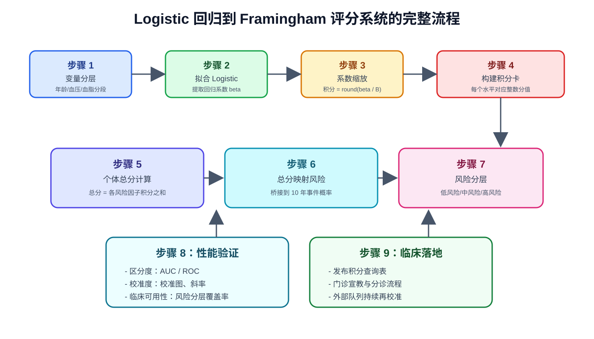

```{r setup, include=FALSE}
knitr::opts_chunk$set(
  echo = TRUE,
  warning = FALSE,
  message = FALSE,
  fig.width = 8,
  fig.height = 5,
  fig.retina = 2,
  out.width = "100%",
  dpi = 150,
  fig.align = 'center'
)
set.seed(2026)
```

## 方法背景与适用场景

### 为什么要做“回归系数 -> 积分系统”？

在临床预测模型中，Logistic 回归非常常见，但它的直接输出是回归系数和对数几率，临床端往往不便于快速手工应用。

**Framingham 评分系统**的核心价值，是把“统计模型”转成“可操作规则”：

- 回归系数变成整数分值（points）
- 每位患者可得到总分（total points）
- 总分映射成 10 年风险概率
- 风险概率再映射成低/中/高风险等级

这套流程特别适合：门诊初筛、基层随访、无法即时调用电子计算器的场景。

### 生活化理解

可以把 Logistic 回归理解成“精密电子秤”，非常准确，但不方便随身携带；
Framingham 积分卡更像“带刻度的便携弹簧秤”，精度略降，但部署和解释效率大幅提升。

### 典型应用场景

| 场景 | 是否推荐积分化 | 原因 |
|---|---|---|
| 社区慢病筛查 | ✅ 推荐 | 需要快速分层，解释清晰 |
| 多中心随访管理 | ✅ 推荐 | 便于统一执行标准 |
| 高精度个体化风险预测 | ⚠️ 视情况 | 可保留原始模型作为主预测器 |
| 自动化 EHR 实时预测 | ❌ 可不做 | 直接调用模型概率更方便 |

### 方法流程图



**图意说明**：从变量分层、模型拟合、系数缩放、积分汇总，到风险映射和性能验证，构成完整闭环。

**读图结论**：积分法不是替代建模，而是对建模结果做“可部署化改造”。

---

## 数据与变量准备

本教程使用模拟队列演示，目标结局为 **10 年 CVD 事件**（0/1）。

```{r packages}
library(tidyverse)
library(broom)
library(gtsummary)
library(pROC)
library(gt)
library(scales)
```

### 构建模拟队列

```{r simulate-data}
n <- 3200

raw_data <- tibble(
  id = 1:n,
  age = round(rnorm(n, mean = 56, sd = 9)),
  sex = factor(sample(c("女", "男"), n, replace = TRUE, prob = c(0.47, 0.53))),
  sbp = round(rnorm(n, mean = 132, sd = 18)),
  tc = round(rnorm(n, mean = 205, sd = 36)),
  hdl = round(rnorm(n, mean = 50, sd = 12)),
  smoker = factor(sample(c("否", "是"), n, replace = TRUE, prob = c(0.68, 0.32))),
  diabetes = factor(sample(c("否", "是"), n, replace = TRUE, prob = c(0.80, 0.20)))
) |>
  mutate(
    lp_true = -9.4 +
      0.060 * age +
      0.018 * sbp +
      0.006 * tc -
      0.022 * hdl +
      0.58 * (sex == "男") +
      0.72 * (smoker == "是") +
      0.84 * (diabetes == "是"),
    risk_10y = plogis(lp_true),
    cvd_10y = rbinom(n, 1, risk_10y)
  ) |>
  select(-lp_true, -risk_10y)

raw_data |>
  summarise(
    样本量 = n(),
    事件数 = sum(cvd_10y),
    事件率 = percent(mean(cvd_10y), accuracy = 0.1)
  )
```

### 变量分层（用于积分卡）

Framingham 风格积分通常基于**分层变量**而不是连续变量原值。

```{r categorize-variables}
analysis_data <- raw_data |>
  mutate(
    age_grp = cut(
      age,
      breaks = c(-Inf, 44, 49, 54, 59, 64, 69, Inf),
      labels = c("<45", "45-49", "50-54", "55-59", "60-64", "65-69", "70+"),
      right = TRUE
    ),
    sbp_grp = cut(
      sbp,
      breaks = c(-Inf, 119, 129, 139, 159, Inf),
      labels = c("<120", "120-129", "130-139", "140-159", "160+"),
      right = TRUE
    ),
    tc_grp = cut(
      tc,
      breaks = c(-Inf, 159, 199, 239, 279, Inf),
      labels = c("<160", "160-199", "200-239", "240-279", "280+"),
      right = TRUE
    ),
    hdl_grp = cut(
      hdl,
      breaks = c(-Inf, 39, 49, 59, Inf),
      labels = c("<40", "40-49", "50-59", "60+"),
      right = TRUE
    ),
    age_grp = fct_relevel(age_grp, "<45"),
    sbp_grp = fct_relevel(sbp_grp, "<120"),
    tc_grp = fct_relevel(tc_grp, "<160"),
    hdl_grp = fct_relevel(hdl_grp, "60+"),
    smoker = fct_relevel(smoker, "否"),
    diabetes = fct_relevel(diabetes, "否"),
    sex = fct_relevel(sex, "女")
  )

analysis_data |>
  select(age_grp, sbp_grp, tc_grp, hdl_grp, smoker, diabetes, sex, cvd_10y) |>
  tbl_summary(
    by = cvd_10y,
    statistic = list(
      all_categorical() ~ "{n} ({p}%)"
    ),
    label = list(
      age_grp ~ "年龄分层",
      sbp_grp ~ "收缩压分层",
      tc_grp ~ "总胆固醇分层",
      hdl_grp ~ "HDL 分层",
      smoker ~ "吸烟",
      diabetes ~ "糖尿病",
      sex ~ "性别"
    )
  ) |>
  add_p()
```

---

## 第 1 步：拟合 Logistic 回归模型

```{r fit-logistic}
fit_logit <- glm(
  cvd_10y ~ age_grp + sbp_grp + tc_grp + hdl_grp + smoker + diabetes + sex,
  data = analysis_data,
  family = binomial(link = "logit")
)

fit_logit |>
  tbl_regression(
    exponentiate = TRUE,
    label = list(
      age_grp ~ "年龄",
      sbp_grp ~ "收缩压",
      tc_grp ~ "总胆固醇",
      hdl_grp ~ "HDL",
      smoker ~ "吸烟",
      diabetes ~ "糖尿病",
      sex ~ "性别"
    )
  ) |>
  bold_p()
```

**解读要点**：

- OR > 1 表示风险增加，OR < 1 表示保护作用
- 这里的估计值是后续“积分化”的原始材料

---

## 第 2 步：把回归系数转换为积分

### 2.1 提取系数并设定“积分基准单位”

Framingham 风格积分常设定一个“基准系数 B”，再用 `积分 = round(beta / B)` 进行缩放。

本例中我们取一个**临床可解释且稳定**的单位：

- `B = log(1.25)`
- 含义：大约对应每增加一个“中等强度风险单位”给 1 分

```{r extract-coefs}
coef_tbl <- tidy(fit_logit, conf.int = TRUE) |>
  filter(term != "(Intercept)") |>
  mutate(
    variable = case_when(
      str_detect(term, "^age_grp") ~ "age_grp",
      str_detect(term, "^sbp_grp") ~ "sbp_grp",
      str_detect(term, "^tc_grp") ~ "tc_grp",
      str_detect(term, "^hdl_grp") ~ "hdl_grp",
      str_detect(term, "^smoker") ~ "smoker",
      str_detect(term, "^diabetes") ~ "diabetes",
      str_detect(term, "^sex") ~ "sex",
      TRUE ~ "other"
    ),
    level = case_when(
      variable == "age_grp" ~ str_remove(term, "^age_grp"),
      variable == "sbp_grp" ~ str_remove(term, "^sbp_grp"),
      variable == "tc_grp" ~ str_remove(term, "^tc_grp"),
      variable == "hdl_grp" ~ str_remove(term, "^hdl_grp"),
      variable == "smoker" ~ str_remove(term, "^smoker"),
      variable == "diabetes" ~ str_remove(term, "^diabetes"),
      variable == "sex" ~ str_remove(term, "^sex"),
      TRUE ~ term
    )
  )

B_unit <- log(1.25)

coef_tbl |>
  select(term, estimate, conf.low, conf.high) |>
  arrange(desc(abs(estimate)))
```

### 2.2 构建完整积分卡（含参照组）

```{r build-score-card}
age_levels <- levels(analysis_data$age_grp)
sbp_levels <- levels(analysis_data$sbp_grp)
tc_levels <- levels(analysis_data$tc_grp)
hdl_levels <- levels(analysis_data$hdl_grp)
smoker_levels <- levels(analysis_data$smoker)
diabetes_levels <- levels(analysis_data$diabetes)
sex_levels <- levels(analysis_data$sex)

score_template <- tibble(
  var = c("age_grp", "sbp_grp", "tc_grp", "hdl_grp", "smoker", "diabetes", "sex"),
  var_cn = c("年龄(岁)", "收缩压(mmHg)", "总胆固醇(mg/dL)", "HDL(mg/dL)", "吸烟", "糖尿病", "性别"),
  levels = list(age_levels, sbp_levels, tc_levels, hdl_levels, smoker_levels, diabetes_levels, sex_levels)
)

score_card <- score_template |>
  mutate(rows = pmap(
    list(var, var_cn, levels),
    function(v, v_cn, lv) {
      tibble(
        var = v,
        变量 = v_cn,
        水平 = lv,
        term = if_else(
          lv == lv[1],
          "(Reference)",
          paste0(v, lv)
        )
      )
    }
  )) |>
  select(rows) |>
  unnest(rows) |>
  left_join(
    coef_tbl |>
      transmute(term, beta = estimate),
    by = "term"
  ) |>
  mutate(
    beta = replace_na(beta, 0),
    积分 = round(beta / B_unit),
    OR = exp(beta)
  )

score_card |>
  select(变量, 水平, beta, OR, 积分) |>
  mutate(
    beta = round(beta, 3),
    OR = round(OR, 2)
  ) |>
  gt(groupname_col = "变量") |>
  tab_header(title = "Framingham 风格积分卡（由 Logistic 回归系数转换）") |>
  cols_label(
    水平 = "水平",
    beta = "回归系数(beta)",
    OR = "OR",
    积分 = "积分"
  ) |>
  tab_options(
    table.font.size = px(14),
    data_row.padding = px(8)
  )
```

**解读建议**：

- 积分为负值通常来自保护性水平（如更高 HDL）
- 分值高不代表“必然发病”，仅表示相对风险更高

---

## 第 3 步：计算个体总分并映射风险

### 3.1 给每位受试者打分

```{r individual-scoring}
age_points <- score_card |>
  filter(var == "age_grp") |>
  select(level = 水平, age_points = 积分)

sbp_points <- score_card |>
  filter(var == "sbp_grp") |>
  select(level = 水平, sbp_points = 积分)

tc_points <- score_card |>
  filter(var == "tc_grp") |>
  select(level = 水平, tc_points = 积分)

hdl_points <- score_card |>
  filter(var == "hdl_grp") |>
  select(level = 水平, hdl_points = 积分)

smoker_points <- score_card |>
  filter(var == "smoker") |>
  select(level = 水平, smoker_points = 积分)

diabetes_points <- score_card |>
  filter(var == "diabetes") |>
  select(level = 水平, diabetes_points = 积分)

sex_points <- score_card |>
  filter(var == "sex") |>
  select(level = 水平, sex_points = 积分)

scored_data <- analysis_data |>
  left_join(age_points, by = c("age_grp" = "level")) |>
  left_join(sbp_points, by = c("sbp_grp" = "level")) |>
  left_join(tc_points, by = c("tc_grp" = "level")) |>
  left_join(hdl_points, by = c("hdl_grp" = "level")) |>
  left_join(smoker_points, by = c("smoker" = "level")) |>
  left_join(diabetes_points, by = c("diabetes" = "level")) |>
  left_join(sex_points, by = c("sex" = "level")) |>
  mutate(
    across(ends_with("_points"), ~ replace_na(.x, 0L)),
    total_points = age_points + sbp_points + tc_points + hdl_points +
      smoker_points + diabetes_points + sex_points
  )

scored_data |>
  summarise(
    最小总分 = min(total_points),
    中位数总分 = median(total_points),
    最大总分 = max(total_points)
  )
```

### 3.2 总分到风险概率的桥接

常见做法是用线性桥接把“总分”近似映射回 logit 概率空间。

```{r points-to-risk}
scored_data <- scored_data |>
  mutate(
    lp_model = predict(fit_logit, type = "link"),
    prob_model = plogis(lp_model)
  )

bridge_fit <- lm(lp_model ~ total_points, data = scored_data)

scored_data <- scored_data |>
  mutate(
    lp_points = predict(bridge_fit, newdata = tibble(total_points = total_points)),
    prob_points = plogis(lp_points),
    risk_group = cut(
      prob_points,
      breaks = c(-Inf, 0.10, 0.20, Inf),
      labels = c("低风险(<10%)", "中风险(10%-20%)", "高风险(>20%)"),
      right = FALSE
    )
  )

risk_lookup <- scored_data |>
  group_by(total_points) |>
  summarise(
    预测风险 = mean(prob_points),
    样本数 = n(),
    .groups = "drop"
  ) |>
  mutate(
    `10年风险` = percent(预测风险, accuracy = 0.1)
  )

risk_lookup |>
  arrange(total_points)
```

### 3.3 临床分层结果

```{r risk-stratification}
scored_data |>
  count(risk_group) |>
  mutate(
    比例 = percent(n / sum(n), accuracy = 0.1)
  ) |>
  arrange(risk_group)
```

---

## 第 4 步：可视化积分系统

### 4.1 总分分布

```{r plot-score-distribution}
ggplot(scored_data, aes(x = total_points, fill = risk_group)) +
  geom_histogram(binwidth = 1, alpha = 0.85, color = "white") +
  scale_fill_brewer(palette = "RdYlBu", direction = -1) +
  labs(
    title = "总分分布与风险分层",
    x = "Framingham 风格总分",
    y = "人数",
    fill = "风险层级"
  ) +
  theme_minimal(base_size = 12) +
  theme(
    legend.position = "bottom",
    plot.title = element_text(face = "bold")
  )
```

**图意说明**：该图展示不同总分对应的人群规模与风险层级构成。

**读图结论**：总分升高后，高风险人群占比上升，说明积分系统具备分层梯度。

### 4.2 “总分-事件率”关系图

```{r plot-points-vs-observed-risk}
obs_curve <- scored_data |>
  group_by(total_points) |>
  summarise(
    observed_risk = mean(cvd_10y),
    predicted_risk = mean(prob_points),
    n = n(),
    .groups = "drop"
  ) |>
  filter(n >= 20)

ggplot(obs_curve, aes(x = total_points)) +
  geom_line(aes(y = observed_risk, color = "观察事件率"), linewidth = 1.1) +
  geom_point(aes(y = observed_risk, color = "观察事件率"), size = 2) +
  geom_line(aes(y = predicted_risk, color = "积分预测风险"), linewidth = 1.1, linetype = 2) +
  scale_y_continuous(labels = percent_format(accuracy = 1)) +
  scale_color_manual(values = c("观察事件率" = "#dc2626", "积分预测风险" = "#2563eb")) +
  labs(
    title = "总分与风险的单调关系",
    x = "总分",
    y = "10年风险",
    color = "曲线"
  ) +
  theme_minimal(base_size = 12) +
  theme(
    legend.position = "bottom",
    plot.title = element_text(face = "bold")
  )
```

**图意说明**：同一总分段内对比“观察事件率”和“积分预测风险”。

**读图结论**：两条曲线整体同向且接近，说明积分映射没有破坏主要风险趋势。

---

## 第 5 步：性能评估（区分度与校准）

### 5.1 区分度：AUC 对比

```{r auc-comparison}
roc_model <- roc(scored_data$cvd_10y, scored_data$prob_model, quiet = TRUE)
roc_points <- roc(scored_data$cvd_10y, scored_data$prob_points, quiet = TRUE)

auc_tbl <- tibble(
  模型 = c("原始 Logistic", "积分近似模型"),
  AUC = c(as.numeric(auc(roc_model)), as.numeric(auc(roc_points)))
) |>
  mutate(AUC = round(AUC, 3))

auc_tbl
```

```{r plot-roc}
plot(
  roc_model,
  col = "#1d4ed8",
  lwd = 2.6,
  main = "ROC 曲线：原始模型 vs 积分近似模型",
  legacy.axes = TRUE
)
plot(roc_points, col = "#dc2626", lwd = 2.6, add = TRUE)
abline(0, 1, lty = 2, col = "#6b7280")
legend(
  "bottomright",
  legend = c(
    paste0("原始 Logistic (AUC=", round(as.numeric(auc(roc_model)), 3), ")"),
    paste0("积分近似模型 (AUC=", round(as.numeric(auc(roc_points)), 3), ")")
  ),
  col = c("#1d4ed8", "#dc2626"),
  lwd = 2.6,
  bty = "n"
)
```

**图意说明**：对比原始概率与积分近似概率的 ROC 曲线和 AUC。

**读图结论**：若 AUC 差值较小（如 <0.02），通常说明积分化在区分度上的损失可接受。

### 5.2 校准度：十分位校准图

```{r calibration-data}
calib_df <- scored_data |>
  mutate(decile = ntile(prob_points, 10)) |>
  group_by(decile) |>
  summarise(
    pred = mean(prob_points),
    obs = mean(cvd_10y),
    n = n(),
    .groups = "drop"
  )

calib_df
```

```{r plot-calibration}
ggplot(calib_df, aes(x = pred, y = obs)) +
  geom_point(size = 2.8, color = "#0f766e") +
  geom_line(color = "#0f766e", linewidth = 1) +
  geom_abline(slope = 1, intercept = 0, linetype = 2, color = "#374151") +
  scale_x_continuous(labels = percent_format(accuracy = 1)) +
  scale_y_continuous(labels = percent_format(accuracy = 1)) +
  labs(
    title = "积分系统校准图（十分位）",
    x = "平均预测风险",
    y = "观察事件率"
  ) +
  theme_minimal(base_size = 12) +
  theme(plot.title = element_text(face = "bold"))
```

**图意说明**：横轴为预测风险，纵轴为实际事件率，虚线为理想校准线。

**读图结论**：点越贴近 45 度线，校准越好；若高风险端系统偏离，需重校准。

---

## 第 6 步：生成可落地的“评分查询表”

### 6.1 总分到风险的实用映射表

```{r risk-table}
score_risk_table <- scored_data |>
  group_by(total_points) |>
  summarise(
    `10年风险` = mean(prob_points),
    样本数 = n(),
    .groups = "drop"
  ) |>
  mutate(
    风险百分比 = percent(`10年风险`, accuracy = 0.1),
    风险等级 = case_when(
      `10年风险` < 0.10 ~ "低风险",
      `10年风险` < 0.20 ~ "中风险",
      TRUE ~ "高风险"
    )
  ) |>
  filter(样本数 >= 10) |>
  select(总分 = total_points, 风险百分比, 风险等级, 样本数)

score_risk_table |>
  gt() |>
  tab_header(title = "临床使用表：总分对应 10 年风险") |>
  tab_options(
    table.font.size = px(14),
    data_row.padding = px(8)
  )
```

### 6.2 个体化演示

```{r individual-example}
new_patient <- tibble(
  age_grp = factor("60-64", levels = levels(analysis_data$age_grp)),
  sbp_grp = factor("140-159", levels = levels(analysis_data$sbp_grp)),
  tc_grp = factor("200-239", levels = levels(analysis_data$tc_grp)),
  hdl_grp = factor("40-49", levels = levels(analysis_data$hdl_grp)),
  smoker = factor("是", levels = levels(analysis_data$smoker)),
  diabetes = factor("否", levels = levels(analysis_data$diabetes)),
  sex = factor("男", levels = levels(analysis_data$sex))
)

new_scored <- new_patient |>
  left_join(age_points, by = c("age_grp" = "level")) |>
  left_join(sbp_points, by = c("sbp_grp" = "level")) |>
  left_join(tc_points, by = c("tc_grp" = "level")) |>
  left_join(hdl_points, by = c("hdl_grp" = "level")) |>
  left_join(smoker_points, by = c("smoker" = "level")) |>
  left_join(diabetes_points, by = c("diabetes" = "level")) |>
  left_join(sex_points, by = c("sex" = "level")) |>
  mutate(
    across(ends_with("_points"), ~ replace_na(.x, 0L)),
    total_points = age_points + sbp_points + tc_points + hdl_points +
      smoker_points + diabetes_points + sex_points,
    lp_points = predict(bridge_fit, newdata = tibble(total_points = total_points)),
    risk_10y = plogis(lp_points),
    risk_group = case_when(
      risk_10y < 0.10 ~ "低风险",
      risk_10y < 0.20 ~ "中风险",
      TRUE ~ "高风险"
    )
  )

new_scored |>
  select(age_grp, sbp_grp, tc_grp, hdl_grp, smoker, diabetes, sex, total_points, risk_10y, risk_group) |>
  mutate(
    risk_10y = percent(risk_10y, accuracy = 0.1)
  )
```

---

## 方法学注意事项与常见误区

### 1) 积分化会损失信息

连续变量分层后，模型可解释性上升，但预测精度通常略降，这是正常现象。

### 2) 变量分层边界应有临床依据

不要仅按分位数机械切分。优先采用指南阈值（如血压、血脂临床分层）。

### 3) 不同人群需要重校准

若目标人群基线风险与建模人群明显不同，必须重新估计截距或重新桥接。

### 4) 评分系统必须报告验证结果

至少给出：

- 区分度（AUC/C-index）
- 校准度（校准图、校准斜率）
- 风险分层后的临床可用性

---

## 与原始 Logistic 模型如何协同使用

推荐双轨策略：

- **科研论文/电子系统**：保留原始 Logistic 概率
- **临床宣教/手工分诊**：使用积分卡与风险等级

当两者预测冲突时，优先检查：

1. 是否存在边界分层导致的信息损失
2. 是否在外部人群上发生校准漂移
3. 是否需要引入再分类指标（NRI/IDI）

---

## 小结

本教程完整演示了“Logistic 回归后应用 Framingham 评分系统”的关键路径：

1. 用分层变量建立可解释 Logistic 模型
2. 通过 `beta / B` 把系数转换为整数积分
3. 计算个体总分并映射到 10 年风险
4. 用 ROC 和校准图验证积分系统性能
5. 产出可直接部署的总分-风险查询表

如果你在真实队列中应用，建议进一步增加：

- Bootstrap 内部验证
- 外部队列验证
- 再校准（intercept/slope）

---

## 参考文献

1. Wilson PWF, D'Agostino RB, Levy D, et al. Prediction of coronary heart disease using risk factor categories. *Circulation*. 1998;97(18):1837-1847.
2. D'Agostino RB, Vasan RS, Pencina MJ, et al. General cardiovascular risk profile for use in primary care. *Circulation*. 2008;117(6):743-753.
3. Harrell FE. *Regression Modeling Strategies*. 2nd ed. Springer; 2015.
4. Steyerberg EW. *Clinical Prediction Models*. 2nd ed. Springer; 2019.
