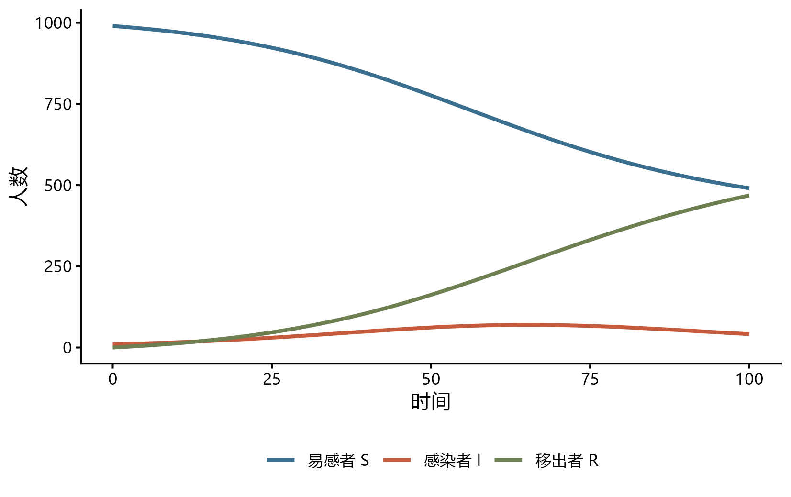
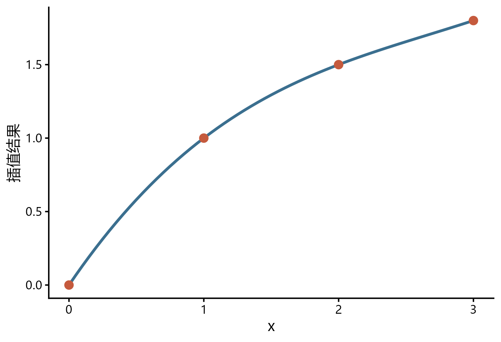

## 包的定位与当前版本

`mathmodels` 是《数学建模：算法与编程实现》的配套 R 包，目标是把数学建模中反复出现的预处理、评价、预测、常微分方程、插值和曲线拟合流程封装为一致的函数接口。它不是用一个函数自动完成整道建模题，而是减少公式到可复现代码之间的重复实现。

截至 2026-07-31，GitHub 主分支的版本为 **0.0.11**，`NAMESPACE` 声明 **111 个导出函数**。官方 README 将功能组织为评价模型、预测模型、微分方程模型、插值与曲线拟合等模块，并提供与 `dplyr`、`purrr` 和 `ggplot2` 衔接的返回对象。该版本仍以 GitHub 为主要发布渠道，安装前应核对仓库的 `DESCRIPTION`、版本和更新记录，而不是假定 CRAN 已有同名包。

## 安装与版本核对

```r
install.packages("remotes")
remotes::install_github("zhjx19/mathmodels")

library(mathmodels)
packageVersion("mathmodels")
length(getNamespaceExports("mathmodels"))
```

GitHub 安装会同时解析 `forecast`、`deSolve`、`minpack.lm`、`lpSolveAPI`、`car`、`lmtest` 等依赖。正式竞赛或项目应提前安装并锁定版本，不要在提交前临时更新。包采用 AGPL-3.0 或更高版本许可证，分发修改版或把它纳入服务前应阅读许可证条款。

查看帮助和在线手册：

```r
help(package = "mathmodels")
?mathmodels::topsis
?mathmodels::model_sir
?mathmodels::interp_spline
```

## 四类算法总览

| 模块 | 代表函数 | 典型问题 | 输出核验重点 |
|---|---|---|---|
| 综合评价 | `AHP()`、`entropy_weight()`、`critic_weight()`、`topsis()`、`fuzzy_eval()`、`basic_DEA()` | 多指标排序、赋权、效率评价 | 指标方向、无量纲化、权重和敏感性 |
| 预测模型 | `GM11()`、`markov_chain()`、`reg_lm()`、`ts_sarima()`、`ts_forecast()` | 灰色预测、回归、时间序列 | 训练与验证划分、残差、外推范围 |
| 微分方程 | `ode_solver()`、`model_sir()`、`model_seir()`、`model_lv()` | 传播过程、人口增长、捕食者与猎物 | 参数单位、初值、守恒关系、数值稳定性 |
| 插值与拟合 | `interp_linear()`、`interp_spline()`、`interp_hermite()`、`curve_fit()`、`growth_fit()` | 缺少中间观测、经验曲线拟合 | 插值与外推的区分、边界行为、残差 |

包还包含不平等指标、区域经济指标、耦合协调度、障碍度、时间序列数据结构及绘图辅助函数。函数数量多并不意味着每个模型都适用于当前问题；选择仍应由数据生成机制、目标量和假设决定。

## 综合评价工作流

### 指标方向、赋权与 TOPSIS

下面有 4 个候选方案，收益和可靠性为正向指标，成本为负向指标。先用熵权法计算数据驱动权重，再用 TOPSIS 得分排序。

```r
library(dplyr)
library(mathmodels)

方案 <- tibble(
  方案 = LETTERS[1:4],
  收益 = c(80, 75, 90, 85),
  成本 = c(12, 10, 15, 11),
  可靠性 = c(0.91, 0.88, 0.94, 0.90)
)

指标方向 <- c("+", "-", "+")

熵权结果 <- entropy_weight(
  方案 |> select(-方案),
  index = 指标方向
)

评价结果 <- 方案 |>
  mutate(
    TOPSIS得分 = topsis(
      方案 |> select(-方案),
      w = 熵权结果$w,
      index = 指标方向
    )
  ) |>
  arrange(desc(TOPSIS得分))

熵权结果$w
评价结果
```

这段代码的关键不是函数调用，而是 `index` 的科学含义。成本通常是负向指标，但 pH、温度或剂量等变量可能是区间最优或中间型指标，不能一律写成正向或负向。`rescale_middle()`、`rescale_interval()` 可处理对应结构，但阈值必须来自题意或可核验依据。

### 权重不是“客观真值”

熵权、CRITIC 和 PCA 赋权都从样本分布提取信息。它们反映变异、冲突或主成分结构，不自动等于指标的实质重要性。建议至少比较：

- 等权、主观权重与一种数据驱动权重；
- 不同无量纲化方法；
- 删除单个指标后的排序变化；
- 权重扰动对前几名方案的影响。

若排序对很小的权重变化就反转，应报告不稳定性，而不是只保留某个“最好看”的权重方案。

## 预测模型工作流

### 回归预测

`reg_lm()`、`reg_logistic()`、`reg_poisson()` 和 `reg_negbin()` 提供统一的回归接口，`reg_predict()` 和 `reg_diagnostics()` 用于预测与诊断。

```r
library(mathmodels)

fit <- reg_lm(mpg ~ wt + hp + am, data = mtcars)
reg_diagnostics(fit)

new_cars <- data.frame(
  wt = c(2.5, 3.0),
  hp = c(110, 150),
  am = c(1, 0)
)

reg_predict(fit, n_new = 2)

# 对明确指定的新数据，使用封装结果中的底层 lm 对象
predict(
  fit$model,
  newdata = new_cars,
  interval = "prediction"
)
```

`reg_predict()` 0.0.11 的 `n_new` 会根据原模型输入生成用于演示的新观测，并返回预测与区间；它没有 `newdata` 参数。若需要预测业务上明确给出的样本，应像上面一样调用 `fit$model` 的标准 `predict()`。教程必须以实际函数签名为准，不能因为包提供了统一接口就猜测它与其他预测函数具有相同参数。

自动逐步选择只能视为候选流程，不能替代理论变量选择、外部验证和过拟合控制。竞赛中也应保留训练/验证划分、误差指标和基线模型，避免用同一数据既选择模型又宣称泛化性能。

### 时间序列

`mathmodels` 使用 `ts_df` 统一时间序列处理。基本顺序是转换、补齐时间索引、变换、检验、拟合、预测和残差诊断。

```r
library(mathmodels)

passengers <- as_ts_df(log(AirPassengers))
fit_ts <- ts_sarima(passengers)
forecast_ts <- ts_forecast(fit_ts, h = 12)

plot_ts_forecast(passengers, forecast_ts)
plot_ts_residuals(fit_ts)
```

缺口填补、对数或 Box-Cox 变换、差分次数以及预测区间都应在正文中说明。时间序列的随机拆分会破坏时间顺序，验证应采用滚动起点、留后验证或与任务一致的回测。

### 灰色与 Markov 模型

`GM11()`、`GM1N()`、`DGM21()`、`verhulst()`、`markov_chain()` 和 `GM11_markov()` 覆盖常见灰色和状态转移方法。样本少不等于灰色模型必然合适。序列应满足方法需要的可比性和规律性，并检查级比、残差和后验误差；Markov 转移还需说明状态划分是否稳定、齐次假设是否合理。

## 微分方程模型

### SIR 模型

```r
library(mathmodels)

sir_result <- model_sir(
  init = c(S = 990, I = 10, R = 0),
  params = c(beta = 0.15, gamma = 0.10),
  times = seq(0, 100, by = 0.5)
)

plot_compartments(sir_result, compartments = c("S", "I", "R"))

sir_metrics <- epi_metrics(
  sir_result,
  beta = 0.15,
  gamma = 0.10,
  N = 1000
)

sir_metrics$R0
```

下图由上述 `model_sir()` 结果实际计算后绘制，展示同一组参数下三个舱室随时间的变化。它只能说明方程与参数共同决定的动态轨迹，不能当作现实疫情预测。图件生成脚本保存在 [`examples/generate-mathmodels-figures.R`](examples/generate-mathmodels-figures.R)，便于核对包版本和输入。

{fig-alt="SIR 模型曲线：易感者随时间下降，感染者先上升后下降，移出者逐渐增加。"}

SIR 示例展示的是给定参数下的数值解，不是对真实流行病的自动估计。`beta` 和 `gamma` 的时间单位必须与 `times` 一致，初始人数应与总人口定义一致。把模型用于预测时还需说明参数来源、观测过程、识别性和不确定性。

### 自定义常微分方程

`ode_solver()` 接受字符串形式的方程，适合快速搭建自定义系统。方程、状态名和参数名必须完全一致。

```r
library(mathmodels)

logistic_result <- ode_solver(
  init = c(N = 10),
  equations = c(N = "r * N * (1 - N / K)"),
  params = c(r = 0.35, K = 500),
  times = seq(0, 30, by = 0.2)
)

head(logistic_result)
```

遇到刚性方程、多尺度系统或事件触发过程时，应进一步核对 `deSolve` 求解器、容差和步长。数值求解成功只说明算法返回结果，不说明模型结构正确。

## 插值与曲线拟合

### 三次样条插值

```r
library(mathmodels)

observed_x <- c(0, 1, 2, 3)
observed_y <- c(0, 1, 1.5, 1.8)

interp_result <- interp_spline(
  x = observed_x,
  y = observed_y,
  xout = seq(0, 3, by = 0.5)
)

interp_result
```

{fig-alt="四个观测节点及其范围内的平滑三次样条插值曲线。"}

插值用于观测范围内的中间位置，外推用于观测范围之外，两者风险不同。高次多项式可能在边界剧烈振荡；样条通常更平滑，但也不保证单调或符合物理约束。若变量必须非负、单调或守恒，应选择满足约束的模型并检查全区间行为。

### 非线性增长曲线

`growth_fit()` 支持 Logistic、Gompertz 等增长模型并可生成起始值。自动起始值提高易用性，但非线性拟合仍可能受初值、参数相关性和局部最优影响。报告时应给出参数含义、置信区间、残差和外推范围，而不只展示一条平滑曲线。

## 与 tidyverse 结合批量建模

包的优势之一是许多函数接收数据框并返回向量、tibble 或标准模型对象，可与 `nest()` 和 `map()` 组合。以下结构按年份分别计算耦合协调度。

```r
library(tidyverse)
library(mathmodels)

分年结果 <- 子系统得分 |>
  nest(.by = 年份) |>
  mutate(
    model = map(
      data,
      \(d) coupling_degree(d, id_cols = "地区")
    )
  ) |>
  select(-data) |>
  unnest(model)
```

批量调用前应先用一个分组验证列名、指标方向、缺失处理和返回结构。若某个分组数据不足或退化，不能用 `tryCatch()` 静默跳过；应记录失败分组及其对结论的影响。

## 模型选择与核验

面对题目时，可以按以下顺序缩小函数范围：

1. 写清输出是排序、预测、动态过程还是缺失位置的函数值；
2. 确认数据是横截面、时间序列、面板、状态转移还是连续动力系统；
3. 列出单位、指标方向、约束、时间尺度和评价指标；
4. 先建立可解释的基线方法，再调用更复杂函数；
5. 用留出数据、回测、残差、守恒关系或敏感性分析验证；
6. 把函数、参数、包版本和随机种子写入复现记录。

“函数能运行”只验证了接口。“模型可用”还需要目标量一致、假设合理、输入有源、输出通过领域检查。

## 常见问题

| 问题 | 原因 | 处理 |
|---|---|---|
| `install.packages("mathmodels")` 找不到包 | 当前版本主要从 GitHub 发布 | 使用官方仓库安装并锁定提交或版本 |
| TOPSIS 排名与直觉相反 | 指标方向、权重或归一化设定错误 | 逐列核对 `index` 和中间结果 |
| 灰色预测拟合很好但外推差 | 小样本内拟合不能证明稳定趋势 | 留后回测并与朴素基线比较 |
| SIR 曲线异常 | 参数时间单位、初值或总人口不一致 | 检查单位和 (S+I+R) 的变化 |
| 高次插值边界振荡 | 多项式阶数过高或节点分布不佳 | 改用分段线性、样条或约束方法 |
| 批量建模丢失分组 | 分组数据不足或错误被静默处理 | 汇总每组状态并保留失败信息 |

## 官方资源

- [`mathmodels` GitHub 仓库](https://github.com/zhjx19/mathmodels)
- [`mathmodels` 在线函数文档](https://zhjx19.github.io/mathmodels/)
- [《mathmodels 包使用手册》](https://zhjx19.github.io/mathmodels-book/)
- [GitHub `NAMESPACE`：导出函数单源](https://github.com/zhjx19/mathmodels/blob/main/NAMESPACE)
- [GitHub `NEWS.md`：版本变化](https://github.com/zhjx19/mathmodels/blob/main/NEWS.md)
