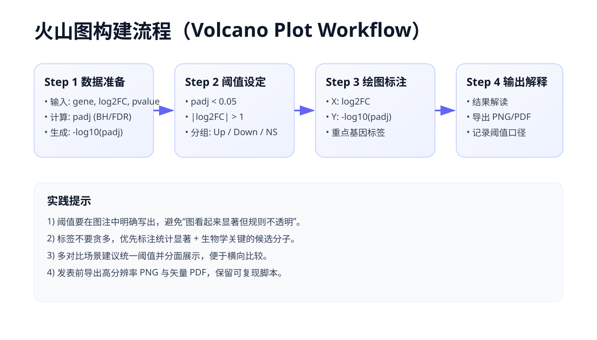

```{r setup, include=FALSE}
knitr::opts_chunk$set(
  echo = TRUE,
  warning = FALSE,
  message = FALSE,
  fig.width = 9,
  fig.height = 6,
  dpi = 150
)
```

## 图表用途与场景

火山图（Volcano Plot）是差异分析中最常见的可视化之一，核心目标是同时展示：

- 效应量大小（通常是 `log2FC`）
- 统计显著性（通常是 `-log10(p)` 或 `-log10(padj)`）

它非常适合以下场景：

- 转录组差异表达基因筛选
- 蛋白组或代谢组差异分子筛选
- 多组学中候选标志物优先级排序
- 方法学报告中的显著结果概览

火山图最大的价值是把“变化幅度”和“统计证据”放进同一张图中。相比只看 p 值表格，火山图更直观；相比只看 fold change，火山图能避免“变化大但不稳定”的误判。

---

## 火山图原理速览



上图对应的实务流程可以概括为四步：

1. 准备差异分析结果表
2. 设定显著性与效应阈值
3. 对点进行分组着色
4. 标注重点基因并输出图形

### 常见坐标定义

| 轴 | 常见变量 | 含义 |
|---|---|---|
| X 轴 | `log2FC` | 组间变化方向与幅度 |
| Y 轴 | `-log10(pvalue)` 或 `-log10(padj)` | 统计证据强弱 |

### 阈值常见选项

| 指标 | 常见阈值 | 说明 |
|---|---|---|
| `padj` | `< 0.05` | 控制多重比较后的错误发现率 |
| `|log2FC|` | `> 0.58`、`> 1` | 分别对应 1.5 倍与 2 倍变化 |

阈值并不是固定模板，应该根据数据量、噪声水平和研究目标调整。

---

## 数据准备

下面用可复现模拟数据演示完整流程。实际项目中，你只需要把这部分替换成自己的差异分析结果表。

```{r data-prep}
library(dplyr)
library(ggplot2)

set.seed(2026)

n_gene <- 3500

volcano_df <- tibble::tibble(
  gene = paste0("Gene_", sprintf("%04d", 1:n_gene)),
  log2FC = rnorm(n_gene, mean = 0, sd = 1.15),
  pvalue = runif(n_gene, min = 1e-6, max = 1)
) %>%
  mutate(
    padj = p.adjust(pvalue, method = "BH"),
    neg_log10_padj = -log10(padj)
  )

dplyr::glimpse(volcano_df)
```

### 设定阈值并分组

```{r threshold-group}
fc_cutoff <- 1
padj_cutoff <- 0.05

volcano_df <- volcano_df %>%
  mutate(
    regulation = case_when(
      padj < padj_cutoff & log2FC >= fc_cutoff ~ "Up",
      padj < padj_cutoff & log2FC <= -fc_cutoff ~ "Down",
      TRUE ~ "NS"
    ),
    regulation = factor(regulation, levels = c("Up", "Down", "NS"))
  )

volcano_df %>%
  count(regulation)
```

这一步非常关键：**先定义规则，再上色**，能避免“颜色很漂亮但统计意义不清晰”的问题。

---

## 示例一：基础火山图

```{r volcano-basic}
p_basic <- ggplot(volcano_df, aes(x = log2FC, y = neg_log10_padj)) +
  geom_point(aes(color = regulation), alpha = 0.65, size = 1.6) +
  geom_vline(xintercept = c(-fc_cutoff, fc_cutoff), linetype = "dashed", linewidth = 0.7) +
  geom_hline(yintercept = -log10(padj_cutoff), linetype = "dashed", linewidth = 0.7) +
  scale_color_manual(values = c(Up = "#D55E00", Down = "#0072B2", NS = "#8A8A8A")) +
  labs(
    title = "火山图：基础版",
    subtitle = "阈值：|log2FC| > 1 且 padj < 0.05",
    x = "log2 Fold Change",
    y = "-log10(adjusted p-value)",
    color = "分组"
  ) +
  theme_minimal(base_size = 13) +
  theme(
    panel.grid.minor = element_blank(),
    plot.title = element_text(face = "bold")
  )

p_basic
```

### 如何读这张图

- 左上角：显著下调分子
- 右上角：显著上调分子
- 中央或底部：变化小或统计不显著

如果你的点大量堆在图顶端，通常是样本量很大或 p 值极小，可考虑设置 `y` 轴上限并说明处理方式。

---

## 示例二：发表级火山图（重点标注）

实际报告中通常需要把最关键的候选分子标出来。下面演示一种稳定做法：

1. 先筛选显著点
2. 按 `padj` 排序
3. 取前 N 个做文本标注

```{r volcano-label-data}
label_df <- volcano_df %>%
  filter(regulation != "NS") %>%
  arrange(padj) %>%
  slice_head(n = 18)

label_df %>%
  select(gene, log2FC, padj, regulation) %>%
  head(8)
```

```{r volcano-labeled}
p_labeled <- ggplot(volcano_df, aes(x = log2FC, y = neg_log10_padj)) +
  geom_point(aes(color = regulation), alpha = 0.7, size = 1.7) +
  geom_vline(xintercept = c(-fc_cutoff, fc_cutoff), linetype = "dashed", linewidth = 0.7) +
  geom_hline(yintercept = -log10(padj_cutoff), linetype = "dashed", linewidth = 0.7) +
  geom_text(
    data = label_df,
    aes(label = gene),
    size = 3.2,
    check_overlap = TRUE,
    vjust = -0.35
  ) +
  scale_color_manual(values = c(Up = "#E64B35", Down = "#4DBBD5", NS = "#9A9A9A")) +
  labs(
    title = "火山图：重点分子标注版",
    subtitle = "标注显著分子中 padj 最小的前 18 个",
    x = "log2 Fold Change",
    y = "-log10(adjusted p-value)",
    color = "分组"
  ) +
  theme_classic(base_size = 13) +
  theme(
    legend.position = "top",
    plot.title = element_text(face = "bold")
  )

p_labeled
```

### 标注策略建议

| 场景 | 建议 |
|---|---|
| 候选分子很多 | 仅标注前 10-30 个，正文给补充表格 |
| 图面拥挤 | 优先标注已知 marker 或 pathway 关键基因 |
| 需要强可读性 | 放大画布、减少标签数量、按方向分层标注 |

---

## 示例三：多对比火山图（分面展示）

很多项目不是单一对比，而是多个分组并行分析。此时建议统一阈值、分面展示，避免在一张图里混杂太多含义。

```{r multi-contrast-data}
set.seed(2026)

contrast_name <- c("Treatment_vs_Control", "Followup_vs_Baseline")

volcano_multi <- tibble::tibble(
  contrast = rep(contrast_name, each = n_gene),
  gene = rep(volcano_df$gene, times = 2),
  log2FC = c(
    rnorm(n_gene, mean = 0.1, sd = 1.2),
    rnorm(n_gene, mean = -0.05, sd = 1.1)
  ),
  pvalue = c(
    runif(n_gene, min = 1e-6, max = 1),
    runif(n_gene, min = 1e-6, max = 1)
  )
) %>%
  group_by(contrast) %>%
  mutate(
    padj = p.adjust(pvalue, method = "BH"),
    neg_log10_padj = -log10(padj),
    regulation = case_when(
      padj < padj_cutoff & log2FC >= fc_cutoff ~ "Up",
      padj < padj_cutoff & log2FC <= -fc_cutoff ~ "Down",
      TRUE ~ "NS"
    )
  ) %>%
  ungroup() %>%
  mutate(regulation = factor(regulation, levels = c("Up", "Down", "NS")))

volcano_multi %>%
  count(contrast, regulation)
```

```{r volcano-facet}
p_facet <- ggplot(volcano_multi, aes(x = log2FC, y = neg_log10_padj)) +
  geom_point(aes(color = regulation), alpha = 0.6, size = 1.4) +
  geom_vline(xintercept = c(-fc_cutoff, fc_cutoff), linetype = "dashed", linewidth = 0.6) +
  geom_hline(yintercept = -log10(padj_cutoff), linetype = "dashed", linewidth = 0.6) +
  facet_wrap(~contrast, ncol = 2) +
  scale_color_manual(values = c(Up = "#D7301F", Down = "#2171B5", NS = "#9E9E9E")) +
  labs(
    title = "多对比火山图",
    subtitle = "统一阈值便于横向比较",
    x = "log2 Fold Change",
    y = "-log10(adjusted p-value)",
    color = "分组"
  ) +
  theme_minimal(base_size = 12) +
  theme(
    panel.grid.minor = element_blank(),
    strip.text = element_text(face = "bold"),
    legend.position = "bottom"
  )

p_facet
```

---

## 阈值如何设定更合理

### 场景化建议

| 场景 | 推荐阈值策略 |
|---|---|
| 探索性分析 | `padj < 0.1` + `|log2FC| > 0.58`，扩大候选范围 |
| 发表级主结果 | `padj < 0.05` + `|log2FC| > 1` |
| 高噪声数据 | 适当提高 `|log2FC|` 阈值，减少假阳性 |
| 样本量很大 | 重点关注效应量，避免“显著但无生物意义” |

### 不建议的做法

- 只按 p 值筛选，不看效应量
- 同一项目不同图使用不同阈值但不说明
- 直接抄别人文章阈值而不结合自身数据

---

## 常见问题与排查

### 问题一：为什么显著点很少

可能原因：

- 样本量不足
- 方差较大
- 阈值过严

建议先检查原始数据质量和标准化流程，再考虑调整阈值。

### 问题二：图上点太密，看不清

可用策略：

- 减小 `alpha`
- 适当减小点大小
- 分面绘图
- 只标注关键子集

### 问题三：标签重叠严重

可用策略：

- 降低标签数量
- 按方向拆开标注
- 增大画布尺寸
- 使用 `check_overlap = TRUE` 先做基础去重

---

## 导出建议（报告与投稿）

```{r export-example, eval=FALSE}
# 建议同时导出 PNG + PDF
ggsave("figure/volcano_main.png", p_labeled, width = 9, height = 6, dpi = 300)
ggsave("figure/volcano_main.pdf", p_labeled, width = 9, height = 6, device = cairo_pdf)
```

如果你用于论文投稿，建议优先使用矢量 PDF；如果用于汇报幻灯片，300 dpi PNG 通常足够。

---

## 小结

一张高质量火山图至少要满足四点：

1. 阈值规则清晰且可解释
2. 颜色分组与生物学问题一致
3. 标签有策略，不追求“全标注”
4. 在多对比场景下保持规则一致

火山图不是“画完就结束”，而是差异分析与候选筛选之间的桥梁。你把阈值、标注、解释三件事做扎实，图才真正有科研价值。

---

## 相关资源

- [热图完全指南](2020-heatmap.html)
- [森林图绑制](2016-forestplot.html)
- [ggplot2 样式设置详解](2033-ggplot2-styling.html)
- [可访问性折线图完全指南](2069-accessible-linechart.html)
