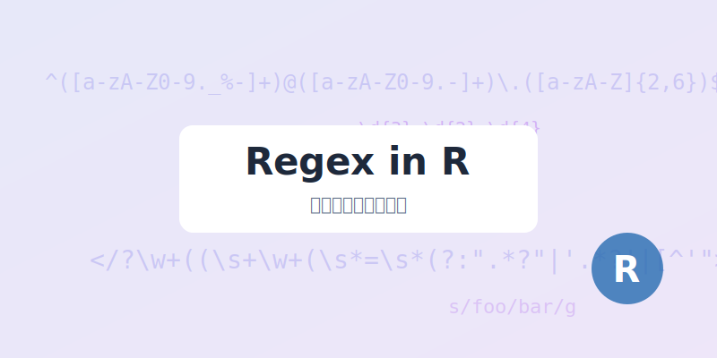

> [!NOTE]
> 正则表达式（Regular Expression，简称 Regex）是一种强大的文本处理工具，用于搜索、匹配和替换特定的字符模式。在 R 语言中，正则表达式是数据清洗和文本挖掘的核心技能。

## 什么是正则表达式？

正则表达式是由普通字符（如字母 a 到 z）以及特殊字符（称为“元字符”）组成的文字模式。该模式描述在搜索文本时要匹配的一个或多个字符串。

正则表达式可以用来：
- 验证字符串是否符合某种规则（如电子邮箱格式）。
- 在一段文字中提取特定的信息（如电话号码）。
- 批量替换文本中的特定内容。

## R 语言中的正则表达式环境

在 R 中，主要有两套处理正则表达式的系统：

1.  **Base R 函数**：如 `grep()`, `sub()`, `gsub()`, `regexpr()` 等。
2.  **stringr 包**：由 Hadley Wickham 开发，其语法更加统一和现代，推荐在现代 R 开发中使用。

本教程将重点介绍 `stringr` 包的使用。

```{r setup, message=FALSE}
# 安装并加载必要的包
if (!require("stringr")) install.packages("stringr")
if (!require("dplyr")) install.packages("dplyr")

library(stringr)
library(dplyr)
```

## 基础语法详解

### 1. 字符匹配

-   `.`：匹配除换行符之外的任意单个字符。
-   `^`：匹配字符串的开始。
-   `$`：匹配字符串的结束。
-   `[abc]`：匹配方括号内的任意一个字符。
-   `[^abc]`：匹配不在方括号内的任意一个字符。
-   `[a-z]`：匹配指定范围内的任意小写字母。

### 2. 量词（次数匹配）

-   `*`：匹配前面的元素 0 次或多次。
-   `+`：匹配前面的元素 1 次或多次。
-   `?`：匹配前面的元素 0 次或 1 次。
-   `{n}`：匹配前面的元素恰好 n 次。
-   `{n,}`：匹配前面的元素至少 n 次。
-   `{n,m}`：匹配前面的元素 n 到 m 次。

### 3. 特殊转义

> [!IMPORTANT]
> 在 R 中，反斜杠 `\` 是转义字符。要表示正则表达式中的特殊含义，通常需要使用**双反斜杠** `\\`。

-   `\\d`：匹配数字。
-   `\\D`：匹配非数字。
-   `\\w`：匹配单词字符（字母、数字、下划线）。
-   `\\s`：匹配空白字符（空格、制表符等）。

## stringr 实战案例

### 1. 检测模式：str_detect

用于判断字符串中是否包含特定模式，返回逻辑值。

```{r str_detect_demo}
fruits <- c("apple", "banana", "cherry", "date")

# 是否包含 'a'
str_detect(fruits, "a")

# 以 'a' 开头
str_detect(fruits, "^a")

# 以 'e' 结尾
str_detect(fruits, "e$")
```

### 2. 提取内容：str_extract 与 str_extract_all

`str_extract` 提取第一个匹配到的内容，`str_extract_all` 提取所有匹配到的内容。

```{r str_extract_demo}
text <- "My phone number is 123-456-7890 and office is 098-765-4321."

# 提取第一个电话号码格式 (数字-数字-数字)
str_extract(text, "\\d{3}-\\d{3}-\\d{4}")

# 提取所有电话号码
str_extract_all(text, "\\d{3}-\\d{3}-\\d{4}")
```

### 3. 替换内容：str_replace 与 str_replace_all

用于清洗数据，替换不需要的字符。

```{r str_replace_demo}
messy_data <- c("ID_001", "ID_002", "ID_003")

# 将 ID_ 替换为空，只保留数字
str_replace(messy_data, "ID_", "")

# 将所有破折号替换为斜杠
date_text <- "2023-10-01"
str_replace_all(date_text, "-", "/")
```

## 综合练习：清洗科研数据

假设我们有一组杂乱的样本编号，需要提取出其中的数字部分并转换为数值型。

```{r lab_cleaning}
raw_samples <- c("Sample-12 (Control)", "Sample-45 (Treated)", "Exp_09_v2")

# 步骤：
# 1. 提取所有连续的数字
# 2. 转换为数值
clean_ids <- raw_samples %>%
    str_extract("\\d+") %>%
    as.numeric()

print(clean_ids)
```

## 总结

正则表达式是 R 语言中不可或缺的利器。虽然初学者可能会觉得语法晦涩，但通过 `stringr` 包的函数和不断的练习，你会发现它在处理凌乱的医学或社会科学数据时效率极高。

> [!TIP]
> 推荐使用 [Regex101](https://regex101.com/) 等在线工具进行模式测试，提高开发效率。
