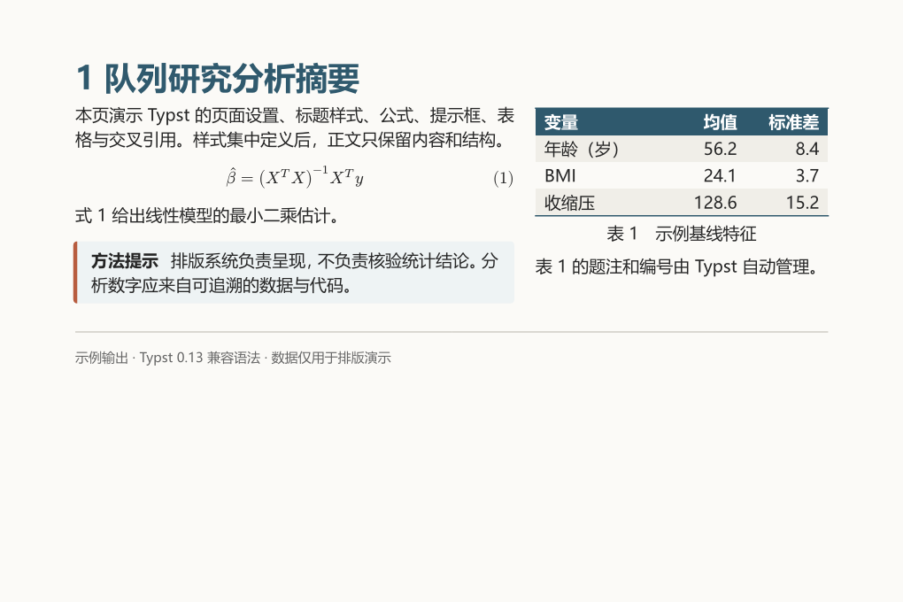

## Typst 适合什么任务

Typst 是开源的标记式排版系统。它保留了结构化文本的简洁输入，同时提供变量、函数、条件、循环、页面布局和样式规则。与 Markdown 相比，它更适合需要精确页面控制、公式、交叉引用和统一模板的 PDF；与 LaTeX 相比，它的语法更集中，错误信息和实时预览通常更直接。

截至 2026-07-31，Typst 的稳定工作流仍以 PDF 及 PNG/SVG 等视觉输出为主。官方 HTML reference 将 HTML 导出标记为正在开发的实验功能，需要显式启用 feature flag，不建议用于生产。需要网站或可访问的结构化网页时，应优先保留 Markdown/Quarto 等内容单源，再按输出目标选择 HTML 或 Typst PDF。

| 任务 | Markdown | Typst | LaTeX |
|---|---|---|---|
| 普通网页与轻量笔记 | 最直接 | HTML 尚处于实验阶段 | 通常不作为首选 |
| 公式较多的 PDF | 依赖渲染器 | 原生支持，语法统一 | 成熟且生态庞大 |
| 页面和组件定制 | 能力取决于工具链 | `set`、`show` 和函数较灵活 | 能力最强，学习成本较高 |
| 模板复用 | YAML、CSS 或扩展 | 模板函数与包 | 文档类与宏包 |
| 编译反馈 | 通常较快 | 增量编译快 | 大型项目可能较慢 |

## 使用方式

### Web App

在 [Typst Web App](https://typst.app/) 新建项目即可编辑和预览，不需要本地安装。它适合学习语法、使用模板和协作。

### 本地 CLI

从 [Typst 官方发布页](https://github.com/typst/typst/releases) 安装 CLI 后，可使用：

```bash
typst compile main.typ
typst watch main.typ
typst fonts
```

`compile` 生成文件，`watch` 在保存后持续编译，`fonts` 用于核对可用字体。项目中引用本地文件时，建议在项目根目录运行命令，避免图片和文献路径随工作目录变化。

### Quarto 内置 Typst

Quarto 自带兼容的 Typst CLI，不需要另外安装 Typst：

```bash
quarto typst --version
quarto typst compile main.typ
```

Quarto 文档还可直接指定 `format: typst`，让 Markdown 正文、R/Python 代码和 Typst PDF 处于同一工作流。

## 三种语法模式

Typst 文档在三种模式之间切换：标记模式负责正文，数学模式负责公式，代码模式负责函数和计算。

### 标记模式

```typst
= 一级标题
== 二级标题

普通正文，*加粗*，_强调_，`行内代码`。

- 无序列表
- 第二项

+ 有序列表
+ 第二项

https://typst.app/
```

标题使用一个或多个 `=`，无序列表使用 `-`，有序列表使用 `+`。空行分隔段落。Typst 的强调标记与常见 Markdown 接近，但并非所有 Markdown 扩展都能直接复制。

### 数学模式

```typst
行内公式：$ y = beta_0 + beta_1 x + epsilon $

$
  hat(beta) = (X^T X)^(-1) X^T y
$

$ sum_(i=1)^n x_i / n $
```

Typst 数学语法不是 LaTeX 命令的逐字兼容层。例如分式可以直接写 `/`，上下标用 `_` 和 `^`，矩阵和对齐结构应查阅 Typst 数学参考。迁移旧 LaTeX 稿时，应逐个检查自定义宏、特殊符号和环境。

### 代码模式

在正文中使用 `#` 进入代码模式：

```typst
#let alpha = 0.05
#let sample-size = 240

显著性水平为 #alpha，计划样本量为 #sample-size。

#let emphasize(body) = box(
  fill: luma(240),
  inset: 6pt,
  radius: 3pt,
  body,
)

#emphasize[这是一个可复用的内容块。]
```

方括号 `[...]` 创建内容，圆括号传递参数，花括号常用于代码块。变量名可用连字符，但应保持项目内命名一致。

## 最小可编译文档

```typst
#set page(
  paper: "a4",
  margin: (x: 2.4cm, y: 2.2cm),
  numbering: "1",
)

#set text(
  size: 10.5pt,
  lang: "zh",
)

#set par(
  justify: true,
  leading: 0.75em,
)

#set heading(numbering: "1.1")

= Typst 示例文档

本文展示页面、正文、公式和交叉引用的最小结构。

== 模型

线性模型写为：

$ y_i = beta_0 + beta_1 x_i + epsilon_i $ <eq-linear>

式 @eq-linear 中，$beta_1$ 表示 $x$ 每增加一个单位时的条件均值变化。
```

`set` 规则修改某类元素的默认属性。把全局页面、字体、段落和标题设置集中放在文件开头，正文会更容易维护。

下面是本教程示例源码由当前项目内置 Typst 0.13 实际编译得到的 PNG 预览，而不是生成式示意图。它把标题规则、两栏布局、编号公式、提示框、三线式表格和交叉引用放在同一页，便于对照“源码结构”与“最终页面”的关系。可复现源码保存在 [`examples/typst-tutorial-preview.typ`](examples/typst-tutorial-preview.typ)。

{fig-alt="Typst 编译页面预览：左侧为标题、正文、编号公式和提示框，右侧为带题注的三列表格。"}

从预览可以看出，Typst 的优势不只是语法短。全局 `set` 规则控制页面和正文，`show` 规则控制标题呈现，自定义函数封装提示框，而正文只保留语义结构。真实项目应让样式规则集中、内容文件简洁，这比在每段文字旁反复写字体和间距更容易维护。

## 中文字体

Typst 从系统字体中查找字体。先运行 `typst fonts`，再把实际存在的字体写入文档：

```typst
#set text(
  font: (
    "Noto Sans CJK SC",
    "Source Han Sans SC",
    "Microsoft YaHei",
  ),
  lang: "zh",
  size: 10.5pt,
)
```

字体列表按顺序回退。不同电脑的字体名称可能不同，正式项目可以把许可允许分发的字体放入项目，并通过 CLI 的 `--font-path` 或 Quarto 的 `font-paths` 指定路径。不能只在开发电脑上目测正常就假定其他环境也能复现。

## 页面与段落布局

```typst
#set page(
  paper: "a4",
  margin: (
    top: 2.2cm,
    bottom: 2.2cm,
    left: 2.5cm,
    right: 2.2cm,
  ),
  header: context [
    #h(1fr)
    #counter(page).display("1 / 1", both: true)
  ],
)

#set par(
  first-line-indent: 2em,
  justify: true,
  leading: 0.8em,
)
```

页边距使用长度值；`h(1fr)` 把页眉内容推向右侧；`context` 允许读取当前页等上下文信息。首页是否显示页眉、奇偶页布局和章节页样式通常需要单独的 `show` 规则或模板函数。

## `set` 与 `show` 的分工

`set` 规则修改默认参数，`show` 规则可以改变元素的呈现方式或重组内容。

```typst
#set heading(numbering: "1.1")

#show heading.where(level: 1): it => block(
  above: 1.5em,
  below: 0.8em,
  breakable: false,
)[
  #set text(size: 16pt, weight: "bold")
  #it
]
```

`it` 是被匹配的原始标题元素。样式规则应尽量基于元素类型和层级，而不是在每个标题处手工重复字号和间距。

### 一个可复用的提示框

```typst
#let note(title: [说明], body) = block(
  width: 100%,
  fill: rgb("f5f5f5"),
  stroke: 0.6pt + rgb("666666"),
  inset: 9pt,
  radius: 3pt,
)[
  *#title*\
  #body
]

#note(title: [方法边界])[
  插值只用于观测范围内；超出观测范围属于外推。
]
```

函数参数中把默认标题写成 content，正文通过 trailing content block 传入。组件较多时，应把函数移到单独的 `.typ` 文件再导入。

## 表格

```typst
#table(
  columns: (1.5fr, 1fr, 1fr),
  align: (left, right, right),
  stroke: none,
  table.hline(stroke: 1pt),
  [变量], [均值], [标准差],
  table.hline(stroke: 0.6pt),
  [年龄], [56.2], [8.4],
  [BMI], [24.1], [3.7],
  table.hline(stroke: 1pt),
) <tab-baseline>

表 @tab-baseline 汇总了示例变量。
```

`columns` 可混合固定宽度、自动宽度和比例宽度。复杂表格应先控制列宽、换行和数字对齐，再增加底纹；不要依靠缩小字体把过宽表格强塞进页面。

## 图片、题注与交叉引用

```typst
#figure(
  image("figures/flow.svg", width: 82%),
  caption: [研究流程],
) <fig-flow>

图 @fig-flow 展示了数据收集、分析与报告之间的关系。
```

标签写成 `<fig-flow>`，正文使用 `@fig-flow` 引用。标签应具有语义，不要只写 `<fig1>`；章节移动后，语义标签仍然容易维护。

标题也可以附标签：

```typst
== 统计分析 <sec-analysis>

分析方法见 @sec-analysis。
```

## 参考文献

正文引用 BibTeX 键：

```typst
多重插补应把插补不确定性带入最终推断 @rubin1987。

#bibliography("references.bib", style: "apa")
```

`references.bib` 示例：

```bibtex
@book{rubin1987,
  author    = {Donald B. Rubin},
  title     = {Multiple Imputation for Nonresponse in Surveys},
  year      = {1987},
  publisher = {Wiley}
}
```

引用键、作者、年份和 DOI 应来自文献管理器或权威数据库。排版系统只负责渲染，不能核验引文身份。

## 条件、循环与数据驱动内容

```typst
#let results = (
  (name: "模型 A", auc: 0.78),
  (name: "模型 B", auc: 0.81),
  (name: "模型 C", auc: 0.76),
)

#for result in results [
  - #result.name：AUC = #result.auc
]

#let show-appendix = true

#if show-appendix [
  = 附录
  这里放置补充方法。
]
```

这类功能适合从同一数据对象生成重复结构，但研究结果仍应由分析代码产生，再以明确的数据接口传给排版层。不要在 `.typ` 文件里复制多份手敲统计数字。

## 文件拆分与模板

一个可维护的项目可以采用：

```text
project/
├── main.typ
├── template.typ
├── references.bib
├── figures/
└── chapters/
    ├── introduction.typ
    └── methods.typ
```

在 `template.typ` 中定义模板函数：

```typst
#let report(
  title: none,
  authors: (),
  body,
) = {
  set page(paper: "a4", margin: 2.4cm)
  set text(size: 10.5pt, lang: "zh")
  set par(justify: true, leading: 0.75em)

  align(center)[
    #text(size: 20pt, weight: "bold")[#title]
    #v(0.8em)
    #authors.join([，])
  ]

  v(1.8em)
  body
}
```

在 `main.typ` 中使用：

```typst
#import "template.typ": report

#show: report.with(
  title: [队列研究分析报告],
  authors: ([作者甲], [作者乙]),
)

#include "chapters/introduction.typ"
#include "chapters/methods.typ"
```

`show: report.with(...)` 把后续正文作为 `body` 传入模板。模板负责稳定版式，章节文件负责内容，可减少全文散落的格式指令。

## 包与模板仓库

Typst Universe 提供社区包和模板。导入语法形如：

```typst
#import "@preview/package-name:version": *
```

版本号必须从 [Typst Universe](https://typst.app/universe/) 当前页面复制，不要凭记忆填写。包更新可能改变接口；正式项目应锁定版本，并检查许可证、维护状态和编译环境。

## Quarto 生成 Typst PDF

最小 `.qmd` 文件：

````markdown
---
title: "分析报告"
format:
  typst:
    toc: true
    section-numbering: 1.1
    papersize: a4
    margin:
      x: 2.4cm
      y: 2.2cm
---

## 数据摘要

正文使用 Markdown，代码由 knitr 或 Jupyter 执行。

```{r}
summary(mtcars$mpg)
```
````

渲染命令：

```bash
quarto render report.qmd --to typst
```

Quarto 会先把 Markdown 转为 Typst，再调用内置 CLI 生成 PDF。需要保留中间 `.typ` 时设置 `keep-typ: true`。若只想在局部使用原生 Typst，可写 raw block：

````markdown
```{=typst}
#set par(justify: true)
```
````

直接写 Typst 适合追求完整排版控制；Quarto + Typst 适合已有 Markdown、R/Python 计算或需要同时维护 HTML 与 PDF 的项目。两条路径不必二选一，可以让 Quarto 管内容和计算，让 Typst 模板管 PDF 版式。

## HTML 导出的当前边界

官方参考页当前将 HTML 标记为实验功能。CLI 示例为：

```bash
typst compile --features html --format html main.typ
```

实验 HTML 以语义结构为目标，而不是把 PDF 页面逐像素搬到网页。现有 `set page`、绝对定位和视觉布局规则不一定能自然映射为 HTML。生产网站应继续使用成熟的 HTML 工具链，并把 Typst HTML 视为需要单独测试的候选输出。

## 常见错误

| 现象 | 常见原因 | 处理 |
|---|---|---|
| 中文显示为空框 | 系统没有指定字体 | 用 `typst fonts` 核对名称并设置回退字体 |
| 图片找不到 | 编译工作目录与相对路径不一致 | 从项目根编译并统一资源目录 |
| 从 LaTeX 复制公式报错 | Typst 数学语法并非 LaTeX 兼容层 | 按 Typst math reference 改写 |
| `set` 没有效果 | 规则放在元素之后或作用域不对 | 把全局规则前置，检查代码块作用域 |
| `show` 规则递归或重复 | 重建了同类元素并再次命中规则 | 限定 selector，必要时改用 `show ...: it =>` |
| 模板在另一台电脑变化 | 字体、包版本或 Typst 版本不同 | 锁定版本和字体，保存编译命令 |
| HTML 与 PDF 差异很大 | 两种输出目标的布局语义不同 | 分别测试，避免依赖 PDF 专属绝对布局 |

## 学习顺序

先掌握标题、列表、强调、公式和 `#let`；随后学习 `set`、`show`、表格、figure、标签和参考文献；最后再拆分模板、使用社区包并接入 Quarto。遇到语法问题时，优先查官方 tutorial 和 reference，因为 Typst 仍在快速演进，旧示例可能不再对应当前版本。

## 官方资料

- [Typst Tutorial](https://typst.app/docs/tutorial/)
- [Typst Syntax Reference](https://typst.app/docs/reference/syntax/)
- [Typst Standard Library](https://typst.app/docs/reference/)
- [Typst HTML 状态](https://typst.app/docs/reference/html/)
- [Typst Universe](https://typst.app/universe/)
- [Quarto 的 Typst 输出指南](https://quarto.org/docs/output-formats/typst.html)
- [Quarto Typst 格式选项](https://quarto.org/docs/reference/formats/typst.html)
