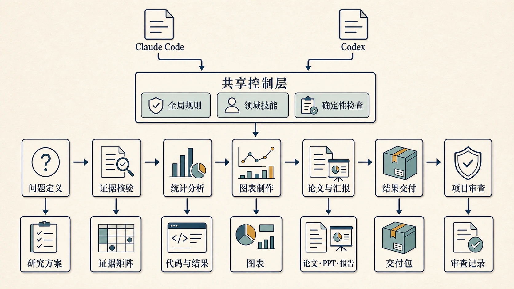

`project-init` 为卫生统计、流行病学和统计咨询建立标准项目骨架。它不仅创建文件夹，还同时生成项目规则、研究方案、统计分析计划、结果单源、表图 registry、决策记录、会话日志与待补清单，让后续分析、写作和审查共享同一套目录与来源。

{fig-alt="EpiAgentKit 科研工作流，项目初始化为证据、分析、图表、论文、汇报和审查提供统一基础"}

## 何时触发

只有用户明确说“创建项目”“初始化”“新建项目”，要求把空工作区建成标准研究项目，或明确新建咨询项目时触发。

简单作业、单次处理、快速核验、只要一个小结果和已有项目开始分析都不触发。调用其他领域 Skill 也不会自动创建七层目录。边界不清且初始化会明显改变文件布局时，先向用户确认。

## 开工前确认

初始化前确认项目名、绝对创建位置、研究模式或咨询模式、研究主题、负责人、数据来源、主要暴露、结局、分组、纳排、主分析与是否启用 Git。

分组、终点、纳排或主分析存在多个合理口径时，必须由研究者选择。无法确定的内容保留为待补项，不能用模板默认值替代研究决策。

创建位置必须明确且可写。若目标目录已有文件，先盘点并保留来源不明的内容，不把已有工作区当作空目录覆盖。

## 两种项目模式

| 模式 | 适合对象 | 额外重点 |
|:---|:---|:---|
| 研究模式 | 论文、学位论文、课题和长期研究 | 方案、SAP、结果单源、论文和汇报链 |
| 咨询模式 | 受托分析与外部交付 | 客户需求、交付目录、复现入口与 `consulting-delivery` 衔接 |

两种模式共享数据安全、代码、表图、结果、报告、论文和备份结构。咨询模式只增加必要的客户交付准备，不把每个研究项目都包装成咨询包。

## 七层目录

```text
项目根/
├── 01_data/
│   └── rawdata/
├── 02_code/
├── 03_tables/
├── 04_figures/
├── 05_reports/
├── 06_results/
├── 07_paper/
├── 08_ppt/
└── 09_backup/
```

七层中的“层”指主流程职责，不要求每个目录都立即产生文件。原始数据只放 `01_data/rawdata/` 并保持只读；代码、表格、图件、报告、分析对象、论文与汇报分别落入固定位置；旧批次和隔离实验进入 `09_backup/`。

## 项目级规则

初始化同时创建项目级 `CLAUDE.md` 与 `AGENTS.md`，记录新会话必读顺序、当前状态、项目基本信息、已经锁定的口径和项目特定覆盖规则。全局规则仍是上游，项目文件只保存当前项目确实需要的差异和状态。

“当前状态”是少量快照，不复制历史日志。方法变化进入 `DECISIONS.md`，执行历史进入 `SESSION_LOG.md`，缺口和待办进入 `BACKLOG.md`。

## 方案与统计分析计划

`PROTOCOL.md` 保存研究问题、设计、对象、暴露、结局、比较、时间窗、纳排和伦理等预设；`SAP.md` 保存估计目标、变量处理、主模型、协变量、敏感性分析、缺失值与报告要求。

未确认内容以明确占位和 `BACKLOG.md` 记录，不包装成已经预设。后续方法改变时写入 `DECISIONS.md`，保持方案、实施与偏离可区分。

## 结果单源

正式项目使用 `07_paper/results.yaml` 保存可被下游引用的结果数字，`0_result_summaries.md` 是由其派生的人读版。论文、报告和 PPT 通过 `val()` 取数，不手敲样本量、效应值、置信区间和 P 值。

分析结果变化时先更新 `results.yaml`，再派生摘要和下游文档。这样同一指标不会在论文、报告和汇报中形成多个版本。

## Registry 与稳定编号

表格和图件的语义名、编号和路径集中在 registry 及 `02_code/config.R`、`conventions.R`。代码通过 `table_path()` 和 `fig_path()` 等 helper 取路径，不在每个脚本里写死 `Table3` 或 `Fig2`。

增加、删除或重排表图时只更新 registry，下游路径和引用按规则同步，减少编号漂移。`03_tables/` 与 `04_figures/` 只保留当前稳定产物。

## 数据与代码模板

`01_data/README.md` 提供数据来源、变量清单和变更记录模板。清洗脚本从 `01_data/rawdata/` 读取，逐步记录样本量损失，编码分类变量，并把清洗后的表格化数据写入 `06_results/*.xlsx`。

原始数据根禁止修改。缺失、异常或口径冲突先回最早来源核验，不在模板脚本中自动填补或排除。

## 初始化脚本

确定性创建由 `scripts/init_project.R` 完成，可选择研究或咨询模式并传入项目名、路径和 Git 选项。脚本只建立项目骨架和模板，不执行统计分析，也不安装 R 包或其他本机环境。

Git 默认是可选项。只有用户在初始化任务中明确启用时才执行 `git init`。Git 不可用时跳过版本管理，不安装 Git，也不影响项目骨架创建。

## 初始化验证

完成后检查目标路径、目录完整性、模板可打开性、项目名替换、模式特定内容、原始数据保护、相对路径、结果单源、registry、备份索引和 Git 选项是否符合用户选择。

还要确认没有把示例值误写成真实研究信息，没有在项目根留下测试文件，已有文件未被覆盖。初始化通过只说明骨架可用，不代表研究方案和统计分析已经完成。

## 内部组成

| 资源 | 内容 |
|:---|:---|
| `SKILL.md` | 开工问题、双模式目录、模板内容与 VERIFY 清单 |
| `project-hygiene.md` | 命名、当前版唯一性、归档和项目完成条件 |
| `registry.md` | 表图语义名、连续编号和路径 helper |
| `init_project.R` | 七层目录与模板的确定性生成 |

## 与其他 Skills 的组合

正式研究项目通常从 `biostat-principles → project-init` 开始，之后进入 `r-biostats`、`publication-figures` 和 `academic-publishing`。咨询模式在分析完成并验证后进入 `consulting-delivery`，项目签发前使用 `epi-project-audit`。

## 能力边界

本技能不自动升级轻量任务，不代研究者确定研究口径，不修改原始数据，不执行统计分析，也不安装或升级运行环境。它建立可追溯的起点，研究内容仍需要后续专业流程完成。

## 安装与入口

```bash
python scripts/epiagentkit.py install --target all --preset custom \
  --skills project-init --yes
```

- [EpiAgentKit 总览](5013-epiclaude.html)
- [r-biostats R 统计分析](5016-skill-r-biostats.html)
- [20 个 Skills 完整目录](5019-epiagentkit-skills.html)
