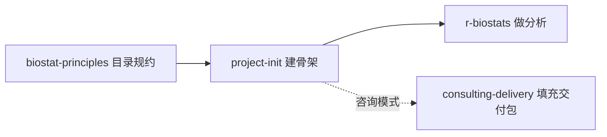

```{r setup, include=FALSE}
knitr::opts_chunk$set(echo = TRUE, eval = FALSE)
```

::: {.callout-note}
## 关于本系列
本文是 [EpiClaude](5013-epiclaude.html) 技能逐个分享系列之一。EpiClaude 是一套面向流行病学与生物统计研究的 Claude Code 配置系统，`project-init` 是它的「执行层」入口技能——研究的第一步。配套阅读：[如何写好一份 CLAUDE.md](5014-claude-md-guide.html)。
:::

## 这个技能解决什么问题

每开一个新研究，你都要重复一套机械动作：建数据目录、建代码目录、建表图目录、写 README、配 `.gitignore`、初始化 Git……做十遍有十种命名，过两个月自己都认不出哪个文件夹放什么。更糟的是，目录一旦起得随意，后面的分析、出图、写论文全都跟着乱，复现和交接成为灾难。

`project-init` 把这一步标准化：用一条流程，问清几个关键信息，就生成一套**结构一致、可复现、便于交接**的研究项目骨架。它不只是 `mkdir` 一堆文件夹，而是把「研究该怎么组织」这件事的最佳实践固化下来。

---

## 应用场景

`project-init` 的触发很简单——你说「创建项目 / 初始化 / 新建项目」，它就接管。典型场景有四类：

- **研究生开新课题**：手上拿到一份数据，要从零做到投稿，但没有规范的项目管理经验，最怕做到一半文件全乱。
- **统计咨询接单**：接了一个客户的分析任务，需要一个能独立复现、最终打包交付的项目结构（咨询模式会额外预建交付包骨架）。
- **多人协作课题组**：希望组内每个项目结构统一，新人接手不用从头摸索「东西放哪」。
- **任何新的数据分析任务**：哪怕只是一次性分析，规范的骨架也能让结果可追溯、可复查。

**什么时候不需要它**：纯粹临时跑几行代码、不打算留存结果的探索，用不上完整骨架；这种情况直接写脚本即可。

---

## 它怎么工作：五步状态机

`project-init` 遵循一条清晰的工作流，每一步都有明确产出：


- **INQUIRE（问清信息）**：信息不全不开工。先问项目名、研究类型、模式、根路径、是否启用 Git。
- **SCAFFOLD（建目录）**：按研究类型和模式生成七层目录结构。
- **POPULATE（填模板）**：写入 `CLAUDE.md`、`DECISIONS.md`、数据字典、清洗脚本模板等。
- **VERIFY（自检）**：检查目录、模板、Git 是否都就绪，输出自检报告。
- **GUIDE（告诉下一步）**：明确告诉你「现在该把数据放哪、该填哪个文件、从哪开始」。

---

## 如何使用

### 第一步：发起

直接对 Claude Code 说：

> 帮我初始化一个队列研究项目

技能会进入 INQUIRE 阶段，逐项问你：

```
1. 项目名称（英文 snake_case，例如 cohort_smoking_chd）：
2. 研究类型：[1]队列 [2]病例对照 [3]横断面 [4]RCT [5]Meta [6]RWD [7]方法学
3. 模式：[A]研究模式 [B]咨询模式
4. 存放根路径（默认当前工作目录）：
5. 是否启用 Git（默认 yes）：
```

::: {.callout-tip}
## 两种模式怎么选
- **研究模式（A）**：自己做研究、投稿用，生成标准七层骨架。
- **咨询模式（B）**：给客户做交付用，在研究模式基础上额外预建一个交付包骨架（含 `run_all.R`、客户说明、`data/code/tables/figures`），并在 `CLAUDE.md` 追加「交付前必过终检」。
:::

### 第二步：确认与生成

回答完信息，技能会生成全部目录与模板。如果项目名不符合 `snake_case`，它会建议规范名让你确认而不是硬改；如果同名目录已存在，它会停下来问你覆盖、改名还是追加，而不是默默覆盖。

### 第三步：按指引开干

生成后它会给出自检报告和明确的下一步，例如：

```
下一步：
  1. 把原始数据放入 01_data/rawdata/
  2. 填写 01_data/README.md 数据字典
  3. 锁口径：打开 CLAUDE.md，填"口径锁定"节
  4. 开始清洗：打开 02_code/01_data_cleaning.R
```

---

## 技能内容详解

### 生成的目录结构

研究模式生成的标准骨架如下，每一层各司其职：

```
{project}/
├── CLAUDE.md              # 项目级规则（继承全局 + 本项目口径锁定）
├── README.md              # 项目说明
├── SESSION_LOG.md         # 操作日志
├── DECISIONS.md           # 方法决策记录
├── BACKLOG.md             # 待补清单（只增不删）
├── .gitignore             # 原始数据与临时产物不入 git
├── .Rproj                 # RStudio 项目文件
├── 01_data/
│   ├── rawdata/           # 只读原始数据
│   └── README.md          # 数据字典
├── 02_code/
│   ├── config.R           # 口径常量 + 表图 registry
│   └── 01_data_cleaning.R # 清洗脚本模板
├── 03_tables/             # 最终表格
├── 04_figures/            # 最终图件
├── 05_reports/            # 可分享结果包
├── 06_results/            # 中间对象
├── 07_paper/
│   └── 0_result_summaries.md  # 结果汇总（由 results.yaml 派生）
└── 09_backup/             # 旧版与一次性脚本
```

### 关键模板文件

技能不止建空目录，还会填好几个关键文件，让项目「开箱即用」：

| 文件 | 作用 |
|:-----|:-----|
| `CLAUDE.md`（项目级） | 继承全局规则，含「新会话必读」「当前状态快照」「口径锁定」三节，让任何新会话都能快速进入状态 |
| `DECISIONS.md` | 方法决策记录，所有影响结果的选择都写这里（选择+原因+放弃方案） |
| `BACKLOG.md` | 待补清单，四列结构（待完善内容/完善方式/重要性/状态），发现即记、只增不删 |
| `01_data/README.md` | 数据字典模板，含数据来源与变量清单表 |
| `02_code/01_data_cleaning.R` | 清洗脚本模板，含样本量损失链、编码、落盘的标准骨架 |
| `.gitignore` | 原始数据与中间产物默认不入 Git，避免敏感数据外泄 |

### 设计上的几个讲究

- **口径锁定优先**：`CLAUDE.md` 里专门有「口径锁定」节（纳排、暴露、结局、随访、协变量），口径一变就先改这里、记 `DECISIONS.md`、再重跑分析——从源头防止「分析口径漂移」。
- **原始数据天生只读**：`01_data/rawdata/` 在 `.gitignore` 里被排除，配合 EpiClaude 的 Hook 可彻底锁死写入。
- **待补清单只增不删**：`BACKLOG.md` 让你随手记下「还缺哪篇文献、还能补哪个分析」，规划时先扫它，避免想法过两轮就忘。
- **不默认上 renv**：对小咨询任务，renv 反而拖慢速度，因此默认不启用，除非你明确要求。

---

## 与其他技能的衔接

`project-init` 是研究流水线的起点，建好骨架后自然交棒给下游：



- 上游：`biostat-principles` 提供目录规约。
- 下游：建好骨架后，[r-biostats](5016-skill-r-biostats.html) 接着做统计分析；咨询模式则交给 `consulting-delivery` 填充交付包。

---

## 常见问题

**Q：项目名用了中文会怎样？**
技能会建议改成 `snake_case` 英文名，但尊重你的决定；用中文名会警示 shell 转义风险。

**Q：目录已经存在怎么办？**
它会停下来问你覆盖、改名还是追加，默认建议加 `_v2` 后缀，绝不直接覆盖。

**Q：不在 Git 仓库但想启用 Git？**
技能会先 `git init`，并保证 `.gitignore` 在第一次提交之前就位，避免原始数据被误提交。

**Q：建好之后还要手动改什么？**
主要是三件事：把数据放进 `01_data/rawdata/`、填数据字典、在 `CLAUDE.md` 锁定口径。技能会在 GUIDE 阶段明确提示。

---

## 下载与获取

`project-init` 是 EpiClaude 技能生态的一部分，随整套配置一起分发：

- **技能源码（在线浏览）**：<https://github.com/KangWang42/EpiClaude/tree/main/skills/project-init>
- **整套 EpiClaude 仓库**：<https://github.com/KangWang42/EpiClaude>

安装方式（macOS / Linux）：

```bash
git clone git@github.com:KangWang42/EpiClaude.git ~/.claude-epiclaude
cp ~/.claude-epiclaude/CLAUDE.md ~/.claude/CLAUDE.md
cp -r ~/.claude-epiclaude/skills ~/.claude/skills
```

安装与整体介绍详见 [EpiClaude 流行病学科研工作流](5013-epiclaude.html)。装好后，在 Claude Code 里说一句「创建项目」即可触发本技能。

---

## 扩展资源

- 配套技能：[r-biostats（统计分析执行层）](5016-skill-r-biostats.html)、[publication-figures（发表级图件）](5017-skill-publication-figures.html)、[academic-publishing（论文写作）](5018-skill-academic-publishing.html)
- 基础阅读：[EpiClaude 总览](5013-epiclaude.html)、[如何写好一份 CLAUDE.md](5014-claude-md-guide.html)、[Claude Code 完全指南](5008-claudecode.html)
