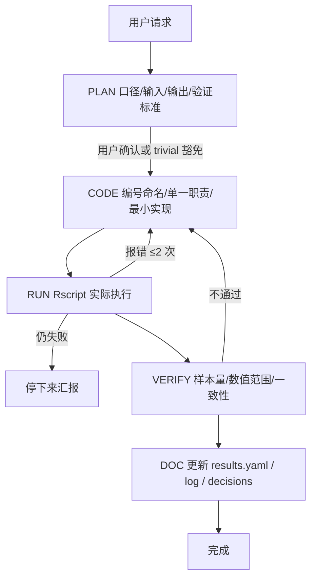
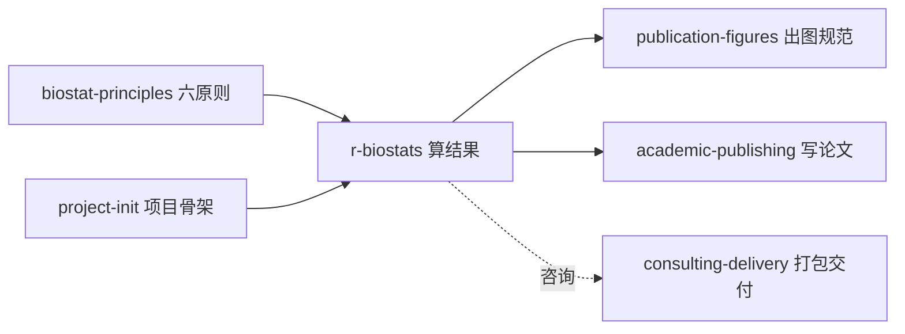

```{r setup, include=FALSE}
knitr::opts_chunk$set(echo = TRUE, eval = FALSE)
```

::: {.callout-note}
## 关于本系列
本文是 [EpiClaude](5013-epiclaude.html) 技能逐个分享系列之一。`r-biostats` 是整套配置的核心执行层——几乎所有 R 统计分析任务都由它接管。它的上游是 [project-init](5015-skill-project-init.html) 建好的项目骨架。
:::

## 这个技能解决什么问题

让 AI 写统计分析代码，最常见的三种翻车是：**写了不跑就说"完成"**、**跑出 warning 当没看见**、**结果改了论文里的数字却没跟着改**。任何一种发生，交付的就是带病结果——而医学研究里，一个没核对的样本量、一个被吞掉的收敛警告，可能直接让结论站不住。

`r-biostats` 用一条强制状态机解决这个问题：分析必须走 `PLAN → CODE → RUN → VERIFY → DOC` 五个阶段，**每一阶都有显式的退出条件，不满足就不能进入下一阶**。它把「严谨」从口头要求变成流程约束。

---

## 应用场景

只要是 R 统计分析，基本都归它管：

- **描述统计与基线表**：gtsummary / compareGroups 出 Table 1。
- **各类回归**：线性、逻辑、Poisson、负二项、有序回归等。
- **生存分析**：KM 曲线、Cox 模型、时变协变量、竞争风险。
- **因果推断与中介**：中介效应、调节、PSM、IPW 等。
- **Meta 分析**：森林图、异质性检验、亚组分析。
- **数据清洗与缺失处理**、**R 代码报错调试**、**出版级表格生成**。

适用对象覆盖医学研究生、临床数据分析、真实世界数据（RWD）研究和统计咨询。

**边界**：出图任务虽然由它落盘，但具体的图件规范交给 [publication-figures](5017-skill-publication-figures.html)；写论文交给 [academic-publishing](5018-skill-academic-publishing.html)。`r-biostats` 专注「算对、算清、记好」。

---

## 核心：五阶状态机

这是技能的灵魂。每个分析任务都按下图推进，箭头上的条件就是「门禁」：



各阶段的退出门槛：

| 阶段 | 不允许进入下一阶的情况 |
|:-----|:---------------------|
| **PLAN** | 口径有歧义、输入路径不明、没写验证标准 |
| **CODE** | 脚本超 300 行没拆分、用了 for 循环/绝对路径/print 调试、没编号命名 |
| **RUN** | 没真跑过、有 warning 没处理、报错被 `tryCatch` 吞掉 |
| **VERIFY** | 样本量与预期不符、数字异常（NA 爆表、HR=Inf）、图表留白/乱码 |
| **DOC** | session_log 没更新、结果变了但 results.yaml 没改 |

**失败回退规则**：RUN 连续 2 次修不好就停下来汇报，不瞎试第三次；VERIFY 不过必须回到 CODE，不能「大致对就行」；用户说「不对」就立即回到 PLAN，不在错误路径上继续改。

---

## 如何使用

### 第一步：描述任务

直接说你要做什么：

> 读 `01_data/rawdata/` 的队列数据，做基线描述和主分析 Cox 回归

### 第二步：审 PLAN

技能进入 PLAN 阶段，会先输出一个口径块让你确认——这是防止「方向跑偏」的关键：

```
【口径】
  - 研究对象：XX 人群 (N=?)
  - 暴露/干预：XX
  - 结局/终点：XX
  - 协变量：X1, X2, ...
  - 主分析方法：Cox 比例风险模型
  - 敏感性分析：XX
【输入】01_data/rawdata/cohort.csv
【输出】02_code/03_cox_main.R → Table3 + Fig2
【验证】样本量=基线表 N；HR 在合理范围；PH 假设如何判定
```

::: {.callout-important}
## 口径不全不开工
如果【口径】里有任何一项填不出来（比如分组怎么定、终点是什么没说清），技能会先问你，而不是替你猜。这是 EpiClaude 的硬红线——涉及分组、终点、纳排、主分析方法的判断，一律先问用户。
:::

### 第三步：让它跑

确认 PLAN 后，技能写编号脚本、用 `Rscript 文件.R` 实际执行，并全量扫 error/warning。它**不会**用 `Rscript -e` 传多行脚本（本环境会 segfault），而是写成 `.R` 文件再跑。

### 第四步：验收 DOC

跑完并验证后，结果数字会写入单源 `07_paper/results.yaml` 并派生 `0_result_summaries.md`，同时追加 `SESSION_LOG.md`；若方法有变，同步 `DECISIONS.md`；若冒出「还能补」的想法，追加 `BACKLOG.md`。

---

## 技能内容详解

### 硬禁止与必须

技能内置一张「违禁→替代」对照表，把常见劣质写法直接挡在外面：

| 违禁写法 | 替代 |
|:---------|:-----|
| `print()` / `cat()` 调试 | 直接返回对象 |
| `for (i in 1:n)` 循环 | `purrr::map_*()` / `across()` |
| 绝对路径 `"C:/Users/..."` | 相对路径 + `here` |
| 修改 `01_data/rawdata/` | 只读，派生写到 `06_results/` |
| 散落 `.tsv` 输出 | 表格化数据统一 `.xlsx` |
| 脚本里写死 `Table6` / `Fig3` | 经 registry 的 `table_path()` / `fig_path()` 取 |
| 自选配色 `scale_fill_manual` | `ggsci::scale_fill_lancet()` 等期刊配色 |
| 代码写完不跑就交 | 必须 `Rscript` 实际执行 |

必须做的则包括：默认语言 R、脚本顶部写全 `library()` + `set.seed(123)` + 目的注释、双格式导出（PDF 用 `cairo_pdf` + PNG 用 `ragg::agg_png` 300dpi）、UTF-8 编码、结果数字写入单源。

### 技术栈

技能预设了一套成熟的包组合，按需加载：

```r
library(tidyverse)                       # 数据处理 + 绘图
library(here)                            # 相对路径
library(gtsummary); library(compareGroups)  # 基线表
library(broom); library(survival); library(survminer)  # 整理 + 生存
library(mediation); library(lavaan)      # 中介
library(meta); library(metafor)          # Meta
library(ggsci); library(ragg); library(patchwork)  # 可视化
```

### 按分析类型加载参考

技能不是把所有模板都塞进上下文，而是按任务类型读取对应的 reference 文件（渐进式披露）：

| 任务 | 参考文件 |
|:-----|:---------|
| 基线表 / 描述统计 | `references/descriptive.md` |
| 回归（线性/逻辑/Poisson/负二项） | `references/regression.md` |
| 生存分析（KM/Cox/时变/竞争风险） | `references/survival.md` |
| 中介 / 调节效应 | `references/mediation.md` |
| Meta 分析 / 森林图 | `references/meta.md` |
| 结果汇总单源 | `references/result-summary-schema.md` |

### 结果单源机制

这是 r-biostats 与论文写作之间的「数据契约」。算完每个指标就调 `add_result()` 把估计值、CI、P 值写入 `results.yaml`，再 `render_summary_md()` 派生出人读版。下游论文、报告、PPT 一律用 `val()` 取数，**禁止手敲**——从机制上保证「结果改了，论文里的数字自动跟着对」。

---

## 完成前终检清单

技能在宣告完成前会逐项自查，节选关键项：

- PLAN 的四块（口径/输入/输出/验证）都写出
- 脚本编号命名、实际跑过、warning 已理解
- 表在 `03_tables/`、图在 `04_figures/`、中间在 `06_results/`
- 表格化数据是 `.xlsx`，`.rds` 仅限非表格对象（模型/ggplot）
- 图件 PDF+PNG 双存、中文不乱码、ggsci 配色
- 结果变 → 写 `results.yaml`；方法变 → 写 `DECISIONS.md`；想法 → 写 `BACKLOG.md`

---

## 与其他技能的衔接



- 上游：开工前对齐 `biostat-principles` 六原则；项目骨架来自 `project-init`。
- 下游：出图交 `publication-figures`，写论文交 `academic-publishing`（消费 `results.yaml`），咨询任务额外过 `consulting-delivery`。

---

## 下载与获取

- **技能源码（在线浏览）**：<https://github.com/KangWang42/EpiClaude/tree/main/skills/r-biostats>
- **整套 EpiClaude 仓库**：<https://github.com/KangWang42/EpiClaude>

安装方式（macOS / Linux）：

```bash
git clone git@github.com:KangWang42/EpiClaude.git ~/.claude-epiclaude
cp ~/.claude-epiclaude/CLAUDE.md ~/.claude/CLAUDE.md
cp -r ~/.claude-epiclaude/skills ~/.claude/skills
```

装好后，任何 R 统计分析请求都会自动触发本技能。整体安装与介绍见 [EpiClaude 流行病学科研工作流](5013-epiclaude.html)。

---

## 扩展资源

- 配套技能：[project-init（项目初始化）](5015-skill-project-init.html)、[publication-figures（发表级图件）](5017-skill-publication-figures.html)、[academic-publishing（论文写作）](5018-skill-academic-publishing.html)
- 基础阅读：[EpiClaude 总览](5013-epiclaude.html)、[如何写好一份 CLAUDE.md](5014-claude-md-guide.html)
- 本站相关：[生存分析](1020-survival.html)、[gtsummary 发表级表格](1053-gtsummary.html)、[Meta 分析](1022-meta-analysis.html)
