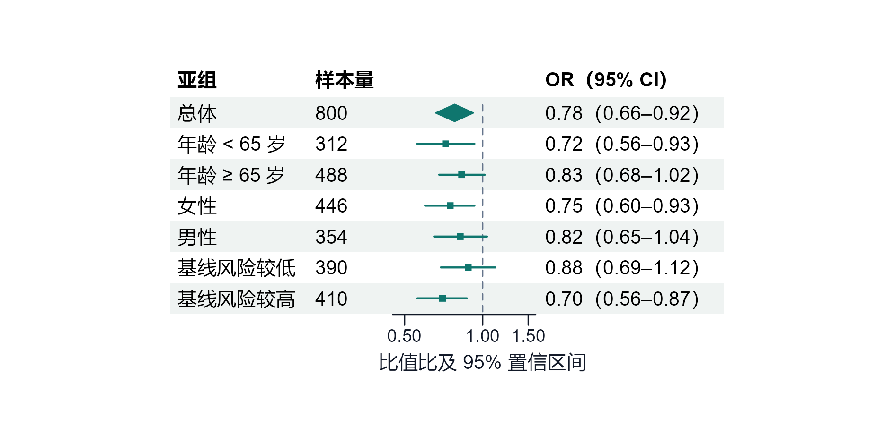

`publication-figures` 处理统计图、数据图和其他含坐标或尺度映射的结果图。它把图型选择、真实数据口径、印刷尺寸、字体、配色、多面板、导出格式和最终检查纳入同一流程，使图件不仅看起来整洁，还能在论文、报告和汇报的真实尺寸中准确传达结果。

{fig-alt="发表级森林图示例，左侧为变量与分组，中间为效应值及置信区间，右侧为数值结果"}

## 触发边界

森林图、生存曲线、ROC、校准图、热图、回归诊断、散点图、柱状图、箱线图和所有真实数据映射图触发本技能。任何 ggplot2、matplotlib 或统计结果出图任务也适用。

流程图、概念框架、机制图、技术路线和系统架构转 `research-visuals`。科研原始图像不由本技能生成或重绘。Excel 内部图表可以由 `xlsx` 处理，但正式统计图仍优先使用本技能。

## 上游原则

开始前加载 `biostat-principles`，确认研究对象、变量、分组、时间窗、统计量、估计值、区间、参考组、缺失处理和图件用途。图形不能替用户选择一个尚未锁定的统计口径。

图中数字必须来自已经验证的数据或结果对象。不能为了构图效果调整点位、方向、样本量或置信区间。

## 图前要求

每张图开始前明确：读者要回答的问题；数据与统计对象；x、y、颜色、形状和分面的映射；分组与水平顺序；最终载体和物理尺寸；语言与字体；期刊格式；输出路径；必须核对的数字和关系。

图前要求还决定哪些信息必须写在图内，哪些留给图注。一个图不同时承担所有分析结果，图例、标签和面板数量由核心信息任务决定。

## 复杂度分层

简单图使用基础主题和最小模板，避免为了调用配方而增加无关结构。复杂图、多面板、专门医学图和特殊注释先检索画廊与配方，再按真实数据改写。

| 层级 | 例子 | 推荐路径 |
|:---|:---|:---|
| 基础 | 散点、箱线、柱状、折线 | 公共主题与直接语法 |
| 专门统计图 | 森林图、生存、ROC、校准、火山图 | 先查常用配方 |
| 复杂或组合图 | 多重注释热图、关联网络、多面板复合图 | 查高级索引与历史案例 |

## 约 180 种图型资源

`references/chart-gallery.md` 提供约 180 种统计图的选型画廊，按数据关系、研究问题和使用条件组织。它帮助回答“应该画什么”，而不是把所有图型都视为可互换装饰。

`recipes_catalog.md` 与 `recipes_advanced_index.md` 分别索引常用配方和复杂案例，`recipes_common_50/` 保存柱状图、差异图、热图、火山图、Venn、UpSet、生存曲线、森林图、ROC、PCA 和瀑布图等 R 脚本。使用时必须替换为当前数据、变量和口径，不能原样套示例数字。

## 物理尺寸

图件按最终印刷或显示宽度生成，不依赖投稿前统一缩小。论文单栏通常约 85 mm，双栏约 170 至 180 mm；报告和 PPT 按实际占位计算。

物理尺寸改变会影响字号、线宽、点大小、图例和面板间距。先以最终尺寸设计，才能确保坐标轴和注释在 Word、PDF 或投影中仍清楚。

## 分辨率与格式

线图和文字密集图优先保存矢量 PDF，审稿和网页预览同时输出高分辨率 PNG。需要 SVG 时可以输出矢量文件，但不能用位图放大伪装成矢量。

同一图的 PDF 与 PNG 由同一代码、数据和尺寸参数生成，避免两个版本内容漂移。输出路径通过 registry 的 `fig_path()` 获取。

## 字体

英文图通常使用 Arial、Helvetica 或期刊指定字体。中文图显式注册可用中文字体，并在 PDF 与 PNG 中验证是否缺字、乱码或字体回退。

字体嵌入和设备兼容性需要在实际导出文件中检查。开发窗口显示正常不代表 PDF 中中文正确。

## 配色与可访问性

颜色服务于分组和重点，不按变量数量随机分配。主要比较使用有限、低饱和且有足够对比的颜色，参考组与辅助信息使用中性色。颜色不是唯一线索时，可同时使用形状、线型或直接标签。

连续变量使用与数值意义匹配的连续色阶，发散色只用于有真实中点的情形。避免彩虹色、过度透明、荧光色和大面积高饱和背景。

## 主题与结构

公共主题集中管理字体、轴线、网格、图例、标题、边距和背景。图标题通常由论文图注承担，图内避免重复标题和长解释。标签优先直接、简短且与变量定义一致。

坐标轴范围、变换、参考线和截断必须有统计理由。柱状图从零起点，效应估计图可围绕无效线组织；对数尺度和断轴要明确标示。

## 多面板

多面板先统一数据口径、字体、颜色、坐标和图例，再使用 patchwork 或同类工具组合。面板标记按阅读顺序连续，子图之间的宽高由信息量而非均分画布决定。

共用图例只保留一份。任何子图单独缩放后文字过小，说明组合方案需要重排，而不是继续压缩。

## R 与 Python 导出

R 通过 `scripts/fig_setup.R` 提供公共主题和双格式保存函数，脚本使用 `ggsave`、Cairo 或合适设备输出。Python 使用 matplotlib 或 seaborn 时同样显式设置物理尺寸、字体、DPI、边距和格式。

导出函数不能掩盖警告。保存后重新读取图件并核对像素、页面尺寸、字体、透明背景和空边。

## 每张图的三重检查

### 数据正确性

核对样本量、统计量、分组、参考组、效应方向、置信区间、P 值、事件数和坐标范围。图与相应 Excel 表格及结果单源一致。

### 科学合理性

图型与研究问题匹配，尺度、归一化、平滑、误差条和显著性标记有方法依据。不能用面积或三维效果夸大差异，也不能隐藏负面结果。

### 视觉可读性

在最终显示尺寸查看字体、线宽、点、图例、标签、面板、留白和裁切。分类映射全图一致，连接线与标签不重叠，PDF 与 PNG 内容相同。

## 常见不合格情况

事后把整图缩小、中文字体未注册、图例占用过多空间、颜色过多、坐标轴或误差条被裁切、`coord_equal` 造成大片空白、面板标签不连续、同一类别跨图换色、显著性星号没有对应检验，均需要返工。

## 与其他 Skills 的组合

分析出图使用 `biostat-principles → r-biostats → publication-figures`；论文和报告嵌图分别与 `academic-publishing`、`report-writing` 配合；PPT 中的真实数据图与 `sysu-ppt` 配合。非统计视觉转 `research-visuals`。

## 能力边界

本技能不生成不存在的数据，不改变研究口径，不把图型新颖当作科学优势，也不负责流程、机制和框架图。

## 安装与入口

```bash
python scripts/epiagentkit.py install --target all --preset analysis --yes
```

- [r-biostats R 统计分析](5016-skill-r-biostats.html)
- [research-visuals 非统计视觉](5024-skill-research-visuals.html)
- [EpiAgentKit Skills 目录](5019-epiagentkit-skills.html)
