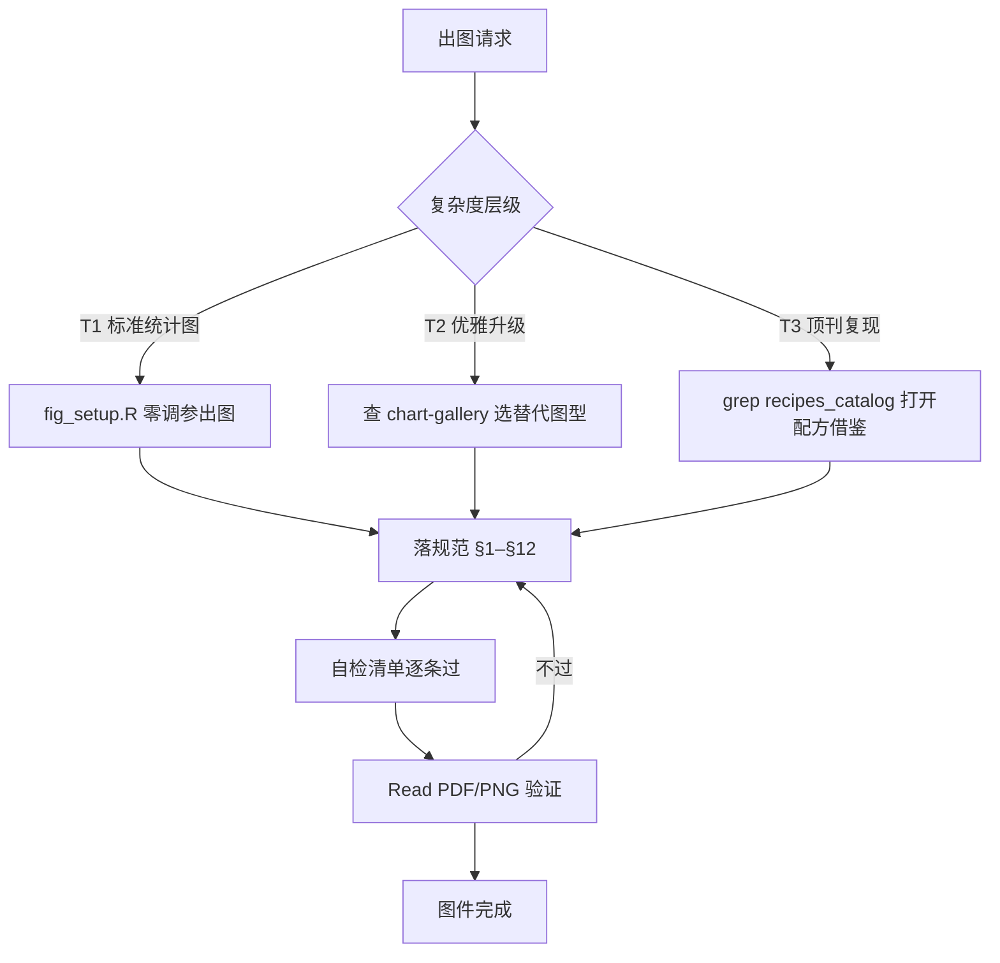
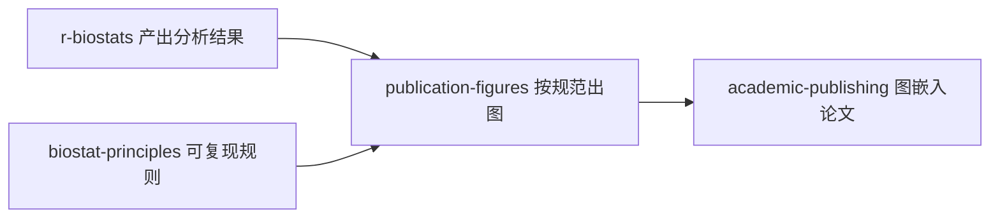

```{r setup, include=FALSE}
knitr::opts_chunk$set(echo = TRUE, eval = FALSE)
```

::: {.callout-note}
## 关于本系列
本文是 [EpiClaude](5013-epiclaude.html) 技能逐个分享系列之一。`publication-figures` 是 EpiClaude 的「出图规范层」——任何 ggplot / matplotlib 出图任务都先过它。它的数据来自 [r-biostats](5016-skill-r-biostats.html) 的分析结果。
:::

## 这个技能解决什么问题

图件是论文最容易被退回的部件之一：字号太小看不清、分辨率不够印出来糊、中文 PDF 变方块、配色彩虹刺眼、坐标轴没单位、同一篇论文不同图风格不一……这些都不是「画错了」，而是「没按发表标准画」。返工一轮少则半天。

`publication-figures` 的核心目标是一句话：**一次出图即可直接投稿**。它把发表级图件的全部硬指标（物理尺寸、分辨率、字体、配色、主题、多面板、各图型经验值）和一份出图前后的自检清单固化下来，让 AI 出图开箱即达投稿标准。同时它还内置一个约 180 种图型的选型画廊，帮你在「该用什么图」上做得更专业、更有新意。

---

## 应用场景

- **任何论文图件**：散点、箱线、小提琴、KM 曲线、ROC、森林图、列线图、RCS、火山图、热图、PCA 等。
- **答辩 / 汇报 PPT 出图**：需要清晰、专业、风格统一的图。
- **图件返工**：已有的图被审稿人或导师挑了字号、配色、分辨率问题，要按标准重做。
- **投稿前图件审查**：上传前做一遍发表级自检。
- **不知道用什么图 / 想让图更优雅**：用选型画廊找合适、更有表达力的图型。

它对 R（ggplot2）和 Python（matplotlib）都适用。

---

## 它怎么工作：复杂度分层 + 检索 + 自检

技能不是对所有图一视同仁，而是先判断复杂度层级，再决定要不要「开宝库」：



| 层级 | 何时 | 怎么做 |
|:-----|:-----|:-------|
| **T1 朴素默认** | 标准统计图、用户没要"高级" | 用 `fig_setup.R` 零调参出图，不堆元素 |
| **T2 优雅升级** | 朴素图信息损失或要"好看点" | 查画廊选替代图型（云雨/山脊/哑铃/棒棒糖/桑基…），升级必须比朴素图多传达信息 |
| **T3 顶刊复现** | 要"Nature 风/复杂高级" | 必走配方检索，打开 work.R 借鉴技法/配色/拼接再重写 |

核心原则：**优雅 ≠ 炫技，新意服务表达**。一张图只讲一个核心关系，能朴素讲清就不堆元素。

---

## 如何使用

### 第一步：提出出图需求

> 把主分析的 Cox 结果画成发表级森林图

技能会判断这是 T1/T2/T3 哪一层，标准森林图走 T1，顶刊同款走 T3 检索配方。

### 第二步：技能落规范出图

它会按 mm 物理尺寸、字体嵌入、ggsci 配色、双格式导出生成图。R 的最小骨架长这样：

```r
p <- ggplot(dat, aes(x, y, colour = group)) +
  geom_point(size = 1.2) +
  scale_colour_lancet() +
  labs(x = "Follow-up (months)", y = "Tumor volume (mm³)") +
  theme_classic(base_size = 8, base_family = "Arial")

ggsave(fig_path("volume", "pdf"), p, width = 88, height = 70,
       units = "mm", device = cairo_pdf)
ggsave(fig_path("volume", "png"), p, width = 88, height = 70,
       units = "mm", dpi = 300, bg = "white")
```

### 第三步：自检与验证

出图后技能会逐条过自检清单，并 Read 生成的 PNG/PDF 实际看一眼——中文图还要额外把 PDF 第一页转 PNG 复核，确认中文不是方块、没被裁切。任一条不过就返工。

---

## 技能内容详解

### 物理尺寸（按印刷宽度画，不事后缩放）

| 版面类型 | 宽度 | 最大高度 |
|:---------|:-----|:---------|
| 单栏 | 约 88–90 mm | 170 mm |
| 1.5 栏 | 约 120–140 mm | 170 mm |
| 双栏 / 全幅 | 约 180 mm | 225 mm |

绘图时必须显式传 **mm** 宽高，绝不靠 `width = 8, height = 6` 这种英寸默认值糊弄。

### 字体与中文处理

- 默认 Arial / Helvetica，中文统一一种（思源黑体 / 苹方 / 微软雅黑）。
- 字号按印刷尺寸：刻度 6–7pt、轴标题与图例 7–8pt、面板标签 8pt bold。
- 字体必须嵌入：R 用 `cairo_pdf`，Python 用 `pdf.fonttype = 42`。
- 中文图件必须显式注册中文字体（`sysfonts::font_add` + `showtext::showtext_auto()`），否则 PDF 中文变方块。

### 配色

医学期刊配色顺位：`ggsci::pal_lancet()` → `pal_nejm()` → `pal_jco()` → `pal_nature()`。分类组 ≤5 时首选色盲友好调色板；连续热图用 viridis，**绝不用红绿对比做连续映射**；同一论文所有图同分组颜色必须完全一致。

### 各图型尺寸经验值（节选）

| 图类型 | 推荐尺寸（宽×高 mm） |
|:-------|:---------------------|
| ROC / 校准曲线（单图） | 88 × 85（方形） |
| 森林图 | 160 × (5–8 × 行数 + 20) |
| 列线图（≤6 变量） | 180 × 110 |
| RCS / 剂量反应曲线 | 120 × 85 |
| KM 生存（含 risk table） | 120 × 120 |
| 相关热图 / 矩阵 | 130 × 130（方形） |

### 致丑陋陷阱（硬禁止）

技能列出一串「违反即不合格」的禁令，例如：

- 不用 `width = 8, height = 6` 英寸默认值，一律 `units = "mm"`。
- 不在 ≤88×66mm 小画布用 `base_size = 12`，小画布压到 7–8pt。
- 中文长标题（>12 字）必须换行。
- 图例不得压住任何数据曲线、散点、柱、误差棒。
- 同分类层多组不得完全重叠交付，必须显式错位。
- 不只看 PNG 就声称 PDF 没问题——两条字体路径独立，中文图必须额外复核 PDF。

### 出图后强制三查

每生成或重渲一张图都要做，不只看好不好看，更看对不对：

1. **数值可溯源**：图上每个数字都能在数据源查到且一致，schematic 里的数字禁止硬编码。
2. **无统计假象**：警惕「所有格子同值」这类计算 bug，检查量级、方向、分布是否合常理。
3. **表达正确**：分类映射无 NA、图例不压数据、标签无内部变量名、多结局图含全部结局、与全文风格一致。

---

## 与其他技能的衔接



- 上游：数据来自 `r-biostats` 的分析；遵守 `biostat-principles` 的口径与可复现规则。
- 下游：图件被 `academic-publishing` 嵌入论文（换语言时图内文字也要随之重出）。

---

## 常见问题

**Q：T1/T2/T3 我要自己指定吗？**
不用，技能会判断。你只要在想要更精致时说一句「做好看点 / 顶刊同款」，它就升级层级。

**Q：为什么强调 mm 而不是英寸？**
期刊版面以 mm 计。按最终印刷宽度画图，字号比例才正确；事后缩放会让字号失真。

**Q：中文图老是乱码怎么办？**
确保走了 `sysfonts::font_add` 注册中文字体，PDF 用 `cairo_pdf`、PNG 用 `ragg::agg_png`，并 Read 验证。技能默认就这么做。

---

## 下载与获取

- **技能源码（在线浏览）**：<https://github.com/KangWang42/EpiClaude/tree/main/skills/publication-figures>
- **整套 EpiClaude 仓库**：<https://github.com/KangWang42/EpiClaude>

安装方式（macOS / Linux）：

```bash
git clone git@github.com:KangWang42/EpiClaude.git ~/.claude-epiclaude
cp ~/.claude-epiclaude/CLAUDE.md ~/.claude/CLAUDE.md
cp -r ~/.claude-epiclaude/skills ~/.claude/skills
```

装好后，任何出图请求都会自动触发本技能。整体介绍见 [EpiClaude 流行病学科研工作流](5013-epiclaude.html)。

---

## 扩展资源

- 配套技能：[project-init（项目初始化）](5015-skill-project-init.html)、[r-biostats（统计分析）](5016-skill-r-biostats.html)、[academic-publishing（论文写作）](5018-skill-academic-publishing.html)
- 本站相关：[ggplot2 可视化入门](2032-ggplot2-intro.html)、[配色方案](2011-viscolor.html)、[森林图](2016-forestplot.html)、[patchwork 图片拼接](2012-patchwork.html)
