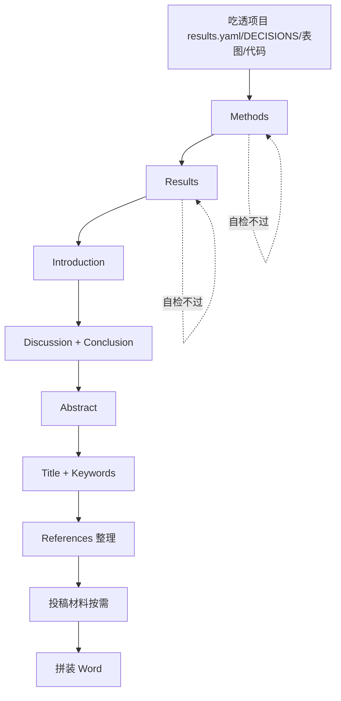
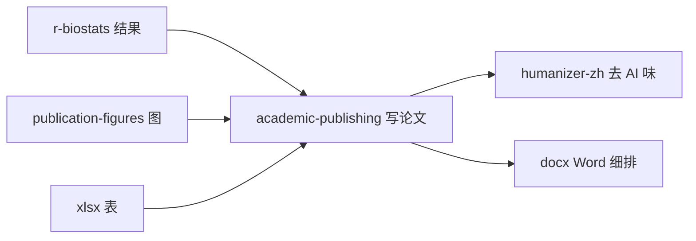

```{r setup, include=FALSE}
knitr::opts_chunk$set(echo = TRUE, eval = FALSE)
```

::: {.callout-note}
## 关于本系列
本文是 [EpiClaude](5013-epiclaude.html) 技能逐个分享系列之一。`academic-publishing` 是 EpiClaude 的「产出层」——把 [r-biostats](5016-skill-r-biostats.html) 算出的结果、[publication-figures](5017-skill-publication-figures.html) 出的图，转成可投稿的论文。
:::

## 这个技能解决什么问题

让 AI 写论文，最大的风险有三个：**编数字**（凭印象写样本量、CI、P 值，与实际分析对不上）、**AI 味重**（满篇套话、三段式、宣传腔，审稿人一眼看穿）、**一次性吐全文**（结构松散、各部件口径打架、改一处忘了同步另一处）。任何一个都足以让稿子被退。

`academic-publishing` 的定位是一句话：**把项目里已经跑完的分析转成可投稿的论文与投稿材料，语言到位、结构到位、零编造、看不出 AI 痕迹**。它通过「数据单源 + 逐部件门控 + 反 AI 痕迹」三道机制，把上面三个风险逐一封死。

---

## 应用场景

技能覆盖三条写作线和投稿材料：

- **中文期刊论著**（GB/T 7713.2，≤5000 字）：投中文核心期刊的标准论著。
- **中文学位论文**（GB/T 7713.1 长文）：硕士、博士论文，含封面、双声明、中英摘要、综述章、致谢等前后置部件。
- **英文期刊**（IMRaD）：投 SCI 的英文 manuscript。
- **单部件生成或润色**：只写/改引言、方法、结果、讨论、摘要、题名中的某一个。
- **投稿材料**：Cover Letter、Response to Reviewers、Highlights、Graphical Abstract、Title Page、各类声明。
- **投稿前自查**：逻辑、数据、格式、合规四查。

**边界**：它只「消费」分析结果，不改分析——结果由 `r-biostats` 产出，图由 `publication-figures` 出，表由 `xlsx` 出。报告类（非论文）文档走 `report-writing`，咨询交付包走 `consulting-delivery`。

---

## 它怎么工作：先吃透项目，再逐部件门控

技能不会一上来就写。它先读项目建立「事实底座」，然后按一条固定顺序逐部件推进，每个部件写完自检通过才进下一个：



为什么是「先 Results 和 Methods，再 Introduction 和 Discussion，最后 Abstract、Title」？因为结果锁定后，引言的 gap 和讨论的解释才有靶子，摘要才能精准压缩。

每个部件都走：**写入独立 md → 跑该部件自检清单 → 字数核对 → 标记完成 → 下一部件**。禁止一次性吐全文。

---

## 如何使用

### 第一步：发起并确认语言与部件

> 根据现在的结果，写中文论著的结果部分

技能第一步判定「语言 × 部件」，只加载需要的 reference 以节省上下文。如果目标期刊、语言、分组、终点等关键信息不明，它会先问你（一次问 2–3 个最关键的，不一口气抛十个）。

### 第二步：技能吃透项目

写第一个字前，它按顺序读 `results.yaml`（数据唯一源）、`DECISIONS.md`（方法口径）、`03_tables/`+`04_figures/`（表图清单）、`02_code/` 关键脚本顶部（变量定义、模型设定）、项目 `CLAUDE.md`（研究背景），产出一张内部「事实卡」。

### 第三步：逐部件写 + 自检

它一次只写一个部件，写完立即跑该部件的自检清单。所有数字用 `val("07_paper/results.yaml", "key")` 取，源里没有就标 `[NEED CONFIRMATION]`，绝不瞎填。

### 第四步：投稿前四查 + 拼装 Word

全文写完过「逻辑/数据/格式/合规」四查，再用 `python-docx` 直接生成终稿 docx（禁用 `pandoc -o`，因为中文字体、三线表、真上下标控制不到位）。

---

## 技能内容详解

### 八条铁律

技能开篇就立了八条「违反=未完成」的铁律，是它质量的地基：

1. **数据唯一来源 = `results.yaml`**：所有数字取自该源，禁止手敲，禁止四舍五入到与源不一致。
2. **期刊 Guide for Authors 是最高法**：目标期刊的官方须知覆盖一切默认值。
3. **不编造**：参考文献、伦理号、基金号、统计结论一律不虚构，缺的用占位符。
4. **不照抄**：参考范文只借鉴修辞功能与句式骨架，不复制原句。
5. **逐部分门控**：一次只写一个部分，禁止一次性吐全文。
6. **疑点先问**：分组/终点/纳排/主分析/目标期刊不明先问。
7. **零 AI 痕迹**：中文过反 AI 黑名单 + 困惑度/突发性；英文过 over-claim 黑名单。
8. **局部修改也走完整标准**：哪怕只改一句，也要加载对应 reference、跑自检、复扫一致性。

### 三条写作线的差异

| 线 | 规范 | 篇幅 | 关键 reference |
|:---|:-----|:-----|:---------------|
| 中文期刊论著 | GB/T 7713.2 | ≤5000 字 | `chinese-paper.md` + `section-content-playbook.md` |
| 中文学位论文 | GB/T 7713.1 | 80–120 页长文 | `chinese-thesis.md` + `thesis-formatting.md` |
| 英文期刊 | IMRaD | 期刊上限 | `english-writing.md` + `english-phrasebank.md` |

期刊论著与学位论文的结构、字数、排版完全不同，分不清就先问。

### 反 AI 痕迹机制

这是技能最有特色的部分。中文稿要过 `chinese-anti-ai.md` 的套话黑名单，并用「提高困惑度（具体化、低频专业词、具体数字）+ 提高突发性（句长方差、段首多样、连接词收敛）」两个杠杆改写；英文稿过 over-claim 黑名单与时态规范。全程研究者第一作者视角（「本研究 / we」），不暴露版本演进、调参、工程细节。中文稿还可叠加 [humanizer-zh](5014-claude-md-guide.html) 再过一遍。

### 投稿前四查

| 查 | 看什么 |
|:---|:-------|
| **逻辑查** | 题名↔全文、摘要↔结果、引言 Gap↔结果是否回答、结论无新内容、探索性结果未升格 |
| **数据查** | 样本量全文一致、摘要=结果=讨论=表图=数据源同一数字、效应量措辞与强度匹配 |
| **格式查** | 字数、摘要结构、关键词、参考文献格式、图表按引用顺序连续编号 |
| **合规查** | 伦理、知情同意、利益冲突、基金、数据可用性、报告清单（STROBE/COREQ 等） |

---

## 图表与公式嵌入

技能要求正文真正含图表，不能只写「见表1」而正文无内容：

- **随文排版**：每个表/图紧随首次引用它的段落之后插入，不堆在文末；只有附表附图（S 系列）集中文末。
- **表**：把关键数据写进 Markdown 表格，拼装时转三线表。
- **图**：`` 嵌入，图注在图下方。
- **公式**：`$$LaTeX$$` 标记，拼装转 OMML，禁止 fallback 字符串。
- **图表语言随正文**：英文稿绝不沿用中文图表，需用英文标签重出。

---

## 与其他技能的衔接



- 开工前对齐 `biostat-principles`（口径与可复现）。
- 结果由 `r-biostats` 产出、图由 `publication-figures` 出、表由 `xlsx` 出；本技能只消费不改分析。
- 中文去 AI 味叠加 `humanizer-zh`；Word 细排叫 `docx`。
- 结果变回写 `results.yaml`、方法变回写 `DECISIONS.md`、操作完写 `SESSION_LOG.md`。

---

## 常见问题

**Q：它会自己编参考文献吗？**
不会。文献未提供就用 `[待补充引用]`（中）/ `[ref]`（英）占位并计数，绝不虚构。

**Q：能一次把整篇论文写完吗？**
技能刻意不这么做。它逐部件门控，写一个、自检一个、过一个再写下一个——这是保证结构与口径一致的关键。

**Q：写出来的中文怎么避免 AI 味？**
过反 AI 黑名单 + 困惑度/突发性双杠杆改写，必要时再叠加 humanizer-zh。核心是具体化、句长有变化、收敛连接词。

**Q：终稿为什么不用 pandoc 转 Word？**
中文字体字号、三线表、首行缩进、真上下标，pandoc 控制不到位，所以用 `python-docx` 直接生成。

---

## 下载与获取

- **技能源码（在线浏览）**：<https://github.com/KangWang42/EpiClaude/tree/main/skills/academic-publishing>
- **整套 EpiClaude 仓库**：<https://github.com/KangWang42/EpiClaude>

安装方式（macOS / Linux）：

```bash
git clone git@github.com:KangWang42/EpiClaude.git ~/.claude-epiclaude
cp ~/.claude-epiclaude/CLAUDE.md ~/.claude/CLAUDE.md
cp -r ~/.claude-epiclaude/skills ~/.claude/skills
```

装好后，说一句「写论文 / 写英文论文 / 写学位论文」即可触发本技能。整体介绍见 [EpiClaude 流行病学科研工作流](5013-epiclaude.html)。

---

## 扩展资源

- 配套技能：[project-init（项目初始化）](5015-skill-project-init.html)、[r-biostats（统计分析）](5016-skill-r-biostats.html)、[publication-figures（发表级图件）](5017-skill-publication-figures.html)
- 基础阅读：[EpiClaude 总览](5013-epiclaude.html)、[如何写好一份 CLAUDE.md](5014-claude-md-guide.html)、[Claude Code 完全指南](5008-claudecode.html)
