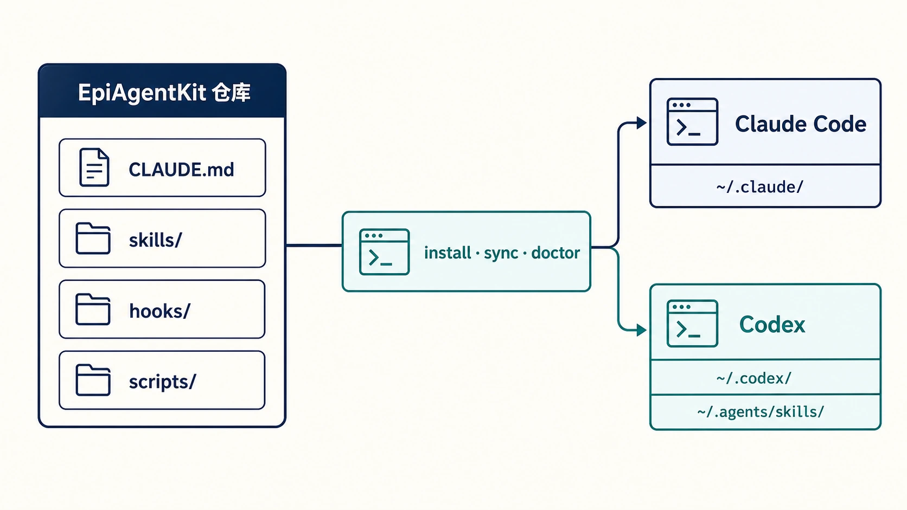

`epiagentkit-maintenance` 专门维护 EpiAgentKit 自身，覆盖全局或项目规则、skills、references、hooks、安装与同步脚本、兼容性测试和 README。普通研究项目的数据分析、写作和初始化不触发它。

{fig-alt="EpiAgentKit 双平台架构，全局规则、领域 Skills、Hooks 和配置管理器作为共享组件"}

## 适用场景

用户要求完善、重构、精简 EpiAgentKit 规则，新增或修改仓库 Skill，排查 Hook，调整安装、同步、doctor、路由或跨平台一致性时触发。修改 Skill 时同时使用 `skill-creator`。

Git 仅在当前目录已经是仓库且命令可用时使用，不安装 Git，也不隐式初始化仓库。

## 建立基线

修改前先读取当前工作区规则、目标组件、引用链、安装器清单和已有测试。检查 Git 状态，保留来源不明的既有改动。若存在多个候选当前版且无法从目录与引用判断，先向用户确认。

基线包括当前触发边界、必须保留的旧行为、源文件、安装目标、双平台差异和已有验证入口。没有基线就无法判断“简化”是否造成能力回退。

## 变更要求

每次修改先写清四项内容：观察到的真实缺口；必须保留的行为；解决问题所需的最小变更集；覆盖旧能力和新场景的代表性验证用例。

Skill 优化不是只增不减。现有内容可以保留、重写、合并、下沉、脚本化或删除，只有真实任务缺口无法通过重构解决时才新增规则或文件。差异更大、文字更多和目录更深都不代表更好。

## 单源归属

| 内容 | 唯一归属 |
|:---|:---|
| 每次会话都需要的全局约束 | `CLAUDE.md` 与 `AGENTS.md` |
| Skill 的核心路由与必须步骤 | `SKILL.md` |
| 条件细节、长规范和示例 | `references/` |
| 重复且要求确定性的操作 | `scripts/` |
| 模板、媒体和可复用资源 | `assets/` |

一个概念只保留一个权威来源，其他位置使用链接或简短指针。不能把同一规则复制到全局文件、多个 Skills 和 README 后分别维护。

## 规则文件维护

全局规则只保留跨任务分流、硬红线、单源指针、优先级和完成条件。项目特定口径放项目级规则，领域步骤放对应 Skill。Claude Code 与 Codex 的规则文件在语义上保持一致，同时适配各平台的文件名与调用方式。

修改后检查规则优先级、轻量与正式项目边界、文件与数据安全、依赖安装限制、视觉路由和 Git 收尾行为是否回退。

## Skills 与 references

修改 Skill 先核对 description 是否能正确触发和排除。`SKILL.md` 保持核心流程清楚，references 只在条件满足时加载，scripts 负责稳定重复操作。引用路径必须真实可达，资源不能变成孤儿文件。

验证同时覆盖应触发、相邻但不应触发、旧代表任务、新增场景、错误输入和能力边界。上下文成本也要检查，避免一次加载大量与当前任务无关的资料。

## Hooks、安装器与同步器

Hook 只承担可确定检查，不把需要专业判断的任务塞进脚本。安装器负责复制规则、Skills、Hooks 并运行 doctor，不负责安装 R、Python、Node、Java、LibreOffice、TeX 或依赖包。

清单、预设、依赖图、安装目标、状态记录和卸载边界需要共同更新。同步操作以仓库为单源，不能手工修改已安装副本后忘记回写仓库。

## 验证与签发

按变更范围依次运行语法或快速 validator、代表性单元测试、安装与同步兼容性审查、双平台同步和 doctor。修改 EpiAgentKit 规则、Skills 或 Hooks 后，以仓库为单源运行：

```bash
python scripts/epiagentkit.py sync --target all
python scripts/epiagentkit.py doctor --target all
```

验证输出需要全量查看 error、warning、failed 和 traceback，不能只看退出码。任何行为回退、引用断裂、清单不一致或 doctor ERROR 都阻止签发。

## 交付说明

交付时说明缺口、实际变更、保留的旧行为、验证命令、验证结果、兼容性影响和回滚方式。若修改了同步结果，说明 Claude Code 与 Codex 两侧状态，但不回显配置和凭证内容。

## 与其他 Skills 的组合

修改 EpiAgentKit Skill 使用 `epiagentkit-maintenance → skill-creator`；完成并验证后用 `git-commit-helper` 整理提交。普通 Skill 创建只用 `skill-creator`，不需要加载本仓库维护规则。

## 能力边界

本技能不负责普通研究数据分析，不通过增加规则数量证明质量，也不在缺少用户授权时安装环境、初始化仓库或推送远端。

## 安装与入口

```bash
python scripts/epiagentkit.py install --target all --preset custom \
  --skills epiagentkit-maintenance --yes
```

- [skill-creator Skill 创建指南](5034-skill-skill-creator.html)
- [git-commit-helper 版本历史](5035-skill-git-commit-helper.html)
- [EpiAgentKit Skills 目录](5019-epiagentkit-skills.html)
