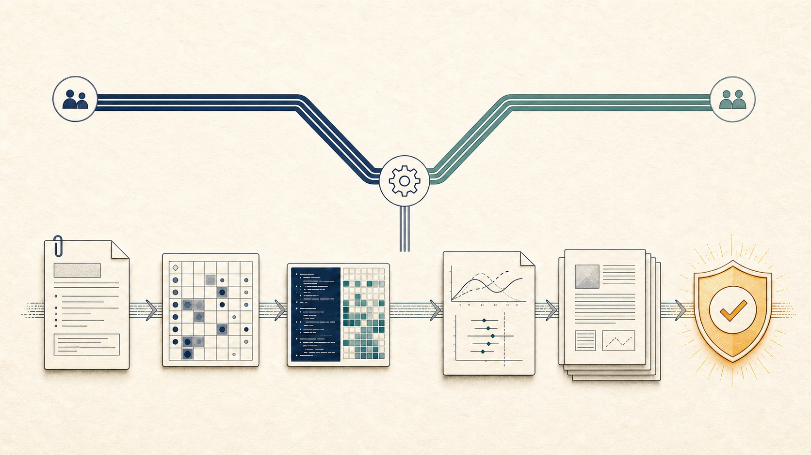

`git-commit-helper` 通过完整差异、验证证据、兼容性影响与回滚上下文，生成清楚、可审查的 Conventional Commit。它既能只建议提交信息，也能在用户授权的工作流中检查暂存区并完成提交。

{fig-alt="EpiAgentKit 科研 Skills 库主视觉，代表规则、Skills 和文档的版本化维护"}

## 触发边界

用户要求写 commit message、检查 staged changes、提交已完成修改、push 或整理仓库历史时触发。只有 Git 已经可用且当前目录本身是仓库时执行，不安装 Git，不隐式 `git init`。

用户只要求审查或解释代码时，不自动提交。只有用户明确要求 push 才推送，不通过提交请求推断远端操作授权。

## 提交信息格式

```text
type(scope): concise summary

optional body

optional footer
```

常见 type 包括 `feat`、`fix`、`docs`、`refactor`、`test`、`build`、`ci`、`chore`、`perf`、`style` 和 `revert`。scope 描述受影响模块，不使用过宽或含糊的名称。

摘要使用祈使语气，直接说明这次提交完成的结果。正文只在需要解释动机、关键实现、兼容性、验证或回滚时加入，不把文件列表机械复述一遍。

## 完整差异审查

生成提交信息前检查工作区、暂存区、完整 diff、文件统计和相关测试结果。不能只看 `git status` 或 diff 的前几行就概括。

还要区分本次任务改动、用户原有未解释改动、生成文件、二进制资产和临时文件。只暂存明确属于当前任务的内容，避免把用户其他工作混入提交。

## 可审查历史要求

一个提交应表达一个连贯目的，审查者能从摘要和 diff 理解为什么要改、行为发生了什么变化以及怎样验证。多文件不等于必须拆分，只要它们共同完成同一结果；互不相关的改动应分开。

纯格式化、生成产物和行为变化混在一起会增加审查成本，必要时拆分。拆分必须保留每个提交的可构建或可理解性，不能为了追求小提交破坏完整功能。

## 兼容性与破坏性变更

若接口、文件格式、命令、配置键、默认行为或数据迁移发生不兼容变化，在摘要使用 `!` 或在 footer 写 `BREAKING CHANGE:`，正文说明受影响对象和迁移方式。

普通内部重构不标为 breaking。兼容性判断来自实际 diff 和验证，不因改动文件多就夸大。

## 验证证据

提交前确认与风险相称的测试、渲染、lint、doctor 或手工检查已经完成。提交信息可以简要记录关键验证，但不能把没有运行的检查写成已通过。

测试失败、工作树包含来源不明的重叠改动或任务尚未完成时，不为了形成提交而忽略问题。

## 回滚上下文

提交正文可以说明依赖、数据迁移、生成步骤和回滚注意事项。可逆改动通常直接 `git revert`，涉及数据库、外部状态或跨文件生成链时，需要说明额外恢复步骤。

禁止使用 force push 或改写远端历史作为常规收尾。修改最近提交或历史整理只有在用户明确要求且不会覆盖他人工作时进行。

## 常用审查命令

```bash
git status --short
git diff --stat
git diff
git diff --cached
```

暂存后再次检查 `git diff --cached`，确保提交范围准确。提交完成后核对最新提交摘要与工作区状态。

## 典型提交信息

```text
docs(epiagentkit): add a dedicated skills section

- document all distributable skills with independent guides
- add first-level navigation and topic landing pages
- replace legacy project-name references
```

正文中的项目符号只描述关键结果和验证上下文，不复述每个文件名。

## 与其他 Skills 的组合

EpiAgentKit 自身维护使用 `epiagentkit-maintenance → skill-creator → git-commit-helper`。普通代码或网站修改完成并验证后，可以单独使用本技能整理提交历史。

## 能力边界

本技能不能把不完整或未验证的工作包装成高质量提交，也不在用户未授权时 push、force push、初始化仓库或重写远端历史。

## 安装与入口

```bash
python scripts/epiagentkit.py install --target all --preset custom \
  --skills git-commit-helper --yes
```

- [epiagentkit-maintenance 仓库维护](5033-skill-epiagentkit-maintenance.html)
- [skill-creator Skill 创建](5034-skill-skill-creator.html)
- [EpiAgentKit Skills 目录](5019-epiagentkit-skills.html)
