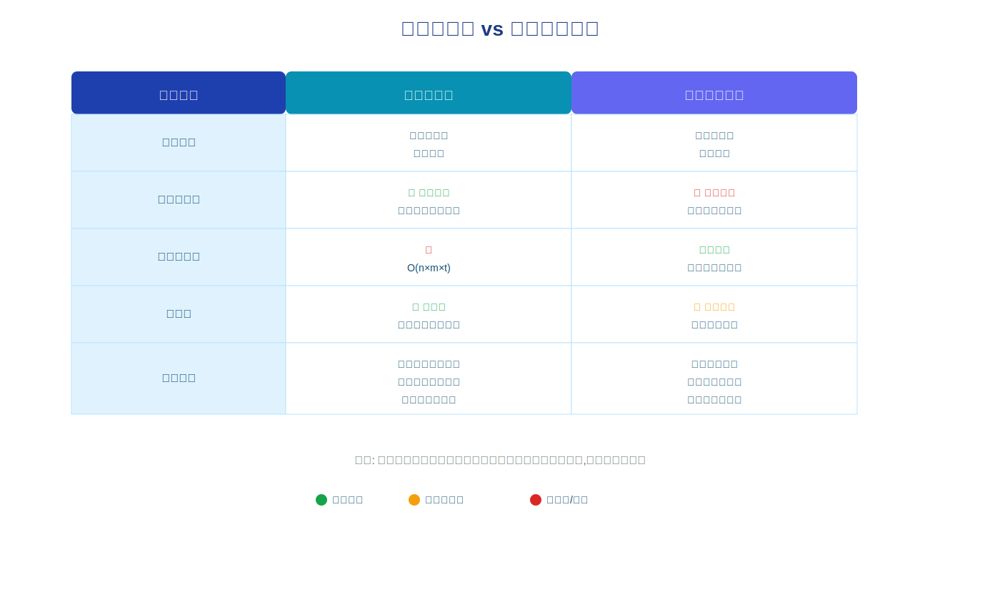
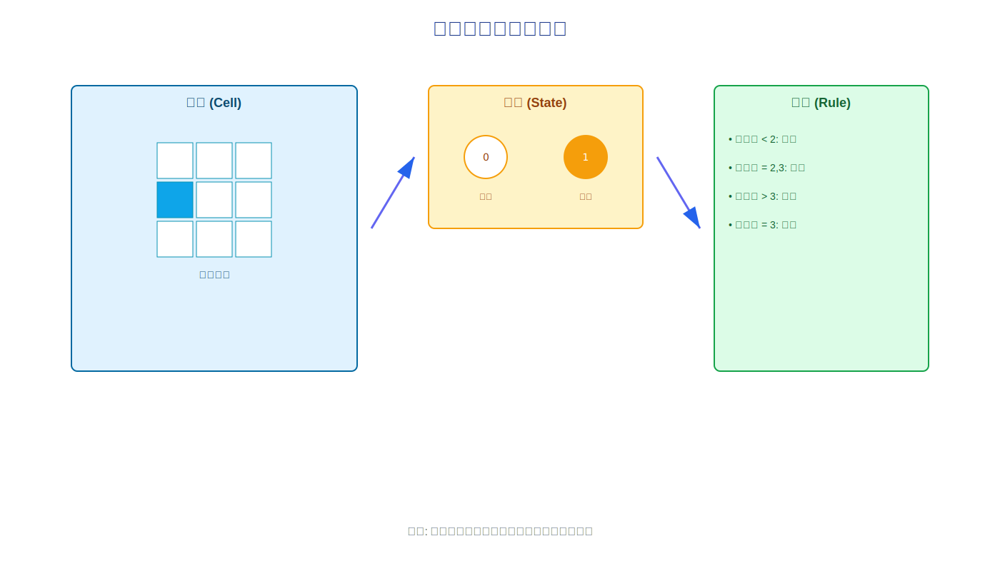

```{r setup, include=FALSE}
knitr::opts_chunk$set(
  echo = TRUE, 
  warning = FALSE, 
  message = FALSE,
  fig.align = 'center',  # 图片居中
  fig.width = 10,
  fig.height = 7, 
  fig.retina = 2, 
  out.width = "100%", 
  dpi = 300
)
set.seed(2026)  # 可复现性
```

## 领域背景与适用场景

### 什么是元胞自动机?

**元胞自动机 (Cellular Automata, CA)** 是一种**离散的动力学系统模型**,由数学家 John von Neumann 在 1940 年代提出。它的核心思想非常简单却极其强大:

> **类比**: 想象一个棋盘,每个格子(元胞)有自己的状态(如黑或白)。每一轮,每个格子根据**邻居格子的状态**和**固定规则**决定下一轮的状态。所有格子**同时更新**,形成时空演化模式。

这种简单的局部交互规则,能够产生出**极其复杂的全局行为**,这正是元胞自动机的魅力所在。

### 核心研究问题

元胞自动机主要用于研究:

1. **涌现现象** (Emergence): 简单规则如何产生复杂模式
2. **自组织** (Self-organization): 系统如何从无序演化为有序
3. **空间动力学**: 空间结构如何影响系统演化
4. **多主体交互**: 个体局部行为如何影响群体动态

### 元胞自动机 vs 传统建模方法



**对比说明**: 上图对比了元胞自动机与传统微分方程建模的核心差异。元胞自动机以**个体为基础**,在**离散时空**中演化,天然支持**空间异质性**和**个体随机性**,但计算复杂度较高。

### 典型应用场景

```{r echo=FALSE}
library(gt)
library(dplyr)

tibble::tibble(
  领域 = c("生态学", "流行病学", "交通工程", "城市规划", "物理学", "计算机科学"),
  应用场景 = c(
    "森林火灾蔓延、种群动态、生态系统演替",
    "传染病空间传播、疫苗接种策略优化",
    "交通流模拟、拥堵形成机制",
    "城市扩张模拟、土地利用变化",
    "晶体生长、渗流现象、相变",
    "图像处理、密码学、并行计算"
  ),
  优势 = c(
    "捕捉空间异质性",
    "模拟个体接触网络",
    "展现突发拥堵现象",
    "整合GIS数据",
    "模拟微观过程",
    "并行化效率高"
  )
) |> 
  gt() |> 
  tab_options(
    table.font.size = px(14),
    data_row.padding = px(8),
    column_labels.font.size = px(15)
  ) |> 
  tab_style(
    style = cell_fill(color = "#E8F4F8"),
    locations = cells_column_labels()
  ) |> 
  tab_style(
    style = cell_text(weight = "bold"),
    locations = cells_body(columns = 领域)
  ) |> 
  cols_width(
    领域 ~ px(120),
    应用场景 ~ px(350),
    优势 ~ px(200)
  )
```

## 核心概念与术语

### 基本术语表

```{r echo=FALSE}
tibble::tibble(
  中文术语 = c(
    "元胞 (Cell)", 
    "状态 (State)", 
    "邻域 (Neighborhood)", 
    "规则 (Rule)", 
    "格子 (Lattice)",
    "边界条件 (Boundary)",
    "时间步 (Time Step)",
    "演化 (Evolution)"
  ),
  英文术语 = c(
    "Cell", 
    "State", 
    "Neighborhood", 
    "Rule", 
    "Lattice",
    "Boundary Condition",
    "Time Step",
    "Evolution"
  ),
  定义说明 = c(
    "空间网格中的基本单元,系统的最小组成部分",
    "元胞在某一时刻的属性值,如0/1、死/活等",
    "某个元胞周围影响其演化的元胞集合",
    "根据邻域状态确定元胞下一状态的转换函数",
    "所有元胞组成的空间结构,通常是规则网格",
    "格子边缘元胞的处理方式,如周期性、固定值等",
    "离散的时间单位,每个时间步所有元胞同步更新",
    "系统随时间的状态变化过程"
  )
) |> 
  gt() |> 
  tab_options(
    table.font.size = px(14),
    data_row.padding = px(8)
  ) |> 
  tab_style(
    style = cell_fill(color = "#E8F4F8"),
    locations = cells_column_labels()
  ) |> 
  cols_width(
    中文术语 ~ px(180),
    英文术语 ~ px(180),
    定义说明 ~ px(400)
  )
```

### 元胞自动机的四要素



**结构说明**: 上图展示了元胞自动机的基本组成要素 —— 元胞、状态、邻域和规则。这四个要素共同定义了一个完整的元胞自动机系统。

一个完整的元胞自动机系统由以下四要素定义:

1. **元胞空间** (Cellular Space)
   - 维度: 1维(线)、2维(面)、3维(体积)
   - 形状: 方形网格、六边形网格、三角形网格等

2. **状态集合** (State Set)
   - 二值状态: {0, 1} 或 {死, 活}
   - 多值状态: {0, 1, 2, ..., k-1}
   - 连续状态: 实数区间 [0, 1]

3. **邻域类型** (Neighborhood Type)
   - **冯诺依曼邻域** (Von Neumann): 上下左右4个邻居
   - **摩尔邻域** (Moore): 周围8个邻居(包含对角线)
   - **扩展邻域**: 可自定义半径和形状

4. **转换规则** (Transition Rule)
   - 确定性规则: 相同邻域状态总是产生相同的下一状态
   - 概率性规则: 允许随机性,引入概率转换

### 邻域类型详解

```{r neighborhood-demo, fig.width=12, fig.height=4}
library(ggplot2)

# 创建网格函数
create_grid <- function(highlight_cells, title) {
  expand.grid(x = 0:4, y = 0:4) |> 
    dplyr::mutate(
      type = dplyr::case_when(
        x == 2 & y == 2 ~ "center",
        paste(x, y) %in% highlight_cells ~ "neighbor",
        TRUE ~ "other"
      )
    ) |> 
    ggplot(aes(x, y, fill = type)) +
    geom_tile(color = "gray30", linewidth = 1) +
    scale_fill_manual(
      values = c(center = "#0ea5e9", neighbor = "#f59e0b", other = "white"),
      labels = c(center = "当前元胞", neighbor = "邻居", other = "其他")
    ) +
    coord_fixed() +
    labs(title = title, fill = NULL) +
    theme_minimal(base_size = 14) +
    theme(
      panel.grid = element_blank(),
      axis.text = element_blank(),
      axis.title = element_blank(),
      legend.position = "bottom"
    )
}

# 冯诺依曼邻域 (4邻居)
von_neumann <- c("2 3", "2 1", "1 2", "3 2")
p1 <- create_grid(von_neumann, "冯诺依曼邻域 (4邻居)")

# 摩尔邻域 (8邻居)
moore <- c("1 3", "2 3", "3 3", "1 2", "3 2", "1 1", "2 1", "3 1")
p2 <- create_grid(moore, "摩尔邻域 (8邻居)")

# 扩展邻域 (5×5)
extended <- paste(rep(0:4, 5), rep(0:4, each = 5))[
  paste(rep(0:4, 5), rep(0:4, each = 5)) != "2 2"
]
p3 <- create_grid(extended[1:12], "扩展邻域 (半径=2)")

# 组合图
library(patchwork)
p1 + p2 + p3 + plot_layout(guides = "collect") & 
  theme(legend.position = "bottom")
```

## 理论基础与数学原理

### 零基础通俗解释

> **生活类比**: 元胞自动机就像**社交网络中的观点传播**:
> 
> - **元胞** = 每个人
> - **状态** = 对某议题的态度(支持/反对)
> - **邻域** = 你的朋友圈
> - **规则** = "如果朋友中超过一半支持,我就改变观点"
> - **演化** = 观点随时间在人群中传播扩散
>
> 即使每个人只看自己朋友的态度,整个社会的观点分布也会随时间产生复杂变化!

### 数学形式化定义

一个 $d$ 维元胞自动机可以形式化定义为四元组:

$$
\text{CA} = \langle L, S, N, f \rangle
$$

其中:

- $L \subset \mathbb{Z}^d$: 元胞空间(格子),通常为 $d$ 维整数网格
- $S = \{s_0, s_1, \ldots, s_{k-1}\}$: 有限状态集合
- $N = \{v_1, v_2, \ldots, v_n\}$: 邻域向量集合
- $f: S^{|N|+1} \rightarrow S$: 局部转换规则函数

### 状态转换方程

对于位置为 $\mathbf{r}$ 的元胞,其在时刻 $t+1$ 的状态由以下方程决定:

$$
s_{\mathbf{r}}^{(t+1)} = f\left( s_{\mathbf{r}}^{(t)}, s_{\mathbf{r}+v_1}^{(t)}, s_{\mathbf{r}+v_2}^{(t)}, \ldots, s_{\mathbf{r}+v_n}^{(t)} \right)
$$

**关键特性**:

1. **局部性** (Locality): 元胞状态只依赖于固定邻域
2. **同步性** (Synchrony): 所有元胞同时更新
3. **一致性** (Homogeneity): 所有元胞使用相同规则
4. **离散性** (Discreteness): 时间、空间、状态均为离散

### Wolfram的元胞自动机分类

Stephen Wolfram 根据长期行为将元胞自动机分为四类:

```{r echo=FALSE}
tibble::tribble(
  ~类别, ~行为特征, ~典型例子, ~复杂度,
  "I类: 均匀态", "演化至单一稳定状态", "全0或全1", "简单",
  "II类: 周期态", "形成简单周期或稳定结构", "规则4", "简单",
  "III类: 混沌态", "产生看似随机的混沌模式", "规则30", "复杂但无结构",
  "IV类: 复杂态", "产生长寿命局部结构和复杂交互", "规则110, 生命游戏", "计算通用性"
) |> 
  gt() |> 
  tab_options(
    table.font.size = px(14),
    data_row.padding = px(8)
  ) |> 
  tab_style(
    style = cell_fill(color = "#E8F4F8"),
    locations = cells_column_labels()
  ) |> 
  tab_style(
    style = list(
      cell_fill(color = "#dcfce7"),
      cell_text(weight = "bold")
    ),
    locations = cells_body(rows = 类别 == "IV类: 复杂态")
  )
```

**重要**: IV类元胞自动机已被证明具有**计算通用性**,即可以模拟任何图灵机,这意味着简单规则可以产生任意复杂的计算!

### 边界条件

处理格子边缘元胞的方式:

1. **周期性边界** (Periodic): 左右/上下相连,形成环面
   $$s_{i, j} = s_{i \bmod m, j \bmod n}$$

2. **固定边界** (Fixed): 边界元胞保持固定值(如0)
   $$s_{-1, j} = s_{m, j} = 0, \quad s_{i, -1} = s_{i, n} = 0$$

3. **反射边界** (Reflective): 边界外镜像内部
   $$s_{-1, j} = s_{0, j}, \quad s_{m, j} = s_{m-1, j}$$

4. **无限空间** (Infinite): 边界外默认为某状态(通常为0)

```{r boundary-comparison, fig.width=12, fig.height=4}
# 演示不同边界条件的效果
demo_boundary <- function(type, title) {
  n <- 10
  mat <- matrix(0, n, n)
  mat[5, 5] <- 1  # 中心点
  
  # 根据边界类型设置边缘
  if (type == "periodic") {
    mat[1, 5] <- mat[n, 5] <- 0.5
  } else if (type == "fixed") {
    mat[1, ] <- mat[n, ] <- mat[, 1] <- mat[, n] <- NA
  }
  
  expand.grid(x = 1:n, y = 1:n) |> 
    dplyr::mutate(value = as.vector(mat)) |> 
    ggplot(aes(x, y, fill = value)) +
    geom_tile(color = "gray50", linewidth = 0.5) +
    scale_fill_gradient2(
      low = "white", mid = "#fbbf24", high = "#dc2626",
      na.value = "gray80",
      midpoint = 0.5
    ) +
    coord_fixed() +
    labs(title = title) +
    theme_void() +
    theme(
      legend.position = "none",
      plot.title = element_text(hjust = 0.5, size = 14, face = "bold")
    )
}

p_periodic <- demo_boundary("periodic", "周期性边界")
p_fixed <- demo_boundary("fixed", "固定边界")
p_infinite <- demo_boundary("infinite", "无限空间")

p_periodic + p_fixed + p_infinite
```

## 数据准备与环境配置

### R包安装

元胞自动机在R中没有统一的专用包,我们将使用基础R和tidyverse工具构建:

```{r install-packages, eval=FALSE}
# 核心可视化与数据处理
install.packages(c("ggplot2", "dplyr", "tidyr", "purrr"))

# 动画制作(可选)
install.packages(c("gganimate", "gifski"))

# 图像处理(可选)
install.packages("imager")
```

```{r load-packages}
library(ggplot2)
library(dplyr)
library(tidyr)
library(purrr)
```

### 元胞自动机的R实现框架


**流程说明**: 上图展示了在R中实现元胞自动机的标准五步流程 —— 初始化网格、定义规则、迭代演化、可视化和结果分析。

我们将构建一个模块化的元胞自动机框架:

```{r ca-framework}
# 1. 初始化网格
initialize_grid <- function(nrow, ncol, init_prob = 0.3) {
  matrix(
    sample(c(0, 1), nrow * ncol, replace = TRUE, prob = c(1 - init_prob, init_prob)),
    nrow = nrow,
    ncol = ncol
  )
}

# 2. 获取邻域状态
get_neighbors <- function(grid, i, j, type = "moore") {
  nrow <- nrow(grid)
  ncol <- ncol(grid)
  
  # 周期性边界
  wrap <- function(x, max) ((x - 1) %% max) + 1
  
  if (type == "moore") {
    # 摩尔邻域 (8邻居)
    coords <- expand.grid(di = -1:1, dj = -1:1) |> 
      filter(!(di == 0 & dj == 0))
  } else if (type == "von_neumann") {
    # 冯诺依曼邻域 (4邻居)
    coords <- data.frame(
      di = c(-1, 1, 0, 0),
      dj = c(0, 0, -1, 1)
    )
  }
  
  neighbors <- coords |> 
    mutate(
      ni = wrap(i + di, nrow),
      nj = wrap(j + dj, ncol)
    ) |> 
    rowwise() |> 
    mutate(state = grid[ni, nj]) |> 
    ungroup()
  
  neighbors$state
}

# 3. 应用规则并更新
update_grid <- function(grid, rule_func, neighborhood = "moore") {
  nrow <- nrow(grid)
  ncol <- ncol(grid)
  new_grid <- grid
  
  for (i in 1:nrow) {
    for (j in 1:ncol) {
      neighbors <- get_neighbors(grid, i, j, neighborhood)
      new_grid[i, j] <- rule_func(grid[i, j], neighbors)
    }
  }
  
  new_grid
}

# 4. 演化模拟
simulate_ca <- function(initial_grid, rule_func, steps = 10, neighborhood = "moore") {
  grids <- vector("list", steps + 1)
  grids[[1]] <- initial_grid
  
  for (t in 1:steps) {
    grids[[t + 1]] <- update_grid(grids[[t]], rule_func, neighborhood)
  }
  
  grids
}

# 5. 可视化单个时间步
plot_grid <- function(grid, title = NULL) {
  grid |> 
    as.data.frame() |> 
    mutate(row = row_number()) |> 
    pivot_longer(-row, names_to = "col", values_to = "state") |> 
    mutate(col = as.integer(gsub("V", "", col))) |> 
    ggplot(aes(col, -row, fill = factor(state))) +
    geom_tile(color = "gray80", linewidth = 0.1) +
    scale_fill_manual(
      values = c("0" = "white", "1" = "#1e40af"),
      labels = c("0" = "死亡", "1" = "存活")
    ) +
    coord_fixed() +
    labs(title = title, fill = "状态") +
    theme_void() +
    theme(
      legend.position = "bottom",
      plot.title = element_text(hjust = 0.5, face = "bold", size = 14)
    )
}
```

### 数据结构说明

元胞自动机的核心数据结构是**二维矩阵**:

```{r data-structure-demo}
# 创建5×5测试网格
test_grid <- matrix(c(
  0, 0, 0, 0, 0,
  0, 0, 1, 0, 0,
  0, 1, 1, 1, 0,
  0, 0, 1, 0, 0,
  0, 0, 0, 0, 0
), nrow = 5, byrow = TRUE)

print("原始矩阵:")
print(test_grid)

# 可视化
plot_grid(test_grid, "5×5 元胞网格示例")
```

**关键点**:

- 行索引 `i`: 对应 y 坐标(从上到下)
- 列索引 `j`: 对应 x 坐标(从左到右)
- 矩阵元素 `grid[i, j]`: 该位置元胞的状态
- R中矩阵默认**列优先存储**,需注意索引顺序

## 完整实现流程

### 案例1: Conway生命游戏 (Game of Life)

**生命游戏**是最著名的元胞自动机,由数学家 John Conway 于1970年提出。

#### 规则定义

生命游戏的规则极其简单:

1. **生存**: 活元胞周围有2或3个活邻居时继续存活
2. **死亡**: 活元胞周围少于2个或多于3个活邻居时死亡
3. **繁殖**: 死元胞周围恰好有3个活邻居时复活

```{r game-of-life-rule}
# Conway生命游戏规则
life_rule <- function(current_state, neighbors) {
  alive_neighbors <- sum(neighbors == 1)
  
  if (current_state == 1) {
    # 当前存活
    if (alive_neighbors < 2 || alive_neighbors > 3) {
      return(0)  # 死亡
    } else {
      return(1)  # 继续存活
    }
  } else {
    # 当前死亡
    if (alive_neighbors == 3) {
      return(1)  # 复活
    } else {
      return(0)  # 继续死亡
    }
  }
}
```

#### 经典初始模式

生命游戏中有许多经典的稳定结构和振荡器:

```{r classic-patterns}
# 滑翔机 (Glider) - 会移动的结构
create_glider <- function(grid, x = 5, y = 5) {
  grid[y,     x + 1] <- 1
  grid[y + 1, x + 2] <- 1
  grid[y + 2, x    ] <- 1
  grid[y + 2, x + 1] <- 1
  grid[y + 2, x + 2] <- 1
  grid
}

# 振荡器 (Blinker)
create_blinker <- function(grid, x = 10, y = 10) {
  grid[y, x:(x+2)] <- 1
  grid
}

# 稳定结构 (Block)
create_block <- function(grid, x = 15, y = 15) {
  grid[y:(y+1), x:(x+1)] <- 1
  grid
}

# 初始化20×20网格并放置经典图案（减小网格以加快渲染）
set.seed(2026)
grid <- matrix(0, nrow = 20, ncol = 20)
grid <- create_glider(grid, 3, 3)
grid <- create_blinker(grid, 10, 10)
grid <- create_block(grid, 15, 15)

plot_grid(grid, "生命游戏初始配置: 滑翔机 + 振荡器 + 稳定块")
```

#### 运行模拟

```{r game-of-life-simulation, fig.width=12, fig.height=8}
# 运行20代（减少迭代次数以加快渲染）
life_simulation <- simulate_ca(grid, life_rule, steps = 20, neighborhood = "moore")

# 显示关键时间步
library(patchwork)
p1 <- plot_grid(life_simulation[[1]], "t = 0")
p2 <- plot_grid(life_simulation[[6]], "t = 5")
p3 <- plot_grid(life_simulation[[11]], "t = 10")
p4 <- plot_grid(life_simulation[[16]], "t = 15")
p5 <- plot_grid(life_simulation[[21]], "t = 20")
p6 <- plot_grid(life_simulation[[21]], "t = 20 (最终)")

(p1 + p2 + p3) / (p4 + p5 + p6)
```

**观察要点**:

- **滑翔机**: 每4代向右下方移动一格
- **振荡器**: 每2代在横竖两种形态间切换
- **稳定块**: 永远保持2×2方块形态不变

### 案例2: 森林火灾模拟

模拟森林火灾蔓延的空间动力学过程。

#### 规则定义

```{r forest-fire-model}
# 森林火灾规则
# 状态: 0 = 空地, 1 = 树木, 2 = 着火, 3 = 灰烬
forest_fire_rule <- function(current_state, neighbors, ignition_prob = 0.0001, growth_prob = 0.01) {
  
  if (current_state == 0) {
    # 空地可能长出新树
    if (runif(1) < growth_prob) return(1) else return(0)
    
  } else if (current_state == 1) {
    # 树木检查是否被点燃
    if (any(neighbors == 2)) {
      return(2)  # 邻居着火则被点燃
    } else if (runif(1) < ignition_prob) {
      return(2)  # 自发闪电
    } else {
      return(1)  # 继续是树
    }
    
  } else if (current_state == 2) {
    # 着火的树变成灰烬
    return(3)
    
  } else if (current_state == 3) {
    # 灰烬变成空地
    return(0)
  }
}

# 包装成不带额外参数的函数
fire_rule_wrapper <- function(current, neighbors) {
  forest_fire_rule(current, neighbors, ignition_prob = 0.001, growth_prob = 0.05)
}
```

#### 运行森林火灾模拟

```{r forest-fire-simulation, fig.width=12, fig.height=4}
# 初始化: 60%树木覆盖率（减小网格以加快渲染）
set.seed(2026)
forest_grid <- matrix(
  sample(c(0, 1), 30 * 30, replace = TRUE, prob = c(0.4, 0.6)),
  nrow = 30
)

# 在中心点燃一棵树
forest_grid[15, 15] <- 2

# 模拟15步（减少迭代次数）
forest_simulation <- simulate_ca(forest_grid, fire_rule_wrapper, steps = 15, neighborhood = "von_neumann")

# 自定义可视化函数
plot_forest <- function(grid, title = NULL) {
  grid |> 
    as.data.frame() |> 
    mutate(row = row_number()) |> 
    pivot_longer(-row, names_to = "col", values_to = "state") |> 
    mutate(col = as.integer(gsub("V", "", col))) |> 
    ggplot(aes(col, -row, fill = factor(state))) +
    geom_tile(color = NA) +
    scale_fill_manual(
      values = c("0" = "#f5f5dc", "1" = "#228b22", "2" = "#dc2626", "3" = "#525252"),
      labels = c("0" = "空地", "1" = "树木", "2" = "着火", "3" = "灰烬")
    ) +
    coord_fixed() +
    labs(title = title, fill = "状态") +
    theme_void() +
    theme(legend.position = "bottom", plot.title = element_text(hjust = 0.5, size = 12))
}

# 展示演化过程
p1 <- plot_forest(forest_simulation[[1]], "t = 0")
p2 <- plot_forest(forest_simulation[[6]], "t = 5")
p3 <- plot_forest(forest_simulation[[11]], "t = 10")
p4 <- plot_forest(forest_simulation[[16]], "t = 15")

(p1 + p2) / (p3 + p4)
```

### 性能统计分析

分析元胞自动机的统计特性:

```{r ca-statistics}
# 计算各时间步的统计量
calculate_stats <- function(grids) {
  purrr::map_dfr(seq_along(grids), function(t) {
    grid <- grids[[t]]
    tibble(
      time = t - 1,
      n_alive = sum(grid == 1),
      n_fire = sum(grid == 2, na.rm = TRUE),
      density = mean(grid == 1, na.rm = TRUE),
      clustering = calculate_clustering(grid)
    )
  })
}

# 计算聚类系数
calculate_clustering <- function(grid) {
  # 简化版: 计算活元胞的平均邻居数
  alive_cells <- which(grid == 1, arr.ind = TRUE)
  if (nrow(alive_cells) == 0) return(0)
  
  neighbor_counts <- apply(alive_cells, 1, function(pos) {
    neighbors <- get_neighbors(grid, pos[1], pos[2], "moore")
    sum(neighbors == 1)
  })
  
  mean(neighbor_counts) / 8  # 归一化到[0,1]
}

# 分析森林火灾
stats_forest <- calculate_stats(forest_simulation)

# 可视化统计量
ggplot(stats_forest, aes(x = time)) +
  geom_line(aes(y = n_alive, color = "树木数量"), linewidth = 1) +
  geom_line(aes(y = n_fire * 10, color = "着火数量×10"), linewidth = 1) +
  scale_color_manual(
    values = c("树木数量" = "#228b22", "着火数量×10" = "#dc2626")
  ) +
  labs(
    title = "森林火灾动态统计",
    x = "时间步",
    y = "元胞数量",
    color = NULL
  ) +
  theme_minimal(base_size = 14) +
  theme(legend.position = "top")
```

## 进阶应用与案例

### 案例3: 一维元胞自动机与Wolfram规则

一维元胞自动机更简单但同样能产生复杂行为:

```{r wolfram-rule-30}
# Wolfram规则编号系统
# 规则30: 01111000 (二进制) = 30 (十进制)
wolfram_rule <- function(rule_number) {
  rule_binary <- as.integer(intToBits(rule_number)[1:8])
  
  function(left, center, right) {
    config_index <- left * 4 + center * 2 + right + 1
    rule_binary[config_index]
  }
}

# 一维CA演化
evolve_1d_ca <- function(initial_state, rule_func, steps = 50) {
  n <- length(initial_state)
  grid <- matrix(0, nrow = steps + 1, ncol = n)
  grid[1, ] <- initial_state
  
  for (t in 1:steps) {
    for (i in 1:n) {
      left <- grid[t, ifelse(i == 1, n, i - 1)]
      center <- grid[t, i]
      right <- grid[t, ifelse(i == n, 1, i + 1)]
      grid[t + 1, i] <- rule_func(left, center, right)
    }
  }
  
  grid
}

# 测试规则30 (产生混沌模式)
set.seed(2026)
initial <- rep(0, 101)
initial[51] <- 1  # 中心点为1

rule30 <- wolfram_rule(30)
grid_rule30 <- evolve_1d_ca(initial, rule30, steps = 50)

# 可视化
grid_rule30 |> 
  as.data.frame() |> 
  mutate(time = row_number() - 1) |> 
  pivot_longer(-time, names_to = "position", values_to = "state") |> 
  mutate(position = as.integer(gsub("V", "", position))) |> 
  ggplot(aes(position, -time, fill = factor(state))) +
  geom_tile() +
  scale_fill_manual(values = c("0" = "white", "1" = "black")) +
  labs(title = "Wolfram规则30: 混沌模式生成器", x = "空间位置", y = "时间") +
  theme_minimal() +
  theme(legend.position = "none")
```

### 案例4: 交通流元胞自动机

模拟单车道交通流的NaSch模型 (Nagel-Schreckenberg):

```{r traffic-flow-model}
# NaSch交通流模型
# 每个元胞是一个车位,状态为速度(0-5)
nasch_update <- function(road, vmax = 5, p_slow = 0.3) {
  n <- length(road)
  new_road <- road
  
  for (i in which(road > -1)) {  # 只处理有车的元胞
    if (road[i] == -1) next  # -1表示空车位
    
    v <- road[i]
    
    # 1. 加速
    v <- min(v + 1, vmax)
    
    # 2. 减速 (避免碰撞)
    gap <- 0
    for (j in 1:vmax) {
      next_pos <- (i + j - 1) %% n + 1
      if (road[next_pos] >= 0) break
      gap <- gap + 1
    }
    v <- min(v, gap)
    
    # 3. 随机慢化
    if (runif(1) < p_slow && v > 0) {
      v <- v - 1
    }
    
    # 4. 移动
    new_pos <- (i + v - 1) %% n + 1
    new_road[new_pos] <- v
    if (new_pos != i) new_road[i] <- -1
  }
  
  new_road
}

# 模拟交通流
set.seed(2026)
road_length <- 100
density <- 0.3
road <- sample(c(-1, -1, 0, 1, 2), road_length, replace = TRUE, 
               prob = c(1-density, 0, density/3, density/3, density/3))

# 记录50步
traffic_history <- matrix(0, nrow = 50, ncol = road_length)
traffic_history[1, ] <- road

for (t in 2:50) {
  road <- nasch_update(road, vmax = 5, p_slow = 0.2)
  traffic_history[t, ] <- road
}

# 可视化 (速度热图)
traffic_history |> 
  as.data.frame() |> 
  mutate(time = row_number()) |> 
  pivot_longer(-time, names_to = "position", values_to = "speed") |> 
  mutate(
    position = as.integer(gsub("V", "", position)),
    speed = ifelse(speed == -1, NA, speed)
  ) |> 
  ggplot(aes(position, time, fill = speed)) +
  geom_tile() +
  scale_fill_gradient2(
    low = "white", mid = "#fbbf24", high = "#dc2626",
    midpoint = 2.5,
    na.value = "gray90",
    name = "速度"
  ) +
  labs(
    title = "单车道交通流时空图 (NaSch模型)",
    subtitle = "密度=30%, 最大速度=5",
    x = "空间位置 (车道)",
    y = "时间步"
  ) +
  theme_minimal(base_size = 14)
```

### 参数敏感性分析

研究参数如何影响系统行为:

```{r parameter-sensitivity}
# 测试不同初始密度对生命游戏的影响（减少测试点和迭代步数）
test_densities <- c(0.2, 0.4, 0.6, 0.8)

density_results <- purrr::map_dfr(test_densities, function(dens) {
  set.seed(2026)
  grid <- matrix(
    sample(c(0, 1), 15 * 15, replace = TRUE, prob = c(1-dens, dens)),
    nrow = 15
  )
  
  sim <- simulate_ca(grid, life_rule, steps = 20, neighborhood = "moore")
  
  tibble(
    density = dens,
    time = 0:20,
    alive = purrr::map_dbl(sim, ~sum(. == 1)),
    survival_rate = alive / (15 * 15)
  )
})

# 可视化敏感性
ggplot(density_results, aes(x = time, y = survival_rate, color = factor(density))) +
  geom_line(linewidth = 1) +
  scale_color_viridis_d(option = "plasma") +
  labs(
    title = "生命游戏对初始密度的敏感性",
    x = "时间步",
    y = "存活率",
    color = "初始密度"
  ) +
  theme_minimal(base_size = 14) +
  theme(legend.position = "right")
```

## 常见问题与解决方案

### 问题1: 边界效应如何处理?

**问题**: 边界元胞的邻域不完整,可能产生人为效应。

**解决方案对比**:

```{r echo=FALSE}
tibble::tribble(
  ~方法, ~优点, ~缺点, ~适用场景,
  "周期性边界", "消除边界效应,保持平移不变性", "可能产生非物理的远程关联", "理论研究,无穷系统近似",
  "固定边界", "简单直观,适合有限空间", "边界处产生边缘效应", "有明确物理边界的系统",
  "吸收边界", "模拟开放系统", "需仔细设计以避免反射", "流体、波动模拟",
  "大尺寸系统", "边界远离感兴趣区域", "计算成本高", "精确模拟"
) |> 
  gt() |> 
  tab_options(
    table.font.size = px(13),
    data_row.padding = px(8)
  ) |> 
  tab_style(
    style = cell_fill(color = "#E8F4F8"),
    locations = cells_column_labels()
  )
```

### 问题2: 如何加速大规模模拟?

**优化策略**:

1. **向量化操作**: 避免显式循环
2. **稀疏表示**: 只存储非零元胞
3. **并行化**: 利用多核CPU
4. **空间分区**: 分块更新减少内存访问

```{r vectorized-update, eval=FALSE}
# 向量化版本 (仅适用于简单规则)
update_grid_vectorized <- function(grid) {
  nrow <- nrow(grid)
  ncol <- ncol(grid)
  
  # 预计算所有邻居和
  neighbors_sum <- 
    grid[c(nrow, 1:(nrow-1)), ] +  # 上
    grid[c(2:nrow, 1), ] +         # 下
    grid[, c(ncol, 1:(ncol-1))] +  # 左
    grid[, c(2:ncol, 1)]           # 右
  
  # 应用规则 (生命游戏示例)
  new_grid <- matrix(0, nrow, ncol)
  new_grid[grid == 1 & (neighbors_sum == 2 | neighbors_sum == 3)] <- 1
  new_grid[grid == 0 & neighbors_sum == 3] <- 1
  
  new_grid
}
```

### 问题3: 随机性如何影响结果?

**最佳实践**:

- **设置随机种子**: 确保可复现性
- **多次重复**: 运行多次取平均
- **报告不确定性**: 使用误差棒或置信区间

```{r stochastic-analysis}
# 重复实验评估随机性（减少重复次数和迭代步数）
n_replicates <- 3

replicate_results <- purrr::map_dfr(1:n_replicates, function(rep) {
  set.seed(2026 + rep)
  grid <- initialize_grid(15, 15, init_prob = 0.3)
  sim <- simulate_ca(grid, life_rule, steps = 15, neighborhood = "moore")
  
  tibble(
    replicate = rep,
    time = 0:15,
    alive = purrr::map_dbl(sim, ~sum(. == 1))
  )
})

# 计算均值和标准差
summary_stats <- replicate_results |> 
  group_by(time) |> 
  summarise(
    mean_alive = mean(alive),
    sd_alive = sd(alive),
    .groups = "drop"
  )

# 可视化不确定性
ggplot(summary_stats, aes(x = time)) +
  geom_ribbon(aes(ymin = mean_alive - sd_alive, ymax = mean_alive + sd_alive),
              fill = "#60a5fa", alpha = 0.3) +
  geom_line(aes(y = mean_alive), color = "#1e40af", linewidth = 1) +
  labs(
    title = "生命游戏演化的随机性 (3次重复)",
    x = "时间步",
    y = "存活元胞数",
    subtitle = "阴影区域表示±1标准差"
  ) +
  theme_minimal(base_size = 14)
```

### 问题4: 如何验证模型正确性?

**验证方法**:

1. **极限情况测试**: 全0/全1初始状态
2. **对称性检查**: 旋转/翻转后结果应相同
3. **守恒量验证**: 某些模型有守恒量(如总质量)
4. **与已知结果对比**: 使用经典案例(如滑翔机)

## 总结

### 核心要点回顾

1. **理论基础**
   - 元胞自动机由元胞、状态、邻域、规则四要素定义
   - 简单局部规则能产生复杂全局行为
   - Wolfram分类揭示了CA的多样性

2. **R实现**
   - 矩阵表示网格,函数封装规则
   - 模块化设计便于扩展
   - ggplot2提供强大可视化

3. **应用场景**
   - 生命游戏: 涌现与自组织
   - 森林火灾: 空间传播过程
   - 交通流: 集体行为与相变

4. **最佳实践**
   - 选择合适的边界条件
   - 使用向量化提升性能
   - 多次重复处理随机性
   - 验证模型正确性

### 适用场景总结

**推荐使用元胞自动机的情况**:

✓ 系统具有明显的空间结构
✓ 个体之间存在局部交互
✓ 需要捕捉涌现现象
✓ 关注空间异质性的影响

**不适合使用元胞自动机的情况**:

✗ 系统是连续的且无明显空间结构
✗ 全局相互作用占主导
✗ 需要精确数值解
✗ 计算资源极度受限

### 进一步学习方向

1. **深入理论**
   - 阅读Wolfram的《A New Kind of Science》
   - 学习统计物理中的元胞自动机理论

2. **扩展应用**
   - 三维元胞自动机
   - 连续状态元胞自动机
   - 异步更新机制

3. **相关领域**
   - Agent-Based Modeling (ABM)
   - 格子玻尔兹曼方法 (LBM)
   - 离散事件模拟

4. **技术提升**
   - 学习Rcpp加速R代码
   - 尝试GPU并行计算
   - 探索Julia等高性能语言

## 参考文献

1. Wolfram, S. (2002). *A New Kind of Science*. Wolfram Media.

2. Chopard, B., & Droz, M. (2005). *Cellular Automata Modeling of Physical Systems*. Cambridge University Press.

3. Toffoli, T., & Margolus, N. (1987). *Cellular Automata Machines*. MIT Press.

4. Ilachinski, A. (2001). *Cellular Automata: A Discrete Universe*. World Scientific.

5. Nagel, K., & Schreckenberg, M. (1992). A cellular automaton model for freeway traffic. *Journal de physique I*, 2(12), 2221-2229.

6. Gardner, M. (1970). Mathematical Games: The fantastic combinations of John Conway's new solitaire game "life". *Scientific American*, 223(4), 120-123.

**在线资源**:

- [LifeWiki](https://conwaylife.com/wiki/): Conway生命游戏百科
- [Wolfram Atlas](https://www.wolframalpha.com/): 在线元胞自动机实验
- [Golly](http://golly.sourceforge.net/): 开源生命游戏模拟器

**R包**:

- `simecol`: 生态建模框架,支持元胞自动机
- `animation`: 创建动画展示演化过程
