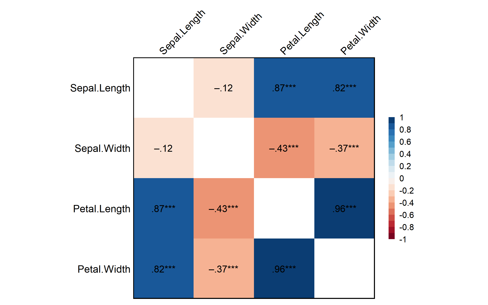

## R包介绍

**bruceR** 全称 "**BR**oadly **U**seful **C**onvenient and **E**fficient **R** functions"，由包寒吴霜博士开发，是一个集成了众多实用功能的 R 包，专为科研数据分析设计。

链接：[CRAN](https://cran.r-project.org/package=bruceR) | [GitHub](https://github.com/psychbruce/bruceR) | [中文教程](https://zhuanlan.zhihu.com/p/281150493)

### 核心功能

bruceR 涵盖了数据分析的完整流程：

| 模块 | 功能 | 主要函数 |
|------|------|----------|
| 基础编程 | 路径设置、数据导入导出、表格打印 | `set.wd()`, `import()`, `export()`, `print_table()` |
| 数据计算 | 量表计算、反向计分、重编码 | `MEAN()`, `SUM()`, `RECODE()`, `RESCALE()` |
| 信效度分析 | 信度分析、因子分析 | `Alpha()`, `EFA()`, `PCA()`, `CFA()` |
| 描述统计 | 描述统计、频率分析、相关分析 | `Describe()`, `Freq()`, `Corr()` |
| 方差分析 | t检验、ANOVA、简单效应、事后比较 | `TTEST()`, `MANOVA()`, `EMMEANS()` |
| 回归模型 | 模型汇总、多层模型 | `model_summary()`, `HLM_summary()` |
| 中介调节 | PROCESS 宏 | `PROCESS()`, `med_summary()` |

### 依赖包自动加载

加载 bruceR 时会自动加载常用包：

- **数据处理**：`data.table`, `dplyr`, `tidyr`, `stringr`
- **可视化**：`ggplot2`
- **统计分析**：`psych`, `emmeans`, `lmerTest`, `effectsize`, `performance`

## R包安装


``` r
# 方法1：从 CRAN 安装（推荐）
install.packages("bruceR", dep = TRUE)

# 方法2：从 GitHub 安装最新版
install.packages("devtools")
devtools::install_github("psychbruce/bruceR", dep = TRUE, force = TRUE)
```


``` r
library(bruceR)
```

---

## 基础编程功能

### set.wd()：智能设置工作目录

自动将工作目录设置为当前脚本所在路径：


``` r
set.wd()
```

### import() / export()：万能数据导入导出

支持几乎所有常见数据格式，自动识别文件类型：


``` r
# 支持的格式：
# - 文本：.txt, .csv, .tsv
# - Excel：.xls, .xlsx
# - SPSS：.sav
# - Stata：.dta
# - R对象：.rda, .rds, .RData

# 导入数据
data <- import("data.xlsx")
data <- import("data.sav")
data <- import("data.dta")

# 导出数据
export(data, file = "output.xlsx")
export(data, file = "output.csv")
```

### cc()：快速创建字符向量

比 `c()` 更简洁，无需引号：


``` r
# 传统写法
c("age", "gender", "education")
```

```
## [1] "age"       "gender"    "education"
```

``` r
# bruceR 写法
cc("age, gender, education")
```

```
## [1] "age"       "gender"    "education"
```

### print_table()：生成三线表


``` r
summary_data <- data.frame(
  Variable = c("Age", "Income", "Score"),
  Mean = c(35.2, 5000, 78.5),
  SD = c(8.3, 1200, 12.1),
  N = c(100, 100, 100)
)

print_table(summary_data)
```

```
## ─────────────────────────────────────
##    Variable     Mean       SD       N
## ─────────────────────────────────────
## 1    Age      35.200    8.300 100.000
## 2    Income 5000.000 1200.000 100.000
## 3    Score    78.500   12.100 100.000
## ─────────────────────────────────────
```

---

## 数据计算功能

### MEAN() / SUM()：横向计算（支持反向计分）

心理学量表经常需要计算多个题目的均值或总分，并处理反向计分：


``` r
# 创建模拟问卷数据（5点量表，共6题）
set.seed(42)
questionnaire <- data.frame(
  id = 1:5,
  q1 = sample(1:5, 5, replace = TRUE),
  q2 = sample(1:5, 5, replace = TRUE),
  q3 = sample(1:5, 5, replace = TRUE),
  q4 = sample(1:5, 5, replace = TRUE),
  q5 = sample(1:5, 5, replace = TRUE),
  q6 = sample(1:5, 5, replace = TRUE)
)
questionnaire
```

```
##   id q1 q2 q3 q4 q5 q6
## 1  1  1  4  1  3  5  4
## 2  2  5  2  5  1  5  3
## 3  3  1  2  4  1  5  2
## 4  4  1  1  2  3  4  1
## 5  5  2  4  2  4  2  2
```

``` r
# 计算均值（q3、q6 反向计分，量表范围1-5）
questionnaire$score_mean <- MEAN(
  questionnaire, 
  varrange = "q1:q6",
  rev = c("q3", "q6"),
  likert = 1:5
)

# 计算总分
questionnaire$score_sum <- SUM(
  questionnaire, 
  varrange = "q1:q6",
  rev = c("q3", "q6"),
  likert = 1:5
)

questionnaire[, c("id", "score_mean", "score_sum")]
```

```
##   id score_mean score_sum
## 1  1   3.333333        20
## 2  2   2.833333        17
## 3  3   2.500000        15
## 4  4   3.000000        18
## 5  5   3.333333        20
```

### RECODE()：变量重编码


``` r
d <- data.frame(age = c(18, 25, 35, 45, 55, 65, 75))

d$age_group <- RECODE(d$age, 
  "lo:29 = '青年'; 
   30:59 = '中年'; 
   60:hi = '老年'"
)
d
```

```
##   age age_group
## 1  18      青年
## 2  25      青年
## 3  35      中年
## 4  45      中年
## 5  55      中年
## 6  65      老年
## 7  75      老年
```

### RESCALE()：变量标准化


``` r
scores <- c(2, 3, 4, 5, 6, 7, 8)
RESCALE(scores, to = 0:100)
```

```
## [1]   0.00000  16.66667  33.33333  50.00000  66.66667  83.33333 100.00000
```

---

## 信度与因子分析

### Alpha()：信度分析


``` r
data("bfi", package = "psych")

# Alpha 需要指定数据和变量名
Alpha(bfi, var = "A", items = 1:5)
```

```
## 
## Reliability Analysis
## 
## Summary:
## Total Items: 5
## Scale Range: 1 ~ 6
## Total Cases: 2800
## Valid Cases: 2709 (96.8%)
## 
## Scale Statistics:
## Mean = 4.208
## S.D. = 0.735
## Cronbach’s α = 0.431
## McDonald’s ω = 0.592
## 
## Warning: Scale reliability is low. You may check item codings.
## Item A1 correlates negatively with the scale and may be reversed.
## You can specify this argument: rev=c("A1")
## 
## Item Statistics (Cronbach’s α If Item Deleted):
## ─────────────────────────────────────────────
##      Mean    S.D. Item-Rest Cor. Cronbach’s α
## ─────────────────────────────────────────────
## A1  2.412 (1.405)         -0.311        0.718
## A2  4.797 (1.176)          0.372        0.278
## A3  4.599 (1.305)          0.478        0.174
## A4  4.682 (1.486)          0.365        0.252
## A5  4.551 (1.262)          0.448        0.207
## ─────────────────────────────────────────────
## Item-Rest Cor. = Corrected Item-Total Correlation
```

### EFA()：探索性因子分析


``` r
data("bfi", package = "psych")

# 探索性因子分析：使用 var + items 格式
# 分析外向性(E)量表的5个题目
EFA(bfi, var = "E", items = 1:5, nfactors = 2, plot.scree = FALSE)
```

```
## 
## Principal Component Analysis
## 
## Summary:
## Total Items: 5
## Scale Range: 1 ~ 6
## Total Cases: 2800
## Valid Cases: 2713 (96.9%)
## 
## Extraction Method:
## - Principal Component Analysis
## Rotation Method:
## - Varimax (with Kaiser Normalization)
## 
## KMO and Bartlett's Test:
## - Kaiser-Meyer-Olkin (KMO) Measure of Sampling Adequacy: MSA = 0.799
## - Bartlett's Test of Sphericity: Approx. χ²(10) = 3011.40, p < 1e-99 ***
## 
## Total Variance Explained:
## ──────────────────────────────────────────────────────────────────────────────────
##              Eigenvalue Variance % Cumulative % SS Loading Variance % Cumulative %
## ──────────────────────────────────────────────────────────────────────────────────
## Component 1       2.565     51.298       51.298      1.884     37.680       37.680
## Component 2       0.768     15.368       66.666      1.449     28.986       66.666
## Component 3       0.643     12.851       79.517                                   
## Component 4       0.561     11.211       90.728                                   
## Component 5       0.464      9.272      100.000                                   
## ──────────────────────────────────────────────────────────────────────────────────
## 
## Component Loadings (Rotated) (Sorted by Size):
## ─────────────────────────────
##        RC1    RC2 Communality
## ─────────────────────────────
## E1   0.812 -0.098       0.668
## E2   0.752 -0.304       0.658
## E4  -0.736  0.290       0.625
## E5  -0.145  0.860       0.761
## E3  -0.312  0.723       0.620
## ─────────────────────────────
## Communality = Sum of Squared (SS) Factor Loadings
## (Uniqueness = 1 - Communality)
```

---

## 描述统计与相关分析

### Describe()：描述统计


``` r
Describe(iris[, 1:4])
```

```
## Descriptive Statistics:
## ────────────────────────────────────────────────────────────────
##                 N Mean   SD | Median  Min  Max Skewness Kurtosis
## ────────────────────────────────────────────────────────────────
## Sepal.Length  150 5.84 0.83 |   5.80 4.30 7.90     0.31    -0.61
## Sepal.Width   150 3.06 0.44 |   3.00 2.00 4.40     0.31     0.14
## Petal.Length  150 3.76 1.77 |   4.35 1.00 6.90    -0.27    -1.42
## Petal.Width   150 1.20 0.76 |   1.30 0.10 2.50    -0.10    -1.36
## ────────────────────────────────────────────────────────────────
```

### Freq()：频率分析


``` r
Freq(iris$Species)
```

```
## Frequency Statistics:
## ───────────────────
##              N    %
## ───────────────────
## setosa      50 33.3
## versicolor  50 33.3
## virginica   50 33.3
## ───────────────────
## Total N = 150
```

### Corr()：相关分析


``` r
Corr(iris[, 1:4])
```

```
## Pearson's r and 95% confidence intervals:
## ─────────────────────────────────────────────────────────────
##                                r       [95% CI]     p       N
## ─────────────────────────────────────────────────────────────
## Sepal.Length-Sepal.Width   -0.12 [-0.27,  0.04]  .152     150
## Sepal.Length-Petal.Length   0.87 [ 0.83,  0.91] <.001 *** 150
## Sepal.Length-Petal.Width    0.82 [ 0.76,  0.86] <.001 *** 150
## Sepal.Width-Petal.Length   -0.43 [-0.55, -0.29] <.001 *** 150
## Sepal.Width-Petal.Width    -0.37 [-0.50, -0.22] <.001 *** 150
## Petal.Length-Petal.Width    0.96 [ 0.95,  0.97] <.001 *** 150
## ─────────────────────────────────────────────────────────────
```

<div class="figure">

<p class="caption">plot of chunk unnamed-chunk-14</p>
</div>

---

## 统计检验

### TTEST()：t检验


``` r
# 独立样本 t 检验（需要两水平因子）
iris_subset <- iris[iris$Species %in% c("versicolor", "virginica"), ]
iris_subset$Species <- droplevels(iris_subset$Species)

TTEST(iris_subset, y = "Sepal.Length", x = "Species")
```

```
## 
## Independent-Samples t-test
## 
## Hypothesis: two-sided (μ2 - μ1 ≠ 0)
## 
## Descriptives:
## ───────────────────────────────────────────────
##      Variable  Factor      Level  N Mean (S.D.)
## ───────────────────────────────────────────────
##  Sepal.Length Species versicolor 50 5.94 (0.52)
##  Sepal.Length Species virginica  50 6.59 (0.64)
## ───────────────────────────────────────────────
## 
## Levene’s test for homogeneity of variance:
## ────────────────────────────────────────────────────────────────────────────
##                                                 Levene’s F df1 df2     p    
## ────────────────────────────────────────────────────────────────────────────
## Sepal.Length: Species (virginica - versicolor)        1.42   1  98  .236    
## ────────────────────────────────────────────────────────────────────────────
## Note: H0 = equal variance (homoscedasticity).
## If significant (violation of the assumption),
## then you should better set `var.equal=FALSE`.
## 
## Results of t-test:
## ─────────────────────────────────────────────────────────────────────────────────────────────────────────────────
##                                                    t df     p     Difference [95% CI] Cohen’s d [95% CI]     BF10
## ─────────────────────────────────────────────────────────────────────────────────────────────────────────────────
## Sepal.Length: Species (virginica - versicolor)  5.63 98 <.001 ***   0.65 [0.42, 0.88]  1.13 [0.73, 1.52] 7.04e+04
## ─────────────────────────────────────────────────────────────────────────────────────────────────────────────────
```

### MANOVA()：多因素方差分析


``` r
MANOVA(data = npk, dv = "yield", between = c("N", "P", "K"))
```

```
## 
## ====== ANOVA (Between-Subjects Design) ======
## 
## Descriptives:
## ─────────────────────────────
##  "N" "P" "K"   Mean    S.D. n
## ─────────────────────────────
##   N0  P0  K0 51.433 (4.600) 3
##   N0  P0  K1 52.000 (5.635) 3
##   N0  P1  K0 54.333 (9.411) 3
##   N0  P1  K1 50.500 (2.364) 3
##   N1  P0  K0 63.767 (5.086) 3
##   N1  P0  K1 54.667 (4.216) 3
##   N1  P1  K0 57.933 (5.478) 3
##   N1  P1  K1 54.367 (5.006) 3
## ─────────────────────────────
## Total sample size: N = 24
## 
## ANOVA Table:
## Dependent variable(s):      yield
## Between-subjects factor(s): N, P, K
## Within-subjects factor(s):  –
## Covariate(s):               –
## ──────────────────────────────────────────────────────────────────────────
##                 MS    MSE df1 df2     F     p     η²p [90% CI of η²p]  η²G
## ──────────────────────────────────────────────────────────────────────────
## N          189.282 30.724   1  16 6.161  .025 *     .278 [.024, .529] .278
## P            8.402 30.724   1  16 0.273  .608       .017 [.000, .220] .017
## K           95.202 30.724   1  16 3.099  .097 .     .162 [.000, .427] .162
## N * P       21.282 30.724   1  16 0.693  .418       .041 [.000, .277] .041
## N * K       33.135 30.724   1  16 1.078  .314       .063 [.000, .312] .063
## P * K        0.482 30.724   1  16 0.016  .902       .001 [.000, .078] .001
## N * P * K   37.002 30.724   1  16 1.204  .289       .070 [.000, .322] .070
## ──────────────────────────────────────────────────────────────────────────
## MSE = mean square error (the residual variance of the linear model)
## η²p = partial eta-squared = SS / (SS + SSE) = F * df1 / (F * df1 + df2)
## ω²p = partial omega-squared = (F - 1) * df1 / (F * df1 + df2 + 1)
## η²G = generalized eta-squared (see Olejnik & Algina, 2003)
## Cohen’s f² = η²p / (1 - η²p)
## 
## Levene’s Test for Homogeneity of Variance:
## ───────────────────────────────────────
##            Levene’s F df1 df2     p    
## ───────────────────────────────────────
## DV: yield       0.986   7  16  .475    
## ───────────────────────────────────────
```

### EMMEANS()：边际均值与事后比较


``` r
result <- MANOVA(npk, dv = "yield", between = c("N", "P"))
```

```
## 
## ====== ANOVA (Between-Subjects Design) ======
## 
## Descriptives:
## ─────────────────────────
##  "N" "P"   Mean    S.D. n
## ─────────────────────────
##   N0  P0 51.717 (4.611) 6
##   N0  P1 52.417 (6.486) 6
##   N1  P0 59.217 (6.504) 6
##   N1  P1 56.150 (5.084) 6
## ─────────────────────────
## Total sample size: N = 24
## 
## ANOVA Table:
## Dependent variable(s):      yield
## Between-subjects factor(s): N, P
## Within-subjects factor(s):  –
## Covariate(s):               –
## ──────────────────────────────────────────────────────────────────────
##             MS    MSE df1 df2     F     p     η²p [90% CI of η²p]  η²G
## ──────────────────────────────────────────────────────────────────────
## N      189.282 32.870   1  20 5.758  .026 *     .224 [.017, .460] .224
## P        8.402 32.870   1  20 0.256  .619       .013 [.000, .181] .013
## N * P   21.282 32.870   1  20 0.647  .430       .031 [.000, .230] .031
## ──────────────────────────────────────────────────────────────────────
## MSE = mean square error (the residual variance of the linear model)
## η²p = partial eta-squared = SS / (SS + SSE) = F * df1 / (F * df1 + df2)
## ω²p = partial omega-squared = (F - 1) * df1 / (F * df1 + df2 + 1)
## η²G = generalized eta-squared (see Olejnik & Algina, 2003)
## Cohen’s f² = η²p / (1 - η²p)
## 
## Levene’s Test for Homogeneity of Variance:
## ───────────────────────────────────────
##            Levene’s F df1 df2     p    
## ───────────────────────────────────────
## DV: yield       0.160   3  20  .922    
## ───────────────────────────────────────
```

``` r
EMMEANS(result, effect = "N")
```

```
## ------ EMMEANS (effect = "N") ------
## 
## Joint Tests of "N":
## ───────────────────────────────────────────────────
##  Effect df1 df2     F     p     η²p [90% CI of η²p]
## ───────────────────────────────────────────────────
##   N       1  20 5.758  .026 *     .224 [.017, .460]
##   P       1  20 0.256  .619       .013 [.000, .181]
##   N * P   1  20 0.647  .430       .031 [.000, .230]
## ───────────────────────────────────────────────────
## Note. Simple effects of repeated measures with 3 or more levels
## are different from the results obtained with SPSS MANOVA syntax.
## 
## Univariate Tests of "N":
## ────────────────────────────────────────────────────────
##            Sum of Squares df Mean Square     F     p    
## ────────────────────────────────────────────────────────
## Mean: "N"         189.282  1     189.282 5.758  .026 *  
## Residuals         657.400 20      32.870                
## ────────────────────────────────────────────────────────
## Note. Identical to the results obtained with SPSS GLM EMMEANS syntax.
## 
## Estimated Marginal Means of "N":
## ────────────────────────────────────
##  "N"   Mean [95% CI of Mean]    S.E.
## ────────────────────────────────────
##   N0 52.067 [48.614, 55.519] (1.655)
##   N1 57.683 [54.231, 61.136] (1.655)
## ────────────────────────────────────
## 
## Pairwise Comparisons of "N":
## ─────────────────────────────────────────────────────────────────────
##  Contrast Estimate    S.E. df     t     p     Cohen’s d [95% CI of d]
## ─────────────────────────────────────────────────────────────────────
##   N1 - N0    5.617 (2.341) 20 2.400  .026 *      0.980 [0.128, 1.831]
## ─────────────────────────────────────────────────────────────────────
## Pooled SD for computing Cohen’s d: 5.733
## Results are averaged over the levels of: P
## No need to adjust p values.
## 
## Disclaimer:
## By default, pooled SD is Root Mean Square Error (RMSE).
## There is much disagreement on how to compute Cohen’s d.
## You are completely responsible for setting `sd.pooled`.
## You might also use `effectsize::t_to_d()` to compute d.
```

---

## 回归分析

### model_summary()：模型汇总


``` r
lm1 <- lm(Sepal.Length ~ Sepal.Width, data = iris)
lm2 <- lm(Sepal.Length ~ Sepal.Width + Petal.Length, data = iris)
lm3 <- lm(Sepal.Length ~ Sepal.Width + Petal.Length + Petal.Width, data = iris)

# 多个模型对比
model_summary(list(lm1, lm2, lm3))
```

```
## 
## Model Summary
## 
## ──────────────────────────────────────────────────────────────────
##               (1) Sepal.Length  (2) Sepal.Length  (3) Sepal.Length
## ──────────────────────────────────────────────────────────────────
## (Intercept)     6.526 ***         2.249 ***         1.856 ***     
##                (0.479)           (0.248)           (0.251)        
## Sepal.Width    -0.223             0.596 ***         0.651 ***     
##                (0.155)           (0.069)           (0.067)        
## Petal.Length                      0.472 ***         0.709 ***     
##                                  (0.017)           (0.057)        
## Petal.Width                                        -0.556 ***     
##                                                    (0.128)        
## ──────────────────────────────────────────────────────────────────
## R^2             0.014             0.840             0.859         
## Adj. R^2        0.007             0.838             0.856         
## Num. obs.     150               150               150             
## ──────────────────────────────────────────────────────────────────
## Note. * p < .05, ** p < .01, *** p < .001.
```

``` r
# 输出标准化系数
model_summary(lm3, std = TRUE)
```

```
## 
## Model Summary
## 
## ──────────────────────────────
##               (1) Sepal.Length
## ──────────────────────────────
## Sepal.Width      .343 ***     
##                 (.035)        
## Petal.Length    1.512 ***     
##                 (.121)        
## Petal.Width     -.512 ***     
##                 (.117)        
## ──────────────────────────────
## R^2              .859         
## Adj. R^2         .856         
## Num. obs.     150             
## ──────────────────────────────
## Note. * p < .05, ** p < .01, *** p < .001.
## 
## # Check for Multicollinearity
## 
## Low Correlation
## 
##         Term  VIF     VIF 95% CI adj. VIF Tolerance Tolerance 95% CI
##  Sepal.Width 1.27 [ 1.11,  1.65]     1.13      0.79     [0.61, 0.90]
## 
## High Correlation
## 
##          Term   VIF     VIF 95% CI adj. VIF Tolerance Tolerance 95% CI
##  Petal.Length 15.10 [11.27, 20.36]     3.89      0.07     [0.05, 0.09]
##   Petal.Width 14.23 [10.63, 19.19]     3.77      0.07     [0.05, 0.09]
```

---

## 中介与调节分析

### PROCESS()：中介调节分析


``` r
set.seed(123)
n <- 200
mediation_data <- data.frame(
  X = rnorm(n),
  M = rnorm(n),
  Y = rnorm(n)
)
mediation_data$M <- 0.5 * mediation_data$X + rnorm(n, sd = 0.5)
mediation_data$Y <- 0.4 * mediation_data$M + 0.3 * mediation_data$X + rnorm(n, sd = 0.5)

# 简单中介模型
PROCESS(mediation_data, y = "Y", x = "X", meds = "M", 
        ci = "boot", nsim = 100)
```

```
## 
## ****************** PART 1. Regression Model Summary ******************
## 
## PROCESS Model ID : 4
## Model Type : Simple Mediation
## -    Outcome (Y) : Y
## -  Predictor (X) : X
## -  Mediators (M) : M
## - Moderators (W) : -
## - Covariates (C) : -
## -   HLM Clusters : -
## 
## All numeric predictors have been grand-mean centered.
## (For details, please see the help page of PROCESS.)
## 
## Formula of Mediator:
## -    M ~ X
## Formula of Outcome:
## -    Y ~ X + M
## 
## CAUTION:
##   Fixed effect (coef.) of a predictor involved in an interaction
##   denotes its "simple effect/slope" at the other predictor = 0.
##   Only when all predictors in an interaction are mean-centered
##   can the fixed effect be interpreted as "main effect"!
##   
## Model Summary
## 
## ──────────────────────────────────────────────────
##              (1) Y        (2) M        (3) Y      
## ──────────────────────────────────────────────────
## (Intercept)    0.010       -0.015        0.010    
##               (0.039)      (0.036)      (0.037)   
## X              0.462 ***    0.475 ***    0.302 ***
##               (0.041)      (0.039)      (0.052)   
## M                                        0.336 ***
##                                         (0.072)   
## ──────────────────────────────────────────────────
## R^2            0.391        0.434        0.452    
## Adj. R^2       0.388        0.431        0.446    
## Num. obs.    200          200          200        
## ──────────────────────────────────────────────────
## Note. * p < .05, ** p < .01, *** p < .001.
## 
## ************ PART 2. Mediation/Moderation Effect Estimate ************
## 
## Package Use : ‘mediation’ (v4.5.0)
## Effect Type : Simple Mediation (Model 4)
## Sample Size : 200
## Random Seed : set.seed()
## Simulations : 100 (Bootstrap)
```

```
## 
## Running 100 simulations...
## Indirect Path: "X" (X) ==> "M" (M) ==> "Y" (Y)
## ─────────────────────────────────────────────────────────────
##                Effect    S.E.      z     p      [Boot 95% CI]
## ─────────────────────────────────────────────────────────────
## Indirect (ab)   0.160 (0.039)  4.046 <.001 *** [0.098, 0.240]
## Direct (c')     0.302 (0.053)  5.713 <.001 *** [0.192, 0.387]
## Total (c)       0.462 (0.040) 11.623 <.001 *** [0.399, 0.545]
## ─────────────────────────────────────────────────────────────
## Percentile Bootstrap Confidence Interval
## (SE and CI are estimated based on 100 Bootstrap samples.)
## 
## Note. The results based on bootstrapping or other random processes
## are unlikely identical to other statistical software (e.g., SPSS).
## To make results reproducible, you need to set a seed (any number).
## Please see the help page for details: help(PROCESS)
## Ignore this note if you have already set a seed. :)
```

---

## 其他实用功能

### 运算符


``` r
# %notin%：不在其中
c(1, 2, 3) %notin% c(2, 4, 6)
```

```
## [1]  TRUE FALSE  TRUE
```

``` r
# %allin%：全部在其中
c(1, 2) %allin% c(1, 2, 3, 4)
```

```
## [1] TRUE
```

### theme_bruce()：ggplot2 主题


``` r
library(ggplot2)

ggplot(iris, aes(x = Sepal.Length, y = Sepal.Width, color = Species)) +
  geom_point(size = 2, alpha = 0.7) +
  geom_smooth(method = "lm", se = FALSE) +
  labs(title = "鸢尾花数据可视化") +
  theme_bruce()
```

<div class="figure">

<p class="caption">plot of chunk unnamed-chunk-21</p>
</div>

---

## 导出到 Word

bruceR 的一大特色是可以将结果直接导出到 Word 文档：


``` r
# 描述统计
Describe(iris[, 1:4], file = "descriptives.doc")

# 相关矩阵
Corr(iris[, 1:4], file = "correlation.doc")

# 回归模型
model_summary(list(lm1, lm2, lm3), file = "regression.doc")

# 中介分析
PROCESS(data, y = "Y", x = "X", meds = "M", file = "mediation.doc")
```

---

## 函数速查表

| 类别 | 函数 | 功能 |
|------|------|------|
| **基础** | `set.wd()` | 设置工作目录到当前脚本位置 |
| | `import()` / `export()` | 万能数据导入/导出 |
| | `cc()` | 快速创建字符向量 |
| | `print_table()` | 打印三线表 |
| **计算** | `MEAN()` / `SUM()` | 横向计算（支持反向计分） |
| | `RECODE()` | 变量重编码 |
| | `RESCALE()` | 变量标准化 |
| **信效度** | `Alpha()` | Cronbach's α 信度分析 |
| | `EFA()` / `PCA()` | 探索性因子分析/主成分分析 |
| | `CFA()` | 验证性因子分析 |
| **描述** | `Describe()` | 描述统计 |
| | `Freq()` | 频率分析与交叉表 |
| | `Corr()` | 相关分析与热力图 |
| **检验** | `TTEST()` | t检验（单样本/独立/配对） |
| | `MANOVA()` | 多因素方差分析 |
| | `EMMEANS()` | 边际均值与事后比较 |
| **回归** | `model_summary()` | 回归模型整洁输出 |
| | `GLM_summary()` | 广义线性模型汇总 |
| | `HLM_summary()` | 多层线性模型汇总 |
| **中介** | `PROCESS()` | 中介/调节效应分析 |
| | `med_summary()` | 中介效应汇总 |

---

## 参考资源

- [bruceR GitHub 主页](https://github.com/psychbruce/bruceR)
- [CRAN 官方页面](https://cran.r-project.org/package=bruceR)
- [中文教程：概述篇](https://zhuanlan.zhihu.com/p/281150493)
- [中文教程：常见问题](https://zhuanlan.zhihu.com/p/432931518)
- 引用：Bao, H. W. S. (2021). bruceR: Broadly useful convenient and efficient R functions. https://doi.org/10.32614/CRAN.package.bruceR
